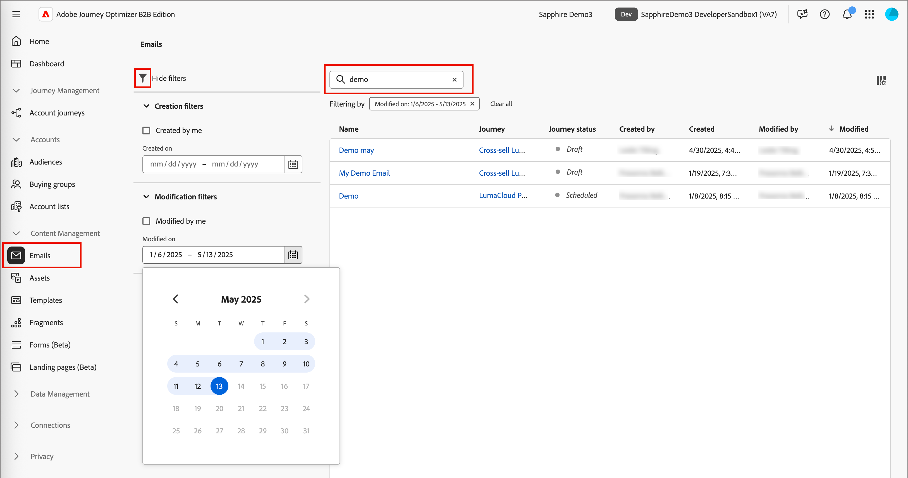
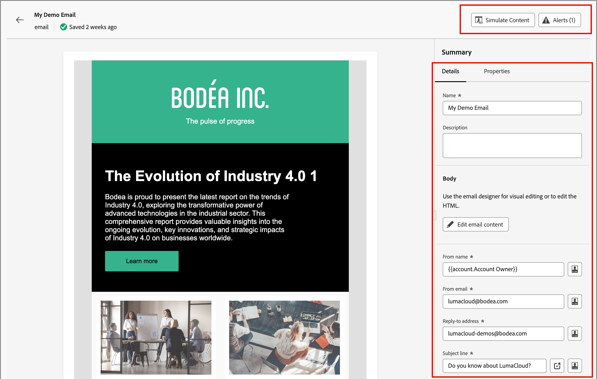

# 電子郵件

當您[建立電子郵件](./add-email.md)時，您將其新增到歷程節點的內容中。 當您想要使用歷程地圖以外的電子郵件內容時，請使用&#x200B;_[!UICONTROL 電子郵件]_&#x200B;清單來尋找及更新電子郵件。 您可以檢閱電子郵件或更新設定和內容。

## 存取和管理電子郵件

若要存取Adobe Journey Optimizer B2B edition中的電子郵件，請前往左側導覽並按一下&#x200B;**[!UICONTROL 內容管理]** > **[!UICONTROL 電子郵件]**。 此動作會開啟一個清單頁面，其中包含為表格中列出的執行個體建立的所有電子郵件。

表格預設會依&#x200B;_[!UICONTROL 已修改]_&#x200B;欄排序，最近更新的電子郵件會顯示在頂端。 按一下欄標題，在升序和降序之間變更。

若要依名稱搜尋電子郵件，請在搜尋列中輸入文字字串。 按一下左上方的&#x200B;_篩選器_ （ ）圖示，以依據建立和修改日期來篩選顯示的電子郵件。 您也可以將清單限制在您已建立或修改的電子郵件。

{width="700" zoomable="yes"}

## 編輯電子郵件

按一下清單中的電子郵件名稱以開啟。 您可以檢閱並變更[電子郵件設定](./add-email.md#define-the-email-settings)。 按一下&#x200B;**[!UICONTROL 編輯電子郵件內容]**&#x200B;以進行[內容更新](./email-authoring.md)。

如果頁面右上方顯示[警報](./add-email.md#check-alerts)，請按一下以檢閱警告或錯誤，並視需要處理專案。

{width="700" zoomable="yes"}
