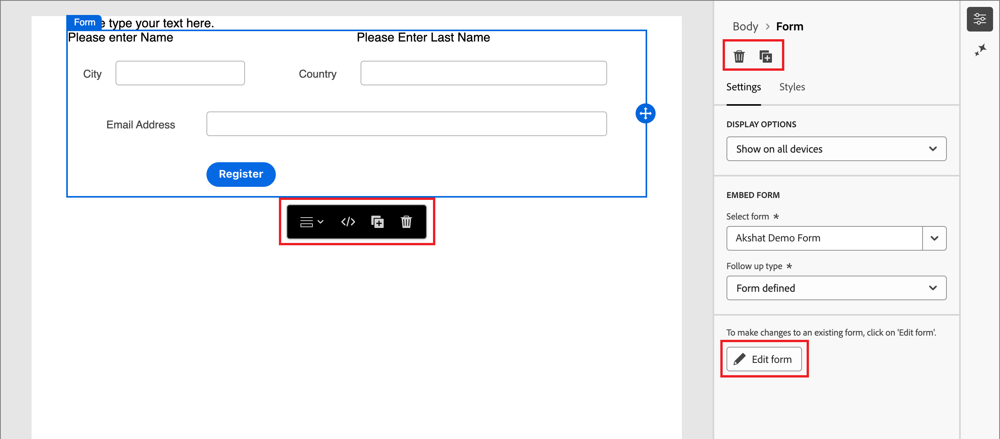

# 表單

若要從網頁訪客擷取資訊，請建立表單並將其新增至您的登入頁面。 表單是一組欄位，頁面訪客可完成並提交以取得某種內容或選件，例如白皮書、隨選網路研討會或免費試用。

表單應擷取的資訊量取決於內容或選件的值。 若您提供簡單的內容（如白皮書），則您應僅收集最低限度的資訊，例如姓名、電子郵件和公司。 如果選件價值較高（例如示範或免費試用），您可以收集更多資訊。 要求提交的表單允許檢視內容稱為&#x200B;_閘道內容_。 您的組織決定應該限制哪些內容，哪些不是（_免費_）。 最佳實務是允許部分內容免費使用，並僅提供您優質或高需求內容。

## 存取及管理表單

若要存取Journey Optimizer B2B edition中的表單，請前往左側導覽並按一下&#x200B;**[!UICONTROL 內容管理]** > **[!UICONTROL Forms]**。 此動作會開啟一個清單頁面，其中包含在表格中列出的執行個體中建立的所有表單。

{width="700" zoomable="yes"}

此表格是依&#x200B;_[!UICONTROL 已修改]_&#x200B;欄排序，最近更新的表單預設會排在頂端。 按一下欄標題，在升序和降序之間變更。

### 表單狀態和生命週期

表單狀態會決定其是否可用於登入頁面或登入頁面範本，以及您能否對表單進行變更。

| 狀態 | 說明 |
| -------------------- | ----------- |
| 草稿 | 當您建立表單時，它處於草稿狀態。 在您定義或編輯欄位時，它會保持此狀態，直到您發佈它以用於登入頁面或登入頁面範本為止。 可用的動作：  <ul><li>編輯所有詳細資料<li>在視覺設計空間編輯<li>發佈<li>重複<li>刪除 |
| 發佈日期 | 當您發佈表單時，該表單將可用於登入頁面或登入頁面範本。 無法在視覺化設計空間中修改發佈的表單內容。 可用的動作：  <ul><li>編輯名稱、說明或感謝頁面<li>新增至登入頁面或登入頁面範本<li>建立草稿版本<li>重複<li>刪除（若未使用）<li>內嵌程式碼 |
| 已與草稿一起發佈 | 當您從已發佈的表單建立草稿時，已發佈的版本仍可用於登入頁面或範本。 可以在視覺設計空間中修改草稿內容。 如果您發佈草稿版本，草稿版本會取代目前發佈的版本，且使用中的登入頁面或登入頁面範本中的內容會更新。 可用的動作：  <ul><li>編輯名稱、說明或感謝頁面<li>新增至登入頁面或登入頁面範本<li>在視覺化設計空間中編輯草稿版本<li>發佈草稿版本<li>重複<li>刪除（若未使用）<li>內嵌程式碼 |

{zoomable="yes"}

### 篩選表單清單

若要依名稱搜尋表單，請在搜尋列中輸入文字字串以尋找相符專案。 按一下&#x200B;_篩選器_&#x200B;圖示（）以顯示可用的篩選器選項，並變更設定以根據您指定的條件篩選顯示的專案。

{width="700" zoomable="yes"}

### 自訂欄顯示

按一下右上角的&#x200B;_自訂表格_&#x200B;圖示（），自訂您要顯示在表格中的欄。

在對話方塊中，選取要顯示的資料行，然後按一下&#x200B;**[!UICONTROL 套用]**。

在Forms清單中顯示{width="300"}

## 建立表單

在Journey Optimizer B2B edition中開始建立可重複使用的表單前，請先考量以下幾點：

* 決定您需要哪些表格。

  可能只能使用四種標準表格。 一個用於存取可下載的內容，一個用於存取優質網頁，一個用於檢視影片，另一個用於註冊網路研討會等活動。 如果您需要變更表單中的欄位，更新全球使用的四個標準表單會比較容易，而不是變更橫跨所有行銷計畫的多個表單。<!-- Global forms also make progressive profiling much easier to implement. -->

* 對於每個標準表單，請決定要使用哪些欄位以及如何顯示它們。

  請考慮使用較短的表單，因為事實證明，其較適合轉換。 當您考慮每個表單時，請決定哪些欄位對於其目的而言合理且必要。

  考慮是否要預先填寫表單欄位，以便預先填寫名稱和電子郵件等基本資訊。 但其他資訊，例如職稱和組織規模，則否。 如此一來，訪客只需填寫兩個欄位並提交表單。 您也可以使用社交表單，以Facebook或Twitter的資料填入。

* 規劃訪客提交表單後要顯示哪些後續頁面（_感謝您_&#x200B;頁面）。

  所有人獲得相同的頁面嗎？頁面是否為動態頁面，且是以他們的資料為基礎？ 例如，健康產業的人可能會看到與技術產業的人不同的頁面內容。

* 如果您已經擁有所需的資訊，請考慮是否要完全略過表單。

  若您允許造訪您登陸頁面的已知人員略過表單，他們只需直接存取內容即可。 略過表單可提供更精簡的訪客體驗。

### 新增表單

您可以在Journey Optimizer B2B edition中建立表單，方法是按一下&#x200B;**[!UICONTROL Forms]**&#x200B;清單頁面右上角的&#x200B;_[!UICONTROL 建立表單]_。

1. 在&#x200B;_[!UICONTROL 建立表單]_&#x200B;對話方塊中，輸入有用的&#x200B;**[!UICONTROL 名稱]** （必要）和&#x200B;**[!UICONTROL 描述]** （選用）。

   表單需求：

   * 名稱 — 最多100個字元，必須是唯一的、不區分大小寫

   * 說明 — 最多300個字元

   * 允許使用Alpha、數值和特殊字元

   * 保留的字元是&#x200B;**_不允許_**： `\ / : * ? " < > |`

   {width="400"}

1. 按一下&#x200B;**[!UICONTROL 建立]**。

   表單詳細資訊頁面隨即開啟，其中包含預設的基本表單定義。

   {width="700" zoomable="yes"}

### 變更預設表單設計

視需要使用視覺化設計工具來變更表單內容：

* [新增欄位](./form-design.md#add-a-field)
* [變更欄位樣式](./form-design.md#change-field-styling)
* [重新排序欄位](./form-design.md#reorder-fields)
* [變更提交按鈕文字和樣式](./form-design.md#edit-and-style-the-submit-button)
* [變更表單樣式](./form-design.md#change-form-styling)

按一下&#x200B;**[!UICONTROL 儲存並關閉]**&#x200B;以儲存您的表單內容設計變更，並移至表單詳細資料。

### 設定感謝頁面

在右側的&#x200B;_[!UICONTROL 摘要]_&#x200B;面板中，捲動至&#x200B;**[!UICONTROL 感謝頁面]**&#x200B;區段，並使用&#x200B;**[!UICONTROL 後續處理]**&#x200B;設定來定義訪客提交表單時會發生什麼情況：

* **[!UICONTROL 停留在頁面]** — 選擇此選項可在提交表單時讓訪客停留在相同頁面。

* **[!UICONTROL 登陸頁面]** — 選擇此選項可選取任何Journey Optimizer B2B edition或Marketo Engage登陸頁面作為後續追蹤。

* **[!UICONTROL 外部URL]** — 選擇此選項可指定任何URL作為後續頁面。 訪客提交表單後，瀏覽器會載入指定的URL。

  >[!TIP]
  >
  >如果您希望使用表單下載檔案，您可以指定託管檔案的URL。 透過此設定，提交按鈕可作為下載按鈕運作。

### 發佈表單草稿

當您準備好讓表單可用於登入頁面或登入頁面範本時，請按一下&#x200B;**[!UICONTROL 發佈]**。

{width="400"}

此動作會開啟確認對話方塊。 您可以按一下&#x200B;**[!UICONTROL 取消]**，或按一下&#x200B;**[!UICONTROL 發佈]**&#x200B;進行確認，以中止發佈程式。

## 檢視表單詳細資料

按一下清單頁面中任何表單的名稱，開啟片段詳細資訊頁面。 您可以選擇編輯表單、重新命名表單或更新表單說明。 進行更新，然後按一下名稱或說明欄位外部以自動儲存變更。

>[!NOTE]
>
>如果登入頁面或登入頁面範本正在使用已發佈的表單，則無法編輯內容或變更感謝頁面。 如果您想要變更表單，可以建立草稿版本。

{width="600" zoomable="yes"}

按一下&#x200B;**[!UICONTROL 編輯表單]**，在視覺化設計空間開啟片段。

隨時按一下左上方的&#x200B;_上一步_&#x200B;箭頭以結束檢視，此箭頭會返回&#x200B;_[!UICONTROL Forms]_&#x200B;清單頁面。

## 檢視參考使用的表單

在右側的「_[!UICONTROL 摘要]_」面板中，按一下「**[!UICONTROL 使用者]**」標籤，以檢視Journey Optimizer B2B edition、各登入頁面及登入頁面範本中目前表單使用位置的詳細資訊。

>[!IMPORTANT]
>
>無法刪除任何登入頁面或登入頁面範本目前正在使用的任何表單。

{width="600" zoomable="yes"}的參考使用

根據類別顯示參考： _登陸頁面_&#x200B;或&#x200B;_登陸頁面範本_。 按一下連結以開啟使用表單的對應頁面或範本。

## 刪除表單

無法刪除登入頁面或登入頁面範本目前正在使用的任何表單。 您可以先檢查&#x200B;_used-by_&#x200B;參考，再開始表單移除。 此外，移除無法復原，因此在起始刪除動作前請先檢查。

您可以使用下列其中一種方法來刪除表單：

* 按一下右上角的&#x200B;**[!UICONTROL ...更多]**&#x200B;並選擇&#x200B;**[!UICONTROL 刪除]**。
* 從&#x200B;_[!UICONTROL Forms]_&#x200B;清單頁面，按一下表單名稱旁的省略符號，然後選擇&#x200B;**[!UICONTROL 刪除]**。

此動作會開啟確認對話方塊。 您可以按一下&#x200B;**[!UICONTROL 取消]**，或按一下&#x200B;**[!UICONTROL 刪除]**&#x200B;確認刪除，以中止程式。

{width="400"}

如果表單目前正在使用中，動作會開啟資訊對話方塊，提醒您無法刪除表單。 按一下&#x200B;**[!UICONTROL 確定]**，這會中止刪除動作。

{width="400"}

## 複製表單

複製表單，以快速輕鬆的方式從使用現有表單開始建立新表單，作為表單設計的起點。

您可以使用下列其中一種方法來複製表單：

* 在表單詳細資料頁面的右上方，按一下&#x200B;**[!UICONTROL ...更多]**&#x200B;並選擇&#x200B;**[!UICONTROL 複製]**。
* 從&#x200B;_[!UICONTROL Forms]_&#x200B;清單頁面，按一下表單名稱旁的省略符號，然後選擇&#x200B;**[!UICONTROL 複製]**。

{width="450"}

在對話方塊中，輸入有用的名稱（唯一）和說明。 按一下&#x200B;**[!UICONTROL 複製]**&#x200B;以完成動作。

{width="400"}

編輯重複表單以視需要變更名稱，並變更表單以供預期使用。

## 編輯表單

表單的變更取決於其目前狀態：

* 當表單處於&#x200B;_草稿_&#x200B;狀態時，您可以編輯其任何詳細資訊和內容（欄位、按鈕和樣式）。
* 當表單處於&#x200B;_已發佈_&#x200B;狀態時，您可以編輯表單名稱或說明。 您無法編輯內容。
* 當表單處於&#x200B;_以草稿_&#x200B;狀態發佈時，您可以編輯表單名稱或說明。 在草稿版本中，您也可以編輯內容和感謝頁面。

>[!BEGINTABS]

>[!TAB 草稿]

1. 從&#x200B;_[!UICONTROL Forms]_&#x200B;清單頁面，按一下表單名稱以開啟。

   隨即顯示表單內容的預覽，表單詳細資料位於右側。

1. 修改任何詳細資訊，例如名稱和說明。

   {width="600" zoomable="yes"}

1. 若要變更視覺化設計空間中的表單，請按一下&#x200B;**[!UICONTROL 編輯表單]**。

   視需要使用視覺化設計工具：

   * [新增欄位](./form-design.md#add-a-field)
   * [變更欄位樣式](./form-design.md#change-field-styling)
   * [重新排序欄位](./form-design.md#reorder-fields)
   * [變更提交按鈕文字和樣式](./form-design.md#submit-button)
   * [變更表單樣式](./form-design.md#change-form-styling)

   按一下&#x200B;**[!UICONTROL 儲存並關閉]**&#x200B;以返回表單詳細資料。

1. 當表單符合您的條件且您想要讓表單可用於登入頁面或登入頁面範本時，請按一下&#x200B;**[!UICONTROL 發佈]**。

>[!TAB 已發佈]

1. 從&#x200B;_[!UICONTROL Forms]_&#x200B;清單頁面，按一下表單名稱以開啟。

   隨即顯示表單內容的預覽，表單詳細資料位於右側。

1. 若要建立草稿版本以編輯表單，請按一下右側&#x200B;**[!UICONTROL 摘要]**&#x200B;面板中的&#x200B;_[!UICONTROL 編輯表單]_。

1. 在對話方塊中按一下&#x200B;**[!UICONTROL 建立草稿版本]**，在視覺化設計空間開啟草稿版本。

   {width="400"}

1. 視需要使用視覺化設計工具來更新表單內容：

   * [新增欄位](./form-design.md#add-a-field)
   * [變更欄位樣式](./form-design.md#change-field-styling)
   * [重新排序欄位](./form-design.md#reorder-fields)
   * [變更提交按鈕文字和樣式](./form-design.md#submit-button)
   * [變更表單樣式](./form-design.md#change-form-styling)

   按一下&#x200B;**[!UICONTROL 儲存並關閉]**&#x200B;以返回表單詳細資料。

1. 當草稿表單符合您的條件，而您想要讓變更可用於登入頁面或登入頁面範本時，請按一下&#x200B;**[!UICONTROL 發佈]**。

   當您發佈草稿版本時，草稿版本會取代目前發佈的版本，而表單內容會在其已使用的登陸頁面或登陸頁面範本中更新。

>[!TAB 已發佈草稿]

1. 按一下表單名稱以開啟。

1. 選取&#x200B;**[!UICONTROL 草稿]**&#x200B;索引標籤。

   將會顯示草稿版本表單內容的預覽，表單詳細資訊會顯示在右側。

   {width="700" zoomable="yes"}

1. 按一下右側&#x200B;**[!UICONTROL 摘要]**&#x200B;窗格中的&#x200B;_[!UICONTROL 編輯表單]_，並視需要使用視覺化設計工具：

   * [新增欄位](./form-design.md#add-a-field)
   * [變更欄位樣式](./form-design.md#change-field-styling)
   * [重新排序欄位](./form-design.md#reorder-fields)
   * [變更提交按鈕文字和樣式](./form-design.md#submit-button)
   * [變更表單樣式](./form-design.md#change-form-styling)

   按一下&#x200B;**[!UICONTROL 儲存並關閉]**&#x200B;以返回表單詳細資料。

1. 當草稿表單符合您的條件且您想要讓變更可用於登入頁面與登入頁面範本時，請按一下&#x200B;**[!UICONTROL 發佈]**。

   當您發佈草稿版本時，草稿版本會取代目前發佈的版本，而表單會更新登入頁面和範本中（其中表單已有人使用）。

>[!ENDTABS]

## 新增表單至登入頁面或範本

Forms是專為重複使用而設計，可在您設計[登陸頁面](./landing-page-design.md)或[登陸頁面範本](./landing-page-templates.md)時插入。

{{$include /help/_includes/content-design-add-forms.md}}

## 用於頁面和範本製作的表單動作

當表單包含在登入頁面或登入頁面範本中時，無法在頁面或範本中變更表單內容。 不過，您可以套用下列動作：

* **[!UICONTROL 刪除]** — 此動作會從目前頁面或範本內容移除表單（片段來源不受影響）。
* **[!UICONTROL 複製]** — 此動作會複製編輯器內相同頁面或範本中的表單（具有相同維度），並在其下方新增。
* **[!UICONTROL 檢視HTML]** — 此動作會針對表單開啟含有HTML的快顯視窗。 您可以編輯HTML，或複製它以用於其他網頁內容。
* **[!UICONTROL 編輯表單]** — 此動作會開啟新的瀏覽器索引標籤，其中包含表單編輯器頁面和詳細資料。

當您在登入頁面設計空間上選取表單時，可以從右側的內容工具列和屬性面板中取得這些動作。

{width="600" zoomable="yes"}
