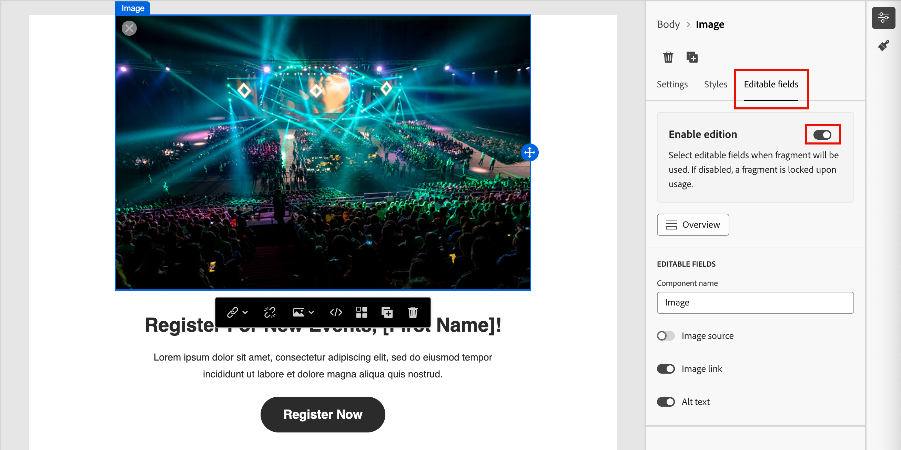
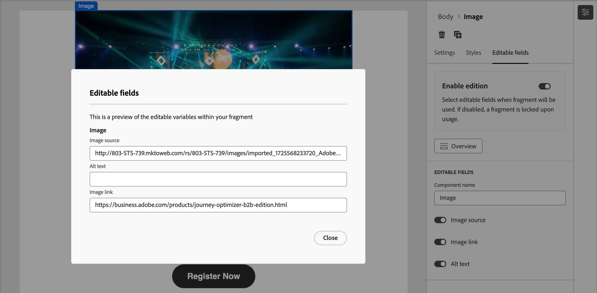

# 片段編寫

在您[建立片段](./fragments.md#create-fragments)後，請使用視覺設計空間來編寫片段中的結構和內容元件。

## 新增結構和內容 {#design-fragment}

{{$include /help/_includes/content-design-components.md}}

## 新增資產

{{$include /help/_includes/content-design-assets.md}}

## 導覽圖層、設定和樣式

{{$include /help/_includes/content-design-navigation.md}}

## 將內容個人化

{{$include /help/_includes/content-design-personalization.md}}

## 條件式內容

若要根據規則將內容調整至目標設定檔的條件式內容，請選取內容元件，然後按一下元件工具列中的&#x200B;**[!UICONTROL 啟用條件式內容]**&#x200B;按鈕。 當發佈的片段包含在電子郵件訊息中時，條件規則會決定電子郵件訊息中轉譯的條件元件的變體。

如需詳細資訊，請參閱&#x200B;[_條件式內容_](./conditional-content.md)。

## 啟用片段自訂

當作者將片段新增至[電子郵件](./email-authoring.md#content-authoring---use-visual-fragments)或[電子郵件範本](./email-template-authoring.md#content-authoring---use-visual-fragments)時，依預設會鎖定片段內容。 對已發佈片段所做的任何變更都會自動傳播至使用該片段的所有內容資產。 當您將片段中元件的引數指定為可編輯時，電子郵件或範本作者可以指定特定於其需求的自訂欄位值。 此自訂標幟僅限影像、文字和按鈕視覺元件使用。

例如，如果您設計包含可點按按鈕的可重複使用橫幅，您可以將按鈕的URL引數指定為可編輯。 之後，電子郵件作者便可使用與其電子郵件促銷活動更為專屬的URL。 透過這些可自訂欄位，行銷人員可以管理和個人化可重複使用的內容，而無需建立全新的內容區塊或中斷來自原始片段的繼承更新。

1. 在視覺內容編輯器中，選取您要啟用自訂的影像、文字或按鈕元素。

1. 在右側的元件詳細資訊中，選取&#x200B;**[!UICONTROL 可編輯欄位]**&#x200B;索引標籤。

1. 按一下&#x200B;**[!UICONTROL 啟用版本]**&#x200B;選項切換並設定可編輯的欄位。

   {width="700" zoomable="yes"}

   您可以根據元件型別和片段中定義的引數，啟用顯示欄位的自訂功能。

   針對您想要允許自訂的每個欄位，將切換變更為啟用狀態。

1. 按一下&#x200B;**[!UICONTROL 總覽]**&#x200B;以檢閱所有可編輯的欄位及其預設值。

   {width="700" zoomable="yes"}

1. 儲存您的變更。

## 編輯連結的URL追蹤

{{$include /help/_includes/content-design-links.md}}
