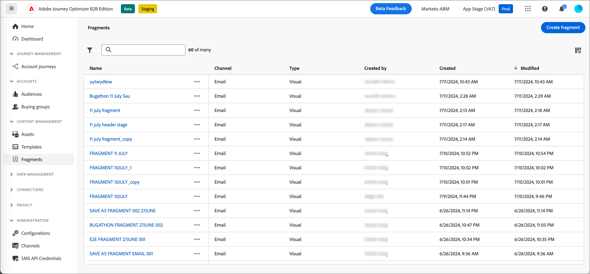
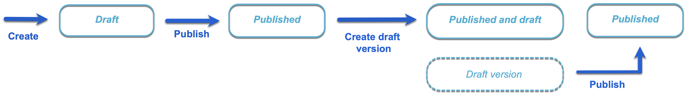
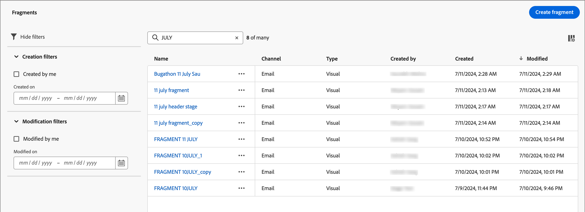
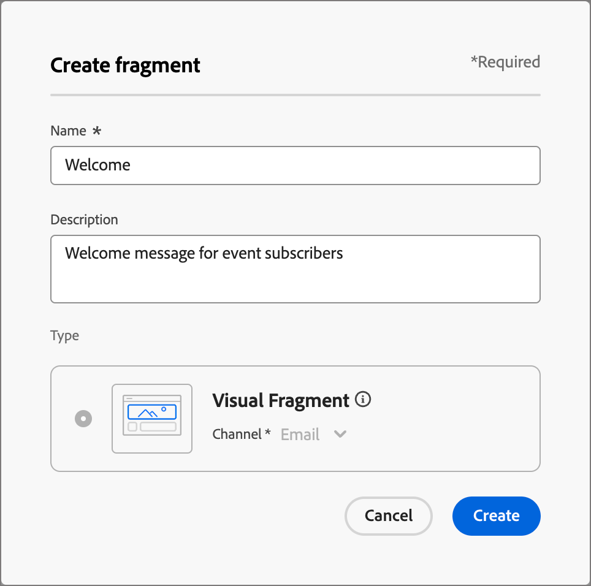
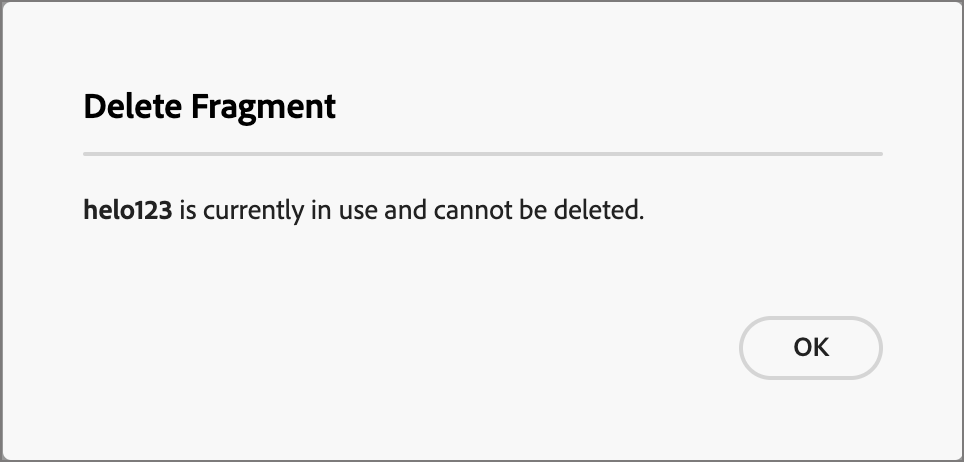
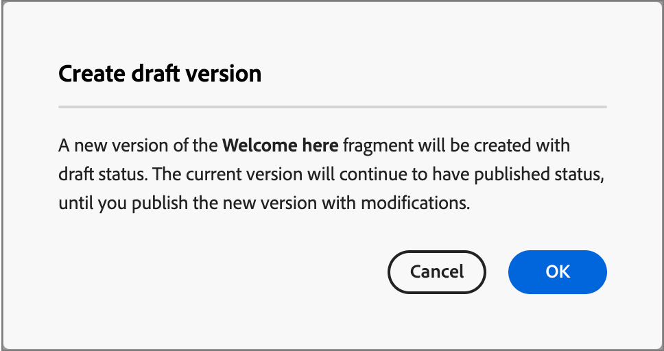
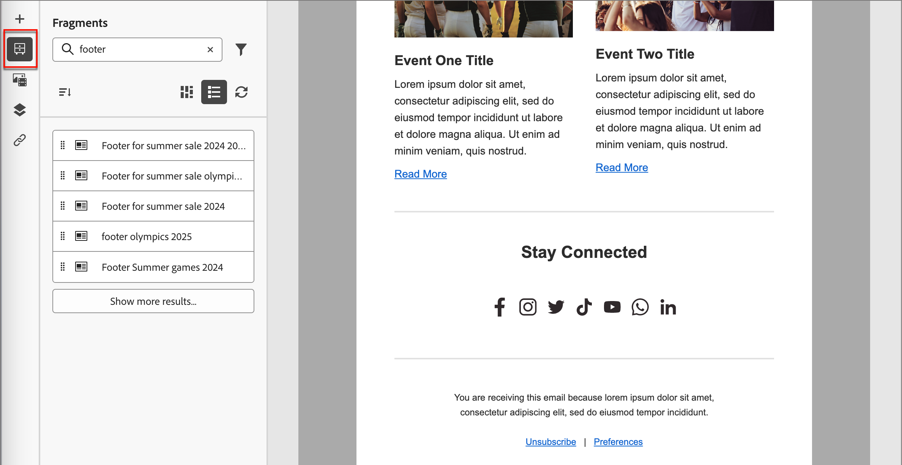
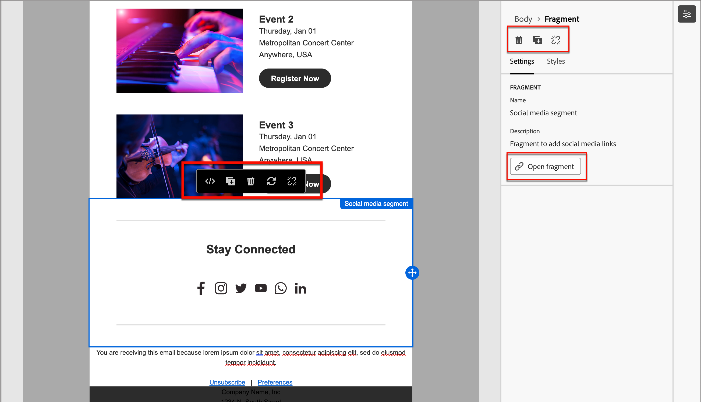

# 片段

片段是可重複使用的元件，可在各個Adobe Journey Optimizer B2B edition的一或多封電子郵件和電子郵件範本中參照。 這通常是可以預先建立並快速插入電子郵件或電子郵件範本中的內容區塊（文字、影像或兩者）。 透過此功能，您可以預先建置多個自訂內容區塊，以供行銷團隊成員用於組合電子郵件內容，以改進設計流程。 常見的使用案例包括電子郵件的頁首/頁尾內容區塊、事件邀請橫幅和季節性問候。

>[!BEGINSHADEBOX]

**視覺片段**

視覺片段是預先定義的視覺化區塊，使用視覺化內容設計工具建置，可在多個電子郵件或電子郵件範本中重複使用。 Journey Optimizer B2B edition及本檔案的目前範圍僅為視覺片段。 Journey Optimizer B2B edition尚不支援運算式型片段。

>[!ENDSHADEBOX]

若要在工作流程中善用片段：

* _建立您自己的片段_ — 從草稿開始建立視覺化片段，或是從視覺化內容編輯器將內容儲存為片段。
* _重複使用片段_ — 視需要在您的內容中多次使用這些片段。

## 存取及管理片段

若要存取Adobe Journey Optimizer B2B edition中的視覺片段，請前往左側導覽並按一下&#x200B;**[!UICONTROL 內容管理]** > **[!UICONTROL 片段]**。 此動作會開啟一個清單頁面，其中包含在表格中列出的執行個體中建立的所有片段。

{width="700" zoomable="yes"}

此表格是依&#x200B;_[!UICONTROL 已修改]_&#x200B;欄排序，最近更新的片段預設會排在頂端。 按一下欄標題，在升序和降序之間變更。

### 片段狀態和生命週期

片段狀態決定其是否可用於電子郵件或電子郵件範本，以及您可以對其進行的變更。

| 狀態 | 說明 |
| -------------------- | ----------- |
| 草稿 | 當您建立片段時，它處於草稿狀態。 在您定義或編輯視覺內容時，它保持此狀態，直到您發佈它以用於電子郵件或電子郵件範本為止。 可用的動作：  <ul><li>編輯所有詳細資料<li>在視覺化設計工具中編輯<li>發佈<li>重複<li>刪除 |
| 發佈日期 | 當您發佈片段時，該片段將可用於電子郵件或電子郵件範本。 在視覺化設計工具中無法修改已發佈的片段內容。 可用的動作：  <ul><li>編輯說明<li>新增至電子郵件或範本<li>建立草稿版本<li>重複<li>刪除（若未使用） |
| 已與草稿一起發佈 | 當您從已發佈的片段建立草稿時，已發佈的版本仍可在電子郵件或電子郵件範本中使用，且草稿內容可在視覺化設計工具中修改。 如果您發佈草稿版本，草稿版本會取代目前發佈的版本，且使用中的電子郵件和電子郵件範本中的內容會更新。 可用的動作：  <ul><li>編輯說明<li>新增至電子郵件或範本<li>在視覺化設計工具中編輯草稿版本<li>發佈草稿版本<li>重複<li>刪除（若未使用） |

{zoomable="yes"}

>[!IMPORTANT]
>
>Journey Optimizer B2B edition 8月發行版本已引入片段狀態。 在此版本之前建立的所有片段都會具有&#x200B;_草稿_&#x200B;狀態，即使這些片段用於電子郵件或範本中亦然。 如果您對這些片段進行變更，則必須發佈片段以傳播變更。

### 篩選片段清單

若要依名稱搜尋片段，請在搜尋列中輸入文字字串以尋找相符專案。 按一下&#x200B;_篩選器_&#x200B;圖示（）以顯示可用的篩選器選項，並變更設定以根據您指定的條件篩選顯示的專案。

{width="700" zoomable="yes"}

### 自訂欄顯示

按一下右上角的&#x200B;_自訂表格_&#x200B;圖示（），自訂您要顯示在表格中的欄。

在對話方塊中，選取要顯示的資料行，然後按一下&#x200B;**[!UICONTROL 套用]**。

{width="300"}

## 建立內容片段

您可以按一下右上角的「**[!UICONTROL 建立片段]**」，在Journey Optimizer B2B edition中建立新的視覺片段。

1. 在&#x200B;_[!UICONTROL 建立片段]_&#x200B;對話方塊中，輸入有用的&#x200B;**[!UICONTROL 名稱]**&#x200B;和&#x200B;**[!UICONTROL 描述]** （選擇性）。

   片段需求：

   * 名稱 — 最多100個字元，必須是唯一的、不區分大小寫

   * 說明 — 最多300個字元

   * 允許使用Alpha、數值和特殊字元

   * 保留的字元是&#x200B;**_不允許_**： `\ / : * ? " < > |`

   {width="400"}

1. 按一下&#x200B;**[!UICONTROL 建立]**。

   視覺化設計工具會以空白畫布開啟。

1. 使用內容設計工具建立視覺片段內容：

   * [新增結構和內容](./fragment-authoring.md#add-structure-and-content)
   * [新增Assets](./fragment-authoring.md#add-assets)
   * [導覽圖層、設定和樣式](./fragment-authoring.md#navigate-the-layers-settings-and-styles)
   * [將內容個人化](./fragment-authoring.md#personalize-content)
   * [啟用自訂欄位](./fragment-authoring.md#enable-fragment-customization)
   * [編輯連結的URL追蹤](./fragment-authoring.md#edit-linked-url-tracking)

1. 隨時按一下&#x200B;**[!UICONTROL 儲存]**&#x200B;以儲存草稿片段。

1. 當您準備好讓片段可用於電子郵件或電子郵件範本時，請按一下[發佈]。****

## 檢視片段詳細資訊

按一下清單頁面中任何片段的名稱，以開啟片段詳細資訊頁面。 您可以選擇編輯片段、重新命名片段或更新片段說明。 進行更新，然後按一下名稱或說明欄位外部以自動儲存變更。

>[!NOTE]
>
>如果電子郵件或電子郵件範本正在使用已發佈的片段，則您無法變更名稱或編輯內容。 如果您想對片段進行變更，可以建立草稿版本。

{width="600" zoomable="yes"}

按一下「**[!UICONTROL 編輯片段]**」以在視覺內容編輯器中開啟片段。

隨時按一下左上方的&#x200B;_上一步_&#x200B;箭頭以結束檢視，此箭頭會返回&#x200B;_片段_&#x200B;清單頁面。

## 檢視片段使用者參考

在片段詳細資訊頁面中，按一下&#x200B;**[!UICONTROL 使用者]**&#x200B;索引標籤，以檢視Journey Optimizer B2B edition、電子郵件、電子郵件範本和片段中目前使用片段的詳細資訊。

>[!IMPORTANT]
>
>無法刪除任何電子郵件或電子郵件範本目前正在使用的任何片段。

根據類別顯示參考： _電子郵件_&#x200B;或&#x200B;_電子郵件範本_。 Journey Optimizer B2B edition中的電子郵件內嵌於帳戶歷程中並加以撰寫，因此使用片段的電子郵件上層歷程會顯示在參考中。

{width="600" zoomable="yes"}的參考使用

按一下連結，開啟使用片段之對應的電子郵件或電子郵件範本。

## 刪除片段

無法刪除任何電子郵件或電子郵件範本目前正在使用的任何片段，因此在起始片段移除前，請務必檢查&#x200B;_used-by_&#x200B;參考。 此外，移除無法復原，因此在起始刪除動作前請先檢查。

您可以使用下列其中一種方法來刪除片段：

* 從右側的片段詳細資料中，按一下&#x200B;**[!UICONTROL 刪除]**。
* 從&#x200B;_[!UICONTROL 片段]_&#x200B;清單頁面，按一下片段旁的省略符號，然後選擇&#x200B;**[!UICONTROL 刪除]**。

此動作會開啟確認對話方塊。 您可以按一下&#x200B;**[!UICONTROL 取消]**，或按一下&#x200B;**[!UICONTROL 刪除]**&#x200B;確認刪除，以中止程式。

{width="400"}

如果片段目前正在使用中，動作會開啟資訊對話方塊，提醒您無法刪除該片段。 按一下&#x200B;**[!UICONTROL 確定]**，這會中止刪除動作。

{width="400"}

## 編輯片段

對片段的編輯取決於其目前狀態：

* 當片段處於&#x200B;_草稿_&#x200B;狀態時，您可以編輯其任何詳細資訊和視覺內容。
* 當片段處於&#x200B;_已發佈_&#x200B;狀態時，您可以編輯片段說明，但不能編輯名稱。 您無法編輯視覺內容。
* 當片段處於&#x200B;_以草稿_&#x200B;狀態發佈時，編輯詳細資料僅限於說明。 您也可以編輯草稿版本的視覺內容。

>[!BEGINTABS]

>[!TAB 草稿]

1. 從&#x200B;_[!UICONTROL 片段]_&#x200B;清單頁面，按一下片段名稱以開啟。

   接著會顯示視覺內容的預覽，片段詳細資訊位於右側。

1. 修改任何詳細資訊，例如名稱和說明。

   {width="600" zoomable="yes"}

1. 若要變更視覺化設計工具中的內容，請按一下[編輯片段]。****

   視需要使用視覺化設計工具工具：

   * [新增結構和內容](./fragment-authoring.md#add-structure-and-content)
   * [新增Assets](./fragment-authoring.md#add-assets)
   * [導覽圖層、設定和樣式](./fragment-authoring.md#navigate-the-layers-settings-and-styles)
   * [將內容個人化](./fragment-authoring.md#personalize-content)
   * [啟用自訂欄位](./fragment-authoring.md#enable-fragment-customization)
   * [編輯連結的URL追蹤](./fragment-authoring.md#edit-linked-url-tracking)

   按一下「**[!UICONTROL 儲存]**」或「**[!UICONTROL 儲存並關閉]**」以返回片段詳細資料。

1. 當片段符合您的條件且您想要在電子郵件或電子郵件範本中使用時，請按一下&#x200B;**[!UICONTROL 發佈]**。

>[!TAB 已發佈]

1. 從&#x200B;_[!UICONTROL 片段]_&#x200B;清單頁面，按一下片段名稱以開啟。

   接著會顯示視覺內容的預覽，片段詳細資訊位於右側。

1. 視需要修改說明。

   針對已發佈的片段，無法變更所有其他詳細資料。

1. 若要更新內容，請按一下右上方的&#x200B;**[!UICONTROL 建立草稿版本]**。

   在對話方塊中按一下「**[!UICONTROL 確定]**」，在視覺化設計工具中開啟草稿版本。

   {width="300"}

   視需要使用視覺化設計工具工具：

   * [新增結構和內容](./fragment-authoring.md#add-structure-and-content)
   * [新增Assets](./fragment-authoring.md#add-assets)
   * [導覽圖層、設定和樣式](./fragment-authoring.md#navigate-the-layers-settings-and-styles)
   * [將內容個人化](./fragment-authoring.md#personalize-content)
   * [啟用自訂欄位](./fragment-authoring.md#enable-fragment-customization)
   * [編輯連結的URL追蹤](./fragment-authoring.md#edit-linked-url-tracking)

   按一下「**[!UICONTROL 儲存]**」或「**[!UICONTROL 儲存並關閉]**」以返回片段詳細資料。

1. 當草稿片段符合您的條件且您想要讓變更可用於電子郵件或電子郵件範本時，請按一下&#x200B;**[!UICONTROL 發佈]**。

   當您發佈草稿版本時，草稿版本會取代目前發佈的版本，而內容會更新到已使用草稿的電子郵件和電子郵件範本中。

>[!TAB 已發佈草稿]

有兩種方式可開啟草稿版本，以從&#x200B;_[!UICONTROL 片段]_&#x200B;清單頁面進行編輯：

* 按一下片段名稱旁的&#x200B;_更多_&#x200B;圖示(**...**)，然後選擇&#x200B;**[!UICONTROL 開啟草稿版本]**。

  {width="300"}

* 按一下片段名稱以開啟。 然後，按一下右上方的&#x200B;**[!UICONTROL 開啟草稿版本]**。

  將顯示草稿版本的視覺內容預覽，片段詳細資訊在右側。

若要更新內容：

1. 按一下右上方的&#x200B;**[!UICONTROL 編輯片段]**。 視需要使用視覺化設計工具工具：

   * [新增結構和內容](./fragment-authoring.md#add-structure-and-content)
   * [新增Assets](./fragment-authoring.md#add-assets)
   * [導覽圖層、設定和樣式](./fragment-authoring.md#navigate-the-layers-settings-and-styles)
   * [將內容個人化](./fragment-authoring.md#personalize-content)
   * [啟用自訂欄位](./fragment-authoring.md#enable-fragment-customization)
   * [編輯連結的URL追蹤](./fragment-authoring.md#edit-linked-url-tracking)

   按一下「**[!UICONTROL 儲存]**」或「**[!UICONTROL 儲存並關閉]**」以返回片段詳細資料。

1. 當草稿片段符合您的條件且您想要讓變更可用於電子郵件或電子郵件範本時，請按一下&#x200B;**[!UICONTROL 發佈]**。

   當您發佈草稿版本時，草稿版本會取代目前發佈的版本，而內容會更新到已使用草稿的電子郵件和電子郵件範本中。

>[!ENDTABS]

## 重複片段

您可以使用以下任一方法復製片段：

* 從&#x200B;_[!UICONTROL 片段]_&#x200B;清單頁面，按一下片段名稱旁的&#x200B;_更多_&#x200B;圖示(**...**)，然後選擇&#x200B;**[!UICONTROL 複製]**。
* 在片段詳細資料頁面的右上方，按一下&#x200B;**[!UICONTROL ...更多]**&#x200B;並選擇&#x200B;**[!UICONTROL 複製]**。

{width="600" zoomable="yes"}

在對話方塊中，輸入有用的名稱（唯一）和說明。 按一下&#x200B;**[!UICONTROL 複製]**&#x200B;以完成動作。

{width="400"}

然後，重複的（新）片段會出現在&#x200B;_片段_&#x200B;清單中。

## 從電子郵件或範本內容儲存新片段

在視覺內容編輯器中建立/編輯電子郵件或電子郵件範本時，您可以選擇將內容的所有或部分儲存為片段，以便重複使用。

1. 當您將某些內容儲存為片段時，請按一下[其他] ****，然後選擇[另存為片段] ]**。**[!UICONTROL 

1. 選取要包含在片段中的不同元素。

   按住Shift或Control按鈕，選取多個結構。

   您只能選取彼此相鄰的結構，而且介面不允許您選取不相鄰的元素。

1. 選取內容後，按一下右上角的&#x200B;**[!UICONTROL 建立]**。

1. 在對話方塊中，輸入片段的實用名稱和說明。 然後按一下&#x200B;**[!UICONTROL 建立]**。

   然後，新片段會顯示在&#x200B;_片段_&#x200B;清單頁面中，也可在電子郵件和電子郵件範本中使用。

## 將視覺化片段新增至您的電子郵件或範本內容

片段是專為重複使用而設計，可插入以用於電子郵件和電子郵件範本的製作。 您最多可以在電子郵件或範本中新增30個片段。 片段最多只能巢狀內嵌一個層級。

>[!BEGINTABS]

>[!TAB 新增片段至電子郵件]

1. 導覽至&#x200B;**[!UICONTROL 帳戶歷程]**&#x200B;並開啟現有歷程或建立新歷程。

1. 建立[_[!UICONTROL 傳送電子郵件&#x200B;]_節點](./add-email.md#add-an-email-action-node-in-a-journey)。

1. 建立或編輯節點](./email-authoring.md)的[電子郵件內容。

1. 從&#x200B;**[!UICONTROL 元件]**&#x200B;功能表拖放專案，以提供片段的&#x200B;_結構_。

1. 若要開啟已發佈片段的清單，請按一下&#x200B;_片段_&#x200B;圖示。

   您可以：
   * 排序清單。
   * 瀏覽、搜尋及篩選清單。
   * 在卡片（縮圖）和清單檢視之間切換。
   * 重新整理清單以反映任何最近建立的片段。

   {width="600"}

1. 將任何片段拖放至結構元件預留位置。

   編輯器會在電子郵件結構的區段/元素中轉譯片段。

片段的內容會在結構內動態更新，以呈現內容在電子郵件中如何顯示的視覺效果。

>[!TIP]
>
>如果您希望片段佔據電子郵件內的整個水準版面，請新增[!UICONTROL 1:1欄]結構，然後將片段拖放到其中。

儲存電子郵件後，選取&#x200B;_[!UICONTROL 使用者]_&#x200B;索引標籤時，它就會顯示在片段詳細資訊頁面中。 新增到電子郵件的片段在電子郵件或範本中無法編輯 — 發佈的來源片段會定義內容。

>[!TAB 新增片段至電子郵件範本]

1. 從左側導覽列按一下&#x200B;**[!UICONTROL 內容管理]** > **[!UICONTROL 範本]**。

1. 建立新範本，或開啟現有的電子郵件範本，然後按一下[編輯電子郵件範本]。****

1. 從&#x200B;**[!UICONTROL 元件]**&#x200B;功能表拖放專案，以提供片段的&#x200B;_結構_。

1. 若要開啟片段清單，請按一下&#x200B;_片段_&#x200B;圖示。

   您可以：
   * 排序清單。
   * 瀏覽、搜尋及篩選清單。
   * 在卡片（縮圖）和清單檢視之間切換。
   * 重新整理清單以反映任何最近建立的片段。

   {width="600"}

1. 將任何片段拖放至結構元件預留位置。

   編輯器會在電子郵件範本結構的區段/元素中轉譯片段。

1. 將任何片段拖放至結構元件預留位置。

   編輯器會在電子郵件範本結構的區段/元素中轉譯片段。

>[!TIP]
>
>如果您希望片段佔據電子郵件範本內的整個水準配置，請新增&#x200B;_[!UICONTROL 1:1欄]_&#x200B;結構，然後將片段拖放到其中。

儲存電子郵件範本後，選取&#x200B;_[!UICONTROL 使用者]_&#x200B;索引標籤時，其會出現在片段詳細資訊頁面中。 新增到電子郵件範本的片段在範本中無法編輯 — 發佈的來源片段會定義內容。

>[!ENDTABS]

## 電子郵件和範本製作期間的片段動作

將片段新增至電子郵件或電子郵件範本時，無法在電子郵件或範本中編輯片段內容。 不過，您可以套用下列動作：

* **[!UICONTROL 刪除]** — 此動作會從目前的電子郵件或電子郵件範本內容移除片段（片段來源不受影響）。
* **[!UICONTROL 重新整理]** — 此動作會重新整理目前電子郵件或電子郵件範本中的片段內容。 當您想要反映新增到電子郵件或電子郵件範本後對片段的任何最近編輯時，重新整理會很有用。
* **[!UICONTROL 複製]** — 此動作會複製編輯器內相同電子郵件或電子郵件範本中的片段（使用相同的維度），並在其下方新增。
* **[!UICONTROL 開啟片段]** — 此動作會開啟新的瀏覽器索引標籤，其中包含片段編輯器頁面和詳細資訊。
* **[!UICONTROL 中斷繼承]** — 此動作會中斷來自來源的片段繼承（及其變更）。 使用此動作，在電子郵件或電子郵件範本中讓片段內容成為獨立且可編輯的內容。 此動作也會從原始片段的&#x200B;_使用者_&#x200B;參考中移除電子郵件或電子郵件範本。

在編輯器頁面上選取片段時，可以從右側的內容工具列和屬性面板中取得這些動作。

{width="600" zoomable="yes"}
