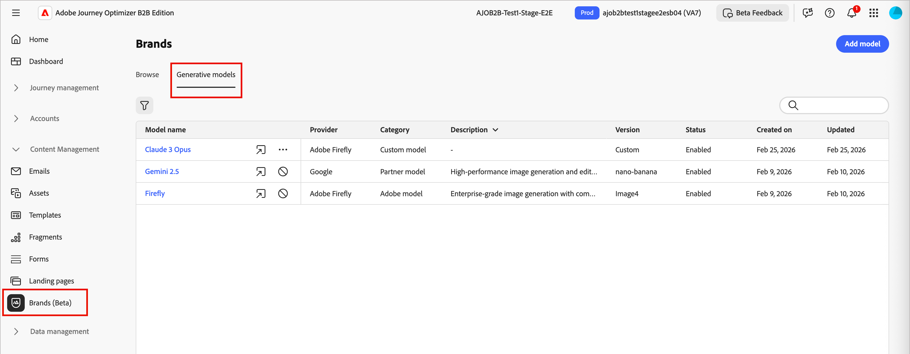

# 品牌調整的創作AI模型

使用內建模型、自訂Firefly模型和協力廠商影像產生提供者來擴展您的AI影像建立功能，以符合您的特定需求並改善品牌一致性：

- **[!UICONTROL Adobe模型]**&#x200B;由Firefly Image Model 4提供技術支援，現成可用立即產生影像，無需額外設定。
- 由Gemini 2.5 Flash支援的&#x200B;**[!UICONTROL 合作夥伴機型]**&#x200B;針對特定使用案例提供特殊功能。
- **[!UICONTROL 自訂模型]**&#x200B;是在您自己的資產上訓練並由您的組織新增的品牌特定模型。

在[Adobe Firefly檔案](https://helpx.adobe.com/firefly/web/work-with-enterprise-features/train-custom-models/custom-models-overview.html){target="_blank"}中瞭解自訂模型。

行銷人員在為其電子郵件或登陸頁面內容產生影像時，可以選取任何已啟用的產生模型。

## 管理產生模型

您可以從中央位置檢視所有可用的模型、篩選和搜尋以尋找特定模型，以及設定品牌的模型設定。

1. 在左側導覽列上，前往&#x200B;**[!UICONTROL 內容管理]** > **[!UICONTROL 品牌]**。

1. 在頁面中，選取&#x200B;**[!UICONTROL 產生式模型]**&#x200B;索引標籤。

{width="800" zoomable="yes"}

### 篩選及搜尋清單

按一下&#x200B;_篩選器_ 圖示以存取篩選器功能表。 依&#x200B;**[!UICONTROL 型別]**&#x200B;或&#x200B;**[!UICONTROL 狀態]**&#x200B;篩選模型。

{width="700" zoomable="yes"}

您也可以使用搜尋列，依名稱尋找特定的產生模型。

### 模型動作

針對清單中的自訂模型，按一下&#x200B;_更多功能表_ 圖示。 您可以選擇&#x200B;**[!UICONTROL 啟用]**&#x200B;或&#x200B;**[!UICONTROL 停用]**&#x200B;來變更模型的使用狀態，或選擇&#x200B;**[!UICONTROL 刪除]**&#x200B;來將模型從清單中移除。

產生模型清單中的{width="450"}

針對內建模型，按一下&#x200B;_啟用_ （）或&#x200B;_停用_ （）圖示，以變更影像產生的模型可用性。

>[!NOTE]
>
>只能刪除自訂模型。

## 新增產生模型

建立自訂Firefly模型或連線協力廠商影像產生提供者，以擴充您的創作AI功能。

>[!NOTE]
>
>建立自訂Firefly模型需要Firefly ETLA合約。

1. 從&#x200B;_[!UICONTROL 產生模型]_&#x200B;索引標籤，按一下&#x200B;**[!UICONTROL 新增模型]**。

1. 輸入模型的&#x200B;**[!UICONTROL 名稱]**。

<!-- 1. Select a **[!UICONTROL Model provider]**. future development -->

1. 輸入&#x200B;**[!UICONTROL 模型識別碼]**。

   若要尋找您的模型ID，請存取Firefly網站並導覽至您訓練的模型。 發佈模型後，可在模型的「管理」區段中取得唯一識別碼。 如需詳細資訊，請參閱[Firefly自訂模型檔案](https://helpx.adobe.com/firefly/web/work-with-enterprise-features/train-custom-models/custom-models-overview.html){target="_blank"}。

1. 選擇性地輸入&#x200B;**[!UICONTROL 描述]**&#x200B;以協助識別模型及其預期用途。

   {width="550" zoomable="yes"}

1. 按一下&#x200B;**[!UICONTROL 測試連線]**&#x200B;以驗證模型組態。

1. 當連線測試成功時，按一下[儲存]儲存模型組態。**&#x200B;**

   儲存模型會將其新增至產生模型清單，您可在此處啟用它以供行銷人員使用。 您也可以隨時停用或刪除它。

   {width="600" zoomable="yes"}
