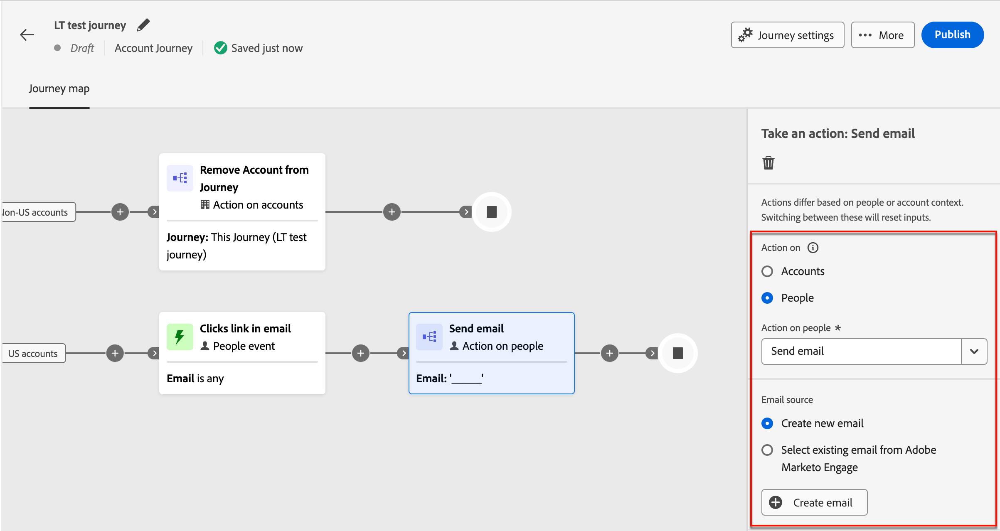
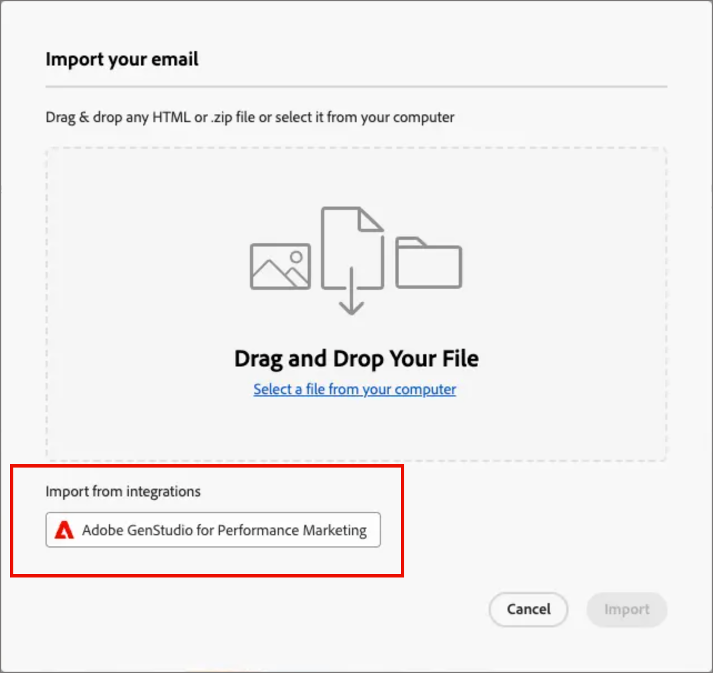
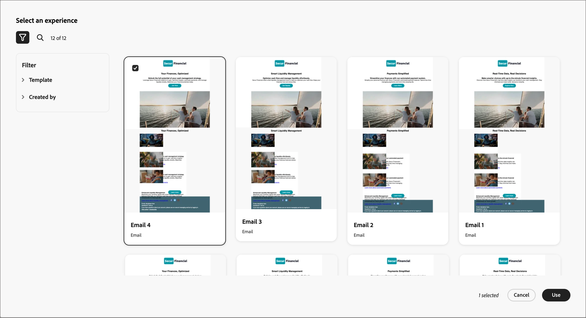
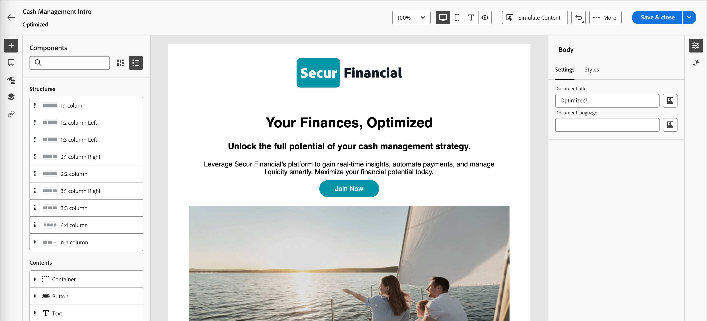

# 使用 GenStudio for Performance Marketing 建立電子郵件內容 {#genstudio-workflow}

>[!CONTEXTUALHELP]
>id="ajo-b2b_genstudio_button"
>title="使用以 GenStudio 建置的範本"
>abstract="使用 Adobe GenStudio for Performance Marketing 的整合功能，匯入使用 Adobe AI 技術增強的 GenStudio 範本。"

>[!AVAILABILITY]
>
>[!DNL Adobe Journey Optimizer B2B Edition] 的 GenStudio 整合目前無法搭配 **Healthcare Shield** 或 **Privacy and Security Shield** 附加元件方案使用。
>
>此整合僅適用於電子郵件頻道。

若要提升工作流程效率並維持品牌一致性，您可以將GenStudio for Performance Marketing體驗與Adobe Journey Optimizer B2B edition電子郵件協調流程結合。 此擴充的工作流程可讓您運用GenStudio中的AI功能內容建立工具，透過帳戶歷程擴充並最大化電子郵件通訊。

例如，技術行銷人員可使用Journey Optimizer B2B edition開發並自動化關鍵帳戶的電子郵件通訊，以便與使用GenStudio建立內容的效能行銷人員共同作業。 透過此工作流程，兩者可以共同合作，將GenStudio中的品牌上內容結合至Journey Optimizer B2B edition帳戶式行銷自動化，提供吸引人的電子郵件，鎖定特定購買群組並提升銷售量。

>[!BEGINSHADEBOX]

## GenStudio內容產生功能

[Adobe GenStudio for Performance Marketing](https://business.adobe.com/products/genstudio-for-performance-marketing.html){target="_blank"}是一款創造性的AI優先應用程式，可讓行銷團隊根據品牌標準並遵守其企業政策，建立具影響力、個人化的廣告和電子郵件。 透過運用Adobe AI技術，提供一套完整的工具，可簡化內容建立及管理的複雜性，讓創意人員可專注在創新上。

{width="30"} [建立品牌內行銷電子郵件](https://experienceleague.adobe.com/zh-hant/docs/genstudio-for-performance-marketing-learn/tutorials/creating-experiences/creating-on-brand-emails){target="_blank"}

在[檔案](https://experienceleague.adobe.com/zh-hant/docs/genstudio-for-performance-marketing/user-guide/home){target="_blank"}中進一步瞭解GenStudio for Performance Marketing功能

>[!ENDSHADEBOX]

## 從Journey Optimizer B2B edition匯出HTML

首先，在Journey Optimizer B2B edition中，從包含您品牌指引的電子郵件匯出HTML。

1. 在Journey Optimizer B2B edition中，存取視覺化設計空間中的電子郵件內容。

1. 從電子郵件設計空間頂端的&#x200B;_[!UICONTROL 更多……]_&#x200B;功能表，選擇&#x200B;**[!UICONTROL 匯出HTML]**。

   ![按一下[更多]並選擇[匯出HTML]](./assets/email-export-html.png){width="600"}

   此動作會產生下載的.zip檔案，其中包含HTML和影像檔案。

## 在GenStudio for Performance Marketing中使用匯出的HTML

使用可辨識的欄位名稱來識別匯入的電子郵件HTML中的特定元素時，GenStudio for Performance Marketing會加以識別。 使用Handlebars語法，在匯出的HTML中新增欄位名稱，其中您需要GenStudio for Performance Marketing產生特定型別的內容。

| 欄位 | 內容類型 |
| ----------------- | ------------------------- |
| `{{pre_header}}` | 預覽文字 |
| `{{headline}}` | 標題 |
| `{{sub_headline}}` | 副標題 |
| `{{body}}` | 內文文字 |
| `{{cta}}` | call to action （按鈕） |
| `{{image}}` | 影像 |
| `{{link}}` | 影像上的Call to action |

### 建立範本

使用HTML檔案在GenStudio for Performance Marketing中建立範本。

如需有關在Adobe GenStudio for Performance Marketing中將HTML範本上傳到GenStudio的詳細資訊，請參閱GenStudio for Performance Marketing檔案中的[新增範本](https://experienceleague.adobe.com/zh-hant/docs/genstudio-for-performance-marketing/user-guide/content/templates/use-templates#add-a-template)。

當您上傳匯出的HTML作為範本時，GenStudio for Performance Marketing會掃描HTML檔案以尋找可識別的欄位。 使用預覽可檢閱您的範本元素，並確認您以識別的欄位名稱正確識別了這些元素。

### 產生電子郵件體驗

在GenStudio for Performance Marketing中，使用範本建立多個電子郵件體驗變數並儲存。

如需有關產生品牌化電子郵件體驗的詳細資訊，請參閱GenStudio for Performance Marketing檔案中的[建立電子郵件體驗](https://experienceleague.adobe.com/zh-hant/docs/genstudio-for-performance-marketing/user-guide/create/create-email-experience)。

## 將產生的電子郵件體驗新增至Journey Optimizer B2B edition

>[!NOTE]
>
>GenStudio for Performance Marketing整合僅適用於建立電子郵件，不適用於建立電子郵件範本。

若要使用從轉存的GenStudio B2B edition電子郵件HTML檔案建立的Journey Optimizer電子郵件變數，請遵循下列步驟：

1. 在Journey Optimizer B2B edition中，[使用&#x200B;_[!UICONTROL 執行動作]_&#x200B;節點，將電子郵件](./add-email.md)新增至帳戶歷程。

   * 針對&#x200B;_目標上的_&#x200B;動作，請選擇&#x200B;**[!UICONTROL 人員]**。

   * 針對人員&#x200B;_的_&#x200B;動作，請選擇&#x200B;**[!UICONTROL 傳送電子郵件]**。

     {width="700" zoomable="yes"}

   * 對於&#x200B;_[!UICONTROL 電子郵件來源]_，請選擇&#x200B;**[!UICONTROL 建立新電子郵件]**，以在Journey Optimizer B2B edition中以原生方式建立電子郵件。

1. 在&#x200B;_建立您的電子郵件_&#x200B;頁面上，選取&#x200B;**[!UICONTROL 匯入HTML]**。

1. 在&#x200B;_[!UICONTROL 匯入您的電子郵件]_&#x200B;對話方塊中，按一下&#x200B;**[!UICONTROL Adobe GenStudio for Performance Marketing]**。

   {width="500" zoomable="yes"}

1. 瀏覽已發佈的體驗。

   您可以根據數個條件篩選體驗，例如&#x200B;_範本_&#x200B;和&#x200B;_建立者_。

   {width="600" zoomable="yes"}

1. 選取體驗並按一下&#x200B;**[!UICONTROL 使用]**&#x200B;開始建立您的電子郵件內容。

   >[!NOTE]
   >
   >從GenStudio B2B edition或Journey Optimizer範本建立的Marketo Engage體驗會直接匯入電子郵件設計空間。 未使用Journey Optimizer B2B edition範本建立的體驗會匯入相容模式。

1. 使用[電子郵件內容與個人化工具](./email-authoring.md)，視需要編輯您的電子郵件並加以儲存。

   {width="800" zoomable="yes"}
