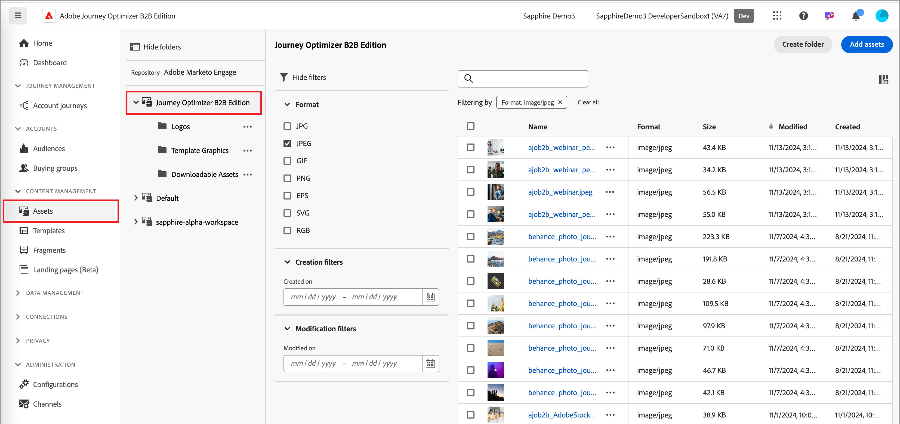
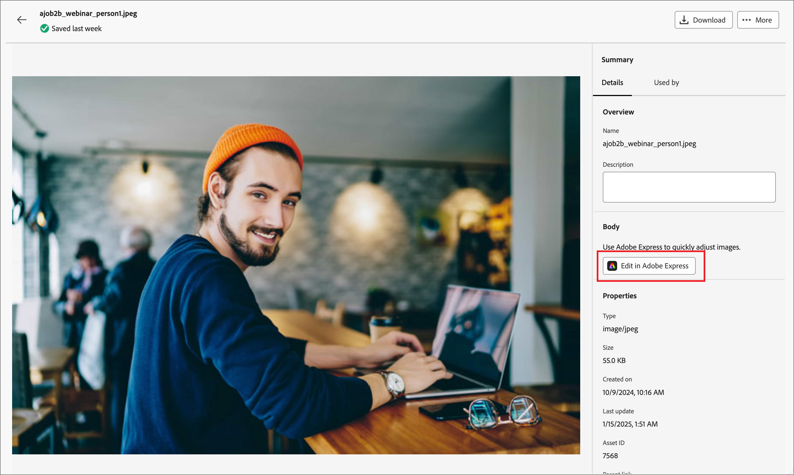
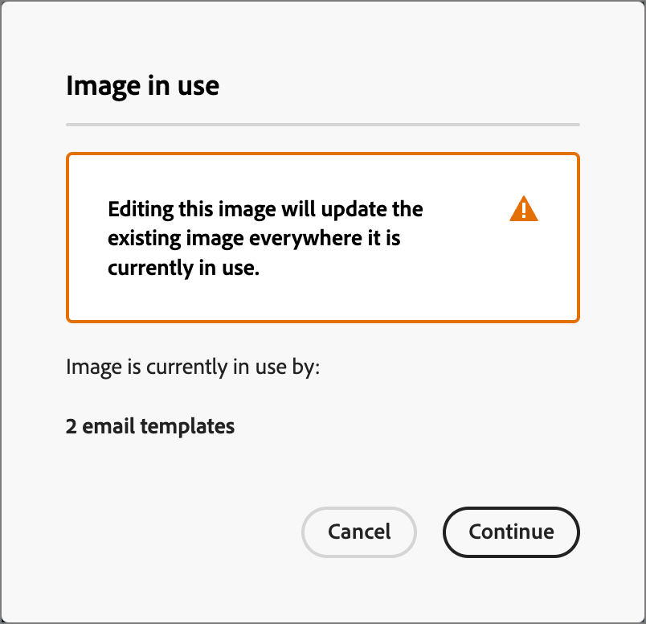
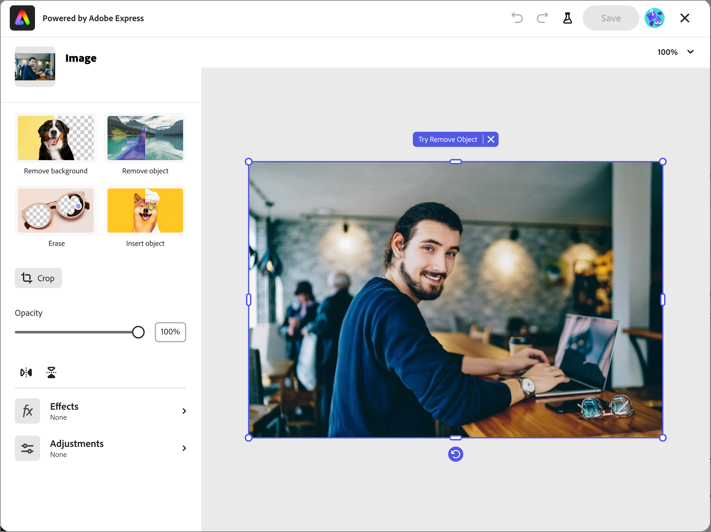
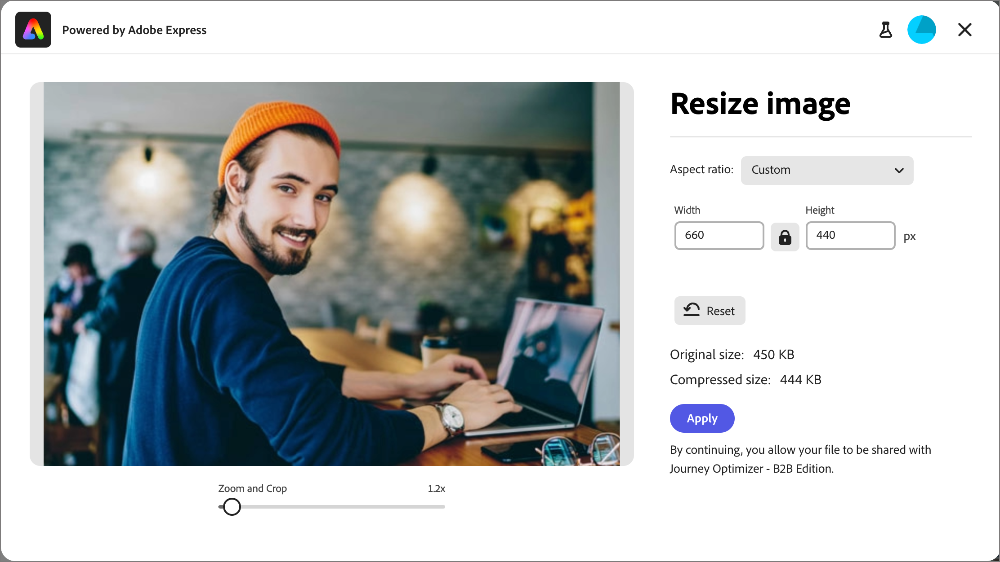
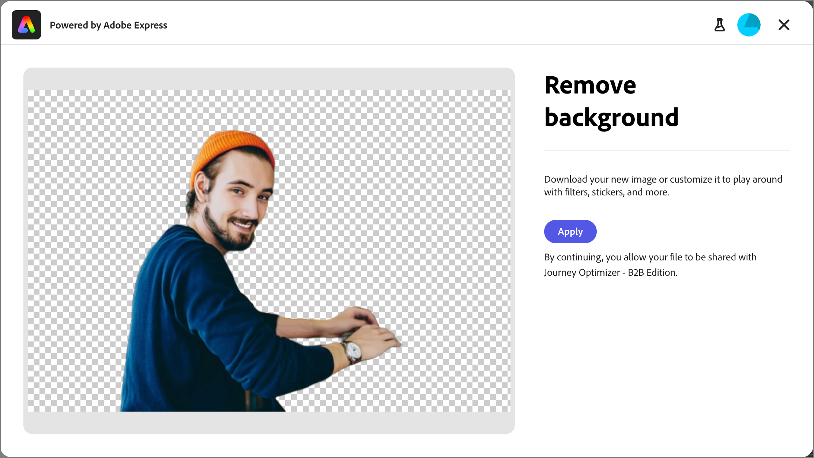
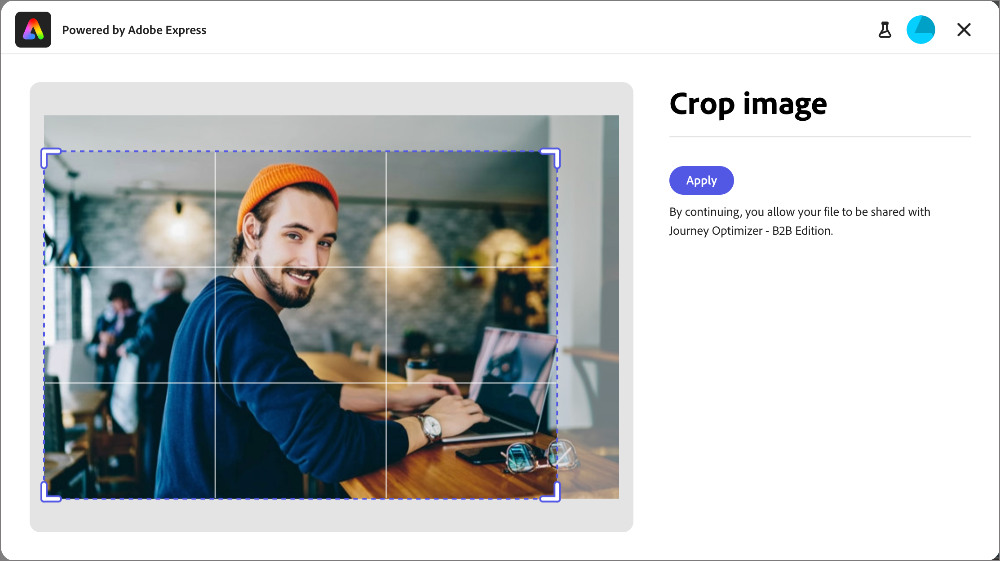
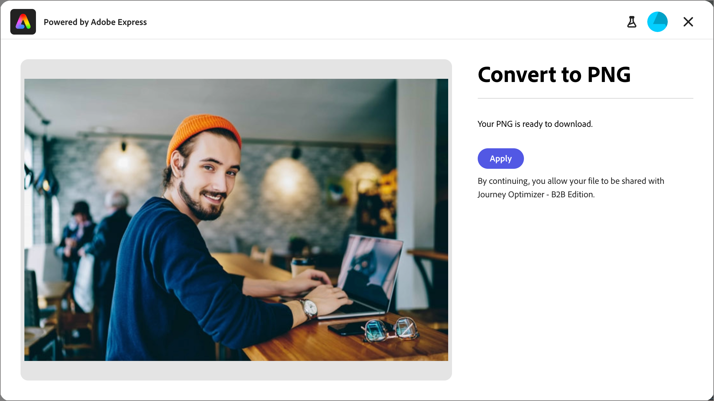

# 使用 Adobe Express 編輯影像 {#edit-images-adobe-express}

>[!CONTEXTUALHELP]
>id="ajo-b2b_assets_edit_adobe_express"
>title="在 Adobe Express 編輯影像"
>abstract="這個簡單直觀的影像編輯工具是由 Adobe Express 提供支援，可直接在 Adobe Journey Optimizer B2B Edition 中使用以加快建立內容的速度。"

Adobe Journey Optimizer B2B edition與Adobe Express原生整合，可讓您存取一組Adobe Express影像編輯工具。 您可以使用這些工具，為連線的Journey Optimizer B2B edition資產存放庫修改儲存在Marketo Engage工作區中的影像。 整合提供下列主要優點：

* 透過在Journey Optimizer B2B edition中編輯和儲存新影像資產，增加內容重複使用率。

* 減少更新影像資產或建立現有影像資產新版本的時間和精力。

>[!NOTE]
>
>Adobe Express編輯功能的權益包含在所有Journey Optimizer B2B edition訂閱中。

Adobe Express函式支援PNG和JPEG影像檔案格式。

修改影像(_T):_

1. 前往左側導覽並按一下&#x200B;**[!UICONTROL 內容管理]** > **[!UICONTROL Assets]**。

此動作會開啟一個清單頁面，其中列出所有資產。 預設會選取&#x200B;_[!UICONTROL Journey Optimizer B2B edition]_&#x200B;工作區。

1. 找到您要修改的影像，或作為建立新資產的原始影像。

   * 若要依工作區和資料夾檢視資產，請按一下左上方的&#x200B;_顯示資料夾_&#x200B;圖示以開啟結構。

   * 若要依任何欄排序表格，請按一下欄標題。 標題列中的箭頭表示目前的排序欄和順序。

   * 若要在選取的工作區或資料夾內搜尋影像資產，請在搜尋列中輸入文字字串。

   {width="800" zoomable="yes"}

1. 按一下影像資產的名稱以開啟並檢視其詳細資訊。

   >[!TIP]
   >
   >最佳實務是在影像詳細資料中選取[_[!UICONTROL 使用者]_&#x200B;標籤](./marketo-engage-design-studio.md#view-asset-used-by-references)，並檢閱目前使用影像的內容，然後再繼續編輯影像檔案。

1. 在右側的影像&#x200B;_[!UICONTROL 詳細資料]_&#x200B;中，按一下&#x200B;**[!UICONTROL 使用Adobe Express編輯]**。

   {width="600" zoomable="yes"}

   如果影像正在使用中，則會出現警告對話方塊，通知您所做的變更會影響該內容。 按一下&#x200B;**[!UICONTROL 繼續]**&#x200B;以繼續前往Adobe Express編輯器。

   {width="300"}

## Adobe Express企業授權

如果您有Adobe Express的企業版授權，可以存取並使用快速編輯器。 這些編輯功能包括影像調整作業，例如顏色、亮度、銳利度、對比和裁切。 它們也包含&#x200B;_AI magic_&#x200B;操作，例如移除背景、插入和移除物件，以及拭除影像部分。

>[!NOTE]
>
>您的Adobe Express企業授權必須在同一個IMS組織下購買，才能從Journey Optimizer B2B edition存取這些完整的編輯器功能。 身為IMS組織的個別成員，您需要Adobe Express執行個體中的指派授權。 否則，您的Adobe Express存取權僅限於Journey Optimizer B2B edition在Adobe Express[上的](#quick-actions-in-adobe-express)快速動作。

{width="600" zoomable="yes"}

[Adobe Express使用手冊](https://helpx.adobe.com/tw/express/web.html){target="_blank"}提供可用編輯功能的詳細資訊。

## Adobe Express中的快速動作

如果您沒有Adobe Express企業授權，可以存取Adobe Express快速動作編輯器。

1. 在Adobe Express快速動作編輯器中，選取任何影像修改函式以變更影像。

   * [**[!UICONTROL 調整影像大小]**](#resize-image)
   * [**[!UICONTROL 移除背景]**](#remove-background)
   * [**[!UICONTROL 裁切影像]**](#crop-image)
   * [**[!UICONTROL 轉換為PNG]**](#convert-file-format) (載入JPEG影像時)
   * [**[!UICONTROL 轉換為JPEG]**](#convert-file-format) （載入PNG影像時）

   {width="600" zoomable="yes"}

1. 當您返回主要Adobe Express快速動作編輯器時，按一下「儲存」**&#x200B;**，使用相同的檔案名稱將修改後的影像檔案儲存在Journey Optimizer B2B edition資產工作區中。

## 調整影像大小

1. 使用調整大小設定來縮小或展開影像：

   * 選取&#x200B;**[!UICONTROL 外觀比例]**&#x200B;選項。 使用數位內容的標準大小，或選擇&#x200B;**[!UICONTROL 自訂]** （如果您想要輸入&#x200B;**[!UICONTROL 寬度]**&#x200B;和&#x200B;**[!UICONTROL 高度]**&#x200B;的值）以符合您的需求。

   * 顯示的&#x200B;_[!UICONTROL 原始大小]_&#x200B;和&#x200B;_[!UICONTROL 壓縮大小]_&#x200B;顯示您套用變更時所導致的大小變更。 **[!UICONTROL 縮放與裁切]**&#x200B;工具可讓您更密切地檢查顯示的影像部分。

   * 如果要將影像回覆成原始狀態，請按一下[重設]。**&#x200B;**

   {width="600" zoomable="yes"}

1. 當您對結果滿意時，請按一下[套用]。**&#x200B;**

## 移除背景

{width="600" zoomable="yes"}

Adobe Express會執行自動背景移除，以隔離影像中的主要物件。 如果您對結果滿意，請按一下[套用]。**&#x200B;**

## 裁切影像

1. 拖曳影像邊角的控點，移除不想包含在影像資產中的外部區域。

   {width="600" zoomable="yes"}

1. 當您對結果滿意時，請按一下[套用]。**&#x200B;**

## 轉換檔案格式

* **[!UICONTROL 轉換為JPEG]** — 若是PNG影像，您可以將影像轉換為JPEG影像檔案，並將其儲存為工作區中的新資產。
* **[!UICONTROL 轉換為PNG]** — 若是JPEG影像，您可以將影像轉換為PNG影像檔案，並將其儲存為工作區中的新資產。

{width="600" zoomable="yes"}

1. 按一下&#x200B;**[!UICONTROL 套用]**。
