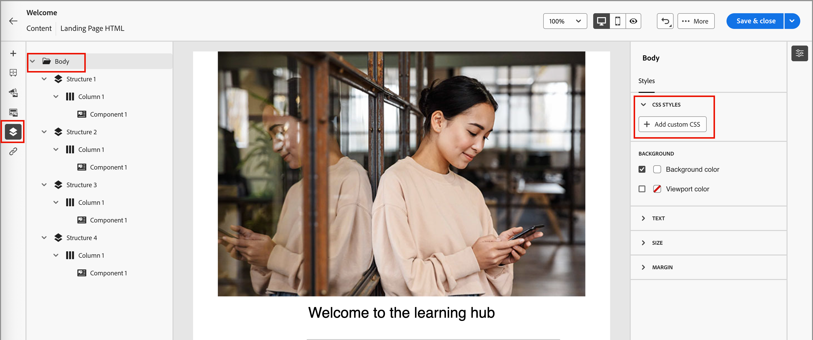

# 設計登陸頁面範本

在您[建立登入頁面範本](./landing-page-templates.md#create-a-landing-page-template)之後，請使用視覺設計空間來編寫頁面範本中的結構和內容元件。

## 新增結構和內容 {#structure-content-landing-page}

>[!CONTEXTUALHELP]
>id="ajo-b2b_landing_page_template_structure"
>title="新增結構元件至登陸頁面"
>abstract="結構元件會定義登陸頁面的版面。將&#x200B;**結構**&#x200B;元件拖放至版面，開始設計頁面範本的內容。"

>[!CONTEXTUALHELP]
>id="ajo-b2b_landing_page_template_content_components"
>title="關於登陸頁面的內容元件"
>abstract="內容元件是可以用來建立登陸頁面範本之版面的空白內容預留位置。"

{{$include /help/_includes/content-design-components.md}}

### 新增自訂 CSS

您可以直接在登入頁面設計空間內新增自己的自訂CSS。 使用自訂CSS套用進階和特定的樣式，以擁有更大的彈性並控制內容的外觀。 最佳實務是在加入影像、按鈕和文字等元件前，先新增此最高層級的樣式。

如果畫布中至少有一個內容元件，請在左側導覽樹狀結構中選取&#x200B;**[!UICONTROL Body]**&#x200B;元件，以存取自訂CSS編輯器。

{width="800" zoomable="yes"}

{{$include /help/_includes/content-design-custom-css.md}}

### 新增資產

{{$include /help/_includes/content-design-assets.md}}

### 新增表單

{{$include /help/_includes/content-design-add-forms.md}}

### 導覽圖層、設定和樣式

{{$include /help/_includes/content-design-navigation.md}}

### 將內容個人化

{{$include /help/_includes/content-design-personalization.md}}

### 編輯連結的URL追蹤

{{$include /help/_includes/content-design-links.md}}

### 儲存您的工作

隨時按一下「儲存」**[!UICONTROL 以儲存登入頁面範本。]**
<!--
You can continue to make edits to the draft page template. When you are ready to make it available for using in page creation, you can [publish the template](./landing-page-templates.md#). -->

### 檢視選項

善用視覺化設計空間中可用的檢視和內容驗證選項。

* 透過預設縮放選項放大/縮小內容。

* 切換在案頭、行動裝置或純文字/純文字間檢視內容。
   * 按一下&#x200B;_檢視_&#x200B;圖示，即可跨裝置預覽內容。
   * 選取其中一個現成可用的裝置，或輸入自訂維度以預覽內容。

### 更多選項

從視覺設計空間頂端的&#x200B;_[!UICONTROL 更多……]_&#x200B;功能表，您可以執行下列動作：

![按一下[更多]以存取範本動作](./assets/landing-page-designer-more-menu.png){width="500"}

* **[!UICONTROL 重設登陸頁面]** — 按一下此選項，將視覺化設計畫布清除為空白並重新啟動建立頁面內容。
* **[!UICONTROL 變更您的設計]** — 返回&#x200B;_[!UICONTROL 建立您的主要登陸頁面]_&#x200B;首頁。 從那裡，您可以選擇另一個範本以重新啟動設計程式，或選擇在空白畫布中從頭開始設計頁面。
<!--- * **[!UICONTROL Save as content template]** - Save the page body as a landing page template to be reused across multiple landing pages. You provide a name and description for the template and save it to the list of saved  landing page templates. -->
* **[!UICONTROL 匯出HTML]** — 將視覺畫布中的內容以HTML格式下載到您的本機系統，並封裝成zip檔。
