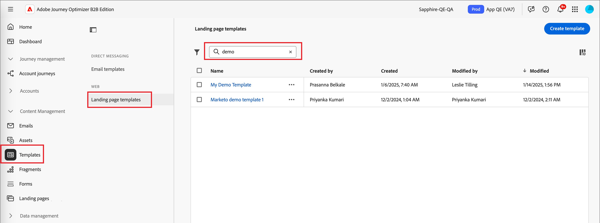
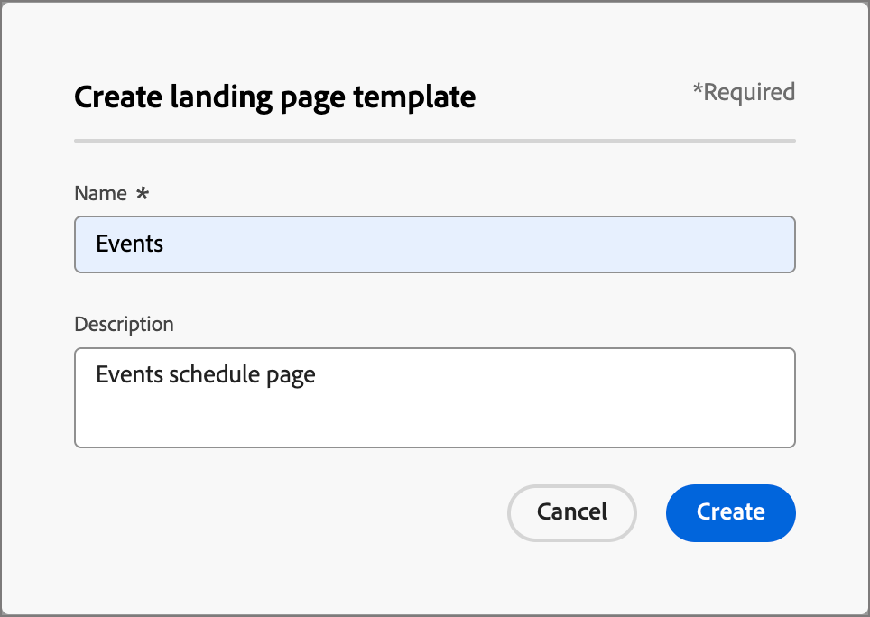
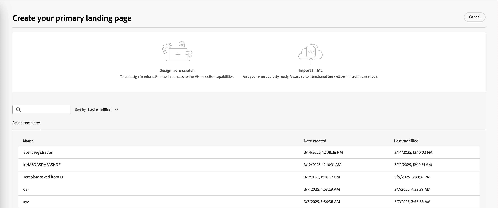

# 登陸頁面範本

為了加快並改善設計流程，您可以建立獨立的登入頁面範本，以標準化您的頁面設計和內容。 行銷策略師可重複使用頁面，並加以調整以適合行銷活動和歷程使用。

## 存取及管理登入頁面範本

若要存取Adobe Journey Optimizer B2B edition中的登入頁面範本，請前往&#x200B;**[!UICONTROL 內容管理]** > **[!UICONTROL 範本]**。 在導覽面板的&#x200B;_[!UICONTROL 網頁]_&#x200B;下，選取&#x200B;**[!UICONTROL 登入頁面範本]**。

顯示的清單頁面包含以表格格式列出的執行個體中建立的所有登入頁面範本。 表格預設會依&#x200B;_[!UICONTROL 已修改]_&#x200B;欄排序，最近更新的範本會位於最上方。 按一下欄標題，在升序和降序之間變更。

若要依名稱搜尋範本，請在搜尋列中輸入文字字串。

{width="700" zoomable="yes"}

按一下左上方的&#x200B;_篩選器_&#x200B;圖示（）可依據建立或修改日期以及您已建立或修改的範本來篩選清單。

按一下右上角的&#x200B;_自訂表格_&#x200B;圖示（），自訂您要顯示在表格中的欄。 選取要顯示的資料行，然後按一下&#x200B;**[!UICONTROL 套用]**。

從顯示的範本清單中，您可以執行下列各節所述的動作。

## 建立登入頁面範本

您可以按一下右上角的&#x200B;**[!UICONTROL 「建立範本]**」，從登入頁面範本清單頁面建立登入頁面範本。

1. 在對話方塊中，輸入唯一的&#x200B;**[!UICONTROL Name]** （必要）和有用的&#x200B;**[!UICONTROL Description]** （選用）。

   {width="400"}

1. 按一下&#x200B;**[!UICONTROL 建立]**。

_[!UICONTROL 建立您的主要登陸頁面]_&#x200B;頁面會開啟並提供建立範本的選項： _[!UICONTROL 從頭開始設計]_、_[!UICONTROL 匯入HTML]_，或選取&#x200B;_[!UICONTROL 已儲存的範本]_&#x200B;之一。

{width="800" zoomable="yes"}

選取您要用來開始範本設計的方法之後，請使用視覺設計空間來[設計您的登入頁面範本內容](./landing-page-design.md)。

### 從頭開始設計

使用視覺化設計空間來定義登入頁面內容的結構。 透過使用簡單的拖放動作新增和移動結構元件，您可以在數秒內設計可重複使用頁面內容的形狀。

>[!NOTE]
>
>可用的設計工具等同於用於登入頁面設計的工具。 不同之處在於此內容會儲存為範本，可在多個登入頁面重複使用。

1. 從&#x200B;_[!UICONTROL 設計您的範本]_&#x200B;首頁，選取&#x200B;**[!UICONTROL 從頭開始設計]**&#x200B;選項。

1. [將結構和內容](./landing-page-design.md#add-structure-and-content)新增到範本。

### 匯入HTML

Adobe Journey Optimizer B2B edition可讓您匯入現有的HTML內容，以設計您的登入頁面範本。

{{$include /help/_includes/content-design-import.md}}

{width="500"}

>[!NOTE]
>
>在HTML檔案中使用`<table>`標籤做為第一個圖層可能會造成樣式遺失，包括上層圖層標籤中的背景和寬度設定。

您可以視需要利用視覺化設計空間個人化匯入的內容。

### 選取設計範本

{{$include /help/_includes/content-design-select-template.md}}

## 檢視頁面範本詳細資訊

在&#x200B;_登入頁面範本_&#x200B;清單頁面中，按一下登入頁面範本的名稱以開啟詳細資訊頁面。 從這裡，您可以檢視登入頁面範本的基本屬性，並存取視覺化設計空間以變更範本內容。

{width="700" zoomable="yes"}

* 檢視範本詳細資訊，例如名稱和說明。 您可以編輯這些設定。 按一下說明方塊外部以自動儲存變更。

* 檢視範本屬性，例如，建立者、建立時間、上次更新時間和修改者。

* 按一下右上角的&#x200B;**[!UICONTROL 更多]**，對登入頁面範本採取快速動作，例如&#x200B;_複製_&#x200B;和&#x200B;_刪除_。

* 如果登入頁面範本有使用中的警示（錯誤和警告），請按一下右上方的&#x200B;**[!UICONTROL 警示]**&#x200B;以檢視資訊。

  這些警報不會禁止使用登入頁面範本來建立登入頁面。 此資訊可讓您團隊中的行銷人員瞭解可能無法使用的專案，以及在可用於傳送之前所需的更新。

## 檢視參考使用的範本

在範本詳細資訊頁面中，按一下&#x200B;**[!UICONTROL 使用者]**&#x200B;標籤以檢視此範本在登入頁面中的使用位置詳細資訊。

![按一下[使用者]索引標籤以檢查範本使用情形](./assets/template-details-used-by.png){width="400"}

* 按一下連結，即可將您導向至使用範本的對應登入頁面。

* 按一下後退箭頭可隨時結束檢視，讓您返回清單頁面。

## 編輯登入頁面範本

此動作可從以下位置執行：

* 詳細資訊頁面 — 按一下&#x200B;**[!UICONTROL 編輯登入頁面範本]**。
* 清單頁面 — 按一下範本旁邊的省略符號(**...**)，然後選擇&#x200B;**[!UICONTROL 編輯]**。

此動作會帶您前往&#x200B;_設計您的範本_&#x200B;頁面或視覺內容編輯器頁面（根據上次儲存的登入頁面範本狀態）。 從這裡，您可以視需要編輯登入頁面範本內容。 如需有關編輯選項的資訊，請參閱[建立登入頁面範本](#create-a-landing-page-template)。

## 複製登陸頁面範本

您可以使用下列其中一種方法來複製登入頁面範本：

* 從右側的範本詳細資料中，展開&#x200B;**[!UICONTROL 更多]**&#x200B;並按一下&#x200B;**[!UICONTROL 複製]**。

  ![按一下[更多]以存取[刪除]和[複製]動作](./assets/template-details-more-menu.png){width="400"}

* 從&#x200B;_[!UICONTROL 登入頁面範本]_&#x200B;清單頁面，按一下範本旁邊的省略符號(...)，然後選擇&#x200B;**[!UICONTROL 複製]**。

在對話方塊中，輸入有用的名稱（唯一）和說明。 按一下&#x200B;**[!UICONTROL 複製]**&#x200B;以完成動作。

然後，重複的（新）登入頁面範本會出現在&#x200B;_登入頁面範本_&#x200B;清單中。

## 刪除登入頁面範本

登陸頁面範本移除無法復原，因此在起始刪除動作前請先檢查。 您可以使用下列其中一種方法來刪除登入頁面範本：

* 從右側的範本詳細資料中，展開&#x200B;**[!UICONTROL 更多]**&#x200B;並按一下&#x200B;**[!UICONTROL 刪除]**。
* 從&#x200B;_登入頁面範本_&#x200B;清單頁面，按一下範本旁邊的省略符號(...)，然後選擇&#x200B;**[!UICONTROL 刪除]**。

  {width="500"}

此動作會開啟確認對話方塊。 您可以按一下&#x200B;**[!UICONTROL 取消]**，或按一下&#x200B;**[!UICONTROL 刪除]**&#x200B;確認移除，以中止程式。

## 執行大量動作

從登入頁面範本清單頁面中，選取左側的核取方塊來一次選取多個範本。 當您選取多個範本時，底部會出現橫幅。

{width="600"}

**[!UICONTROL 刪除]** — 一次最多可以刪除20個範本。 確認對話方塊可讓您中止動作或確認移除範本。

## 從已儲存的範本編寫登入頁面

從&#x200B;_建立您的登入頁面_&#x200B;頁面，使用&#x200B;_選取設計範本_&#x200B;區段，以從範本開始建立您的內容。

若要使用已建立的其中一個登入頁面範本開始建立您的內容，請使用下列步驟：

1. 從&#x200B;_編輯內容_&#x200B;頁面存取視覺化設計空間。

   在&#x200B;_建立您的登入頁面_&#x200B;頁面上，預設會選取&#x200B;_範例範本_&#x200B;索引標籤。

1. 若要使用自訂登入頁面範本，請選取&#x200B;**[!UICONTROL 已儲存的範本]**&#x200B;索引標籤。

   此索引標籤會顯示在沙箱中建立的所有登入頁面範本清單。 您可以依名稱&#x200B;_、_&#x200B;上次修改時間&#x200B;_和_&#x200B;上次建立時間&#x200B;_來排序它們_。

1. 從清單中選取您選擇的範本。

   選取後，這會顯示範本的預覽。 在預覽模式中，您可以使用向右和向左箭頭，在單一類別的所有範本（範例或已儲存，視您的選擇而定）之間導覽。

1. 按一下右上角的&#x200B;**[!UICONTROL 使用此範本]**。

1. 在視覺內容設計工具中，視需要編輯您的內容。
