# 登陸頁面

登入頁面是獨立的網頁，您可以在聯絡人和客戶點按電子郵件、簡訊或任何數位位置中的連結專案後，指引他們。 您可以將這些頁面合併到您的帳戶歷程中，讓您的潛在客戶和客戶在網頁上檢視您的訊息，並在您的帳戶歷程中前進。 您可以在登入頁面視覺設計空間中建立、個人化和預覽登入頁面。

若要在客戶點選特定連結時，將他們導向至已定義的網頁，請在Journey Optimizer B2B edition中建立登陸頁面。

* 建立頁面
* 設計登入頁面及編寫內容
* 測試頁面
* 發佈頁面
* 從您的歷程內容連結至頁面

例如，您可以建立並設計登入頁面，將使用者導向至線上資訊。 頁面可能包含他們可以選擇加入或選擇退出接收您通訊的表單。 或者，也可以是訂閱電子報等週期性通訊的良機。

您可以在視覺設計空間中建立、個人化和預覽登入頁面。
<!-- 
For the Beta phase, you can only design landing pages from scratch and publish your landing pages. The landing pages will be served on adobe hosted domain for the Beta phase. The capability to define your branded domains for hosting will be delivered in a future release. -->

## 存取及管理登入頁面

若要存取Adobe Journey Optimizer B2B edition中的登入頁面，請前往左側導覽並按一下&#x200B;**[!UICONTROL 內容管理]** > **[!UICONTROL 登入頁面]**。 此動作會開啟一個清單頁面，其中包含在表格中列出的執行個體中建立的所有登陸頁面。

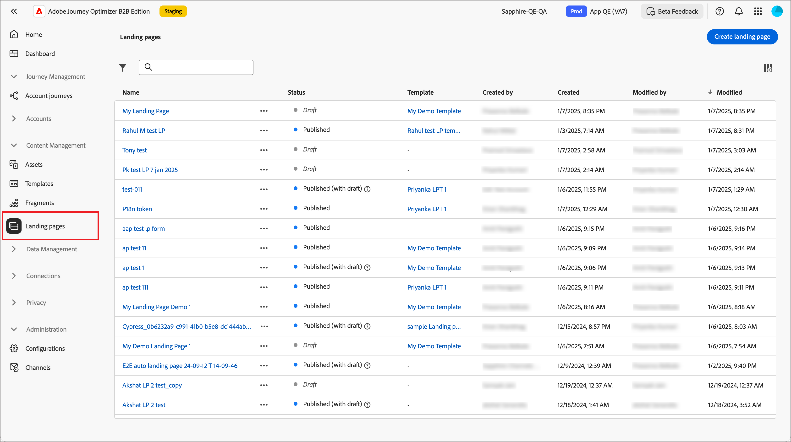{width="800" zoomable="yes"}

表格是依&#x200B;_[!UICONTROL 已修改]_&#x200B;欄排序，最近更新的專案預設會排在頂端。 按一下欄標題，在升序和降序之間變更。

### 篩選登入頁面清單

若要依名稱搜尋登入頁面，請在搜尋列中輸入文字字串以尋找相符專案。 按一下&#x200B;_篩選器_&#x200B;圖示（）以顯示可用的篩選器選項，並變更設定以根據您指定的條件篩選顯示的專案。

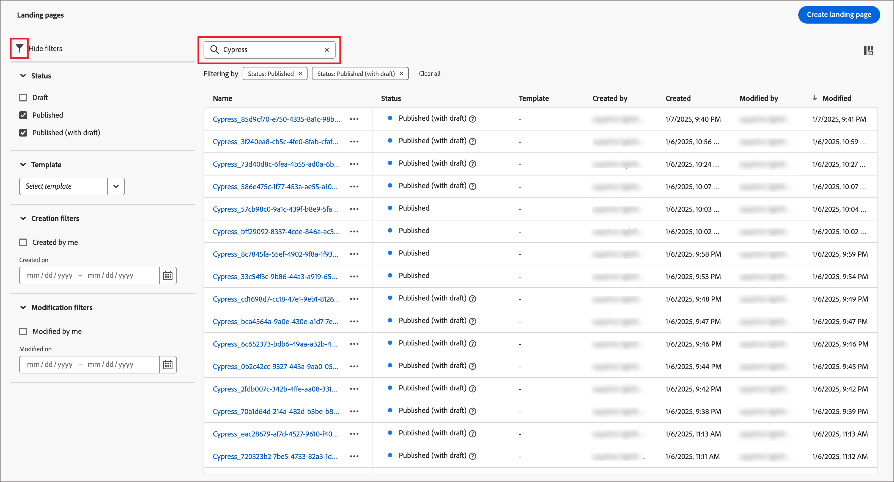{width="700" zoomable="yes"}

### 自訂欄顯示

按一下右上角的&#x200B;_自訂表格_&#x200B;圖示（），自訂您要顯示在表格中的欄。

在對話方塊中，選取要顯示的資料行，然後按一下&#x200B;**[!UICONTROL 套用]**。

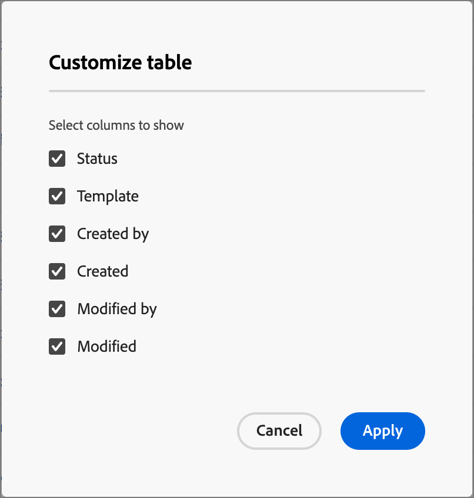{width="300"}

### 登陸頁面狀態和生命週期

登入頁面狀態會決定其是否可用於您的電子郵件和簡訊內容中的連結，以及您可以對其進行的變更。

| 狀態 | 說明 |
| -------------------- | ----------- |
| 草稿 | 建立登入頁面時，其狀態為草稿。 當您定義或編輯視覺內容時，它會保持此狀態，直到您將其發佈為託管頁面為止。 可用的動作：  <ul><li>編輯名稱或說明<li>編輯連結網址<li>在視覺設計空間編輯<li>發佈<li>重複<li>刪除 |
| 發佈日期 | 當您發佈登入頁面時，此頁面託管於Journey Optimizer B2B edition例項，且可在電子郵件或簡訊內容中用於連結。 可用的動作：  <ul><li>編輯名稱或說明<li>編輯連結網址<li>在電子郵件或簡訊內容中新增連結<li>建立草稿版本<li>重複<li>刪除 |
| 已與草稿一起發佈 | 當您從已發佈的登陸頁面建立草稿時，已發佈的版本會保留，而且草稿內容可以在視覺設計空間中進行修改。 如果您發佈草稿版本，草稿版本會取代目前發佈的版本，且託管頁面中的內容會更新。 可用的動作：  <ul><li>編輯名稱或說明<li>編輯連結網址<li>在電子郵件或簡訊內容中新增連結<li>在視覺化設計空間中編輯草稿版本<li>發佈草稿版本<li>重複<li>刪除（刪除兩個版本）<li>捨棄草稿（返回已發佈狀態） |

{zoomable="yes"}

## 建立登陸頁面

您可以按一下右上角的「**[!UICONTROL 建立登陸頁面]**」，在Journey Optimizer B2B edition中新增登陸頁面。

1. 在&#x200B;_[!UICONTROL 建立登陸頁面]_&#x200B;對話方塊中，輸入有用的&#x200B;**[!UICONTROL 名稱]**&#x200B;和&#x200B;**[!UICONTROL 描述]** （選擇性）。

   登陸頁面需求：

   * 名稱 — 最多100個字元，必須是唯一的、不區分大小寫

   * 說明 — 最多300個字元

   * 允許使用Alpha、數值和特殊字元

   * 保留的字元是&#x200B;**_不允許_**： `\ / : * ? " < > |`

   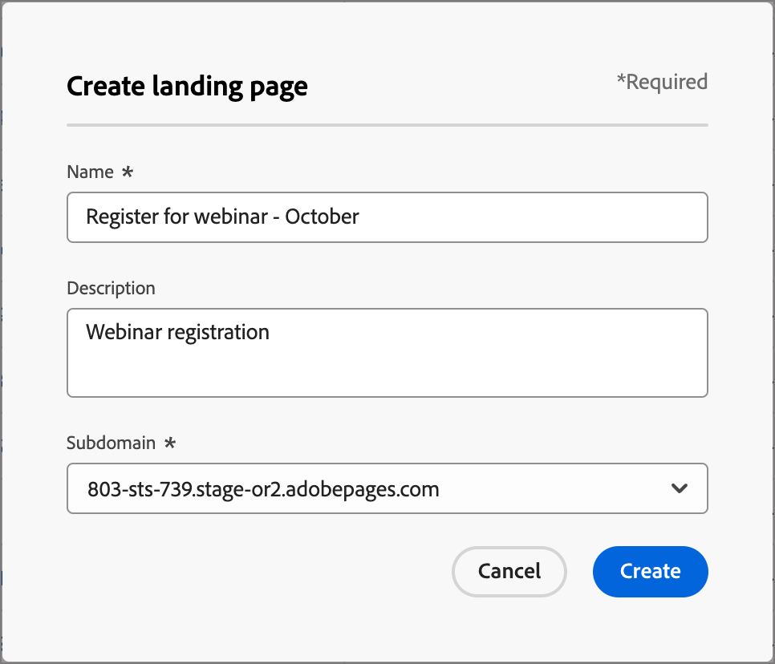{width="400"}

1. 如有需要，而且如果有多個已設定的子網域，請變更&#x200B;**[!UICONTROL 子網域]**&#x200B;以用於登陸頁面。

1. 按一下&#x200B;**[!UICONTROL 建立]**。

   _[!UICONTROL 建立您的主要登陸頁面]_&#x200B;首頁會開啟，並提供多個建立頁面的選項： _[!UICONTROL 從頭開始設計]_、_[!UICONTROL 匯入HTML]_，或使用已儲存的範本。

   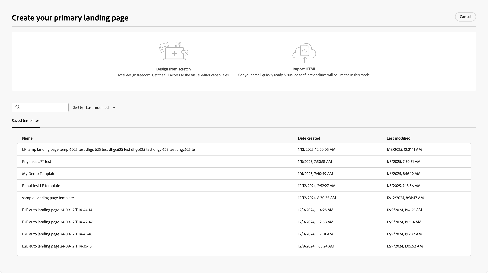{width="800" zoomable="yes"}

   選取您要用來開始登陸頁面設計的方法之後，請使用視覺設計空間[設計頁面](./landing-page-design.md)。

### 從頭開始設計

使用視覺內容編輯器來定義登入頁面內容的結構。 透過使用簡單的拖放動作新增和移動結構元件，您可以在數秒內設計頁面內容的形狀。

1. 從&#x200B;_[!UICONTROL 建立您的主要登陸頁面]_&#x200B;首頁，選取&#x200B;**[!UICONTROL 從頭開始設計]**&#x200B;選項。

1. [新增結構和內容](./landing-page-design.md#add-structure-and-content)至頁面。

### 匯入HTML

Adobe Journey Optimizer B2B edition可讓您匯入現有的HTML內容，以設計您的登入頁面。

{{$include /help/_includes/content-design-import.md}}

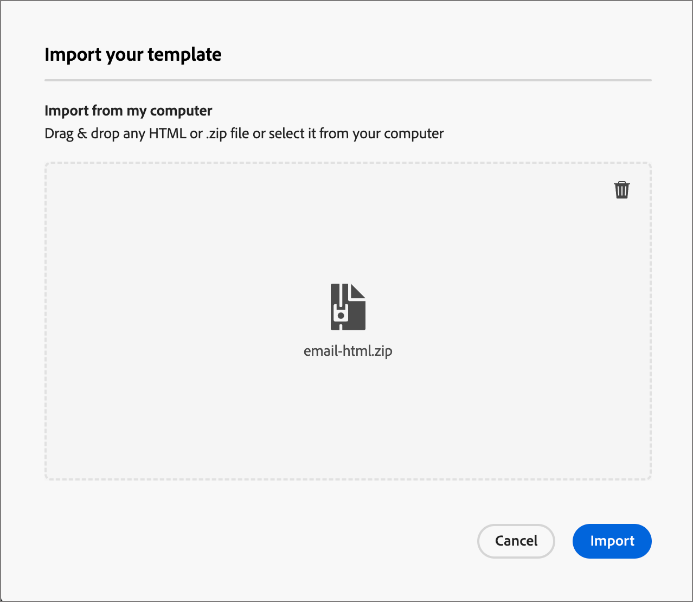{width="500"}

>[!NOTE]
>
>在HTML檔案中使用`<table>`標籤做為第一個圖層可能會造成樣式遺失，包括上層圖層標籤中的背景和寬度設定。

您可以視需要利用視覺化設計空間個人化匯入的內容。

### 選取已儲存的範本

您可以選擇以下選項：

* **範例範本**。 Journey Optimizer介面提供一系列現成的登陸頁面範本，供您選擇。

* **儲存的範本**。 使用貴組織成員使用&#x200B;_[!UICONTROL 範本]_&#x200B;功能表<!-- or the _[!UICONTROL Save as content template]_ option when designing a landing page. -->建立的已儲存自訂範本

使用&#x200B;_[!UICONTROL 選取設計範本]_&#x200B;區段來開始從範本建立您的內容。 您可以使用範例範本或儲存的Journey Optimizer B2B edition例項自訂登陸頁面範本。

>[!BEGINTABS]

>[!TAB 儲存的範本]

在&#x200B;_建立您的主要登陸頁面_&#x200B;首頁上，預設會選取&#x200B;_範例範本_&#x200B;索引標籤。 若要使用自訂範本，請選取&#x200B;**[!UICONTROL 儲存的範本]**&#x200B;索引標籤。

所有已儲存的登入頁面範本清單隨即顯示。 您可以依&#x200B;_[!UICONTROL 名稱]_、_[!UICONTROL 上次修改時間]_&#x200B;和&#x200B;_[!UICONTROL 上次建立時間]_&#x200B;來排序它們。

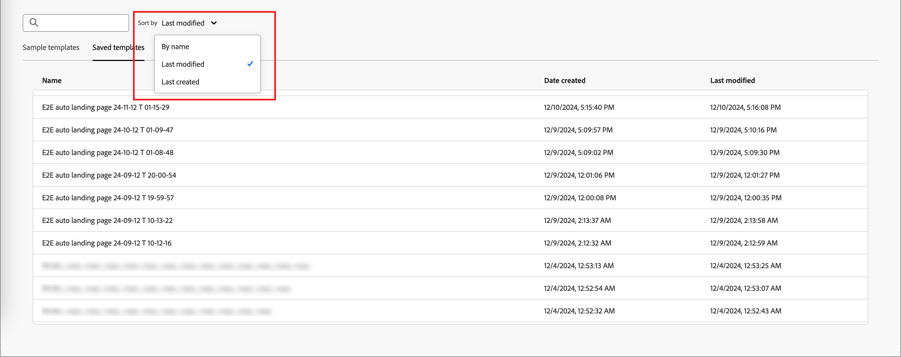{width="700" zoomable="yes"}

從清單中選取您想要的範本。

選取後，這會顯示範本的預覽。 在預覽模式中，您可以使用向右和向左箭頭，在單一類別的所有範本（範例或已儲存，視您的選擇而定）之間導覽。

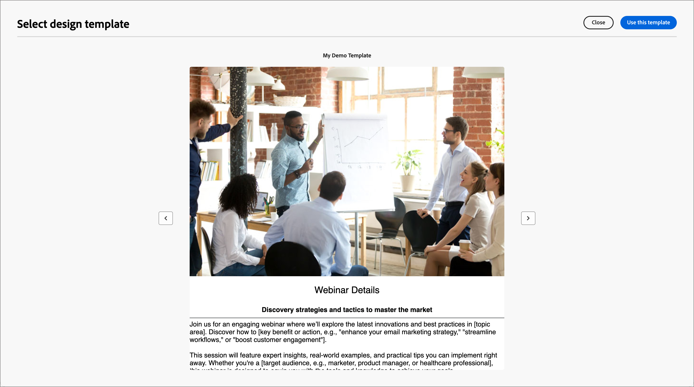{width="800" zoomable="yes"}

當顯示符合您要使用的內容時，請按一下預覽視窗右上角的&#x200B;**[!UICONTROL 使用此範本]**。

此動作會將內容複製到視覺化設計空間，以便您視需要編輯內容。

>[!TAB 範例範本]

Adobe Journey Optimizer B2B edition提供一系列&#x200B;_立即可用的_&#x200B;登入頁面範本，可讓您建立自己的登入頁面和登入頁面範本。

<!-- {width="800" zoomable="yes"} -->

>[!ENDTABS]

<!-- 
>[!NOTE]
>
> Saved templates may have governance (content locking) settings applied to one or more components. The visual designer provides guidelines about locked components when you [author an email from a governed template](./email-authoring-governance.md). -->

## 編輯登入頁面

對登入頁面的編輯取決於其目前狀態：

* 當登入頁面處於&#x200B;**_草稿_**&#x200B;狀態時，您可以編輯其任何詳細資料、URL和視覺內容。
* 當登入頁面處於&#x200B;**_已發佈_**&#x200B;狀態時，您可以編輯說明，但不能編輯名稱。 若要變更視覺內容，您必須建立頁面的草稿版本。
* 當登入頁面處於&#x200B;**_以草稿_**&#x200B;狀態發佈時，編輯詳細資料僅限於說明。 您也可以編輯草稿版本的視覺內容。

>[!BEGINTABS]

>[!TAB 草稿]

1. 從&#x200B;_[!UICONTROL 登入頁面]_&#x200B;清單頁面，按一下登入頁面名稱以開啟。

   接著會顯示視覺內容的預覽，登陸頁面的詳細資訊位於右側。

1. 修改任何詳細資訊，例如名稱和說明。

   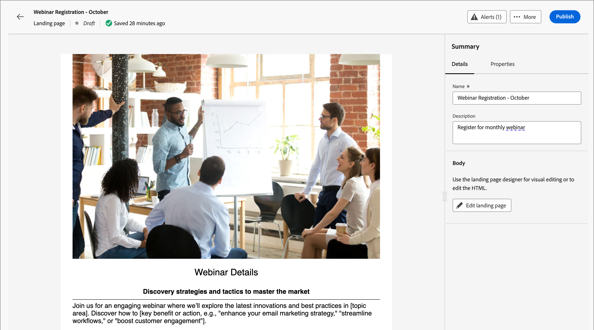{width="700" zoomable="yes"}

1. 若要變更視覺化設計空間中的內容，請按一下&#x200B;**[!UICONTROL 編輯登陸頁面]**。

   視需要使用視覺化設計工具：

   * [新增結構和內容](./landing-page-design.md#add-structure-and-content)
   * [新增Assets](./landing-page-design.md#add-assets)
   * [導覽圖層、設定和樣式](./landing-page-design.md#navigate-the-layers-settings-and-styles)
   * [將內容個人化](./landing-page-design.md#personalize-content)
   * [編輯連結的URL追蹤](./landing-page-design.md#edit-linked-url-tracking)

1. 按一下「**[!UICONTROL 儲存]**」，或「**[!UICONTROL 儲存並關閉]**」以返回登陸頁面的詳細資料。

1. 當頁面符合您的條件且您想要可供顯示時，請按一下&#x200B;**[!UICONTROL 發佈]**。

>[!TAB 已發佈]

1. 從&#x200B;_[!UICONTROL 登陸頁面]_&#x200B;清單頁面，按一下頁面名稱以開啟。

   接著會顯示視覺內容的預覽，登陸頁面的詳細資訊位於右側。

1. 視需要修改說明。

   針對已發佈的登陸頁面，無法變更所有其他詳細資料。

1. 若要更新內容，請按一下右側的&#x200B;**[!UICONTROL 編輯登陸頁面]**。

   在對話方塊中按一下&#x200B;**[!UICONTROL 建立草稿版本]**，在視覺化設計空間開啟草稿版本。

   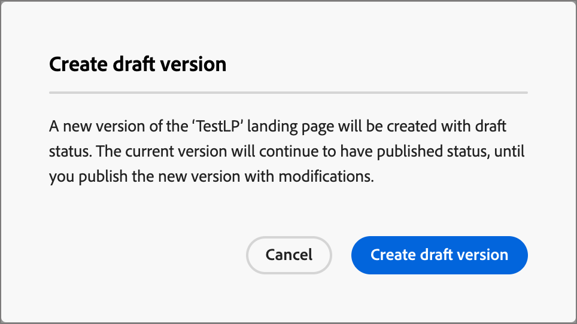{width="300"}

   視需要使用視覺化設計工具：

   * [新增結構和內容](./landing-page-design.md#add-structure-and-content)
   * [新增Assets](./landing-page-design.md#add-assets)
   * [導覽圖層、設定和樣式](./landing-page-design.md#navigate-the-layers-settings-and-styles)
   * [將內容個人化](./landing-page-design.md#personalize-content)
   * [編輯連結的URL追蹤](./landing-page-design.md#edit-linked-url-tracking)

1. 按一下「**[!UICONTROL 儲存]**」，或「**[!UICONTROL 儲存並關閉]**」以返回登陸頁面的詳細資料。

1. 當草稿登入頁面符合您的條件，而您想要讓變更可在已發佈的頁面上使用時，請按一下&#x200B;**[!UICONTROL 發佈]**。

   當您發佈草稿版本時，它會取代目前發佈的版本，並更新頁面URL的內容。

>[!TAB 已發佈草稿]

開啟登入頁面時，預設會顯示草稿版本。 預覽空間頂端的索引標籤可讓您在已發佈版本和草稿版本之間切換顯示。 草稿動作和詳細資訊會顯示在右側。

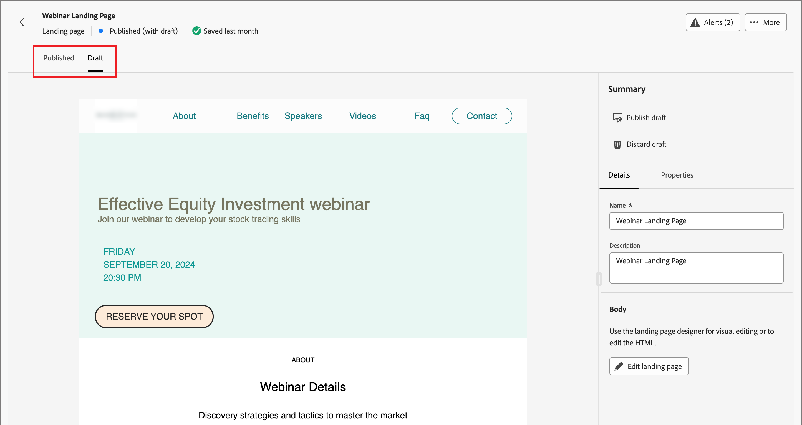{width="700" zoomable="yes"}

若要更新內容：

1. 按一下右上方的&#x200B;**[!UICONTROL 編輯登陸頁面]**。 視需要使用視覺化設計工具：

   * [新增結構和內容](./landing-page-design.md#add-structure-and-content)
   * [新增Assets](./landing-page-design.md#add-assets)
   * [導覽圖層、設定和樣式](./landing-page-design.md#navigate-the-layers-settings-and-styles)
   * [將內容個人化](./landing-page-design.md#personalize-content)
   * [編輯連結的URL追蹤](./landing-page-design.md#edit-linked-url-tracking)

1. 按一下「**[!UICONTROL 儲存]**」，或「**[!UICONTROL 儲存並關閉]**」以返回登陸頁面的詳細資料。

1. 當草稿頁面符合您的條件且您想要讓變更可用時，請按一下[發佈]。****

   當您發佈草稿版本時，草稿版本會取代目前發佈的版本，而託管頁面中的內容會更新。

>[!ENDTABS]

### 檢查警報

當您設計登入頁面內容時，關鍵設定遺失時，警示會顯示在介面（右上方）中。

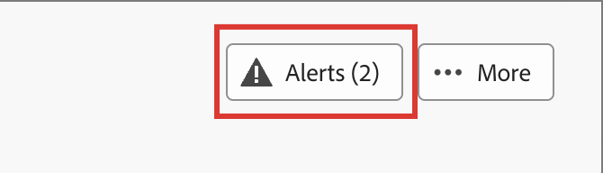{width="250"}

如果沒有看見此按鈕，表示沒有偵測到的問題。

可偵測到兩種型別的警報：

* **_警告_**&#x200B;參考建議與最佳實務的警告，例如：

   * `Placeholder links are present in the landing page body`：別忘了以有效連結取代預留位置。

   * `Text version of HTML is empty`：別忘了定義頁面內文的文字版本，當HTML內容無法顯示時會使用此版本。

   * `Empty link is present in page body`：檢查頁面中的所有連結是否正確。

* **_錯誤_**&#x200B;會阻止您測試或啟用歷程/行銷活動，只要這些錯誤尚未解決，例如：

   * `The landing page content is empty`：頁面內容是必要的。

## 複製登陸頁面

您可以使用下列其中一種方法來複製登入頁面：

* 從&#x200B;_[!UICONTROL 登陸頁面]_&#x200B;清單頁面，按一下登陸頁面名稱旁的&#x200B;_更多_&#x200B;圖示(**...**)，然後選擇&#x200B;**[!UICONTROL 複製]**。
* 在登入頁面詳細資訊頁面的右上方，按一下&#x200B;**[!UICONTROL ...更多]**&#x200B;並選擇&#x200B;**[!UICONTROL 複製]**。

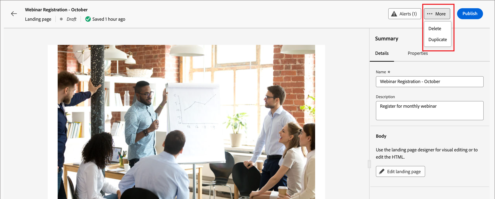{width="600" zoomable="yes"}

在對話方塊中，輸入有用的名稱（唯一）和說明（選擇性）。 按一下&#x200B;**[!UICONTROL 複製]**&#x200B;以完成動作。

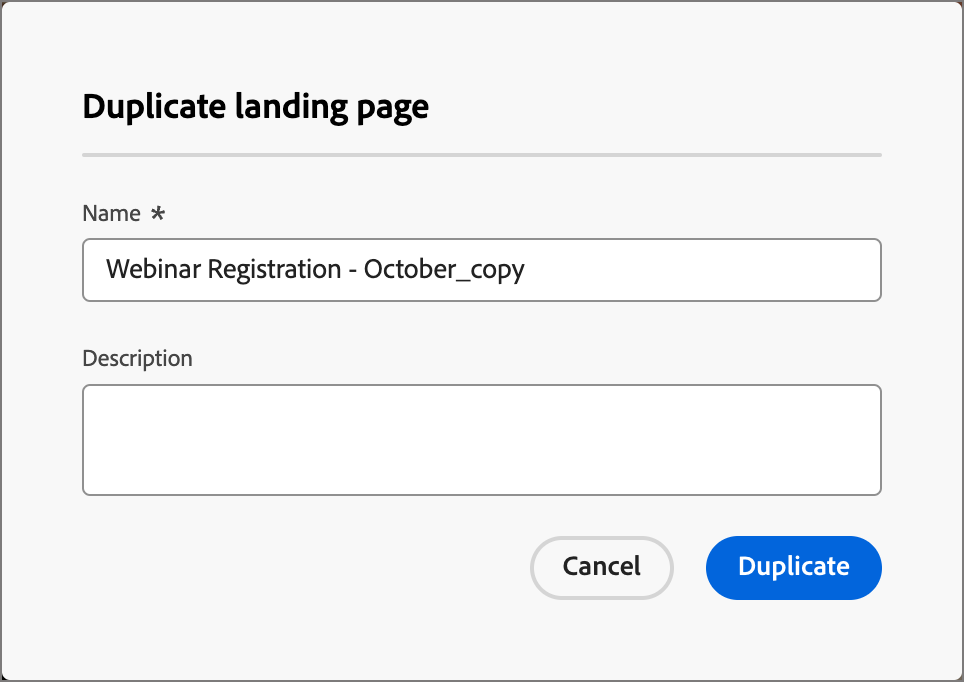{width="350"}

然後，重複的（新）頁面會出現在&#x200B;_登陸頁面_&#x200B;清單中。

## 刪除登陸頁面

您可以使用下列其中一種方法來刪除登入頁面：

* 從&#x200B;_[!UICONTROL 登陸頁面]_&#x200B;清單頁面，按一下登陸頁面名稱旁的&#x200B;_更多_&#x200B;圖示(**...**)，然後選擇&#x200B;**[!UICONTROL 刪除]**。
* 在登入頁面詳細資訊頁面的右上方，按一下&#x200B;**[!UICONTROL ...更多]**&#x200B;並選擇&#x200B;**[!UICONTROL 刪除]**。

此動作會開啟確認對話方塊。 您可以按一下&#x200B;**[!UICONTROL 取消]**，或按一下&#x200B;**[!UICONTROL 刪除]**&#x200B;確認刪除，以中止程式。

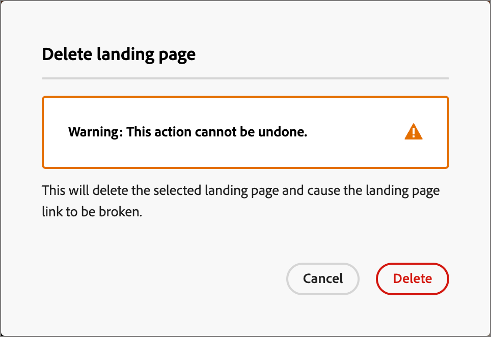{width="400"}

## 連結至登入頁面

作為建立電子郵件、片段和頁面內容的行銷人員或Designer，您可以內嵌連結至在Journey Optimizer B2B edition例項中建立的已發佈（即時）登陸頁面。

1. 當您在片段、電子郵件、登入頁面或範本的視覺設計空間工作時，請為連結選取文字片段、按鈕元件或影像元件。

   **[!UICONTROL 連結]**&#x200B;選項會顯示在右側面板中。

1. 針對&#x200B;**[!UICONTROL Type]**&#x200B;選項，請選擇&#x200B;**[!UICONTROL 登陸頁面]**。

   登陸頁面的{width="700" zoomable="yes"}

1. 針對&#x200B;**[!UICONTROL 登陸頁面]**&#x200B;選項，按一下&#x200B;_選取頁面_&#x200B;圖示（ ）。

1. 在「選取登陸頁面」對話方塊中，將&#x200B;**[!UICONTROL 登陸頁面來源]**&#x200B;設定為&#x200B;**[!UICONTROL Journey Optimizer B2B edition]**，從已發佈頁面的清單中選取登陸頁面的核取方塊，然後按一下「選取&#x200B;**[!UICONTROL 」]**。

   登陸頁面的{width="600" zoomable="yes"}

1. 針對&#x200B;**[!UICONTROL Target]**&#x200B;選項，選擇連結目標行為：

   * **[!UICONTROL 無]** — 使用瀏覽器預設行為開啟連結。
   * **[!UICONTROL 空白]** — 在新視窗或索引標籤中開啟連結。
   * **[!UICONTROL Self]** — 在相同框架中開啟連結。
   * **[!UICONTROL 父系]** — 在父框架中開啟連結。
   * **[!UICONTROL 前]** — 在視窗的整個內文中開啟連結。

1. （僅限文字連結）如果要將連結的文字加底線，請選取&#x200B;**[!UICONTROL 加底線連結]**&#x200B;核取方塊。

   您可以選取右側面板中的&#x200B;**[!UICONTROL 樣式]**&#x200B;索引標籤，為連結文字設定其他樣式，包括連結顏色。
