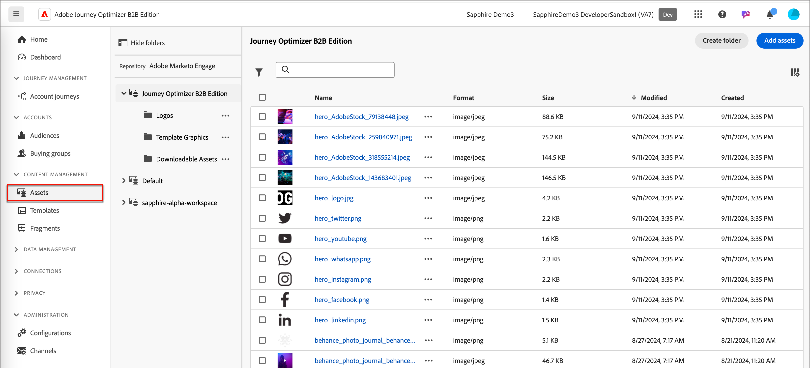
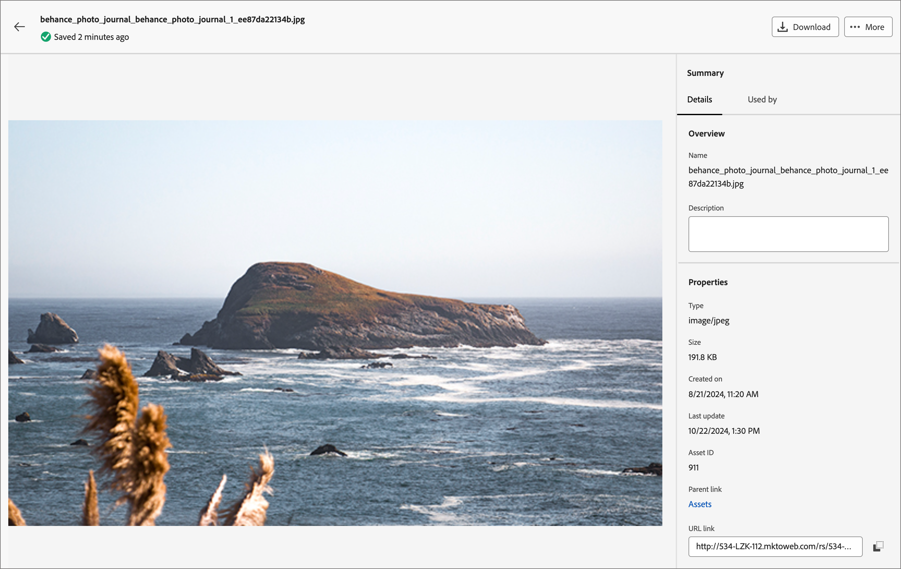
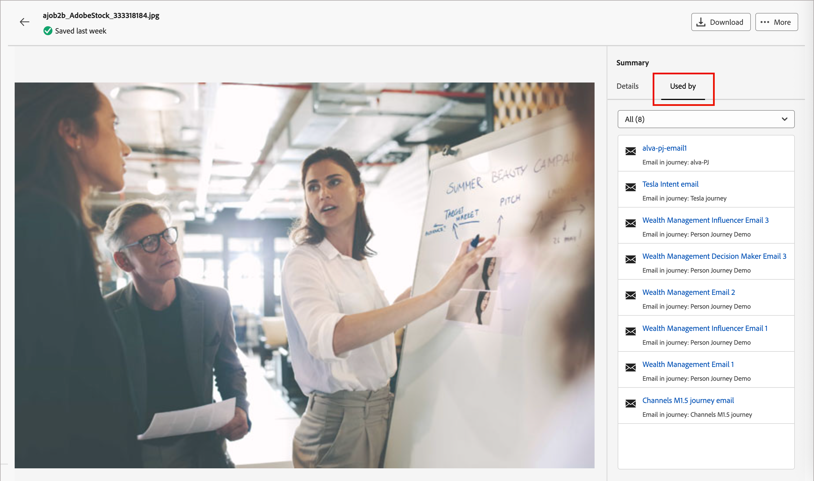
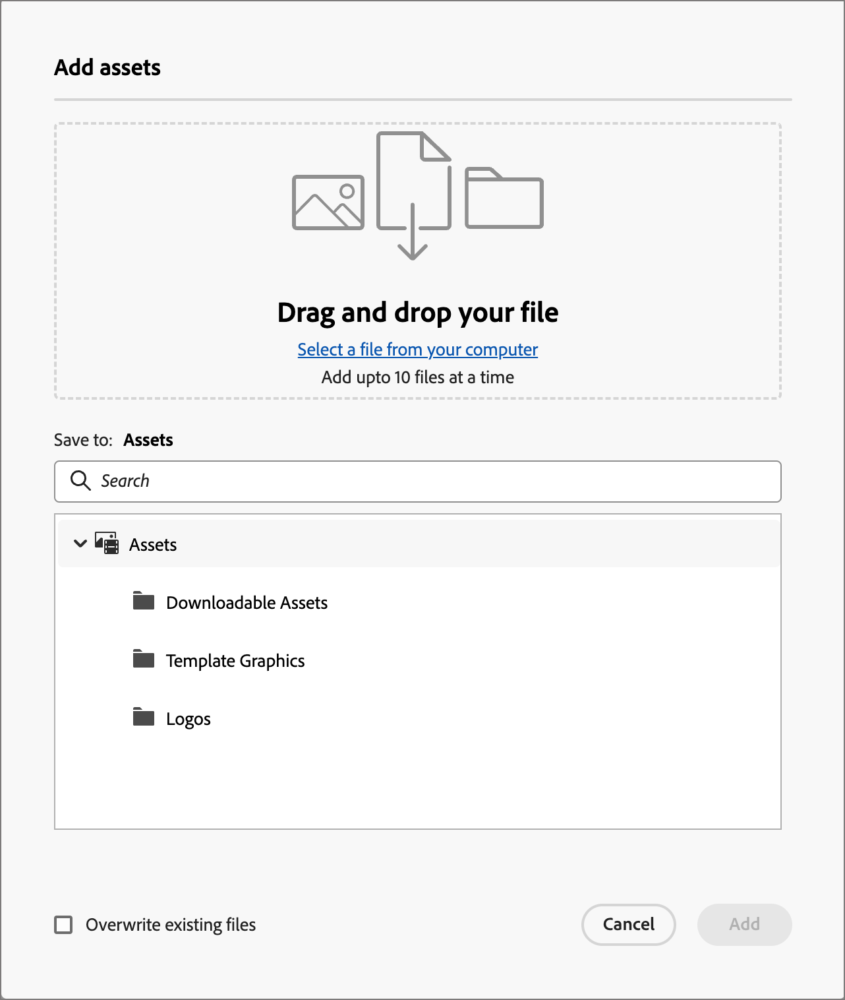
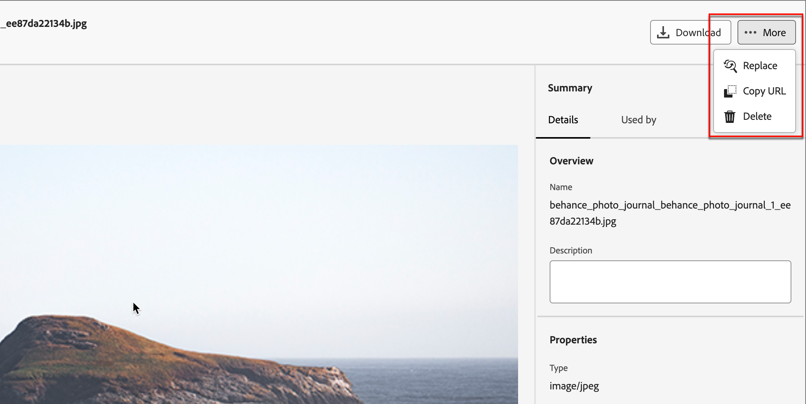
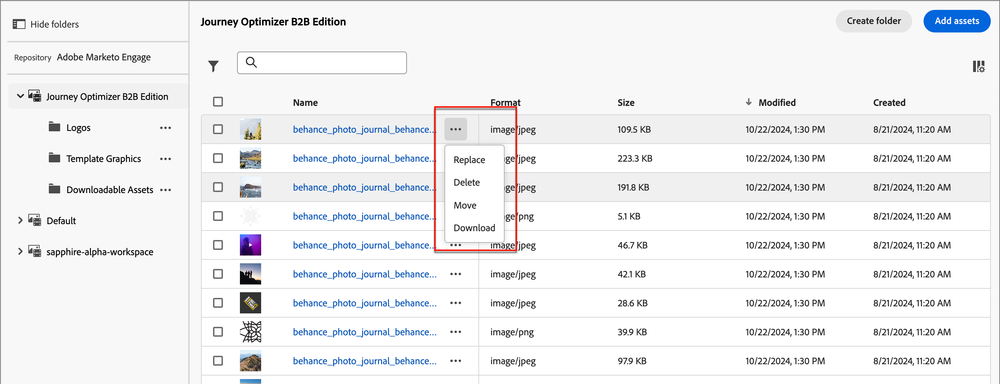
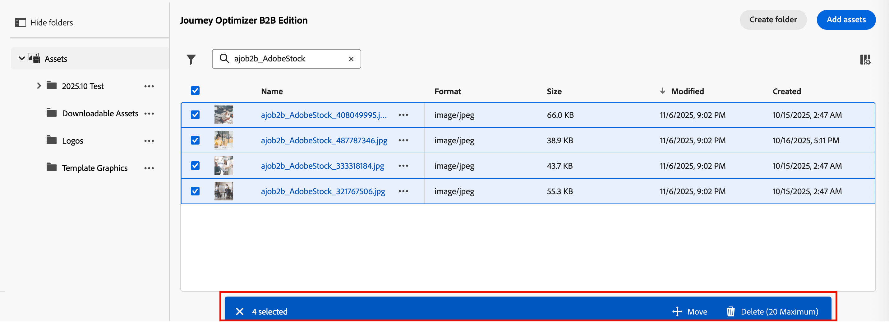
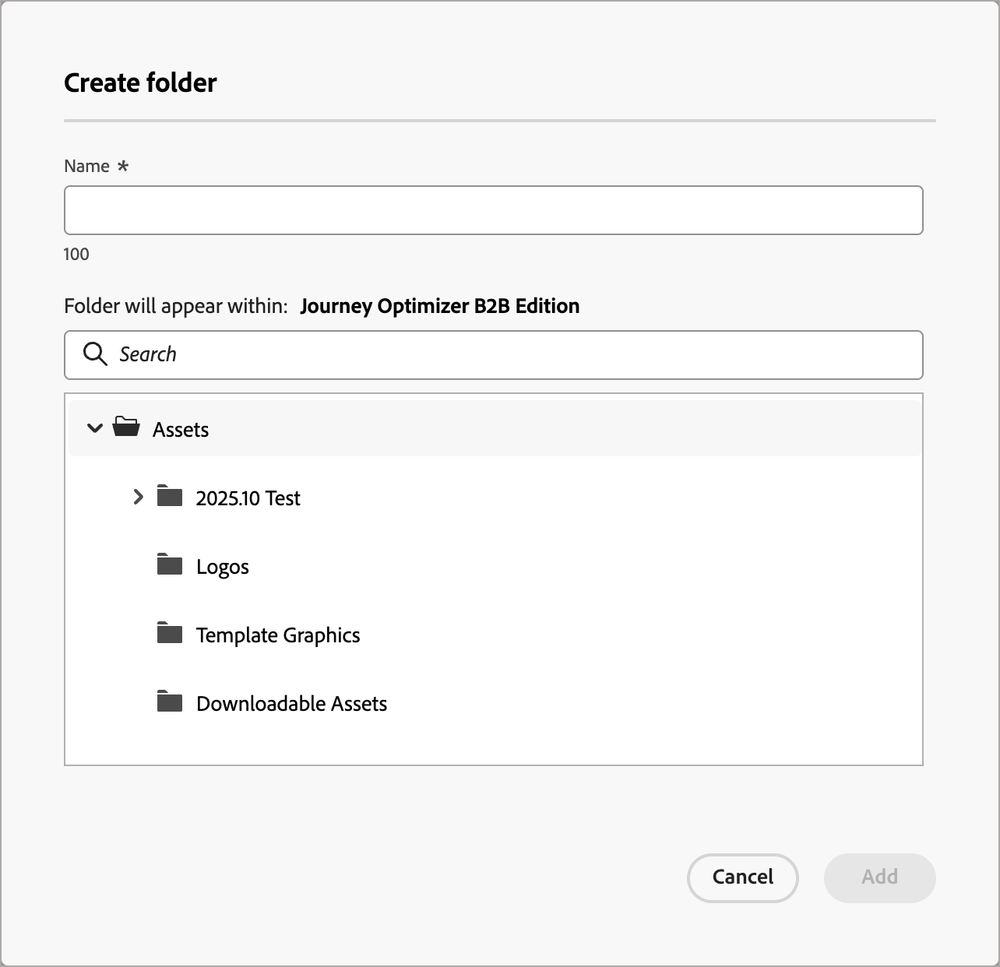
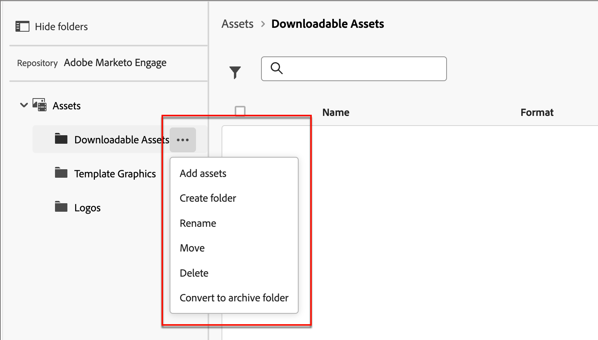

# 使用Marketo Engage資產

Marketo Engage Design Studio是Journey Optimizer B2B edition的預設資產來源，您可以輕鬆管理和使用內容中用於帳戶歷程的可用資產。

在Marketo Engage中，行銷組織使用工作區來組織其內容資產，並幫助團隊存取正確的資產。 明確定義的工作區對於擁有大量產品組合，或因應不同地區行銷需求而在全球經營的大型企業特別實用。

## 中央資產管理

預設有&#x200B;**_[!UICONTROL Journey Optimizer B2B edition]_**&#x200B;工作區可供您專門用於帳戶歷程內容。 您新增至此工作區的資產不可見或無法用於Marketo Engage。 對於居住在此工作區的資產，您可以在Journey Optimizer B2B edition中擁有完整的資產管理功能。 這些函式包括：

* 取代
* 刪除
* 移動

位於Marketo Engage工作區的Assets受限於在電子郵件、電子郵件範本和片段中使用的唯讀存取權。 您可以將新資產新增至這些工作區並下載資產副本。

## 瀏覽及存取資產

若要從Journey Optimizer B2B edition存取Adobe Marketo Engage資產，請前往左側導覽並按一下&#x200B;**[!UICONTROL 內容管理]** > **[!UICONTROL Assets]**。 此動作會開啟一個清單頁面，其中列出所有資產。

{width="800" zoomable="yes"}

依預設，會選取Journey Optimizer B2B edition工作區。 其他工作區如下所列。

* 若要依工作區和資料夾檢視資產，請按一下左上方的&#x200B;_顯示資料夾_&#x200B;圖示以開啟結構。

* 若要依任何欄排序表格，請按一下欄標題。 標題列中的箭頭表示目前的排序欄和順序。

* 若要在選取的工作區或資料夾內搜尋影像資產，請在搜尋列中輸入文字字串。

* 若要自訂表格中顯示的欄，請按一下右上方的&#x200B;_自訂表格_&#x200B;圖示（ ）。

  選取您要顯示在清單中的資料行，然後按一下[套用]。****

## 檢視資產詳細資訊

按一下任何資產的名稱以開啟資產詳細資訊頁面。

{width="700" zoomable="yes"}

## 檢視參考使用的資產

在資產詳細資訊頁面中，按一下&#x200B;**[!UICONTROL 使用者]**&#x200B;索引標籤，以檢視Journey Optimizer B2B edition、電子郵件、電子郵件範本和片段中目前使用資產的詳細資訊。

>[!IMPORTANT]
>
>無法刪除任何電子郵件、電子郵件範本或片段&#x200B;**中目前&#x200B;_使用中_的任何資產**。

面板依類別顯示參考： _電子郵件_、_電子郵件範本_&#x200B;或&#x200B;_片段_。 Journey Optimizer B2B edition中的電子郵件會在歷程中內嵌及編寫，因此使用資產的電子郵件的父歷程會顯示在參考中。

按一下連結，系統會將您導向使用資產的相應電子郵件、電子郵件範本或片段。

{width="700" zoomable="yes"}

## 新增資產

從Assets清單頁面，您可以將影像資產新增至Journey Optimizer B2B edition工作區或Marketo Engage工作區。

1. 按一下右上方的&#x200B;**[!UICONTROL 新增Assets]**。

1. 在&#x200B;_[!UICONTROL 新增資產]_&#x200B;對話方塊中，將一或多個檔案從您的系統拖放至檔案方塊。

   {width="500"}

   您也可以按一下&#x200B;_[!UICONTROL 從電腦選取檔案]_&#x200B;連結，以使用本機檔案系統來尋找及選取檔案。

   您一次最多可以從本機系統上傳10個檔案的資產。 檔案大小上限為100 MB。

   所選影像的檔案名稱會顯示在對話方塊中。 資產檔案名稱必須是唯一的（跨資料夾），如果已存在同名的檔案，則會顯示訊息。 名稱最多可包含100個字元，且不能包含特殊字元（例如`;`、`:`、`\`和`|`）。

1. 選取要儲存資產的目的地工作區或資料夾。

   >[!NOTE]
   >
   >如果您在&#x200B;_[!UICONTROL Journey Optimizer B2B edition]_&#x200B;工作區中選取位置，即可在應用程式中管理資產。 如果將資產新增至Marketo Engage工作區，則只能從Marketo Engage Design Studio使用資產管理功能。

1. 若要在上傳一或多個具有現有檔案名稱的檔案時覆寫（取代）檔案，請選取&#x200B;**[!UICONTROL 覆寫現有檔案]**&#x200B;核取方塊。

1. 按一下&#x200B;**[!UICONTROL 新增]**。

## 刪除資產

無法刪除任何電子郵件、電子郵件範本或片段中目前正在使用的任何資產。 在起始資產移除之前，請檢查使用者參考。 此外，刪除動作無法復原，因此在起始移除動作前請先檢查。

使用下列其中一種方法來刪除位於&#x200B;_[!UICONTROL Journey Optimizer B2B edition]_&#x200B;工作區的資產：

* 前往資產詳細資料，按一下&#x200B;**[!UICONTROL ...在右上角顯示[更多]**]，並從選項中選擇[刪除]。****

  {width="600" zoomable="yes"}

* 在&#x200B;_[!UICONTROL Assets]_&#x200B;清單頁面上，按一下資產專案旁的&#x200B;_更多_&#x200B;圖示(**[!UICONTROL ...]**)，然後從選項中選擇&#x200B;**[!UICONTROL 刪除]**。

  {width="600" zoomable="yes"}

  >[!NOTE]
  >
  >只有位於&#x200B;_[!UICONTROL Journey Optimizer B2B edition]_&#x200B;工作區中的資產可在&#x200B;_更多_&#x200B;功能表中使用資產管理功能。

此動作會開啟確認對話方塊。 您可以按一下&#x200B;**[!UICONTROL 取消]**，或按一下&#x200B;**[!UICONTROL 刪除]**&#x200B;確認刪除，以中止程式。

如果資產目前正在使用中，動作會開啟資訊對話方塊，提醒您無法刪除資產。 按一下&#x200B;**[!UICONTROL 確定]**，這會中止移除。

## 取代資產

使用下列其中一種方法來取代位於&#x200B;_[!UICONTROL Journey Optimizer B2B edition]_&#x200B;工作區中的資產：

* 前往資產詳細資料，按一下&#x200B;**[!UICONTROL ...在右上角顯示[更多]**]，然後從選項中選擇[取代]。****

* 在&#x200B;_[!UICONTROL Assets]_&#x200B;清單頁面上，按一下資產專案旁的&#x200B;_更多_&#x200B;圖示(**[!UICONTROL ...]**)，然後從選項中選擇&#x200B;**[!UICONTROL 取代]**。

在&#x200B;_[!UICONTROL 取代資產]_&#x200B;對話方塊中，將取代檔案從您的系統拖放至檔案方塊。 您也可以按一下&#x200B;_[!UICONTROL 從電腦選取檔案]_&#x200B;連結，以使用本機檔案系統來選取檔案。 （如果您在本機系統中選取多個檔案，則會使用選取的第一個檔案來取代。）

{width="500"}

若要繼續，請按一下[取代]。**** 您可以按一下&#x200B;**[!UICONTROL 取消]**，中止程式。

如果要取代的檔案目前正在使用中，資訊對話方塊會警告您，新影像檔案會在所有使用位置（電子郵件、電子郵件範本和片段）取代影像。

## 下載資產

您可以使用下列其中一種方法下載資產：

* 前往資產詳細資訊，然後按一下右上方的&#x200B;**[!UICONTROL 下載]**。

* 在&#x200B;_[!UICONTROL Assets]_&#x200B;清單頁面上，按一下資產專案旁的&#x200B;_省略符號_ (**[!UICONTROL ...]**)，然後從選項中選擇&#x200B;**[!UICONTROL 下載]**。

在確認對話方塊中，按一下&#x200B;**[!UICONTROL 下載]**&#x200B;以開始將資產下載到您的本機系統。 您可以按一下&#x200B;**[!UICONTROL 取消]**，中止程式。

## 對選取的資產套用大量動作

從清單頁面(_[!UICONTROL 內容管理]_ > _[!UICONTROL Assets]_)，選取左側的每個核取方塊，一次選取多個資產。 當您選取多個資產時，底部會顯示訊息橫幅。

{width="700" zoomable="yes"}

您可以對位於&#x200B;_[!UICONTROL Journey Optimizer B2B edition]_&#x200B;工作區中的所選資產採取下列大量動作：

+++移動資產

1. 在選取範圍橫幅上，按一下&#x200B;**[!UICONTROL 移動]**。

   此動作會開啟&#x200B;_[!UICONTROL 移動Assets]_&#x200B;對話方塊，其中列出所選資產的名稱，並允許您選取您要移動這些資產的&#x200B;_目標_&#x200B;資料夾。

1. 選取資料夾。

   _[!UICONTROL 選取的資產旁的路徑更新將會移至：]_。

1. 按一下&#x200B;**[!UICONTROL 移動]**。

+++

+++刪除資產

>[!NOTE]
>
>您最多可以套用20個所選資產的批次刪除。

1. 在選取範圍橫幅上，按一下&#x200B;**[!UICONTROL 刪除]**。

1. 在確認對話方塊中，按一下&#x200B;**[!UICONTROL 刪除]**。

   如果有任何選取的資產目前正在使用中，則會中止移除該資產，並顯示警示訊息。

+++

## 建立資料夾

1. 在&#x200B;_[!UICONTROL Assets]_&#x200B;清單頁面上，按一下右上方的&#x200B;**[!UICONTROL 建立資料夾]**。

1. 在對話方塊中，輸入資料夾名稱並選取新資料夾的目的地（父）資料夾。

   資料夾名稱必須是唯一的，最多可包含100個字元，而且不能包含特殊字元，例如`;`、`:`、`\`、`|`。

   {width="500"}

1. 按一下&#x200B;**[!UICONTROL 新增]**。

## 套用資料夾層級動作

在&#x200B;_[!UICONTROL Journey Optimizer B2B edition]_&#x200B;工作區中，您可以將動作套用至資料夾或資料夾內的資產。 按一下資料夾旁的&#x200B;_更多_&#x200B;圖示(**...**)以顯示您可以套用至資料夾的動作。

{width="700" zoomable="yes"}

您可以在資料夾層級執行下列動作：

+++新增資產

1. 選擇&#x200B;**[!UICONTROL 新增資產]**&#x200B;以將影像檔案上傳至資料夾。

1. 在&#x200B;_[!UICONTROL 新增資產]_&#x200B;對話方塊中，從您的系統拖放檔案。 您也可以按一下連結，使用您的檔案系統來選取檔案。

   您可以從本機系統新增資產，一次最多可新增10個檔案。 當您上傳一或多個具有現有檔案名稱的檔案時，可以選擇覆寫檔案。

   所選影像的檔案名稱會顯示在對話方塊中。 資產檔案名稱必須是唯一的（跨資料夾），如果具有該名稱的檔案已存在，則會顯示錯誤訊息。 名稱最多可包含100個字元，且不能包含特殊字元（例如`;`、`:`、`\`和`|`）。

1. 按一下&#x200B;**[!UICONTROL 新增]**。

+++

+++建立子資料夾

1. 選擇&#x200B;**[!UICONTROL 建立資料夾]**。

1. 在對話方塊中，輸入資料夾名稱。

   資料夾名稱必須是唯一的，最多可包含100個字元，而且不能包含特殊字元，例如`;`、`:`、`\`、`|`。

1. 按一下&#x200B;**[!UICONTROL 新增]**。

+++

+++重新命名資料夾

1. 選擇&#x200B;**[!UICONTROL 重新命名]**。

1. 在對話方塊中，輸入新資料夾名稱。

   資料夾名稱必須是唯一的，最多可包含100個字元，而且不能包含特殊字元，例如`;`、`:`、`\`、`|`。

1. 按一下&#x200B;**[!UICONTROL 儲存]**。

+++

+++行動資料夾

1. 若要將資料夾移至另一個父資料夾，請選擇&#x200B;**[!UICONTROL 移動]**。

1. 在對話方塊中，選取目標資料夾作為子資料夾的新父資料夾。

1. 按一下&#x200B;**[!UICONTROL 移動]**。

   如果您嘗試將資料夾移動至其本身的子資料夾之一（在所選資料夾的結構內），則會顯示錯誤訊息並取消移動。

+++

+++刪除資料夾

1. 選擇&#x200B;**[!UICONTROL 刪除]**。

1. 在確認對話方塊中，按一下&#x200B;**[!UICONTROL 刪除]**。

如果資料夾中的任何資產目前正在使用中，動作會開啟警報對話方塊，通知您無法刪除該資產。 按一下&#x200B;**[!UICONTROL 確定]**，這會中止移除。

+++

+++轉換為封存資料夾

封存資料夾會使資料夾內的檔案無法搜尋。 針對您不希望團隊成員日後使用的資產檔案（例如過時的活動促銷徽章或季節性內容），使用封存功能。 稍後，如果您希望內容再次可用，可以取消封存資料夾。

* 選擇&#x200B;**[!UICONTROL 轉換成封存資料夾]**。 系統會顯示確認橫幅，確認資料夾狀態已變更為已封存。

* 選擇&#x200B;**[!UICONTROL 取消封存資料夾]**。 系統會顯示確認橫幅，以確認資料夾狀態已變更為未封存。

+++

## 在您的內容中使用資產

Assets可用於您團隊的電子郵件、電子郵件範本，或來自視覺內容編輯器的視覺片段製作。

從視覺化設計工具UI中，選取左側邊欄上的&#x200B;_資產選擇器_&#x200B;圖示(  )。

此動作會變更工具面板，以顯示所選工作區中可用資產的結構化清單。 選取您要顯示的工作區以選擇資產。

{width="700" zoomable="yes"}

將影像資產新增至視覺畫布的方法有很多種：

* 從左側導覽拖放影像縮圖。

* 將影像元件新增至畫布，然後按一下&#x200B;**[!UICONTROL 瀏覽]**&#x200B;以開啟&#x200B;_[!UICONTROL 從Adobe Marketo Engage選取資產]_&#x200B;對話方塊。

  {width="700" zoomable="yes"}

  從對話方塊中，您可以從選取的存放庫中選擇影像。 按一下&#x200B;**[!UICONTROL 選取]**&#x200B;以新增資產。

  有多種工具可協助您找到所需的資產：

   * 按一下左上方的&#x200B;_篩選器_&#x200B;圖示，以根據您的條件篩選顯示的專案。

   * 在&#x200B;_搜尋_&#x200B;欄位中輸入文字，以篩選顯示的專案以符合資產名稱。

  {width="700" zoomable="yes"}
