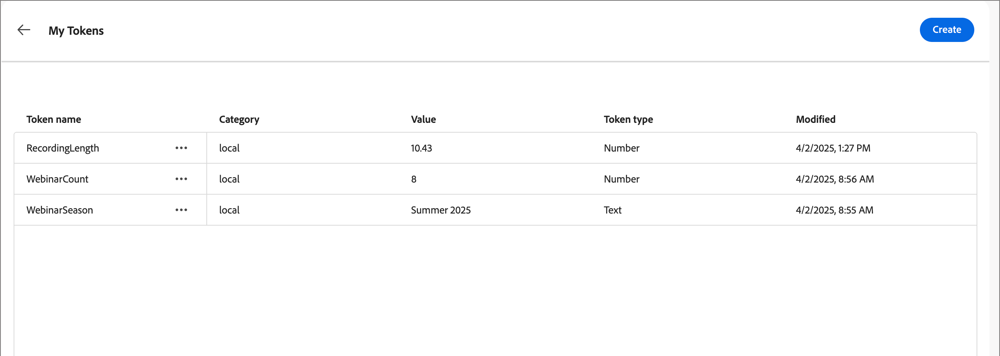
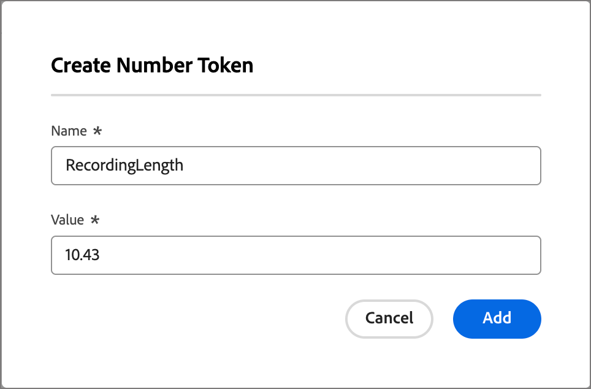
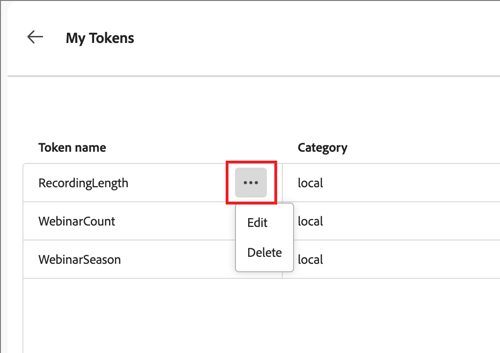
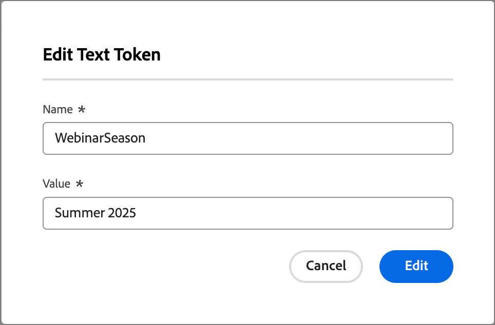
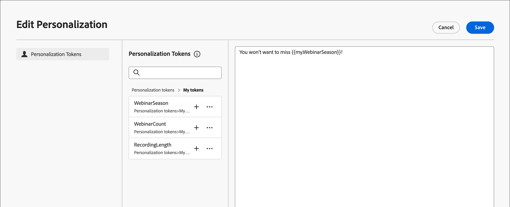

# 電子郵件個人化的自訂權杖

內容個人化使用代號做為產生內容成品時填入的預留位置或變數。 標準個人化權杖適用於電子郵件、登陸頁面、片段和範本。 您也可以使用帳戶歷程專屬的值來定義一組自訂權杖。 這組自訂權杖稱為&#x200B;_我的權杖_，這些自訂權杖中的任何一個都適用於[撰寫歷程電子郵件](./email-authoring.md#content-authoring---personalization)時的個人化。

除了帳戶歷程專屬的&#x200B;_My Token_&#x200B;之外，您還可以使用任何標準（內建）Token進行電子郵件個人化。

## 管理我的Token {#my-tokens}

_我的Token_&#x200B;是您為處於草稿狀態的帳戶歷程建立或修改的自訂變數。 此自訂權杖集目前支援文字和數字權杖定義。

當您新增自訂權杖至電子郵件時，會顯示為`{{my.TokenName}}`。 例如，您可能會建立`{{my.EventDate}}`或`{{my.WebinarSpeaker}}`個Token，以管理與即將舉辦的網路研討會相關的電子郵件內容。

_若要存取帳戶歷程的自訂權杖：_

1. 開啟草稿帳戶歷程。

1. 按一下右上方的&#x200B;**[!UICONTROL 更多……]**&#x200B;功能表，然後選擇&#x200B;**[!UICONTROL 我的Token]**。

   ![按一下右上角的[更多]](../journeys/assets/account-journey-draft-more-menu.png){width="450"}

   _我的權杖_&#x200B;頁面會列出為歷程定義的所有自訂權杖。

   {width="700" zoomable="yes"}

### 建立Token

1. 在&#x200B;_[!UICONTROL 我的Token]_&#x200B;頁面中，按一下&#x200B;**[!UICONTROL 建立]**，然後選擇您要定義的Token型別：

   * **[!UICONTROL 文字]** — 使用此型別定義具有基本文字字串值的權杖。

   * **[!UICONTROL 數字]** — 使用此型別定義具有數值的權杖。

1. 在對話方塊中，輸入Token的&#x200B;**[!UICONTROL 名稱]**&#x200B;和&#x200B;**[!UICONTROL 值]**。

   {width="400"}

   Token名稱中不能使用空格或特殊字元。 您可以使用&#x200B;_駝峰式大小寫_ （例如`EventType`）來使用容易辨識的多字名稱。

   如果您正在定義&#x200B;_Number_&#x200B;代號，則值只能包含數字字元。 您可以使用十進位值。

   {width="400"}

1. 按一下&#x200B;**[!UICONTROL 新增]**。

### 編輯權杖

雖然帳戶歷程仍處於草稿狀態，但您可以編輯任何已定義的「我的Token」。

1. 在&#x200B;_[!UICONTROL 我的Token]_&#x200B;頁面中，按一下Token名稱旁的&#x200B;_更多動作_&#x200B;圖示(**...**)，然後選擇&#x200B;**[!UICONTROL 編輯]**。

   {width="430"}

1. 在對話方塊中，視需要變更歷程的&#x200B;**[!UICONTROL 名稱]**&#x200B;和&#x200B;**[!UICONTROL 值]**。

   {width="400"}

1. 按一下&#x200B;**[!UICONTROL 編輯]**。

### 刪除權杖

您可以從&#x200B;_我的權杖_&#x200B;清單中刪除自訂權杖，但您應確定目前未將其用於歷程電子郵件內容。

1. 在&#x200B;_[!UICONTROL 我的Token]_&#x200B;頁面中，按一下Token名稱旁的&#x200B;_更多動作_&#x200B;圖示(**...**)，然後選擇&#x200B;**[!UICONTROL 刪除]**。

1. 在確認對話方塊中，按一下&#x200B;**[!UICONTROL 刪除]**。

## 在內容中使用自訂代號

當您為帳戶歷程撰寫電子郵件內容時，您可以在視覺設計空間中使用個人化工具時，使用&#x200B;_我的代號_&#x200B;清單中的任一代號。

1. 選取文字元件，然後按一下工具列中的&#x200B;_新增個人化_ （ ）圖示。

   {width="600"}

   此動作會開啟&#x200B;_編輯Personalization_&#x200B;對話方塊。 如果針對帳戶歷程定義了自訂權杖，則該對話方塊會在&#x200B;_[!UICONTROL Personalization權杖]_&#x200B;資料庫中包含&#x200B;_[!UICONTROL 我的權杖]_&#x200B;資料夾。

1. 展開&#x200B;**[!UICONTROL 我的權杖]**&#x200B;資料夾，然後按一下&#x200B;**+**&#x200B;或&#x200B;**...**，將其中一個自訂權杖新增至空白空間。

   您可以視需要新增任何其他靜態文字。

   {width="700" zoomable="yes"}

1. 按一下&#x200B;**[!UICONTROL 儲存]**。
