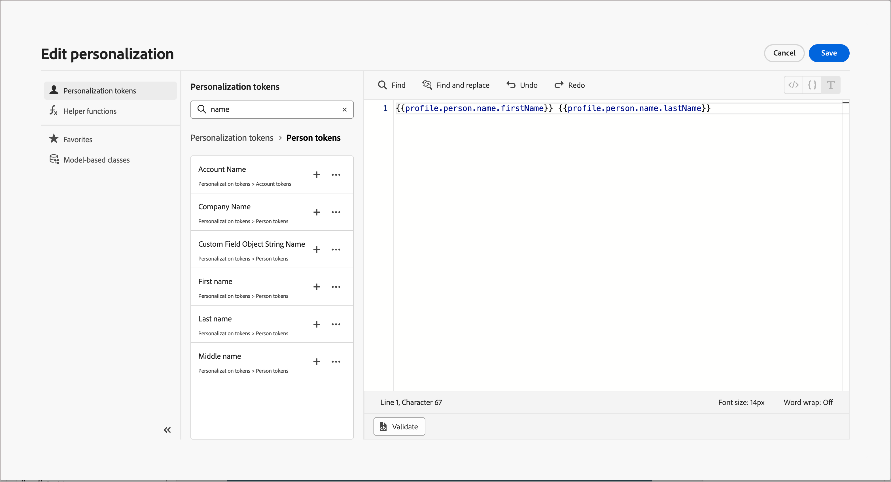
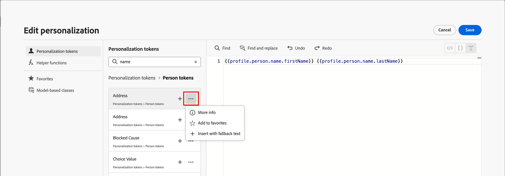
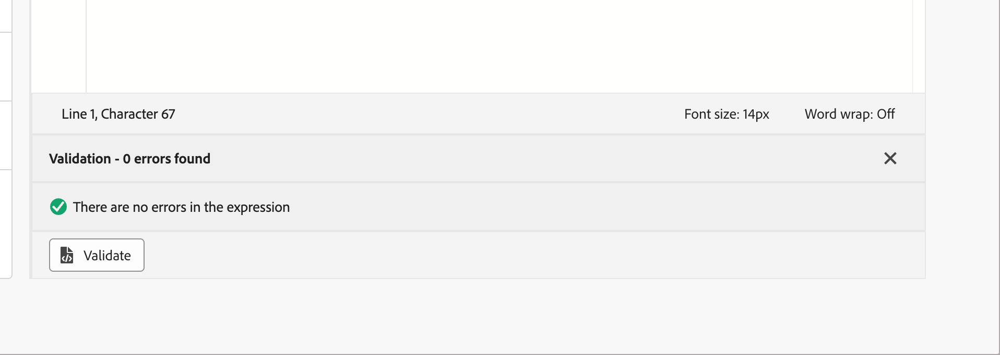

# 內容個人化 {#add-personalization}

>[!CONTEXTUALHELP]
>id="aj-b2b_personalization"
>title="個人化內容體驗"
>abstract="使用&#x200B;**Adobe Journey Optimizer B2B edition**，利用您擁有的訊息相關資料和資訊，將訊息調整成適合每個特定收件者。 可以是使用者的名字、產業、頭銜等。"

[!DNL Adobe Journey Optimizer B2B Edition]個人化功能可讓您利用所擁有的資料與資訊，將電子郵件訊息調整至每個特定收件者。 可以是使用者的名字、產業、頭銜等。

使用&#x200B;_個人化編輯器_，您可以選取、排列、自訂及驗證所有資料，為您的內容建立自訂的個人化。 使用各種工具（例如協助程式功能）來量身打造訊息。 編輯器使用以&#x200B;_Handlebars_&#x200B;為基礎的內嵌個人化語法，其中運算式是以雙大括弧`{{}}`括住的內容所建構。

處理訊息時，Journey Optimizer B2B edition會以Adobe Experience Platform資料集和本機系統值中包含的資料取代運算式。 例如，`Hello {{profile.person.name.firstName}} {{profile.person.name.lastName}}`會動態變成`Hello John Doe`。

使用此語法，您可以跨多個欄位個人化訊息，包括電子郵件主旨列、訊息本文和寄件者資訊。

## Personalization Token

在[!DNL Journey Optimizer B2B Edition]中，您可以使用個人化權杖來建置您的動態電子郵件內容：

* **帳戶權杖** — 這些權杖是以帳戶屬性為基礎，例如&#x200B;_帳戶名稱_、_產業_&#x200B;和&#x200B;_員工人數_。 使用這些權杖來填入由&#x200B;**_XDM商業帳戶詳細資料_**&#x200B;結構描述管理的屬性資料，該結構描述已在Adobe Experience Platform中定義。

* **人員權杖** — 這些權杖是以企業人員屬性為基礎，例如&#x200B;_名字_、_職稱_&#x200B;和&#x200B;_公司名稱_。 使用這些權杖來填入由&#x200B;**_XDM商業人士詳細資料_**&#x200B;結構描述管理的屬性資料，該結構描述已在Adobe Experience Platform中定義。

* **系統權杖** — 這些權杖是以系統欄位值為基礎，例如&#x200B;_date_、_time_&#x200B;和&#x200B;_取消訂閱連結_。

* **我的權杖** （為歷程定義時） — 為電子郵件所在的歷程[定義的](./personalization-my-tokens.md)自訂權杖。

>[!NOTE]
>
>在[Adobe Experience Platform資料模型(XDM)檔案](https://experienceleague.adobe.com/zh-hant/docs/experience-platform/xdm/home){target="_blank"}中進一步瞭解XDM結構描述。

## Personalization編輯器

您必須在電子郵件內容中定義個人化的每個內容中，都可使用個人化編輯器。 在編輯器中，您可以選取、排列、自訂及驗證所有資料，為您的內容建立自訂個人化。

>[!NOTE]
>
>以下個人化編輯器的資訊反映了[簡化架構](../simplified-architecture.md)布建的Journey Optimizer B2B edition環境可用的變更。

按一下「_新增個人化_」（「」）圖示，在任何欄位或內容元件中新增個人化。

{width="800" zoomable="yes"}

若要使用個人化權杖或協助程式功能，請在左側導覽窗格中找出該權杖，然後按一下&#x200B;**+**&#x200B;將其新增至運算式。

按一下&#x200B;_更多功能表_ ( **...** )圖示(在&#x200B;_新增_ ( **+** )圖示旁)以檢視每個屬性的詳細資訊，並將您最常用的屬性新增至&#x200B;_我的最愛_。 新增至我的最愛屬性可從編輯器左側導覽的&#x200B;**[!UICONTROL 我的最愛]**&#x200B;功能表存取。

{width="800" zoomable="yes"}

<!-- >>[!NOTE]
>
>By default, the attributes list shows only populated attributes. To display all attributes, click the _Settings_ icon above the search field and toggle off the **[!UICONTROL Show only populated attributes]** option.
-->
您也可以定義預設後援文字字串，當字串型別的設定檔屬性為空白時就會顯示。 按一下屬性的&#x200B;_更多功能表_ ( **...** )圖示，然後選取&#x200B;**[!UICONTROL 插入後援文字]**。 輸入設定檔的屬性值為空時所應顯示的文字，然後按一下[新增]。**&#x200B;**

最佳實務是在將運算式插入內容之前先驗證該運算式。 按一下編輯器底部的&#x200B;**[!UICONTROL 驗證]**，檢查您的語法並確保沒有錯誤。

{width="500"}

當運算式完成且沒有錯誤時，請按一下[儲存]。**&#x200B;**

<!-- ## Personalization experimentation {#playground}

**[!DNL Adobe Journey Optimizer]** includes an interactive tool designed to help you learn and experiment with personalization capabilities.

This playground provides a simulated environment to write and test personalization code using sample data without requiring live datasets. You can leverage predefined code samples, edit dummy profile payloads, and preview the output of your personalization code in real-time. 

➡️ [Access the personalization playground](https://experienceleague.adobe.com/zh-hant/apps/journey-optimizer/ajo-personalization){target="_blank"} 

## How-to videos{#video-perso}

Learn how to use contextual event information from a journey to personalize a message.

>[!VIDEO](https://video.tv.adobe.com/v/334165?quality=12)

Learn how to add profile-based personalization to a message and how to use audience membership as a pre-condition to a personalization block.

>[!VIDEO](https://video.tv.adobe.com/v/334078?quality=12)

Learn how to leverage the personalization editor playground to write and test personalization code using sample data.

>[!VIDEO](https://video.tv.adobe.com/v/3457868?quality=12) -->