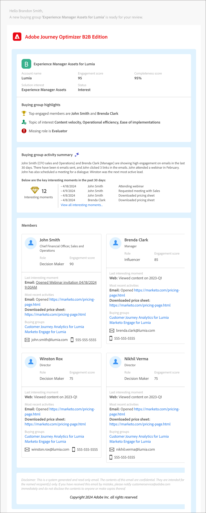

# 銷售警報電子郵件

_銷售警示電子郵件_&#x200B;代表採購群組已移交給銷售人員。 此電子郵件包含購買群組的摘要，以及有關購買群組成員及其活動的資訊。

身為行銷人員，您可以在帳戶歷程中設定銷售警報電子郵件節點，以提醒銷售團隊特定購買群組的歷程已完成。 在節點中，您可以指定銷售團隊的電子郵件地址，或到達一組帳戶的分發別名。

>[!IMPORTANT]
>
>請確定貴組織的允許清單已更新，以便可以傳送銷售警示電子郵件。 如需詳細資訊，請參閱[追蹤和電子郵件傳遞的通訊協定](../start/email-protocols.md)。

## 電子郵件內容

+++銷售警示電子郵件範例
{width="500" zoomable="yes"}

+++

| 區域 | 名稱 | 說明 |
| - | ---- | ----------- |
| 購買群組資訊 | 購買群組名稱 | 購買群組的顯示名稱。 |
|   | 帳戶名稱 | 帳戶名稱。 |
|   | 參與分數 | 購買群組的參與分數，根據過去30天中的活躍參與活動。 |
|   | 完整性分數 | 購買群組的完整度分數。 |
|   | 解決方案興趣 | 與購買團體相關的解決方案興趣 |
|   | 狀態 | 購買群組的狀態。 |
| 購買群組重點 | 最常參與的成員 | 透過購買群組成員參與分數和角色，購買群組的熱門參與成員。 |
|   | 興趣主題 | 內容參與中最常見的關鍵字，根據電子郵件、下載、聊天、PDF評論、活動摘要和網路研討會問題而定。 |
|   | 缺少角色 | 範本中的強制角色，但在購買群組中遺失。 |
| 購買群組摘要 | 活動摘要（由Generative AI提供技術支援） | 根據會員活動由AI產生的購買群組摘要。 考量過去30天的活動。 |
|   | 重要有趣時刻 | 與購買群組成員有關的最近有趣時刻。 |
| 成員 | 四位購買會員的清單 | 依參與分數和角色區分的前四個購買群組成員的詳細資訊。 |
| 每個購買群組成員 | 成員名稱 | 購買群組成員的名稱。 |
|   | 標題 | 購買群組成員的標題。 |
|   | 角色 | 成員的購買群組角色。 |
|   | 參與分數 | 購買群組成員參與分數。 此分數是根據過去30天中的作用中參與活動。 |
|   | 上一個關鍵時刻 | 與成員相關的最近有趣時刻。 |
|   | 最近活動 | 與購買群組成員相關的最新兩個活動。 |
|   | 電子郵件ID | 購買群組成員的電子郵件識別碼。 |
|   | 電話號碼 | 購買群組成員的電話號碼。 |

## 在帳戶歷程中新增銷售警報電子郵件動作

當您新增&#x200B;_[!UICONTROL 採取動作]_&#x200B;節點並執行下列動作時，可以在帳戶歷程中設定銷售警示電子郵件傳遞：

1. 針對&#x200B;]_目標上的_[!UICONTROL &#x200B;動作，請選擇&#x200B;**[!UICONTROL 帳戶]**。

1. 若為帳戶&#x200B;]_上的_[!UICONTROL &#x200B;動作，請選擇&#x200B;**[!UICONTROL 傳送銷售警示]**。

1. 若為&#x200B;**[!UICONTROL 選取方案興趣]**，請選擇要用於產生的電子郵件內容的方案興趣。

1. 針對&#x200B;**[!UICONTROL 傳送電子郵件給]**，請輸入您要納入傳遞的每個電子郵件地址或別名。

   {width="600" zoomable="yes"}

   帳戶歷程發佈後，系統會根據這些引數傳遞銷售警報。
