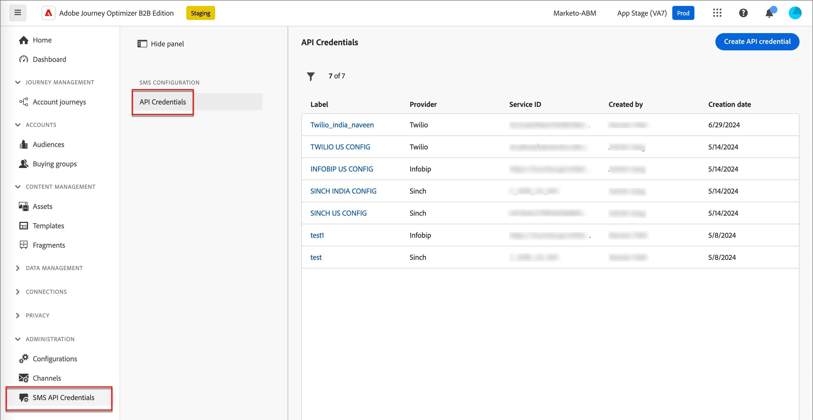
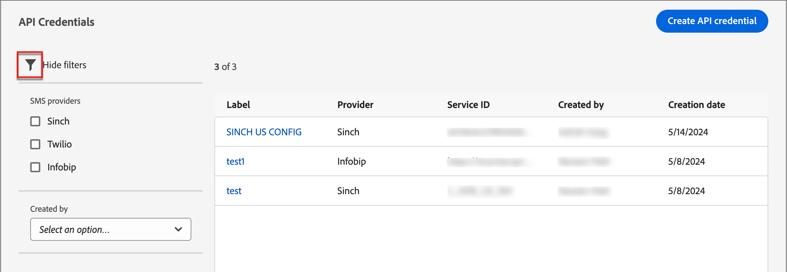
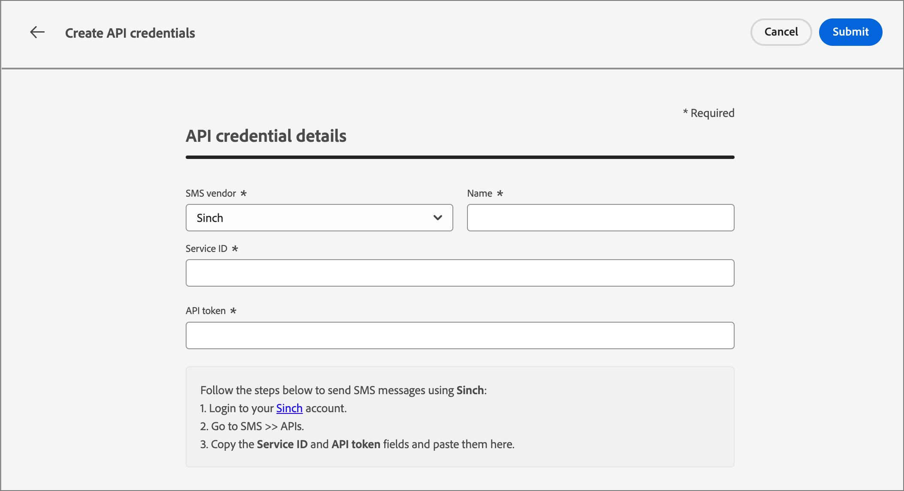

# 簡訊製作

使用Adobe Journey Optimizer B2B Edition傳送簡訊(SMS)給行動裝置上的客戶。 您可以從SMS編輯器以文字格式建立、個人化和預覽訊息。

## 簡訊設定

Adobe Journey Optimizer B2B Edition會透過SMS服務提供者（或SMS閘道提供者）傳送文字訊息。 建立SMS訊息之前，請先從管理員設定設定您的服務提供者。

### SMS閘道服務提供者

Adobe Journey Optimizer B2B Edition目前與獨立提供文字訊息服務的協力廠商提供者整合。 支援的簡訊提供者為Sinch、Twilio和Infobip。

在Adobe Journey Optimizer B2B Edition中設定SMS通道前，您必須透過其中一個提供者建立帳戶，以取得API權杖和服務ID。 設定Adobe Journey Optimizer B2B Edition與適用提供者之間的連線時，需要這些認證。

>[!IMPORTANT]
>
>您對簡訊服務的使用受限於適用提供者的其他條款與條件。 作為協力廠商解決方案，Adobe Journey Optimizer B2B Edition使用者可透過整合使用Sinch、Twilio和Infobip。 Adobe不會控制，且對協力廠商產品不負任何責任。 若有任何與簡訊服務(SMS)相關的問題或尋求協助的請求，請聯絡您的提供者。

### 驗證現有的SMS API設定

>[!NOTE]
>
>上述設定僅供具有SMS管理員許可權的使用者存取。

在左側導覽列中，展開&#x200B;**[!UICONTROL 管理員]**&#x200B;區段，然後按一下&#x200B;**[!UICONTROL 設定]**。

{width="800" zoomable="yes"}

頁面列出執行個體可用的應用程式開發介面設定。 您可以依SMS服務提供者或建立者篩選顯示的API認證。

{width="500"}

### 為SMS服務提供者建立新的API認證

>[!BEGINTABS]

>[!TAB Sinch]

_若要使用Adobe Journey Optimizer B2B版本將Sinch設定為您的SMS提供者：_

1. 在左側導覽列中，展開&#x200B;**[!UICONTROL 管理員]**&#x200B;區段，然後按一下&#x200B;**[!UICONTROL 設定]**。

1. 按一下&#x200B;_[!UICONTROL API認證]_&#x200B;清單右上角的&#x200B;**[!UICONTROL 建立新API認證]**。

1. 設定您的SMS API認證：

   {width="500"}

   * **[!UICONTROL 簡訊供應商]** — 選擇`Sinch`做為簡訊提供者。

   * **[!UICONTROL 名稱]** — 輸入您API認證的名稱。

   * **[!UICONTROL 服務ID]**&#x200B;和&#x200B;**[!UICONTROL API Token]** — 從您的Sinch帳戶存取API頁面（您可以在SMS標籤下找到您的認證）。

   如需尋找您Sinch帳戶之相關資訊的詳細資訊，請參閱[Sinch開發人員檔案](https://developers.sinch.com/docs/sms/getting-started/#2-get-credentials)

1. 當API認證的組態詳細資料完成時，按一下&#x200B;**[!UICONTROL 提交]**。

>[!TAB Twilio]

_若要使用Adobe Journey Optimizer B2B Edition將Twilio設定為您的SMS提供者：_

1. 在左側導覽列中，展開&#x200B;**[!UICONTROL 管理員]**&#x200B;區段，然後按一下&#x200B;**[!UICONTROL 設定]**。

1. 按一下&#x200B;_[!UICONTROL API認證]_&#x200B;清單右上角的&#x200B;**[!UICONTROL 建立新API認證]**。

1. 設定您的SMS API認證：

   {width="500"}

   * **[!UICONTROL 簡訊供應商]** — 選擇`Twilio`做為簡訊提供者。

   * **[!UICONTROL 名稱]** — 輸入API認證定義的名稱。

   * **[!UICONTROL 帳戶SID]**&#x200B;和&#x200B;**[!UICONTROL 驗證權杖]** — 存取您Twilio主控台儀表板頁面的&#x200B;_帳戶資訊_&#x200B;窗格，以尋找您的認證。

   如需尋找您Twilio帳戶之相關資訊，請參閱[Twilio說明中心](https://help.twilio.com/articles/14726256820123-What-is-a-Twilio-Account-SID-and-where-can-I-find-it-)。

1. 完成API認證的組態詳細資料時，請按一下頁面右上方的&#x200B;**[!UICONTROL 提交]**。

>[!TAB Infobip]

_若要使用Adobe Journey Optimizer B2B Edition將Infobip設定為您的SMS提供者：_

1. 在左側導覽列中，展開&#x200B;**[!UICONTROL 管理員]**&#x200B;區段，然後按一下&#x200B;**[!UICONTROL 設定]**。

1. 按一下&#x200B;_[!UICONTROL API認證]_&#x200B;清單右上角的&#x200B;**[!UICONTROL 建立新API認證]**。

1. 設定您的SMS API認證：

   {width="500"}

   * **[!UICONTROL 簡訊供應商]** — 選擇`Infobip`做為簡訊提供者。

   * **[!UICONTROL 名稱]** — 輸入API認證定義的名稱。

   * **[!UICONTROL API基底URL]**&#x200B;和&#x200B;**[!UICONTROL API金鑰]** — 存取您的網頁介面首頁或Infobip帳戶的API金鑰管理頁面，以尋找您的認證。

   如需有關為您的Infobip帳戶尋找此資訊的詳細資訊，請參閱[Infobip檔案](https://www.infobip.com/docs/api/_blank)。

1. 完成API認證的組態詳細資料時，請按一下頁面右上方的&#x200B;**[!UICONTROL 提交]**。

>[!ENDTABS]

按一下&#x200B;_[!UICONTROL 提交]_&#x200B;後，認證會立即驗證並儲存，將您重新導向至&#x200B;_[!UICONTROL API認證]_&#x200B;清單頁面。 如果提交的認證無效，系統會在清單頁面上顯示錯誤訊息。 在這種情況下，您可以選擇取消設定，或更新設定並重新提交。

## 在帳戶歷程中新增簡訊動作

當您新增&#x200B;_[!UICONTROL 採取動作]_&#x200B;節點並執行下列動作時，可以在帳戶歷程中設定文字訊息傳遞：

1. 針對&#x200B;]_目標上的_[!UICONTROL &#x200B;動作，請選擇&#x200B;**[!UICONTROL 人員]**。

1. 針對人員&#x200B;]_上的_[!UICONTROL &#x200B;動作，請選擇&#x200B;**[!UICONTROL 傳送簡訊]**。

   {width="800" zoomable="yes"}

1. 在&#x200B;_[!UICONTROL 執行動作]_&#x200B;面板底部，按一下&#x200B;**[!UICONTROL 建立簡訊]**。

1. 在對話方塊中，輸入電子郵件的唯一&#x200B;**[!UICONTROL 名稱]**，以及&#x200B;**[!UICONTROL 主旨列]**。

   {width="500"}

## 建立簡訊訊息

>[!IMPORTANT]
>
>**簡訊同意管理** 
> 
>根據業界標準及法規，所有簡訊行銷訊息都必須包含讓收件者輕鬆取消訂閱的方式。 要執行此操作，簡訊收件者可以使用選擇加入和選擇退出關鍵字進行回覆。 支援並遵循所有標準的選擇加入和選擇退出關鍵字。 此外，也會支援並接受為您的SMS服務提供者帳戶設定的任何自訂關鍵字。

1. 在&#x200B;**[!UICONTROL 訊息]**&#x200B;欄位中輸入您要傳送的文字。

   您可以建立最多1600個字元的訊息，將每160個字元視為單一SMS訊息。

1. **個人化簡訊**。

   編寫文字訊息時，隨時按一下文字訊息方塊右側的&#x200B;_個人化_&#x200B;圖示。

   ![按一下[個人化]圖示以新增代號至郵件](./assets/sms-message-personalize-icon.png){width="800" zoomable="yes"}

   顯示的頁面可讓您存取Adobe Marketo Engage銷售機會和系統Token。 包含標準和自訂Token。 您可以使用搜尋列來尋找所需的代號，或瀏覽資料夾樹狀結構以尋找及選取任何銷售機會/系統代號。

   將游標放在訊息中要新增權杖的位置。 按一下標籤旁的加號( **+** )以新增標籤。 如果您想要新增具有遞補字元的權杖（預設會顯示在該欄位不適用於潛在客戶的情況下出現），請按一下省略符號( **...** )，然後選擇&#x200B;**[!UICONTROL 插入具有遞補文字]**。

   {width="700" zoomable="yes"}

   在&#x200B;_[!UICONTROL 輸入遞補值]_&#x200B;對話方塊中，輸入顯示為遞補的文字，然後按一下&#x200B;**[!UICONTROL 新增]**。

   {width="400"}

   置入個人化權杖後，按一下&#x200B;**[!UICONTROL 儲存]**&#x200B;以儲存變更並返回主要SMS編寫工作區。 您可以視需要繼續編輯含有代號的訊息。

<!-- 1. **Add URLs to text message**.

   After defining your content, you can add URLs to your message by clicking the _Link_ icon.
   
   You can add two types of URLs: 

   External URLs - This is ANY external URL that can be directly typed into/ pasted into the input text box
   Adobe Marketo Engage Design Studio Landing Pages - Selecting this option, you will see a 'Landing Page picker' from which you can select any of the listed approved Landing Pages from Marketo Engage

   You can choose to 'shorten' either of these URLs by selecting the checkbox
   Note that the URL shortening function, uses the Marketo subdomain for shortening
   The shortened URL appears as a read-only field within the modal
   You can optionally track clicks on the URL
   You can also choose to include 'mkt_tok' for tracking activity against a user
   Click on Add to save changes & add the chosen URL to the SMS message
-->

## 設定簡訊屬性

1. 在&#x200B;_[!UICONTROL SMS屬性]_&#x200B;區段中，為您的訊息輸入&#x200B;**[!UICONTROL 名稱]** （必要，最多100個cha\racter）和&#x200B;**[!UICONTROL 描述]** （選用，最多300個字元）。

   這些欄位允許Alpha、數值、特殊字元。 下列保留的字元是&#x200B;**不允許**： `\`、`/`、`:`、`*`、`?`、`"`、`<`、`>`和`|`。

1. 選擇&#x200B;**[!UICONTROL 簡訊型別]**：

   * 針對需要使用者同意的促銷文字訊息，請使用`Marketing`。
   * 將`Transactional`用於非商業訊息，例如訂單確認、密碼重設通知或傳遞資訊。

1. 針對&#x200B;**[!UICONTROL SMS設定]**，請選擇其中一個預先定義的API設定。

   此設定會決定使用哪個SMS閘道服務提供者和帳戶來傳遞訊息。

1. 輸入您要&#x200B;用於通訊的&#x200B;**[!UICONTROL 寄件者號碼]**。

   {width="700" zoomable="yes"}

   收件者號碼一律對應至Marketo Engage中的`Lead.MainPhone`欄位。

<!-- ## Preview the text message content

When your message content is defined, you can use test profiles to preview its content. If you inserted personalized content, you can check how this content is displayed in the message, using test profile data.

1. Click **[!UICONTROL Simulate Content]** at the top of the SMS authoring workspace.

1. From the _[!UICONTROL Simulate Content]_ page, click **[!UICONTROL Add People]**.

1. Use the # page to manage the leads used for your test profile.

   In the displayed list, you can search for and add any of the leads (up to 10 leads at a time) from the Marketo Engage lead database.

   To search, enter the whole email address and click enter. The corresponding lead profile shows up for selection.

   The preview updated to the personalization fields for the selected profile.

   All the added leads appear on the left rail of the 'Simulate Content' page

   You can manage this list by adding more people and deleting individual leads from the profile listing (it does not remove them from the database).

1. Simulate content for a lead.

   Select any of the leads listed on the left rail of the Simulate Content page and the SMS preview on the page updates for the corresponding lead.

   You can also select a lead from the 'drop-down' box above the preview space and the SMS preview on the page updates for the corresponding lead

1. To exit the _[!UICONTROL Simulate Content]_ page and return back to the SMS authoring workspace, click Close. -->
