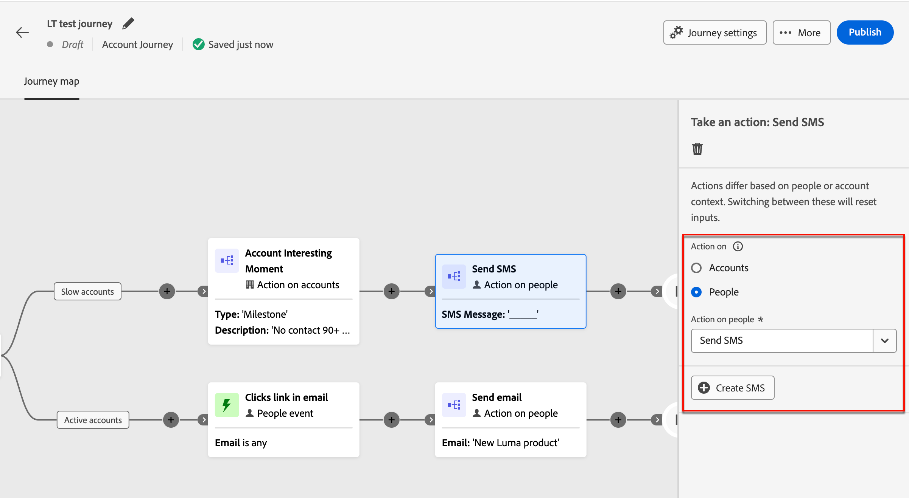

# 簡訊編寫

使用Adobe Journey Optimizer B2B edition傳送簡訊(SMS)給行動裝置上的客戶。 您可以從簡訊編輯器建立、個人化及預覽文字格式的訊息。

在建立帳戶歷程的SMS訊息之前，請確定[SMS服務提供者已由&#x200B;_[!UICONTROL 系統管理員]_&#x200B;設定設定](../admin/configure-channels-sms.md)。

>[!IMPORTANT]
>
>**簡訊同意管理** 
>
>根據業界標準及法規，所有簡訊行銷訊息都必須包含讓收件者輕鬆取消訂閱的方式。 要執行此操作，簡訊收件者可以使用選擇加入和選擇退出關鍵字進行回覆。 支援並遵循所有標準的選擇加入和選擇退出關鍵字。 此外，也會支援並接受為您的SMS服務提供者帳戶設定的任何自訂關鍵字。 如需傳送時如何評估SMS同意偏好設定的詳細資訊，請參閱[同意偏好設定](./channels-consent-preferences.md)。

## 在帳戶歷程中新增簡訊動作 {#add-action}

當您新增&#x200B;_[!UICONTROL 採取動作]_&#x200B;節點並執行下列動作時，可以在帳戶歷程中設定文字訊息傳遞：

1. 針對&#x200B;_目標上的_&#x200B;動作，請選擇&#x200B;**[!UICONTROL 人員]**。

1. 針對人員&#x200B;_上的_&#x200B;動作，請選擇&#x200B;**[!UICONTROL 傳送簡訊]**。

   {width="800" zoomable="yes"}

1. 在&#x200B;_[!UICONTROL 執行動作]_&#x200B;面板底部，按一下&#x200B;**[!UICONTROL 建立簡訊]**。

1. 在對話方塊中，輸入簡訊的唯一名稱&#x200B;**[!UICONTROL 名稱]**。

   {width="400"}

1. 按一下&#x200B;**[!UICONTROL 建立]**。

   _歷程圖_&#x200B;開啟，您可以建立訊息並設定用於傳送訊息的SMS屬性。

### 建立簡訊訊息 {#create-message}

在&#x200B;**[!UICONTROL 訊息]**&#x200B;欄位中輸入您要傳送的文字。

您可以建立最多1600個字元的訊息，將每160個字元視為單一SMS訊息。

{width="800" zoomable="yes"}

#### 個人化簡訊 {#personalize}

1. 將游標放在訊息中要新增個人化權杖的位置。

1. 按一下文字訊息方塊右側的&#x200B;_個人化_&#x200B;圖示（）。

   此對話方塊提供帳戶權杖、人員權杖和系統權杖的存取權。 包含標準和自訂Token。 您可以使用&#x200B;_搜尋_&#x200B;列來尋找您需要的權杖，或瀏覽資料夾樹狀結構來尋找及選取任何權杖。

1. 按一下標籤旁的加號( **+** )以新增標籤。

   如果您想要新增具有遞補文字的Token，請按一下&#x200B;_更多_&#x200B;圖示( **...** )並選擇&#x200B;**[!UICONTROL 插入具有遞補文字]**。 若該欄位不可用於銷售機會，則後援為預設值。

   {width="700" zoomable="yes"}

1. 在&#x200B;_[!UICONTROL 輸入遞補值]_&#x200B;對話方塊中，輸入顯示為遞補的文字，然後按一下&#x200B;**[!UICONTROL 新增]**。

   {width="450"}

1. 置入個人化權杖後，按一下&#x200B;**[!UICONTROL 儲存]**&#x200B;以儲存變更並返回主要SMS編寫工作區。

   您可以視需要繼續編輯含有代號的訊息。

#### 新增連結(URL)至文字訊息 {#add-links}

1. 輸入訊息文字後，請按一下文字訊息方塊右側的&#x200B;_連結_&#x200B;圖示（ ）。

1. 輸入連結的&#x200B;**[!UICONTROL URL]**。

1. 在對話方塊中，選擇要連結的URL型別：

   * **[!UICONTROL 登陸頁面]** — 選擇此選項可選取任何已發佈的登陸頁面。

   * **[!UICONTROL 外部URL]** — 此型別是您在文字方塊中輸入的任何外部URL。

<!--

1. If you choose to use a Marketo Engage landing page, set the tracking options.

   * **[!UICONTROL Enable tracking]** - Select this checkbox to enable tracking, which requires _shortening_ the URL. For a landing page, it uses the Marketo Engage subdomain for the shortened URL. A sample of the shortened URL format is displayed. The actual URL is created when the SMS is sent to the recipient.

   * **[!UICONTROL Include mkt_tok]** - Select this checkbox to track activity against a user. 

      >[!NOTE] 
      >
      >When you allow tracking but disable _[!UICONTROL Include mkt_tok]_, the destination URL does not include the `mkt_tok` query string parameter after redirect. This parameter is used by Marketo Engage landing pages and Munchkin to ensure that tracking of person activities (such as when a person unsubscribes from an email). Do not disable this option unless the parameter is causing issues on your website. 
      >For more information about using Munchkin tracking codes on your website, refer to the [Marketo Engage documentation](https://experienceleague.adobe.com/en/docs/marketo/using/product-docs/administration/additional-integrations/add-munchkin-tracking-code-to-your-website){target="_blank"}.

-->

{width="470"}

1. 連結選項完成時，按一下&#x200B;**[!UICONTROL 新增]**&#x200B;以儲存變更，並將URL連結新增至SMS訊息。

### 設定簡訊屬性 {#sms-properties}

1. 在&#x200B;_[!UICONTROL SMS屬性]_&#x200B;區段中，為您的訊息輸入&#x200B;**[!UICONTROL 名稱]** （必要，最多100個字元）和&#x200B;**[!UICONTROL 描述]** （選用，最多300個字元）。

   這些欄位允許Alpha、數值、特殊字元。 下列保留的字元是&#x200B;**不允許**： `\`、`/`、`:`、`*`、`?`、`"`、`<`、`>`和`|`。

1. 選擇&#x200B;**[!UICONTROL 簡訊型別]**：

   * 針對需要使用者同意的促銷文字訊息，請使用`Marketing`。
   * 將`Transactional`用於非商業訊息，例如訂單確認、密碼重設通知或傳遞資訊。

1. 針對&#x200B;**[!UICONTROL SMS設定]**，請選擇其中一個預先定義的[SMS API設定](../admin/configure-channels-sms.md#create-new-api-credentials-for-an-sms-service-provider)。

   此設定會決定使用哪個SMS閘道服務提供者和帳戶來傳遞訊息。

1. 輸入您要&#x200B;用於通訊的&#x200B;**[!UICONTROL 寄件者號碼]**。

   {width="500" zoomable="yes"}

   收件者號碼一律對應至Experience Platform中的`profile.mobilePhone.number`欄位。

### 模擬文字訊息內容 {#preview-test}

>[!CONTEXTUALHELP]
>id="ajo-b2b_sms_preview_simulate"
>title="檢查您內容的呈現方式"
>abstract="定義內容後，您可以預覽並檢查內容在您使用的管道中的呈現效果。"

定義訊息內容時，您可以使用測試設定檔來模擬（預覽）其內容。 如果您已插入個人化內容，您可以使用測試設定檔資料檢查此內容在訊息中的顯示方式。

>[!IMPORTANT]
>
>繼續模擬文字訊息之前，請務必儲存您的SMS訊息。

1. 按一下SMS編寫工作區頂端的&#x200B;**[!UICONTROL 模擬內容]**。

1. 從&#x200B;_[!UICONTROL 模擬內容]_&#x200B;頁面，按一下&#x200B;**[!UICONTROL 新增人員]**。

1. 使用&#x200B;_模擬內容_&#x200B;頁面來管理測試設定檔所使用的銷售機會。

   在顯示的清單中，您可以搜尋並新增任何銷售機會（一次最多10個銷售機會）。

   若要搜尋，請輸入整個電子郵件地址，然後按&#x200B;_Enter_。 隨即顯示對應的潛在客戶設定檔以供選取。

   預覽會更新所選設定檔的個人化欄位。

   所有新增的潛在客戶都會顯示在左側。

   您可以新增更多人員並從設定檔清單中刪除個別銷售機會，以管理此清單（但不會從資料庫中將其移除）。

1. 模擬所選潛在客戶的內容。

   選取左側列出的任何銷售機會。 頁面上的SMS預覽會更新所選銷售機會。

   您也可以從預覽空間上方的選取器中選取銷售機會，以更新相應銷售機會在頁面上的SMS預覽。

1. 若要結束&#x200B;_[!UICONTROL 模擬內容]_&#x200B;頁面並返回SMS編寫工作區，請按一下右上方的&#x200B;**[!UICONTROL 關閉]**。

## 簡訊同意管理 {#consent-management}

法律規定必須讓收件者能夠取消訂閱來自品牌的通訊，並遵守此選擇。 若未遵守這些法規，您的品牌將面臨法律風險。 此功能可協助您避免傳送未經請求的通訊給收件者。 這可防止他們將您的訊息標示為垃圾訊息，並損害您的聲譽。

提供此選項時，簡訊收件者可使用選擇加入和選擇退出關鍵字進行回覆。 支援並接受所有標準選擇加入和選擇退出關鍵字，以及透過SMS服務提供者設定的任何自訂關鍵字。 取消訂閱後，設定檔會自動從未來行銷訊息的對象中移除。

Journey Optimizer B2B edition可讓您使用下列邏輯，管理簡訊訊息中的選擇退出：

* 根據預設，如果潛在客戶選擇不接收來自您的通訊，則對應的設定檔會從後續SMS傳送中排除

* 來自不同來源（例如AEP或SMS服務提供者）的潛在客戶同意會同步至Journey Optimizer B2B edition。 目前，其在執行個體層級僅支援每個潛在客戶的單一同意狀態（潛在客戶「John Doe」已訂閱或取消訂閱執行個體中的所有促銷SMS）。 目前不支援品牌層級/個別訂閱清單層級同意的雙重選擇加入。
