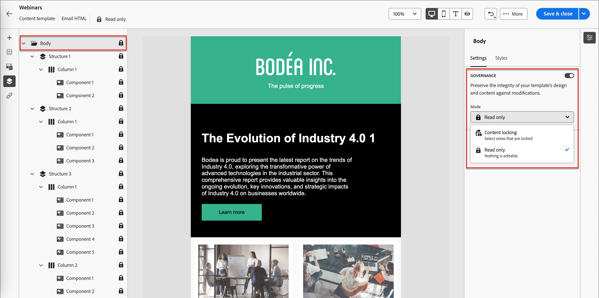
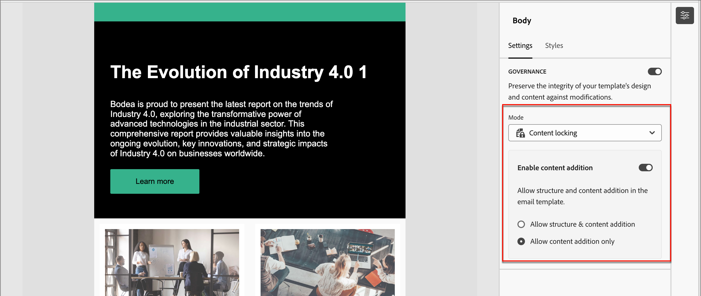
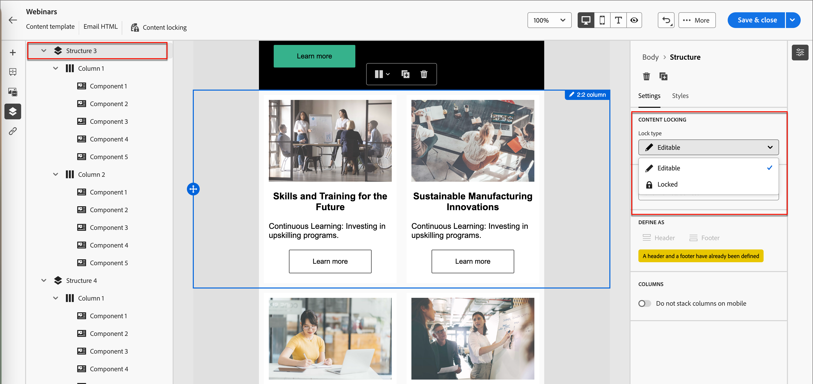
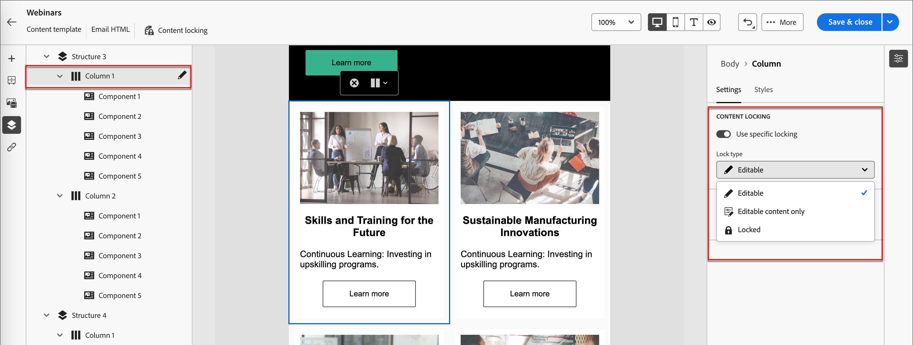

# 範本內容控管

在許多行銷組織中，都有設計電子郵件行銷活動的內容專業人員。 指定的設計可作為整個組織自訂帳戶歷程的基礎。 為確保遵循核准的內容設計，您可以使用內容控管功能來鎖定範本元件。 在電子郵件範本中啟動內容鎖定後，行銷人員可以僅變更允許的元素，以使其與內容策略保持一致。

例如，您可以鎖定專為品牌通訊連續性而設計的頁首與頁尾。 您也可以鎖定包含主體區段的欄，但允許作者修改文字，以符合帳戶歷程設計中的目的。

## 啟用範本的內容控管

使用視覺化設計空間來[為電子郵件範本編寫結構和內容元件](./email-template-authoring.md)之後，請視需要啟用治理並套用特定內容鎖定。

1. 在視覺化設計空間中，使用&#x200B;_導覽樹狀結構_&#x200B;存取圖層/容器和元素。

   按一下畫布左側的&#x200B;_導覽樹狀結構_&#x200B;圖示（）以顯示樹狀結構。

1. 在樹狀結構中，選取根&#x200B;**[!UICONTROL Body]**&#x200B;元件。

   畫布右側的屬性面板依預設會顯示&#x200B;_[!UICONTROL 設定]_&#x200B;標籤。

1. 啟用&#x200B;**[!UICONTROL 治理]**&#x200B;選項。

   {width="800" zoomable="yes"}

   啟用此選項後，預設的&#x200B;_[!UICONTROL 模式]_&#x200B;為&#x200B;**[!UICONTROL 唯讀]**。 在根層級設定此模式時，範本中的所有元素都會鎖定。 左側的樹狀結構會在根及所有子元素旁顯示&#x200B;_唯讀_&#x200B;圖示（  ）。

1. 若要啟用範本中的特定內容鎖定，請將&#x200B;**[!UICONTROL 模式]**&#x200B;變更為&#x200B;**[!UICONTROL 內容鎖定]**。

   在根層級設定此模式時，範本中的所有元素都會解除鎖定。 左側的樹狀結構會在根專案旁顯示&#x200B;_內容鎖定_&#x200B;圖示（  ）。 視需要對包含（結構）和個別內容元件套用內容鎖定。

   若要允許歷程電子郵件作者新增結構或內容元素，請開啟&#x200B;**[!UICONTROL 啟用內容新增]**。 選擇您要允許的新增型別：

   * **[!UICONTROL 允許結構和內容新增]** — 如果要允許作者同時新增結構和內容元素，請選擇此選項。

   * **[!UICONTROL 僅允許新增內容]** — 如果您只允許作者新增內容元素，請選擇此選項。

   {width="600" zoomable="yes"}

   在根層級設定此模式時，範本中的所有元素都會鎖定。 左側的樹狀結構會在根及所有子元素旁顯示&#x200B;_唯讀_&#x200B;圖示（  ）。
<!-- 

   
- 
- 
- 
- 
-  -->

## 將鎖定套用至結構

使用結構繼承模型，根據您要套用的治理來規劃電子郵件範本的版面配置和結構。 使用結構元件作為容器，以可輕鬆指定為鎖定或可編輯的方式將專案分組。 當電子郵件範本設計就緒後，請檢閱結構並根據您的計畫套用鎖定功能。

在結構層級套用鎖定型別，可提供其子元件的預設設定。 之後，您可以視需要在欄或內容元素層級套用特定的鎖定設定。

1. 按一下畫布左側的&#x200B;_導覽樹狀結構_&#x200B;圖示（）以顯示樹狀結構。

1. 在樹狀結構中選取結構。

   畫布右側的屬性面板依預設會顯示&#x200B;_[!UICONTROL 設定]_&#x200B;標籤。

1. 設定&#x200B;**[!UICONTROL 鎖定型別]**：

   * **[!UICONTROL 已鎖定]** — 使用此設定，預設會鎖定所有子元件。 左側的樹狀結構會在所有子元件旁顯示&#x200B;_唯讀_&#x200B;圖示（  ）。

   * **[!UICONTROL 可編輯]** — 透過此設定，所有子元件預設為可編輯。 左側的樹狀結構不會在子元件旁顯示圖示。

   {width="800" zoomable="yes"}

## 設定子元件的鎖定

1. 在樹狀結構中選取元件。

   畫布右側的屬性面板依預設會顯示&#x200B;_[!UICONTROL 設定]_&#x200B;標籤。

1. 啟用&#x200B;**[!UICONTROL 使用特定鎖定]**&#x200B;選項。

1. 選擇要套用的治理型別：

   * **[!UICONTROL 可編輯]** — 允許在電子郵件製作期間對元件進行完整的編輯控制。
   * **[!UICONTROL 僅可編輯的內容]** — 允許電子郵件作者變更內容，但不允許元件本身。
   * **[!UICONTROL 已鎖定]** — 防止在電子郵件製作期間對元件進行任何變更。

     針對鎖定的元件，您可以開啟&#x200B;**[!UICONTROL 允許刪除]**&#x200B;選項，以在電子郵件製作期間允許移除元件。

   {width="800" zoomable="yes"}
