# 網站體驗設計

在您[建立網頁體驗](./web-experiences.md#create-a-web-experience)之後，請使用內容設計空間來定義您要套用至網頁的修改。

>[!BEGINSHADEBOX]

**先決條件**

在設計Web體驗之前，請確定已符合下列需求：

* 產品管理員已設定一或多個網路通道，以定義要納入網路體驗的URL （頁面）。 如需詳細資訊，請參閱[網路通道設定](../admin/configure-channels-web.md)。

* 您的網站已實作[Adobe Experience Platform Web SDK](https://experienceleague.adobe.com/zh-hant/docs/experience-platform/collection/js/js-overview) (`alloy.js`)，以識別訪客並傳送內容。 需要Adobe Experience Platform Web SDK 2.16版或更高版本。

* 您擁有必要的[許可權](../admin/user-management.md#b2b-product-permissions)，才能在歷程中建立和管理網頁體驗：
   * _[!UICONTROL 行銷活動]_ > _[!UICONTROL 管理行銷活動]_ — 需要新增或更新Web個人化動作節點。
   * _[!UICONTROL 行銷活動]_ > _[!UICONTROL 檢視行銷活動]_ — 需要檢視Web個人化動作節點的詳細資料。

>[!ENDSHADEBOX]

>[!IMPORTANT]
>
>在設計網頁體驗之前，請確定您已為網頁瀏覽器安裝Adobe Experience Cloud Visual Editing Helper瀏覽器擴充功能。 若要在Journey Optimizer B2B edition網頁體驗設計空間以可靠的方式開啟、編寫及預覽網頁，則必須使用此擴充功能。 
>
>Google Chrome和Microsoft Edge是目前唯一支援Journey Optimizer B2B edition擴充功能和編寫Web體驗的瀏覽器。 如需詳細資訊，請參閱[安裝Visual Editing Helper擴充功能](./web-experiences.md#install-the-visual-editing-helper-extension)。

## 網站體驗編輯器

Journey Optimizer B2B edition提供兩種型別的編輯器，可用於設計Web修改：

| 編輯者 | 說明 | 最適合 |
| ------ | ----------- | -------- |
| [視覺化編輯器](#visual-editor) | 顯示您的網站並允許您直接選取和修改元素的WYSIWYG (_What You See Is What You Get_)編輯器。 它需要Google Chrome或Microsoft Edge網頁瀏覽器中的[Visual Editing Helper擴充功能](./web-experiences.md#install-the-visual-editing-helper-extension)。 | 對可見的頁面元素（例如文字、影像、按鈕和橫幅）進行視覺化變更。 |
| [非視覺化編輯器](#non-visual-editor) | 程式碼型編輯器，可套用無法透過視覺化編輯器進行的修改。 | 鎖定在視覺上難以選取的元素、套用進階CSS變更，或修改隱藏元素。 |

在Web體驗屬性中，使用&#x200B;**[!UICONTROL 視覺化編輯器]**&#x200B;選項來決定編輯器的型別。 啟用使用視覺化編輯器的選項，或停用它以使用非視覺化編輯器。

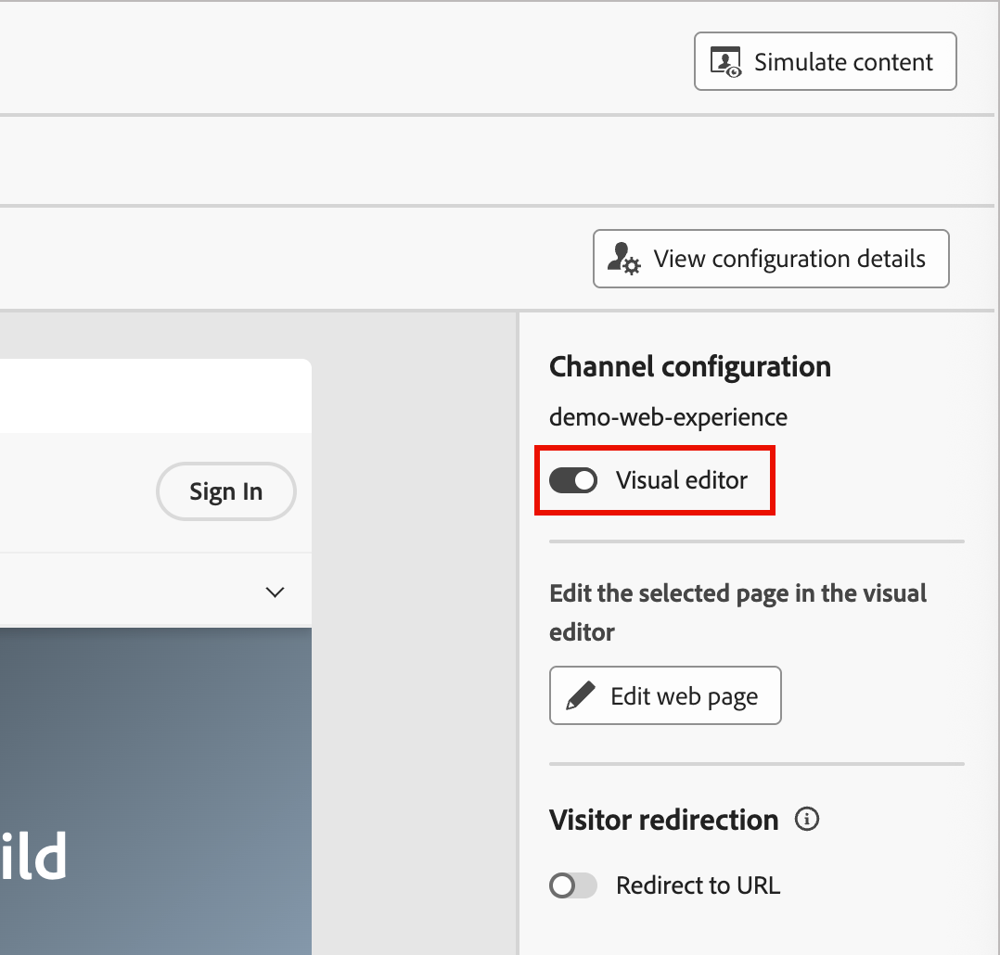{width="400"}

## 視覺化編輯器 {#visual-editor}

>[!CONTEXTUALHELP]
>id="ajo-b2b_web_experience_browse"
>title="使用瀏覽模式"
>abstract="在此模式中，您可以導覽至要針對所選Web Channel設定個人化的確切頁面。"

視覺化編輯器會在iframe內載入網頁，您可於其中選取元素，並直接在頁面預覽中套用修改。 完成下列步驟，使用視覺化編輯器設計您的網頁體驗：

1. 在網頁體驗詳細資訊頁面中顯示&#x200B;_[!UICONTROL 內容]_&#x200B;索引標籤時，按一下右側面板中的&#x200B;**[!UICONTROL 編輯網頁體驗]**。

   視覺化編輯器會根據Web Channel設定載入您的網站。

   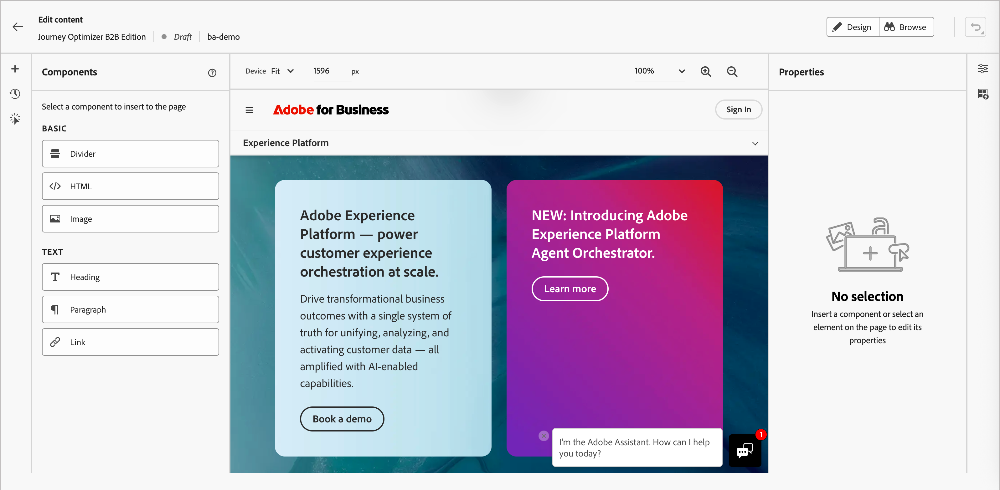{width="800" zoomable="yes"}

1. 如有需要，請按一下右上方的&#x200B;**[!UICONTROL 瀏覽]**，並使用網站導覽列載入您要修改的特定頁面。

   您也可以在上方的欄位中輸入頁面URL。

   >[!NOTE]
   >
   >確保載入的頁面符合在您的Web Channel設定中定義的URL模式。 按一下右上角的&#x200B;**[!UICONTROL 檢視組態詳細資料]**，即可檢視所選Web通道組態的URL或頁面比對規則。

   在視覺化編輯器中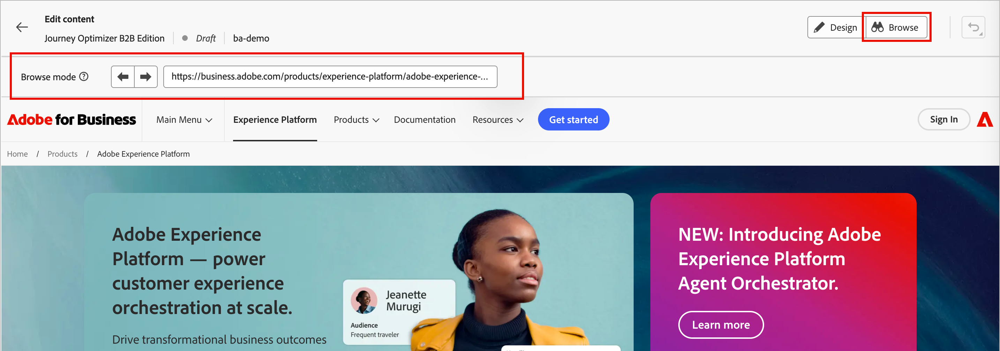{width="700" zoomable="yes"}

   <!-- If the web channel configuration is defined using page matching rules, use the left and right arrows to sequence through the matched pages -- right now these buttons don't do anything -->

   按一下右上角的&#x200B;**[!UICONTROL 設計]**，以載入設計空間中的頁面。

1. 若要定義您要如何修改網頁體驗的顯示頁面，您可以：

   * [將新元件](#insert-new-components) (分隔線、HTML、影像、標題、段落或連結)插入網頁體驗頁面。

   * 從頁面中選取任何現有的元素，例如影像、按鈕、段落、文字、容器、標題或連結，然後為網頁體驗[修改它](#modify-elements)。

   * [為元素新增點選追蹤](#click-tracking-for-web-experiences)，以測量參與度並收集深入分析。

1. 重複步驟2以載入您要納入網頁體驗的其他頁面，並重複步驟3以定義頁面修改。

1. [檢閱您的修改](#manage-modifications)，並視需要進行任何調整。

1. 修改完成後，按一下編輯器上方的左箭頭，返回Web體驗屬性。

### 修改元素

按一下顯示頁面中的元素以選取它。 藍色邊框會指出選取的元素，而內容工具列則會顯示修改選項。

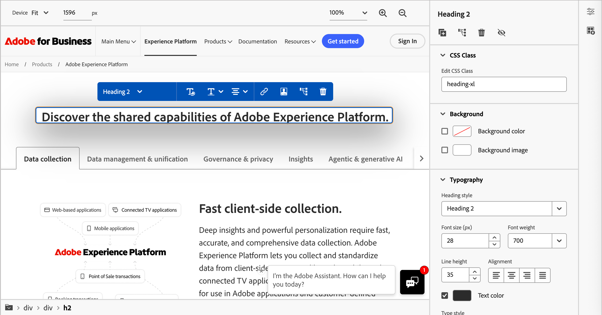{width="700" zoomable="yes"}

工具列選項視選取的元件型別而定：

| 動作 | 說明 |
| ------ | ----------- |
| **[!UICONTROL 文字選項]** | 變更所選元素的文字元素類別或文字樣式。 |
| **[!UICONTROL 選擇影像]** | 取代影像來源或將影像新增至元素。 |
| **[!UICONTROL 編輯連結/新增連結]** | 修改或新增連結URL。 |
| **[!UICONTROL 排列]** | 在顯示內將選取的元素向後或向前移動。 |
| **[!UICONTROL 新增個人化]** | 插入個人化。 |
| **[!UICONTROL 點選追蹤元素]** | 為元素新增點選追蹤。 |
| **[!UICONTROL 刪除]** | 從頁面中移除選取的元素。 |

針對選取的元素，右側面板中的屬性會變更，以反映可用的樣式和動作。 按一下面板頂端的動作圖示，即可複製、按一下追蹤、刪除或隱藏選取的元素。

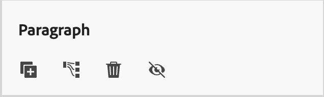{width="300"}

+++文字元素

1. 在頁面上選取文字元素。

1. 輸入新的文字內容，或選取文字字串並輸入取代文字。

1. （選擇性）使用[文字格式選項](./content-components.md#text)，例如粗體、斜體和對齊。

1. 按一下文字元素外部以套用變更。

如需文字元件文字樣式選項的詳細資訊，請參閱[內容元件](./content-components.md#text)。

+++

+++影像元素

1. 在頁面上選取影像元素。

1. 按一下內容工具列或右側面板中的&#x200B;_[!UICONTROL 選擇影像]_&#x200B;圖示。

1. 瀏覽並從資產庫中選取影像。

1. 視需要使用右側面板中的[影像樣式選項](./content-components.md#image)。

+++

+++按鈕元素

1. 在頁面上選取按鈕元素。

1. （選擇性）為按鈕輸入新文字，或選取文字字串並輸入取代文字。

   您可以使用帳戶或個人資料中的資料，透過個人化來變更按鈕文字。

1. 視需要使用右側面板中的[按鈕樣式選項](./content-components.md#button)。

+++

+++ 容器元素

1. 在頁面上選取容器元素。

1. 視需要使用右側面板中的[容器樣式選項](./content-components.md#container)。

+++

### 插入新元件

當您在視覺化編輯器的設計左側導覽中選取&#x200B;**+**&#x200B;圖示時，可以將下列元件型別新增至頁面作為Web體驗修改：

* **[!UICONTROL 分隔線]** — 使用此元件插入分隔線，以組織電子郵件的版面配置和內容。 您可以從右側面板中的屬性調整樣式屬性，例如線條顏色、樣式和高度。 如需詳細資訊，請參閱[內容元件](./content-components.md#divider)中的&#x200B;_分隔線_。
* **[!UICONTROL HTML]** — 使用此元件在現有結構中複製 — 貼上HTML程式碼。 它可讓您建立免費的模組化HTML元件，以重複使用某些外部內容。 如需詳細資訊，請參閱[內容元件](./content-components.md#html)中的&#x200B;_HTML_。
* **[!UICONTROL 影像]** — 使用此元件將影像檔案插入頁面。 您可以從右側面板中的屬性調整樣式屬性，例如寬度和高度。 如需詳細資訊，請參閱[內容元件](./content-components.md#image)中的&#x200B;_影像_。
* **[!UICONTROL 標題]** — 使用此元件插入標題類別文字。 您可以從右側面板中的屬性調整樣式屬性，例如文字顏色、樣式、字型和大小。 如需詳細資訊，請參閱[內容元件](./content-components.md#text)中的&#x200B;_文字_。
* **[!UICONTROL 段落]** — 使用此元件插入標準文字元素。 您可以從右側面板中的屬性調整樣式屬性，例如文字顏色、樣式、字型和大小。 如需詳細資訊，請參閱[內容元件](./content-components.md#text)中的&#x200B;_文字_。
* **[!UICONTROL 連結]** — 使用此元件將獨立文字連結插入至指定的URL。 您可以從右側面板中的屬性調整樣式屬性，例如文字顏色、樣式、對齊方式和大小。

在左側選取元件型別，然後將滑鼠游標停留在您要新增元件的位置旁的元素上。

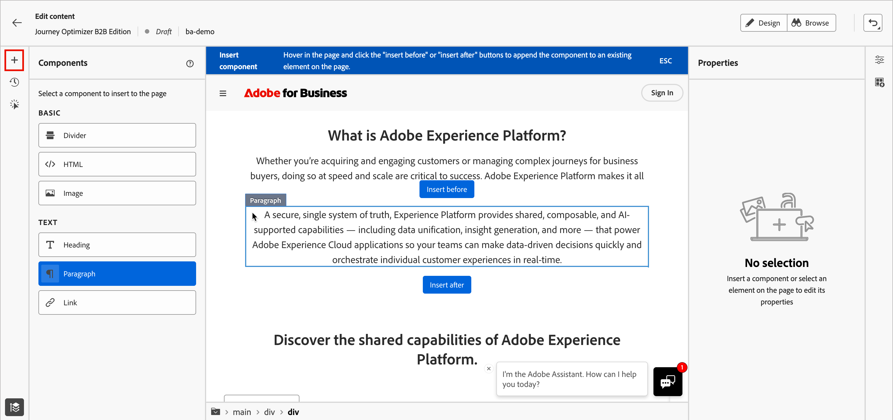{width="800" zoomable="yes"}

按一下顯示的按鈕之一來放置元件：

* ***[!UICONTROL 插入在]**&#x200B;之前 — 將元件插入在選取的元素之前。
* ***[!UICONTROL 插入在]**&#x200B;之後 — 在選取的元素之後插入元件。

若要取消選取要插入的元件型別，請按一下頁面頂端所顯示的內容藍色橫幅中的&#x200B;**[!UICONTROL ESC]**。

## 非視覺化編輯器 {#non-visual-editor}

當您需要進行無法在視覺化編輯器中輕鬆完成的修改時，請使用非視覺化編輯器。 這種程式碼型方法可讓您精確控制元素目標定位和修改。 完成下列步驟，使用非視覺化編輯器設計您的網頁體驗：

1. 在網頁體驗詳細資訊頁面中顯示&#x200B;_[!UICONTROL 內容]_&#x200B;索引標籤時，按一下右側面板中的&#x200B;**[!UICONTROL 新增修改]**。

   非視覺化編輯器會根據Web Channel設定載入頁面。

   {width="800" zoomable="yes"}

1. 定義您要進行的第一個修改。

   左側面板會顯示現有修改的清單（如果有的話）。 按一下[新增]&#x200B;**&#x200B;**&#x200B;以定義新的修改。 如果未定義任何修改，面板會預設為&#x200B;_[!UICONTROL 新增修改]_&#x200B;選項。

   * 選擇&#x200B;**[!UICONTROL 修改型別]**：

     | 類型 | 說明 |
     | ---- | ----------- |
     | [**[!UICONTROL CSS選取器]**](#css-selector-modifications) | 使用CSS選取器字串的目標元素。 |
     | [**[!UICONTROL 頁面]**](#page-modifications) | 將自訂HTML、CSS或JavaScript插入頁面層級元素，例如`<head>`或`<body>`。 |

   * 根據型別設定修改引數：

      * **[!UICONTROL CSS選擇器]** — 輸入有效的CSS選擇器以鎖定特定元素。
      * **[!UICONTROL 動作型別]** — 選擇要執行的動作（編輯、隱藏、刪除、插入、取代）。
      * **[!UICONTROL 內容]** — 提供要套用的內容或樣式。

1. 按一下[儲存]以套用修改。**&#x200B;**

### CSS選擇器修改

CSS選取器修改可讓您使用標準CSS選取器語法精確地鎖定元素。

1. 選擇&#x200B;**[!UICONTROL CSS選取器]**&#x200B;作為修改型別。

1. 在&#x200B;**[!UICONTROL CSS元素選取器]**&#x200B;欄位中輸入選取器。

<!-- This field helps you find and select the HTML elements (or nodes in the DOM tree). -->

    **選取器範例：**
    
    | 選擇器 | 目標 |
    | -------- | ------- |
    | &#39;#hero-banner&#39; | ID為&#39;hero-banner&#39;的元素 |
    | &#39;.cta-button&#39; | 所有具有&#39;cta-button&#39;類別的元素 |
    | &#39;頁首nav a&#39; | 導覽內的連結，在標題內 |
    | &#39;[data-offer=&quot;premium&quot;]&#39; | 具有特定資料屬性的元素 |

1. 選擇&#x200B;**[!UICONTROL 動作型別]**&#x200B;並指定必要的資訊/內容。

   * **[!UICONTROL 設定內容]** — 在&#x200B;**[!UICONTROL 內容]**&#x200B;欄位中，輸入&#x200B;_[!UICONTROL CSS元素選取器]_&#x200B;值所識別之元素的文字。

   * **[!UICONTROL 設定屬性]** — 指定與目前CSS選取器關聯的屬性，以便此屬性可以識別元素。 在&#x200B;**[!UICONTROL 屬性名稱]**&#x200B;欄位中輸入名稱，並在&#x200B;**[!UICONTROL 內容]**&#x200B;欄位中輸入值。 如果屬性已經存在，則會更新值；否則，會新增具有指定名稱和值的新屬性。

   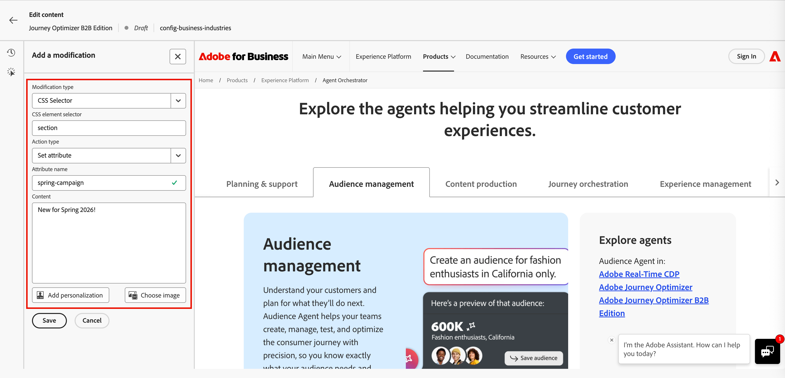{width="800" zoomable="yes"}

1. （選擇性）按一下「**[!UICONTROL 新增個人化]**」並使用「[個人化編輯器](./personalization.md#personalization-editor)」來建立內容的自訂個人化。

### 頁面修改

您可以使用頁面`<head>`修改型別來新增自訂程式碼。 `<head>`元素是中繼資料（資料的相關資料）的容器，並置於`<html>`標籤和`<body>`標籤之間。 在此情況下，程式碼不會等待內文或頁面載入事件，而是在頁面載入開始時執行。

`<head>`元素通常用於將JavaScript或CSS程式碼新增至頁面頂端。 後續視覺化動作的選取器取決於此標籤中新增的HTML元素。

>[!NOTE]
>
>自訂程式碼會在訪客的瀏覽器中執行。 確保您的程式碼安全且經過測試，且不會對頁面效能或使用者體驗產生負面影響。

1. 選擇&#x200B;**[!UICONTROL 頁面`<head>`]**&#x200B;作為修改型別。

1. 在&#x200B;**[!UICONTROL 內容]**&#x200B;方塊中新增您的自訂程式碼。

   >[!CAUTION]
   >
   >您只能新增`<script>`和`<style>`專案至`<head>`區段。 新增`
`標籤和其他元素可能會造成剩餘`<head>`個元素填入`<body>`中。

   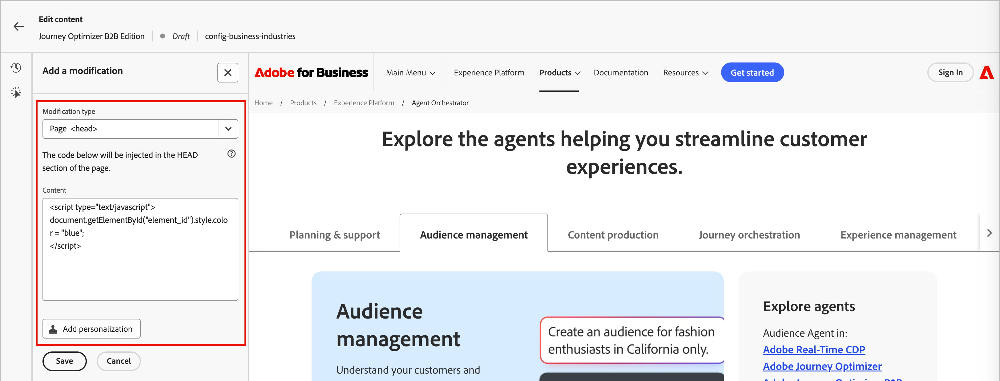{width="800" zoomable="yes"}

1. （選擇性）按一下「**[!UICONTROL 新增個人化]**」並使用「[個人化編輯器](./personalization.md#personalization-editor)」來建立內容的自訂個人化。

## 管理修改 {#manage-modifications}

>[!CONTEXTUALHELP]
>id="ajo-b2b_web_experience_modifications"
>title="輕鬆管理所有變更"
>abstract="使用此窗格，您可以瀏覽並管理為網頁定義的所有調整與新增。"

您建立的所有修改都會受到追蹤，並可從視覺編輯器和非視覺編輯器的&#x200B;**[!UICONTROL 修改]**&#x200B;面板進行管理。 按一下左側工具列中的&#x200B;_[!UICONTROL 修改]_ <!-- (  ) -->圖示以檢視所有修改。

每個修改記錄包括：

* 目標元素或選取器
* 修改型別（例如編輯、隱藏或插入）
* 變更的預覽

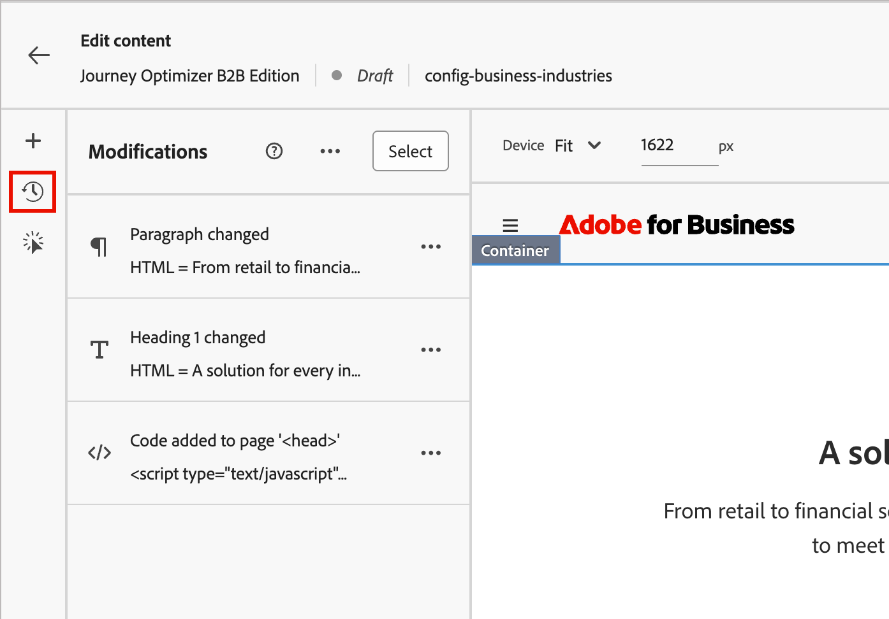{width="500" zoomable="yes"}

### 編輯修改

1. 在&#x200B;_[!UICONTROL 修改]_&#x200B;清單中，尋找您要編輯的修改。

1. 按一下&#x200B;_更多功能表_ ( **...** )圖示，然後選擇&#x200B;**[!UICONTROL 編輯]**。

1. 視需要更新修改屬性。

1. 按一下[儲存]儲存變更。**&#x200B;**

### 刪除修改

1. 在&#x200B;_[!UICONTROL 修改]_&#x200B;清單中，尋找您要移除的修改。

1. 按一下&#x200B;_更多功能表_ ( **...** )圖示，然後選擇&#x200B;**[!UICONTROL 刪除修改]**。

1. 出現提示時確認移除。

<!-- ### Reorder modifications

Modifications are applied in the order that they appear in the list. If you have multiple modifications that affect the same element, the order may impact the final result.

Drag and drop modifications in the list to change the order. The preview updates to reflect the new modification order. -->

## 預覽您的修改

發佈前，請先預覽修改內容向訪客的顯示方式。

使用視覺編輯器頂端的裝置預覽選項來檢視您的修改內容：

* 桌面
* 平板電腦
* 行動

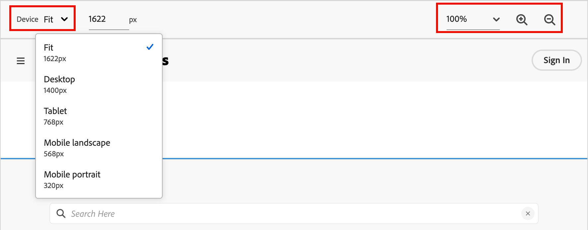{width="550" zoomable="yes"}

預覽會更新，以顯示修改在每個裝置大小上的呈現方式。

使用URL列導覽至您網路頻道設定內的不同頁面。 然後，根據您的URL比對規則，驗證修改是否正確套用至目標頁面。

## 網站體驗的點選追蹤 {#web-click-tracking}

追蹤使用者與元素的互動，以測量參與度並收集深入分析。 點選追蹤資料可在參與報表中取得，並可用於衡量網路體驗修改的成效。

啟用（即時）網頁體驗時，您也可以使用Adobe Customer Journey Analytics建立報表（需要產品訂閱）。 若要改善網站體驗監控功能，您也可以追蹤網站任何特定元素的點按次數。 追蹤可讓您在網頁報告中顯示該元素的點選次數。

如需Customer Journey Analytics和建置Web報表的詳細資訊，請參閱[Customer Journey Analytics檔案](https://experienceleague.adobe.com/zh-hant/docs/analytics-platform/using/cja-landing)。

1. 在網頁體驗編輯器中選取元素，例如影像或連結。

1. 在元素屬性或內容工具列中，按一下&#x200B;_[!UICONTROL 按一下追蹤元素]_&#x200B;圖示。

   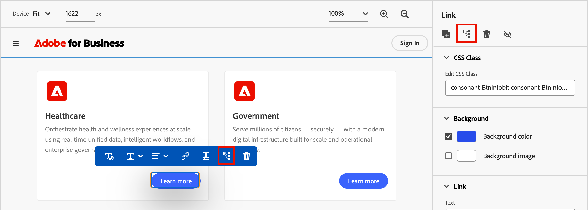{width="600" zoomable="yes"}

1. 開啟左側面板中的點選追蹤清單，並修改&#x200B;**[!UICONTROL 追蹤的動作]**&#x200B;值以在您的報告中識別此互動。

   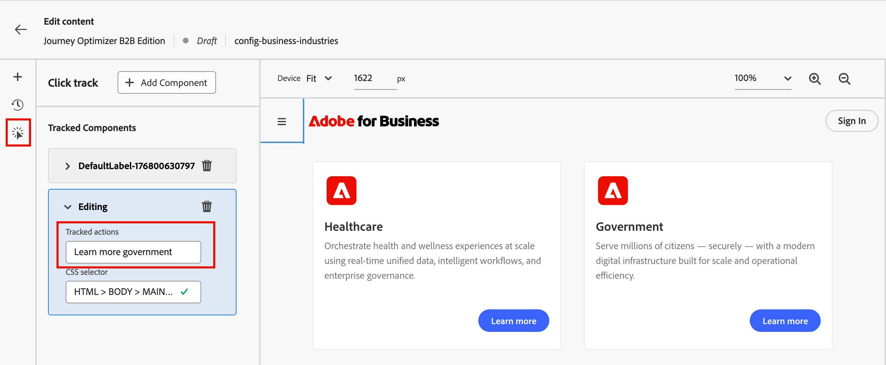{width="600" zoomable="yes"}
