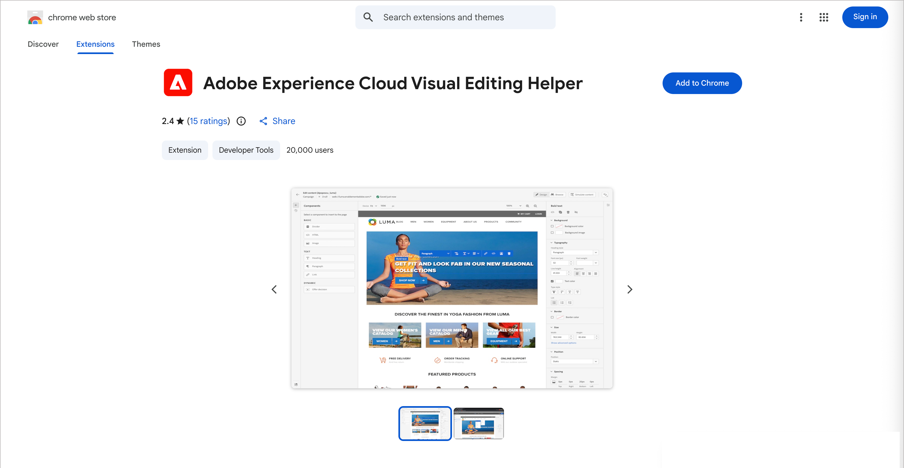
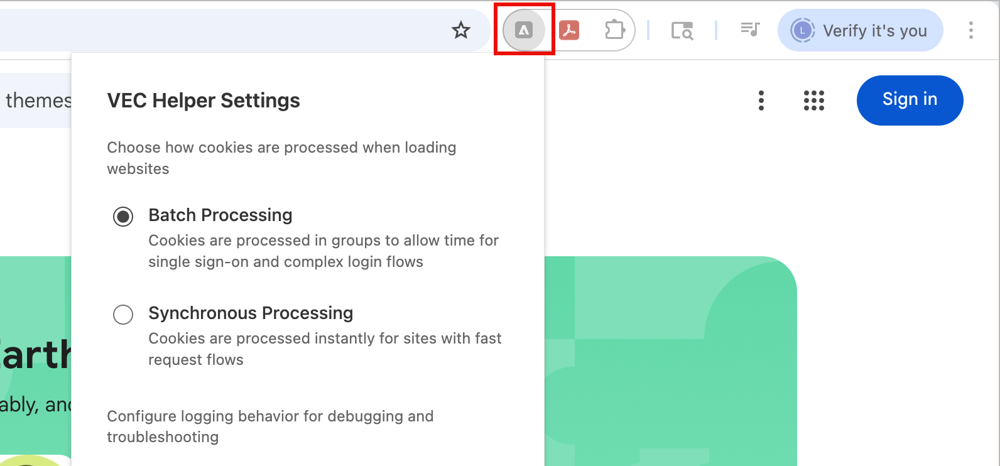
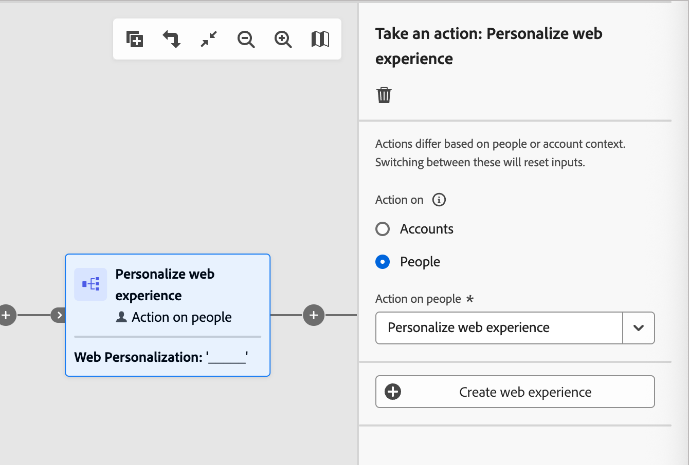
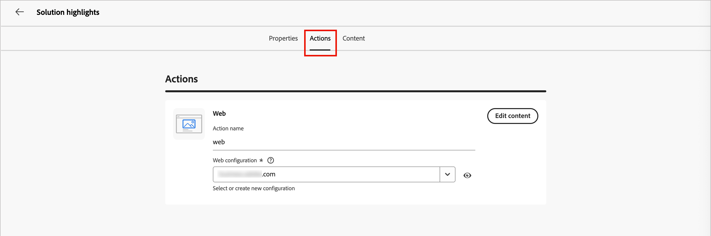
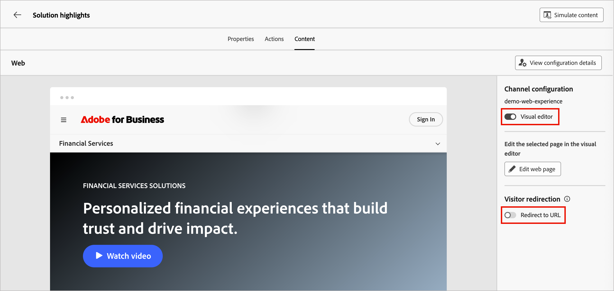
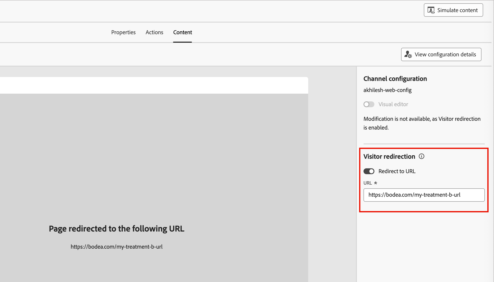

# 網站體驗

Adobe Journey Optimizer B2B edition中的Web頻道可讓您直接在您的網站上建立個人化體驗，協助您以有意義的方式與客戶連結。 此功能提供彈性的工具組，可用來增強與自訂內容的互動，並順暢地與其他管道（例如電子郵件和簡訊）整合。

網頁體驗可讓您：

* 為目標網站訪客提供個人化內容修改
* 根據帳戶屬性自訂網站元素，例如橫幅、文字、影像和按鈕
* 使用URL比對規則鎖定特定頁面，或在多個頁面之間套用變更
* 追蹤參與並監控網頁個人化工作的影響

>[!BEGINSHADEBOX]

## 先決條件

建立網站體驗之前，請先確定已符合下列要求：

* 產品管理員已設定一或多個網路通道，以定義要納入網路體驗的URL （頁面）。 如需詳細資訊，請參閱[網路通道設定](../admin/configure-channels-web.md)。

* 您的網站已實作[Adobe Experience Platform Web SDK](https://experienceleague.adobe.com/en/docs/experience-platform/collection/js/js-overview) (`alloy.js`)，以識別訪客並傳送內容。 請確定Adobe Experience Platform Web SDK的版本是2.16或更高版本。

* 您擁有必要的[許可權](../admin/user-management.md#b2b-product-permissions)，才能在歷程中建立和管理網頁體驗：
   * _[!UICONTROL 行銷活動]_ > _[!UICONTROL 管理行銷活動]_ — 需要新增或更新Web個人化動作節點。
   * _[!UICONTROL 行銷活動]_ > _[!UICONTROL 檢視行銷活動]_ — 需要檢視Web個人化動作節點的詳細資料。
   * _[!UICONTROL 行銷活動]_ > _[!UICONTROL 核准並發佈行銷活動]_ — 必須發佈具有一或多個Web個人化動作節點的歷程。

* 您已為網頁瀏覽器安裝Adobe Experience Cloud [Visual Editing Helper瀏覽器擴充功能](#install-the-visual-editing-helper-extension)。 若要在Journey Optimizer B2B edition內容設計空間以可靠的方式開啟、編寫及預覽網頁，則此擴充功能為必要功能。

  >[!NOTE]
  >
  >Google Chrome和Microsoft Edge是目前唯一支援在Journey Optimizer B2B edition中編寫網頁的瀏覽器。

>[!ENDSHADEBOX]

## 安裝Visual Editing Helper擴充功能

1. 在瀏覽器（[!DNL Google Chrome]或[!DNL Microsoft Edge]）中開啟新索引標籤。

1. 前往[Google Chrome網站商店](https://chromewebstore.google.com/category/extensions)。

   如果您正在使用[!DNL Microsoft Edge]，請選取&#x200B;_允許副檔名_ （從上方橫幅上的其他存放區）。 啟用此選項可讓您將擴充功能從[!DNL Chrome Web Store]新增至[!DNL Microsoft Edge]。

1. 搜尋並導覽至&#x200B;_[!DNL Adobe Experience Cloud Visual Editing Helper]_&#x200B;瀏覽器延伸模組。

   {width="800" zoomable="yes"}

1. 按一下&#x200B;**[!UICONTROL 新增至Chrome]**，然後在確認對話方塊中按一下&#x200B;**[!UICONTROL 新增擴充功能]**。

   如果您使用[!DNL Microsoft Edge]，此動作會將擴充功能新增至[!DNL Edge]。

1. 請確定您的瀏覽器工具列中的[!DNL Visual Editing Helper]瀏覽器延伸模組已正確啟用。

   {width="450"}

現在當網站在Journey Optimizer B2B edition網頁體驗視覺編輯器中開啟時，[!DNL Adobe Experience Cloud Visual Editing Helper]會自動啟用。 擴充功能沒有任何條件設定，且會自動處理所有設定，包括SameSite Cookie設定。

>[!NOTE]
>
>由於下列其中一個原因，某些網站可能無法可靠地在Journey Optimizer B2B edition網頁編輯器中開啟：
>
>* 網站的安全性原則非常嚴格。
>* 網站位於iframe中。
>* 外部無法提供客戶QA或中繼網站（網站為內部網站）。

## 建立網站體驗

當您[新增&#x200B;_[!UICONTROL 採取動作]_&#x200B;節點](../journeys/action-nodes.md)並執行下列動作時，您可以在歷程中設定Web體驗：

1. 針對&#x200B;_[!UICONTROL 目標上的]_&#x200B;動作，請選擇&#x200B;**[!UICONTROL 人員]**。

1. 若要對人員&#x200B;_[!UICONTROL 執行]_&#x200B;動作，請選擇&#x200B;**[!UICONTROL 個人化網頁體驗]**。

   {width="500"}

1. 按一下&#x200B;**[!UICONTROL 建立網頁體驗]**。

1. 在&#x200B;_[!UICONTROL 建立網頁體驗]_&#x200B;對話方塊中，輸入有用的&#x200B;**[!UICONTROL 名稱]**&#x200B;和&#x200B;**[!UICONTROL 描述]** （選擇性）。

   * 名稱 — 最多100個字元，必須是唯一的、不區分大小寫

   * 說明 — 最多300個字元

   >[!NOTE]
   >
   >名稱和說明欄位支援字母、數字和特殊字元。 保留的字元(`\ / : * ? " < > |`)是&#x200B;**_不允許_**。

   {width="400"}

<!-- What is this for? 1. Properties? -->

1. 在&#x200B;**[!UICONTROL 屬性]**&#x200B;索引標籤中，輸入網頁體驗的說明。

1. 按一下「**[!UICONTROL 動作]**」標籤，然後選取要用於網頁體驗的&#x200B;**[!UICONTROL 網頁管道]**。

   Web Channel設定會根據設定的頁面比對規則，決定套用內容修改的位置。 如需詳細資訊，請參閱[Web通道設定](../admin/configure-channels-web.md)。

   {width="700" zoomable="yes"}

1. 若要定義網頁修改，請按一下[編輯內容]。**&#x200B;**

   編輯器會在&#x200B;_[!UICONTROL 內容]_&#x200B;標籤中開啟，您可以在其中定義網頁體驗的修改。 如需使用設計工具新增網頁體驗內容修改的詳細資訊，請參閱[網頁體驗設計](./web-experience-design.md)。

1. 在右側面板中，根據您想要定義和管理它的方式設定Web體驗屬性。

   * **[!UICONTROL 視覺化編輯器]** — 在[視覺化與非視覺化編輯器](./web-experience-design.md#web-design-tools)之間切換，以進行網頁體驗修改設計。
   * **[!UICONTROL 訪客重新導向]** — 啟用此選項以[將訪客重新導向至另一個現有的URL](#redirect-to-url)，而不是在內容標籤中編寫新的變數。

   {width="700" zoomable="yes"}

1. 按一下&#x200B;**[!UICONTROL 編輯網頁]**&#x200B;以[設計您的網頁修改](./web-experience-design.md)。

1. 修改完成後，按一下編輯器上方的左箭頭，返回內容標籤和個人化的Web體驗節點屬性。

   您可以按一下最上方的向左箭頭，返回歷程畫布。

## 編輯網站體驗

1. 開啟歷程並選取&#x200B;**[!UICONTROL 個人化Web體驗]**&#x200B;動作節點。

1. 若要變更Web Channel設定或內容，請按一下[編輯網頁體驗]。**&#x200B;**

1. 選取&#x200B;**[!UICONTROL 動作]**&#x200B;標籤，並視需要變更Web組態。

1. 選取&#x200B;**[!UICONTROL Content]**&#x200B;標籤，並視需要使用視覺化設計工具。

   * _視覺化編輯器_ — 按一下&#x200B;**[!UICONTROL 編輯內容]**。
   * _非視覺化編輯器_ — 按一下&#x200B;**[!UICONTROL 新增修改]**。

   如需詳細資訊，請參閱[網頁體驗設計](./web-experience-design.md)。

1. 修改定義完成後，按一下編輯器上方的左箭頭，返回內容標籤和網頁體驗屬性。

   您可以按一下最上方的向左箭頭，返回歷程畫布。

## 重新導向至 URL

建立網頁體驗時，您可以將訪客重新導向至另一個現有URL，而不是在內容編輯器中編寫新的變數。 當您想要執行比較兩個不同體驗的內容實驗，而不是只變更頁面中的幾個元素時，此選項很有用。

例如，建立具有兩種處理的網路行銷活動：

在處理A中，使用內容編輯器為一半目標人口編寫網頁體驗。

在處理B中，選取目標母體另一半的&#x200B;_[!UICONTROL 重新導向至URL]_&#x200B;選項。 輸入具有您在Journey Optimizer B2B edition外部所編寫替代設計的頁面URL。

{width="500" zoomable="yes"}

>[!NOTE]
>
>選取此選項後，網站預覽不會顯示，且&#x200B;_[!UICONTROL 視覺化編輯器]_&#x200B;切換功能已停用。

當您的Web促銷活動上線時，您可以追蹤您在Journey Optimizer B2B edition中定義的Web體驗，針對使用重新導向至替代頁面的Web體驗執行情形。

## 測試網路體驗

網頁體驗的內容設計完成後，您可以使用&#x200B;_模擬內容_&#x200B;功能來預覽網頁修改。 如果您已插入個人化內容，您可以使用測試設定檔資料來檢查內容的呈現方式。 可從網頁體驗或內容視覺設計編輯器的&#x200B;_[!UICONTROL 內容]_&#x200B;標籤取得模擬工具。

1. 按一下右上方的&#x200B;**[!UICONTROL 模擬內容]**。

1. 選取測試設定檔。

1. 新增測試設定檔，以使用測試設定檔資料檢查網頁。

<!-- This works differently than emails (rely on Marketo data), currently. Will expand when we figure it out -->

## 啟用您的網站體驗

當您[發佈歷程](../journeys/create-publish-journey.md#publish-an-account-journey)時，您的Web體驗會啟動並顯示給對象。 在透過歷程啟用網路體驗之前，請考量下列事項：

* 如果您發佈具有網路體驗的歷程，其影響的頁面與另一個已上線的歷程相同，則所有變更會套用至網頁。

* 如果多個歷程更新網站的相同元素，則優先使用最近套用的變更。

### 傳遞需求

若要啟用Web體驗傳送，必須定義下列設定：

* 在Adobe Experience Platform資料收集中，請務必在Adobe Experience Platform服務底下啟用Adobe Journey Optimizer B2B edition選項，以定義資料串流。

  此設定可確保Adobe Experience Platform Edge可正確處理傳入事件。 [了解更多](https://experienceleague.adobe.com/en/docs/experience-platform/datastreams/configure)

* 在Adobe Experience Platform中，請確定您有一個啟用&#x200B;_[!UICONTROL Active-On-Edge合併原則]_&#x200B;選項的合併原則。

  在「客戶>設定檔>合併原則Experience Platform」功能表下選取原則。 [了解更多](https://experienceleague.adobe.com/en/docs/experience-platform/profile/merge-policies/ui-guide#configure)

  Journey Optimizer B2B edition傳入頻道會使用此合併原則，以正確地啟用並發佈邊緣上的傳入網路體驗。 [了解更多](https://experienceleague.adobe.com/en/docs/experience-platform/profile/merge-policies/ui-guide)

### 疑難排解

您可以使用Adobe Experience Platform Assurance中的Edge Delivery檢視，針對Journey Optimizer B2B edition Web體驗的傳送進行疑難排解。 此外掛程式可讓您詳細檢查要求呼叫、驗證預期的邊緣呼叫，以及檢查設定檔資料。 此設定檔資料包含身分對應、區段會籍和同意設定。 您也可以檢閱要求的合格及不合格活動。

如需Assurance中Edge Delivery檢視的詳細資訊，請參閱[Experience Platform檔案](https://experienceleague.adobe.com/zh-hant/docs/experience-platform/assurance/view/edge-delivery)。
