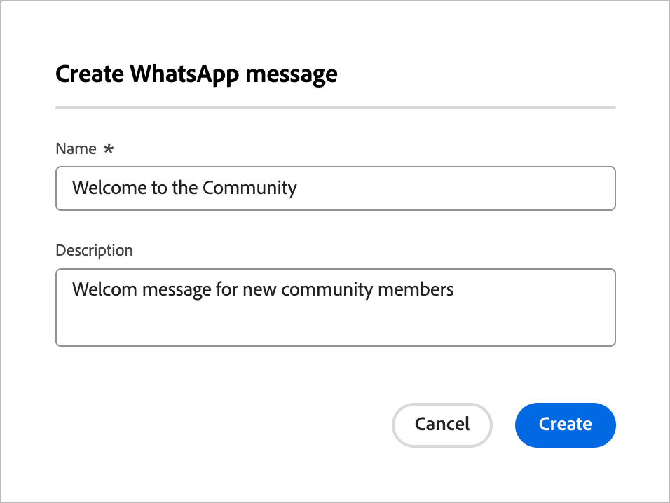

# WhatsApp製作

使用Adobe Journey Optimizer B2B edition將WhatsApp訊息傳送至行動裝置上的帳戶成員。 您可以使用WhatsApp編輯器提供的已核准Meta訊息範本，建立、個人化和預覽訊息。<!-- Test your WhatsApp messages before publishing the account journey to ensure your intended rendering, accurate personalization, and proper configuration of all settings. -->

在建立帳戶歷程的WhatsApp訊息之前，請確定您已在&#x200B;_[!UICONTROL 管理員]_&#x200B;設定中設定所需的[WhatsApp通道](../admin/configure-channels-whatsapp.md)。

>[!NOTE]
>
>Journey Optimizer B2B edition僅支援&#x200B;_傳出_&#x200B;個WhatsApp訊息元素。

+++ 支援的訊息元素和動作呼叫選項

WhatsApp支援下列訊息型別：

| 訊息元素 | 說明 |
| - | - |
| 標頭 | 顯示在訊息本文上方的可選文字。 |
| 文字 | 透過引數支援動態內容。 |
| 影像(JPEG、PNG) | 必須是8位元RGB或RGBA格式，且大小必須小於5 MB。 |
| 影片 | 必須為3GPP或MP4、16 MB以下，並由URL託管。 |
| 音訊 | 僅適用於回應訊息。 必須是AAC、AMR、MP3、MP4音訊或OGG格式，在URL上託管，且小於16 MB。 |
| 文件 | 必須小於100 MB、在URL上代管，且採用下列其中一種格式： `.txt`、`.xls`/`.xlsx`、`.doc`/`.docx`、`.ppt`/`.pptx`或`.pdf`。 |
| 內文 | 透過引數支援動態內容。 |
| 頁尾文字 | 透過引數支援動態內容。 |

以下call-to-action選項適用於您的WhatsApp訊息：

| call to action | 說明 |
| - | - |
| 造訪網站 | 只允許一個按鈕，包含變數引數。 |
| 使用WhatsApp撥打電話 | 提供一個按鈕，可直接從訊息開啟與指定電話號碼的WhatsApp聊天。 |
| 呼叫電話號碼 | 提供當使用者點選時，向指定號碼發起電話通話的按鈕。 |

+++

## 在帳戶歷程中新增WhatsApp動作

當您[新增&#x200B;_[!UICONTROL 採取動作]_&#x200B;節點](../journeys/action-nodes.md)並執行下列動作時，您可以在帳戶歷程中設定WhatsApp訊息傳遞：

1. 針對&#x200B;]_目標上的_[!UICONTROL &#x200B;動作，請選擇&#x200B;**[!UICONTROL 人員]**。

1. 若要對人員&#x200B;]_執行_[!UICONTROL &#x200B;動作，請選擇&#x200B;**[!UICONTROL 傳送WhatsApp]**。

   {width="500" zoomable="yes"}

## 建立WhatsApp訊息

1. 在&#x200B;_[!UICONTROL 執行動作]_&#x200B;面板底部，按一下&#x200B;**[!UICONTROL 建立WhatsApp]**。

1. 在對話方塊中，為WhatsApp訊息輸入唯一的&#x200B;**[!UICONTROL Name]** （必要）和&#x200B;**[!UICONTROL Description]** （選用）。

   {width="400"}

1. 按一下&#x200B;**[!UICONTROL 建立]**。

   _WhatsApp設計空間_&#x200B;開啟，您可以在其中定義WhatsApp動作並建立傳送訊息的內容。

### 選取動作設定

1. 在&#x200B;_WhatsApp設計空間_&#x200B;中，選取&#x200B;**[!UICONTROL 動作]**&#x200B;索引標籤。

1. 針對&#x200B;**[!UICONTROL WhatsApp組態]**，請選取支援行銷動作的[組態](../admin/configure-channels-whatsapp.md#create-channel-configuration)，以及符合您需求的訊息傳遞設定。

   {width="700" zoomable="yes"}

1. 按一下&#x200B;**[!UICONTROL 編輯內容]**&#x200B;以移至訊息引數和文字。

### 選取訊息範本

>[!IMPORTANT]
>
>**WhatsApp同意管理**：根據Meta的原則和適用法規，所有WhatsApp行銷訊息都必須僅傳送給選擇接收通訊的收件者。 WhatsApp收件者可隨時透過回複選擇退出關鍵字來選擇退出。 選擇退出回應會自動接受，而對應的設定檔會從未來的行銷訊息對象中移除。

會使用您Meta WhatsApp商業帳戶中預先核准的訊息範本傳送WhatsApp訊息。 **範本必須由Meta稽核和核准**，您才能在Journey Optimizer B2B edition中使用它們。 與您的[!DNL Meta Business Manager]帳戶管理員合作，管理並提交範本以供核准。

1. 針對&#x200B;**[!UICONTROL 選取範本類別]**，請選擇下列其中一項：

   * 行銷
   * 公用程式
   * Authentication

1. 若為&#x200B;**[!UICONTROL 選取WhatsApp範本]**，請為組態商務帳戶選擇核准的範本。

   範本內容會載入訊息編輯器中，顯示範本結構和可用於個人化的任何變數欄位。

   {width="700" zoomable="yes"}

   範本是依類別（_行銷_、_公用程式_&#x200B;和&#x200B;_驗證_）和狀態來組織。 只有&#x200B;**_已核准的_**&#x200B;範本可供選取。 如需有關建立WhatsApp範本的詳細資訊，請參閱Meta檔案中的&#x200B;[_為您的WhatsApp商業帳戶建立訊息範本_](https://www.facebook.com/business/help/2055875911147364?id=2129163877102343)。

### 影像URL

如果您的範本包含任何影像，請使用&#x200B;**[!UICONTROL 影像URL]**&#x200B;欄位來新增媒體URL，以取代範本中的任何預留位置。 Meta的範本媒體只是預留位置。 若要正確顯示影像、音訊或視訊，您必須使用來自Adobe Experience Manager或其他來源的外部URL。

### 個人化訊息內容

核准的WhatsApp範本可包含您使用設定檔資料或動態值定義的變數預留位置。

針對範本中顯示的每個變數欄位，按一下欄位旁的&#x200B;_個人化_&#x200B;圖示（  ）。

WhatsApp範本中的{width="700" zoomable="yes"}

此對話方塊提供帳戶權杖、人員權杖和系統權杖的存取權。 包含標準和自訂Token。 您可以使用&#x200B;_搜尋_&#x200B;列來尋找您需要的權杖，或瀏覽資料夾樹狀結構來尋找及選取任何權杖。

如需使用權杖進行個人化的詳細資訊，請參閱[內容個人化](./personalization.md)。

定義個人化權杖後，按一下&#x200B;**[!UICONTROL 儲存]**&#x200B;以儲存變更，並返回主WhatsApp訊息工作區。
