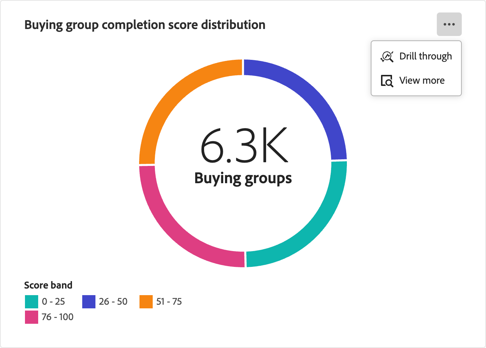
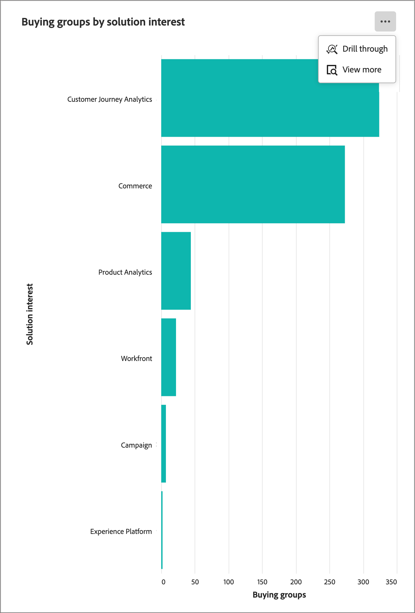
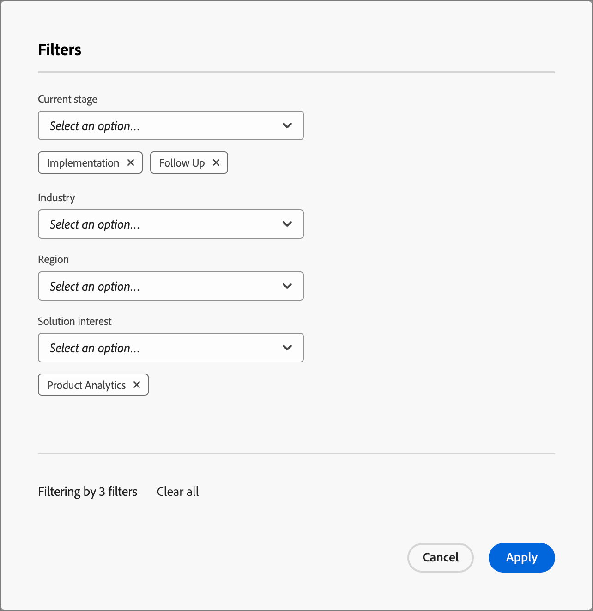
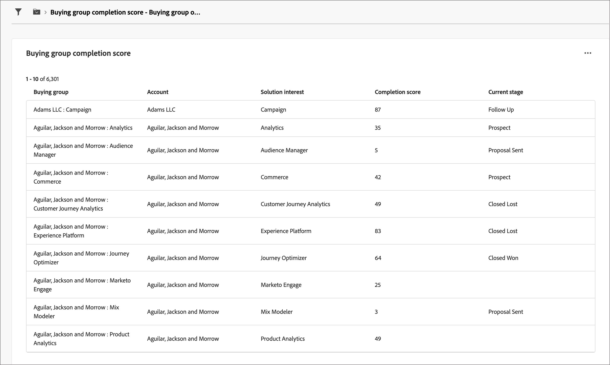
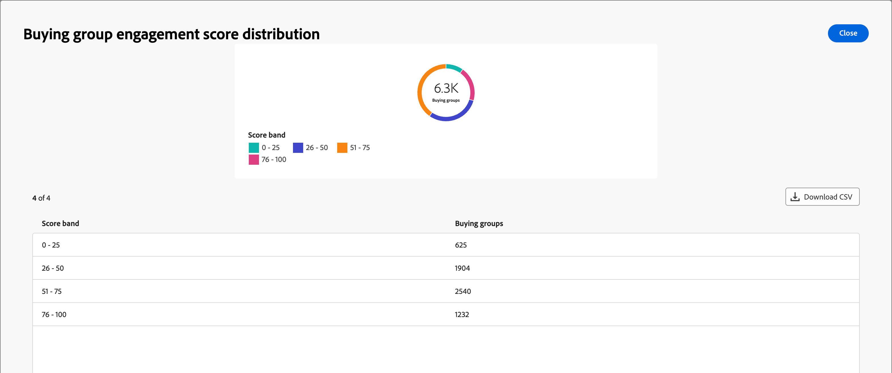

# 購買群組總覽儀表板

採購群組的「概要」控制面板是針對B2B銷售移交程式所設計。 這可讓行銷團隊分享&#x200B;_已就緒_&#x200B;的購買群組及其成員，連同重要資料給銷售團隊執行。 此程式可確保從行銷到銷售的簡化轉換。

銷售移交包括：

* **資料移交**：行銷人員會識別&#x200B;_就緒_&#x200B;目標資料，並以CSV格式讓銷售人員能夠存取。 
* **銷售同意**：銷售人員手動檢閱並將&#x200B;_就緒_&#x200B;目標合併到他們的管道中。

若要存取此儀表板，請展開左側導覽中的&#x200B;**[!UICONTROL 帳戶]**，然後選取&#x200B;**[!UICONTROL 購買群組]**。 選取&#x200B;**[!UICONTROL 概觀]**&#x200B;標籤（如果預設未顯示）。

{width="800" zoomable="yes"}
<!--
## Buying Group Status

Gain insights into your buying groups' progression with the Buying Group Status view. This visualization showcases the distribution of your buying groups categorized by their most recent status update within a specified time frame.

{width="800" zoomable="yes"}

**[!UICONTROL Status]** (y-axis): Track the journey of buying groups through various stages.
**[!UICONTROL Number of Buying Groups]** (x-axis): Quantify the number of buying groups at each status, providing a clear metric of your funnel's health and activity.

To generate a shareable PDF of your current view, click **[!UICONTROL Export]** at the top-right corner of the page. -->

## 購買群組完成分數分佈

此視覺效果會根據完成分數說明購買群組的分佈，並歸類到四個不同的分數區間。 中央數字代表購買群組的總數，並提供整體進度的快速快照。 分段顏色可指出每個分數範圍內購買群組的比例，讓您一眼即可評估完成趨勢。

若要檢視詳細資訊，請按一下右上角的&#x200B;**...**&#x200B;功能表圖示。

{width="500"}

## 購買群組參與分數分佈

此視覺效果會根據參與分數來說明購買群組的分佈，並歸類為四個不同的分數區段。 中央數字代表購買群組的總數，並提供整體進度的快速快照。 分段顏色可指出每個分數範圍內購買群組的比例，讓您一眼即可評估完成趨勢。

若要檢視詳細資訊，請按一下右上角的&#x200B;**...**&#x200B;功能表圖示。

{width="500"}

## 依解決方案興趣劃分的購買群組

此視覺效果可依解決方案興趣說明購買群組的分佈情況，並幫助您識別產生最多興趣的解決方案。 每個長條代表特定的解決方案，其長度表示與該興趣相關的購買群組數量。 此長條圖可讓您清楚且立即瞭解解決方案需求趨勢。

若要檢視詳細資訊，請按一下右上角的&#x200B;**...**&#x200B;功能表圖示。 選擇&#x200B;**鑽研**&#x200B;或&#x200B;**檢視更多**。

{width="500"}

## 篩選資料

按一下左上方的&#x200B;_篩選器_ （ ）圖示，使用下列任一屬性來篩選顯示的資料：

* 目前階段
* 行業
* 區域
* 解決方案興趣

{width="500"}

請針對您想要用來篩選資料的每個屬性選取多個值，然後按一下[套用]。****

## 與資料互動

若要與資料互動，請使用每個圖表右上方的&#x200B;_更多_ (**...**)功能表。

### [!UICONTROL 鑽研]

選擇&#x200B;**[!UICONTROL 鑽研]**&#x200B;以深入分析個別群組分數或分佈。

{width="700" zoomable="yes"}

套用至控制面板的全域篩選器會移轉過來。 按一下左上方的&#x200B;_篩選器_ （）圖示至[變更鑽研檢視的屬性篩選器](#filter-the-data)。

您可以按一下右上方的&#x200B;_更多_ (**...**)功能表，然後選擇&#x200B;**[!UICONTROL 檢視更多]**&#x200B;以[檢視擴充資料](#view-more)。

### [!UICONTROL 檢視更多]

選擇&#x200B;**[!UICONTROL 檢視更多]**&#x200B;以檢視擴充的資料和深入分析。

{width="700" zoomable="yes"}

顯示的快顯視窗包括圖表和表格，其中顯示購買群組分配的劃分資訊。

若要下載資料，請按一下資料表格右上角的&#x200B;**[!UICONTROL 下載CSV]**。 若要返回概觀儀表板，請按一下&#x200B;**[!UICONTROL 關閉]**。
