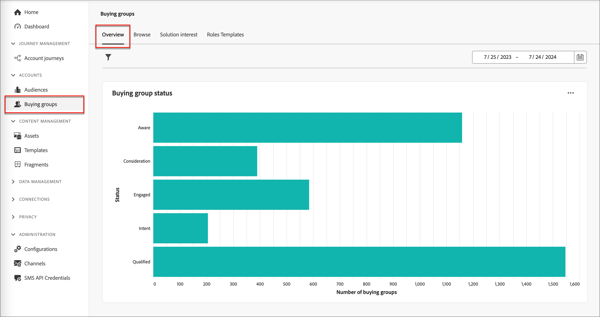
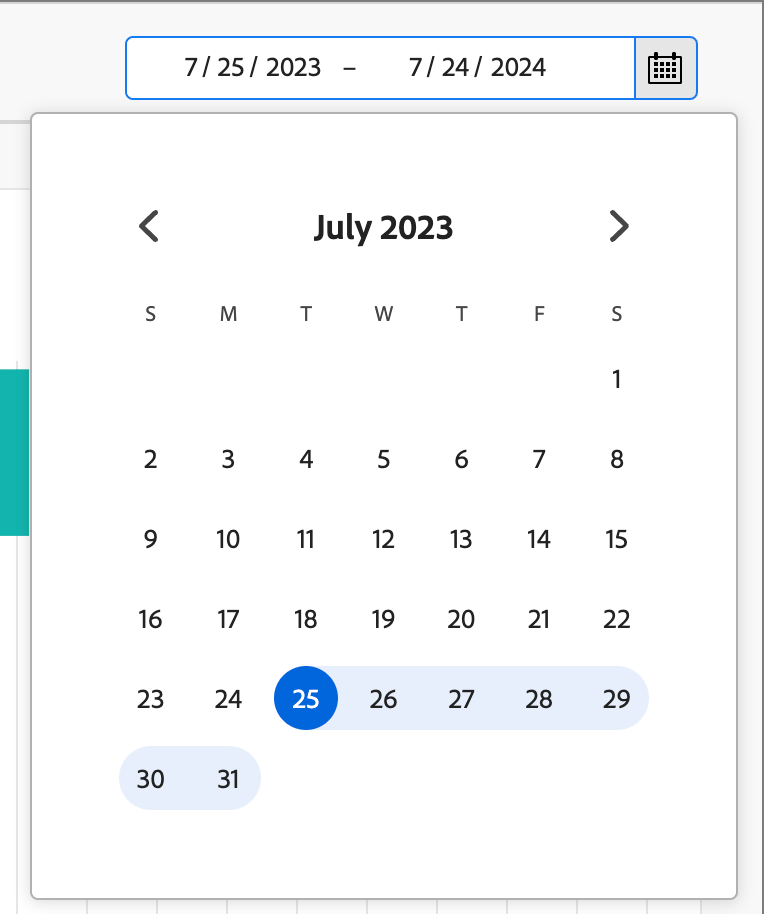
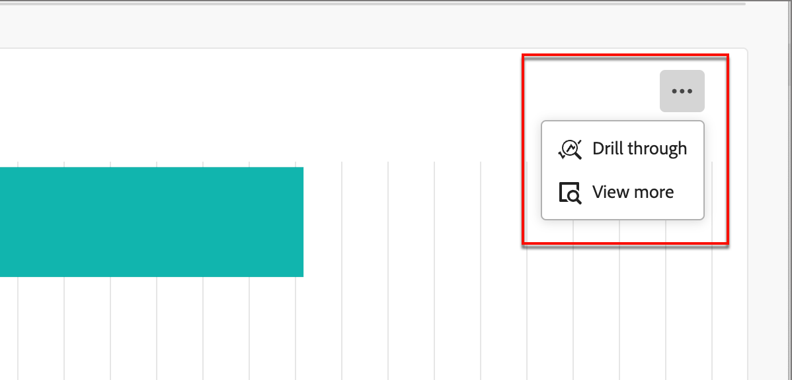
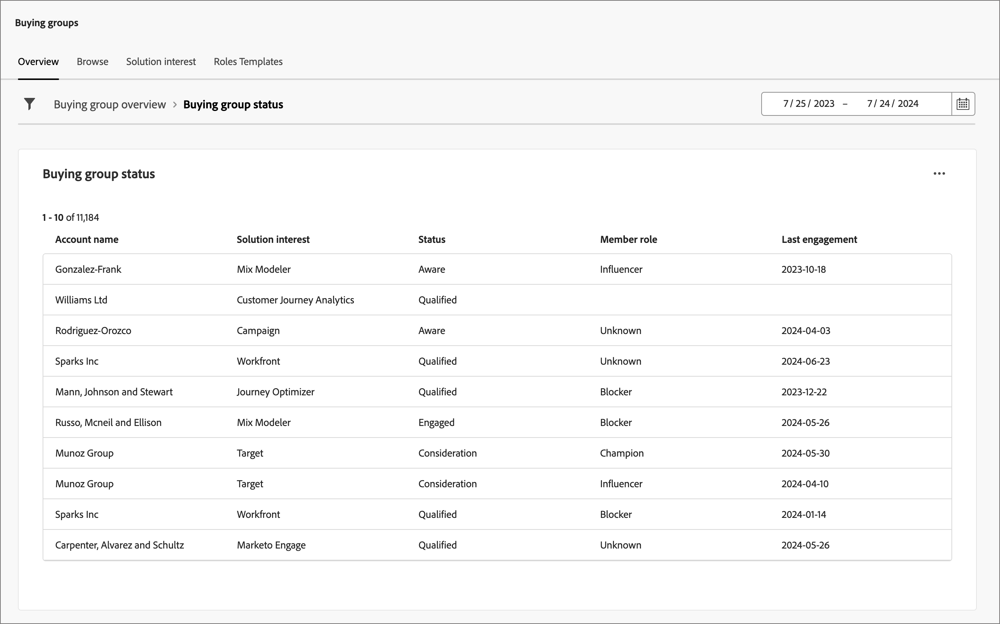
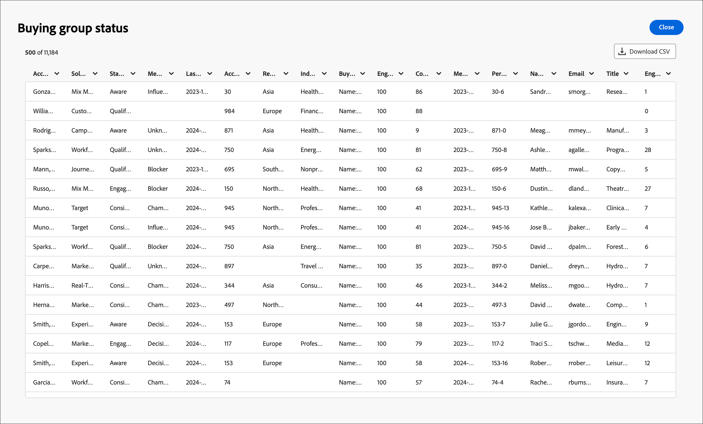

# 購買群組總覽儀表板

「採購群組概要」儀表板是針對B2B銷售移交程式而設計。 這可讓行銷團隊分享&#x200B;_已就緒_&#x200B;的購買群組及其成員，連同重要資料給銷售團隊執行。 此程式可確保從行銷到銷售的簡化轉換。

銷售移交包括：

* **資料移交**：行銷人員會識別&#x200B;_就緒_&#x200B;目標資料，並以CSV格式讓銷售人員能夠存取。 
* **銷售同意**：銷售人員手動檢閱並將&#x200B;_就緒_&#x200B;目標合併到他們的管道中。

## 購買群組狀態

透過「購買群組狀態」檢視，深入瞭解您購買群組的進度。 此視覺效果會展示購買群組在指定時間段內按其最近狀態更新分類的分佈情況。

{width="800" zoomable="yes"}

**[!UICONTROL 狀態]** （Y軸）：追蹤各個階段中的購買群組歷程。
**[!UICONTROL 購買群組數目]** （x軸）：量化每個狀態的購買群組數目，提供漏斗健康狀況和活動的明確量度。
<!-- To generate a shareable PDF of your current view, click **[!UICONTROL Export]** at the top-right corner of the page. -->

### 資料篩選

* **資料篩選器** — 使用&#x200B;_[!UICONTROL 日期篩選器]_，這會反映購買群組上次狀態變更日期。 開始日期可調。 結束日期預設為當天。

  {width="400"}

* **屬性篩選器** — 按一下左上方的&#x200B;_篩選器_&#x200B;圖示，使用下列任何屬性來篩選資料顯示：

   * 解決方案興趣
   * 狀態
   * 購買群組狀態
   * 帳戶區域
   * 帳戶產業
  <!-- * Account's Industry -->

  {width="500"}

## 與資料互動

若要與資料互動，請使用右上角的動作選單。

{width="400"}

### [!UICONTROL 鑽研]

選擇&#x200B;**[!UICONTROL 鑽研]**&#x200B;以深入分析個別群組狀態。

{width="600" zoomable="yes"}

套用至控制面板的全域篩選器會移轉過來，且無法從此頁面變更。

按一下右上方的動作功能表圖示，然後選擇&#x200B;**[!UICONTROL 檢視更多]**&#x200B;以[檢視擴充的資料和深入分析](#view-more)。

### [!UICONTROL 檢視更多]

選擇&#x200B;**[!UICONTROL 檢視更多]**&#x200B;以取得擴充資料和深入分析。 顯示的快顯視窗包括圖表和表格，顯示購買群組狀態的劃分：

* [!UICONTROL 帳戶識別碼]
* [!UICONTROL 帳戶名稱]
* [!UICONTROL 帳戶區域]
* [!UICONTROL 帳戶產業]
* [!UICONTROL 購買群組名稱]
* [!UICONTROL 方案興趣]
* [!UICONTROL 狀態]
* [!UICONTROL 參與分數]
* [!UICONTROL 完整度分數]
* [!UICONTROL 成員角色]
* [!UICONTROL 會員註冊/建立日期]
* [!UICONTROL 人員ID]
* [!UICONTROL 名稱]
* [!UICONTROL 電子郵件]
* [!UICONTROL 標題]
* [!UICONTROL 傳入參與活動數目]
* [!UICONTROL 上次參與日期]

{width="600" zoomable="yes"}

若要下載資料，請按一下右上角的&#x200B;**[!UICONTROL 下載CSV]**。
