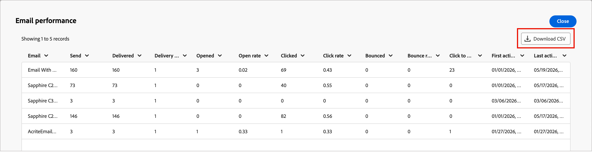

# 以電子郵件傳送效能報表

「**電子郵件效能**」報表可讓行銷人員在Adobe Journey Optimizer B2B edition中統一檢視所有歷程的電子郵件活動。 它會彙總傳送、傳遞、參與和選擇退出量度。 藉由呈現原始計數和計算的比率，您可以監視行銷活動健康情況、比較電子郵件效能，並快速識別傳遞能力或參與問題。 如需跨電子郵件和簡訊頻道的歷程層級量度，請參閱[帳戶歷程儀表板](./journeys-dashboard.md)。

## 存取報告

1. 在左側導覽中，選取&#x200B;**[!UICONTROL 儀表板]**。
1. 選取報告儀表板頂端的&#x200B;**[!UICONTROL 電子郵件效能]**&#x200B;標籤。

{width="800" zoomable="yes"}

## 篩選資料

按一下左上方的&#x200B;_篩選器_ （ ）圖示，使用兩種支援的篩選器型別來篩選資料顯示。 這些篩選器會同時套用至所有面板：

* **[!UICONTROL 歷程]** — 篩選報告以顯示一或多個所選歷程的資料。 使用此篩選條件來隔離對您的行銷活動或方案而言重要之歷程的效能。

* **日期範圍** — 限制在指定時間範圍內傳送之電子郵件的所有量度。 支援預設範圍和自訂日期選擇器。 日期範圍選擇器位於控制面板的右上角。

{width="500"}

當您在篩選器對話方塊中變更篩選器時，請按一下&#x200B;**[!UICONTROL 套用]**。

## 計數和比率量度圖表

電子郵件效能報表的頂端區段包含兩個並排長條圖，提供所選日期範圍和歷程中整體電子郵件程式健康狀況的視覺摘要。

**計數量度** — 顯示電子郵件活動的絕對數量。 每個長條代表篩選範圍中所有電子郵件的主要電子郵件事件總數：已傳送、已傳遞、已開啟、已點按、已退回及取消訂閱。

**費率量度** — 顯示計算的百分比費率，可讓您評估參與度和傳遞能力品質，而不受數量影響：傳遞率、開啟率、點按率、跳出率、點按開啟率和取消訂閱率。

將滑鼠指標暫留在圖表上以顯示數值資料。

{width="500"}

| 量度 | 類型 | 說明 |
|--------|------|-------------|
| 已傳送 | 計數 | 提交以進行傳遞的電子郵件訊息總數。 |
| 已傳遞 | 計數 | 收件者的郵件伺服器已成功接受電子郵件。 |
| 已開啟 | 計數 | 至少開啟一次的傳遞電子郵件數目。 |
| 已點按 | 計數 | 至少收到一個連結點選的電子郵件數。 |
| 已退回 | 計數 | 無法傳遞的電子郵件（硬或軟退回）。 |
| 取消訂閱 | 計數 | 透過電子郵件中的取消訂閱連結選擇退出的收件者。 |
| 傳遞率 | 比率 | 已傳遞÷已傳送。 表示到達收件匣的電子郵件百分比。 |
| 開啟率 | 比率 | 已開啟÷已傳遞。 測量收件者與主旨行的互動。 |
| 點按率 | 比率 | 已按下÷已傳送。 測量每封傳送的電子郵件的整體點按參與度。 |
| 退回率 | 比率 | 已傳送÷退信。 強調傳遞能力並列出健康問題。 |
| 點按開啟率(CTOR) | 比率 | 已開啟÷按一下。 衡量參與讀者中的內容和CTA成效。 |
| 取消訂閱率 | 比率 | 取消訂閱÷傳送。 代表關聯性和受眾契合。 |

## 電子郵件效能表

頁面底部有一個詳細表格，顯示篩選範圍中每個電子郵件資產的每封電子郵件量度。 預設情況下，表格每頁顯示10列。

**取消訂閱%**&#x200B;欄是優先的量度，可直接在表格檢視中監視選擇退出活動。

| 欄 | 說明 |
|--------|-------------|
| 電子郵件名稱 | [電子郵件資產](../content/add-email.md)的名稱，已在歷程中設定。 |
| 已傳送 | 所選日期範圍內此電子郵件的傳送總數。 |
| 已傳遞 | 成功傳送到收件者郵件伺服器的電子郵件數目。 |
| 傳遞% | 已傳遞÷已傳送，以百分比表示。 |
| 開啟次數 | 為此電子郵件記錄的未完成事件總數。 |
| 開啟% | 開啟÷已傳遞，以百分比表示。 |
| 點按次數 | 此電子郵件的連結點選事件總數。 |
| 按一下% | 已傳遞÷點按次數，以百分比表示。 |
| CTOR % | 點按至開啟率：點按÷開啟（以百分比表示）。 |
| 跳出 | 無法傳遞的電子郵件數量（硬+軟退信）。 |
| 退回% | 已傳送÷跳出數，以百分比表示。 |
| 取消訂閱% | 取消訂閱÷傳送。 用於監控選擇退出健康狀況的優先量度。 |
| 第一個活動 | 所選期間內此電子郵件第一個記錄的事件（傳送、開啟或點按）的時間戳記。 |
| 上次活動 | 所選期間內此電子郵件最近記錄之事件的時間戳記。 |

## 匯出報表資料

電子郵件效能報告支援資料匯出，以便在外部工具中進一步分析或與利害關係人分享結果。 您可以匯出與任何資料分析或BI工具相容的CSV格式表格資料。

>[!CAUTION]
>
>匯出會反映目前作用中的篩選器。 匯出之前，請確保已正確設定日期範圍和歷程篩選器，以避免輸出檔案中的資料不完整。

**_若要匯出報表資料:_**

1. 在右上角設定您的日期範圍，並視需要套用&#x200B;**[!UICONTROL 歷程]**&#x200B;篩選。
1. 按一下[電子郵件效能]面板右上角的&#x200B;**...**&#x200B;功能表圖示，然後選擇[檢視更多]]**。**[!UICONTROL 
1. 按一下功能表中的&#x200B;**[!UICONTROL 下載CSV]**。

   {width="700" zoomable="yes"}

   檔案會自動下載至瀏覽器的預設下載位置。

1. 按一下&#x200B;**[!UICONTROL 關閉]**&#x200B;以返回電子郵件效能報表。
