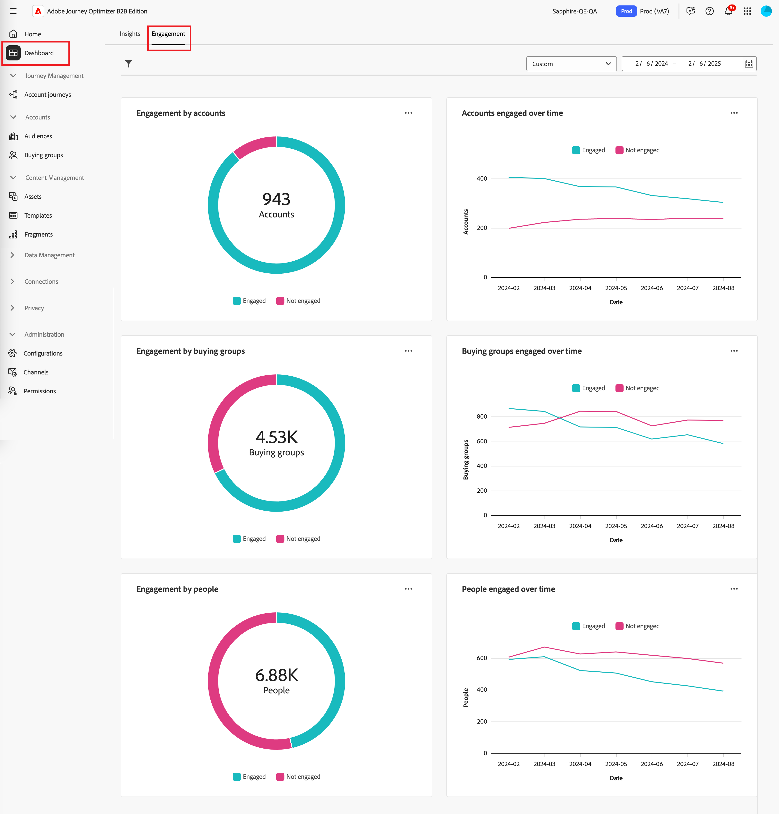
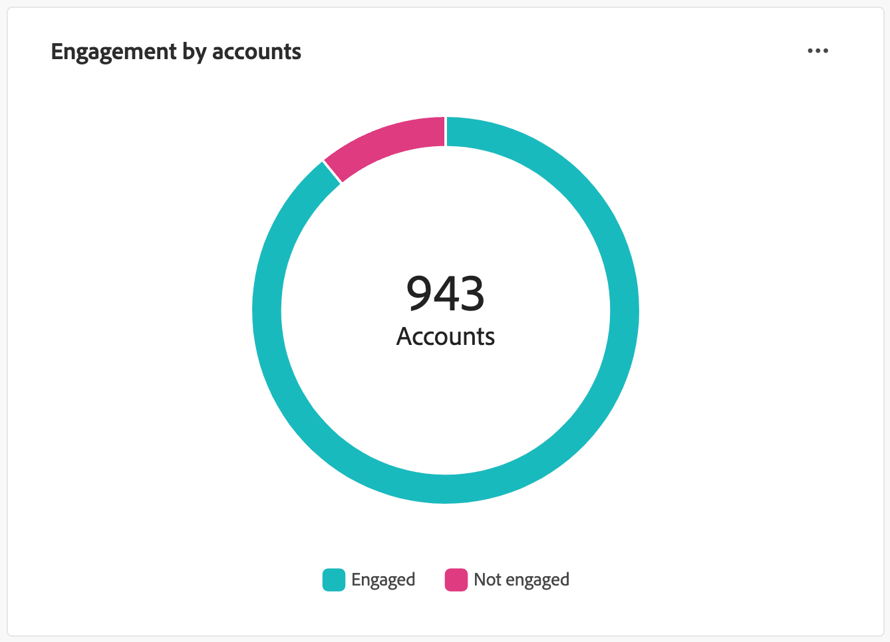
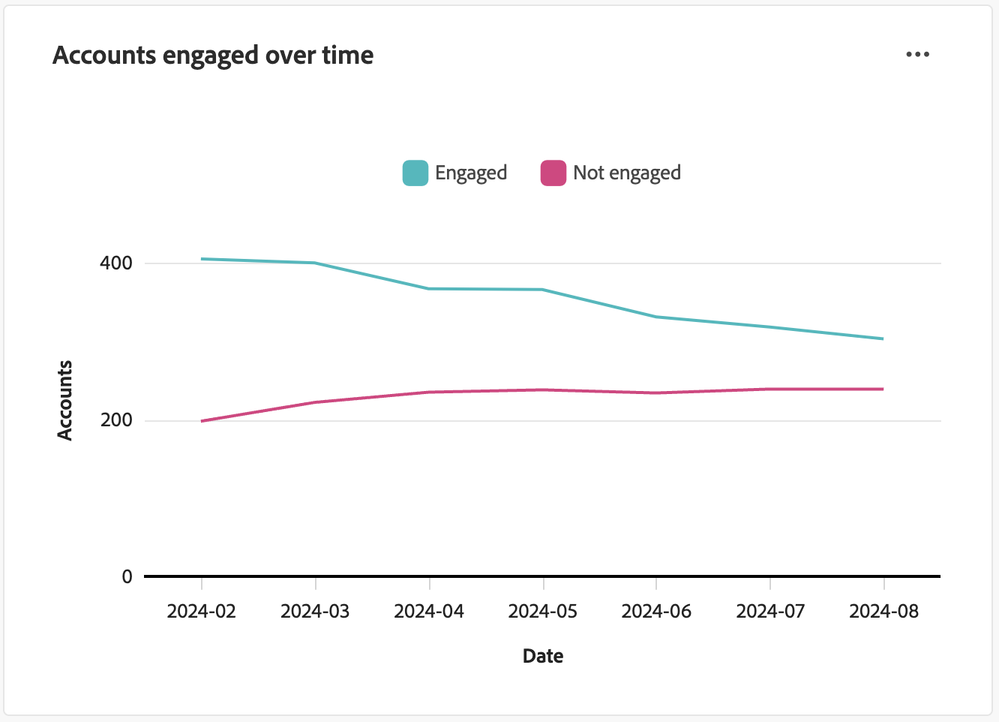
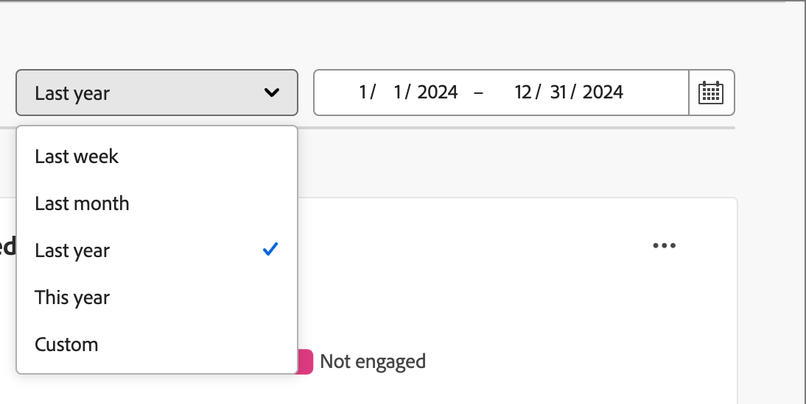
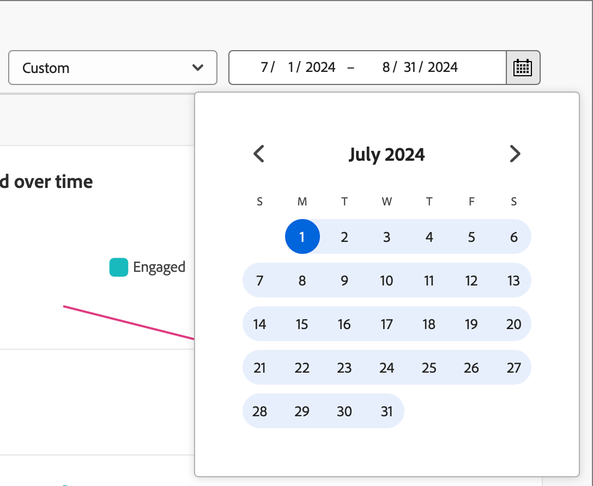
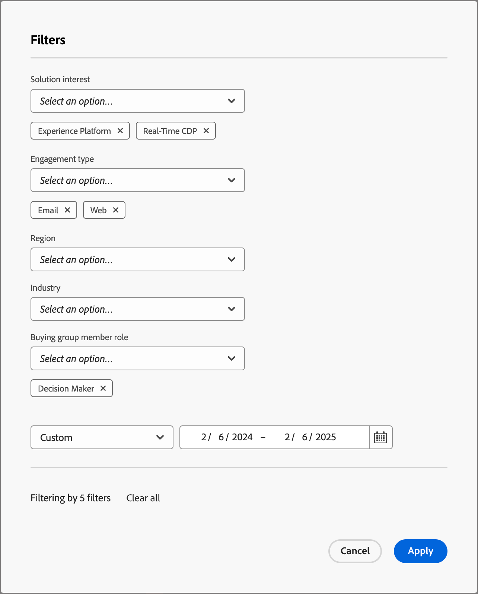
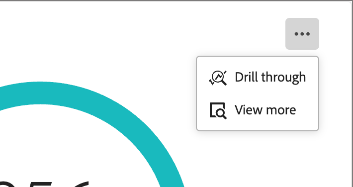
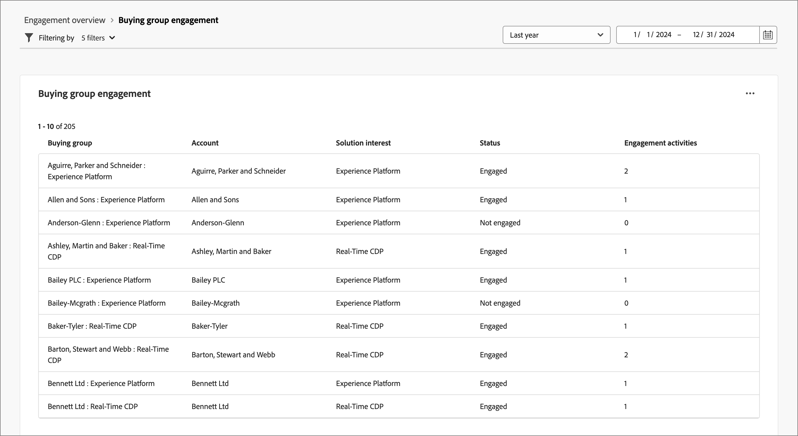
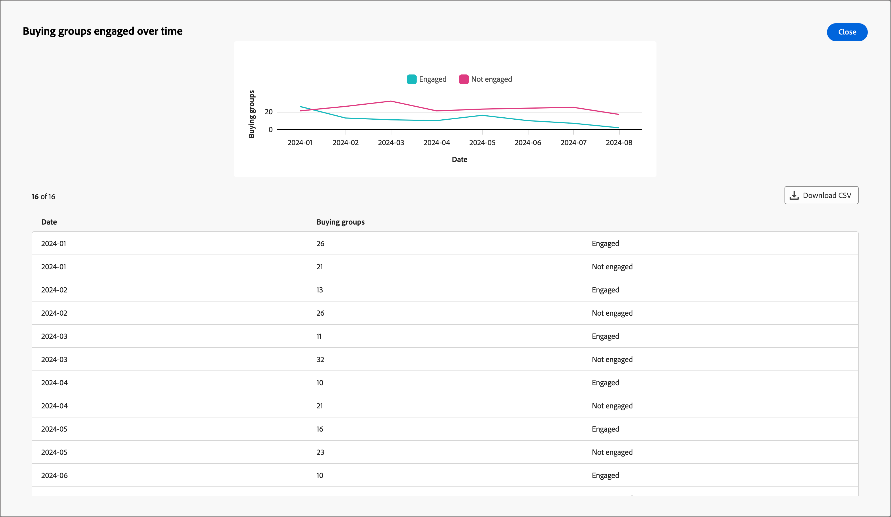

# 參與總覽儀表板

此儀表板透過快照環圈圖和趨勢顯示折線圖，提供參與度的完整檢視，並展示帳戶和個別互動隨時間變化的即時量度。 它可協助您有效監控和策略化參與工作。

若要存取&#x200B;_參與儀表板_，請在左側導覽中選取&#x200B;**[!UICONTROL 儀表板]**&#x200B;專案。 然後選取頁面頂端的&#x200B;**[!UICONTROL 參與]**&#x200B;索引標籤。

<!-- To generate a shareable PDF of your current view, click **[!UICONTROL Export]** at the top-right corner of the page. To engage with the data, use the action menu in the top-right corner. -->

{width="800" zoomable="yes"}

## 依帳戶/購買群組/人員的參與度

圓形圖將帳戶、購買群組或人員劃分為參與和未參與的類別。 中央圖顯示每個類別中的總計數，提供整體參與的一目瞭然瞭解。

{width="500"}

## 帳戶/購買群組/一段時間內的參與人員

這些折線圖顯示一段時間內帳戶或人員的參與層次。 透過與時間戳記水平軸一起視覺化的「已參與」和「未參與」的不同線條，您可以查明趨勢和模式。 您可以將滑鼠指標暫留在折線上，以顯示任何指定日期的精確量度。

{width="500"}

## 篩選資料

您可以依日期範圍和屬性篩選顯示的資料。

### 日期範圍篩選

使用右上角的&#x200B;_[!UICONTROL 日期範圍篩選器]_，根據日期範圍篩選資料。

{width="380"}

對於&#x200B;**[!UICONTROL 自訂]**&#x200B;範圍，您可以使用行事曆工具來指定開始和結束日期。 結束日期預設為當天。

{width="380"}

### 屬性篩選

按一下左上方的&#x200B;_篩選器_ （ ）圖示，使用下列任一屬性來篩選顯示的資料：

* 解決方案興趣
* 參與類型
* 區域
* 行業
* 購買群組成員角色

{width="500"}

請針對您想要用來篩選資料的每個屬性選取多個值，然後按一下[套用]。**&#x200B;**

## 與資料互動

若要與資料互動，請使用每個圖表右上角的&#x200B;**...**&#x200B;功能表。

{width="300"}

### 鑽研

對於圓形圖，請選擇&#x200B;**[!UICONTROL 鑽研]**&#x200B;以深入分析個別群組參與資料。

套用至控制面板的全域篩選器（資料範圍和屬性）會移轉過來。 按一下左上方的&#x200B;_篩選器_ （）圖示至[變更鑽研檢視的屬性篩選器](#filter-the-data)。 使用右上角的日期範圍選擇器來[變更鑽研檢視的日期範圍](#date-range-filter)。

{width="700" zoomable="yes"}

| 依帳戶劃分的參與 | 依購買群組劃分的參與 | 依人員劃分的參與 |
| ---------------------- | --------------------------- | -------------------- |
| <li>帳戶名稱 <li>狀態 <li>參與人數（數字）<li>參與活動（數量） <li>上次參與（日期） | <li>購買群組 <li>帳戶 <li>解決方案興趣 <li>狀態 <li>參與活動（數量） | <li>名稱 <li>狀態 <li>電子郵件（地址） <li>參與活動（數量） <li>上次參與（日期） |

您可以按一下右上角的&#x200B;**...**&#x200B;功能表圖示，然後選擇&#x200B;**[!UICONTROL 檢視更多]**&#x200B;以[檢視擴充資料和深入分析](#view-more)。

### 檢視更多

選擇&#x200B;**[!UICONTROL 檢視更多]**&#x200B;以取得擴充資料和深入分析。

{width="700" zoomable="yes"}

根據圖表，會有下列專案的延伸資料：

| 依帳戶/購買群組/人員的參與度 | 帳戶/購買群組/一段時間內的參與人員 |
| ----------------------------------------------- | -------------------------------------------------- | 
| <li>已參與 <li>未參與 | <li>日期 <li>帳戶/購買群組/人員（數字） <li>已參與/未參與 |

若要複製延伸資料，請按一下右上方的&#x200B;**[!UICONTROL 下載CSV]**。
