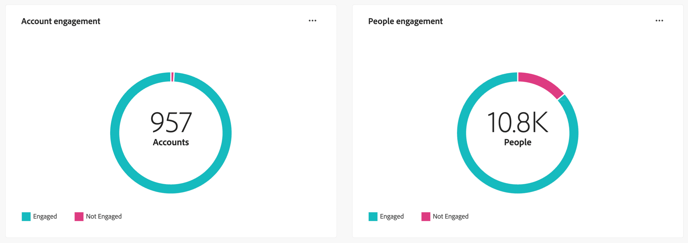
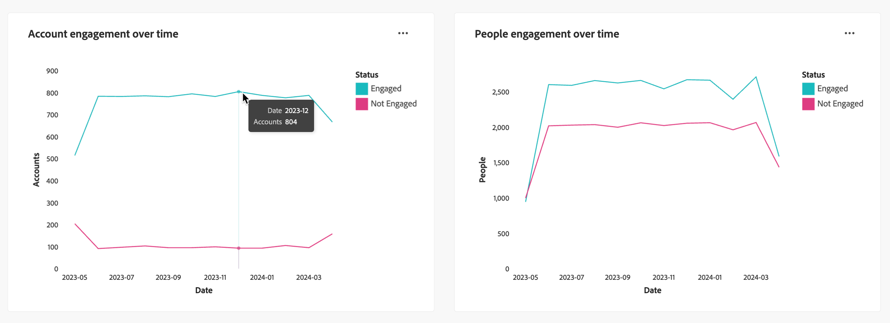

# 參與總覽儀表板

此儀表板透過快照環圈圖和趨勢顯示折線圖，提供參與度的完整檢視，並展示帳戶和個別互動隨時間變化的即時量度。 它可協助您有效監控和策略化參與工作。

<!-- To generate a shareable PDF of your current view, click **[!UICONTROL Export]** at the top-right corner of the page. To engage with the data, use the action menu in the top-right corner. -->

## 依帳戶的參與度/依人員的參與度

環形圖可清楚地將帳戶或人員劃分為參與和未參與的類別。 中央圖表示每個類別中的總計數，提供整體參與的一目瞭然瞭解。

{width="700" zoomable="yes"}

## 一段時間內參與的帳戶/一段時間內參與的人員

這些折線圖顯示一段時間內帳戶或人員的參與層次。 透過與時間戳記水平軸一起視覺化的「已參與」和「未參與」的不同線條，您可以查明趨勢和模式。 您可以將滑鼠指標暫留在折線上，以顯示任何指定日期的精確量度。

{width="700" zoomable="yes"}

## 增強的互動

使用每個圖表右上角的動作圖示( **...** )進一步與資料互動。

{width="300"}

### 檢視更多資訊

**[!UICONTROL 檢視更多]**：針對所有儀表板檢視，會出現快顯視窗，其中顯示圖表和表格，依帳戶/人員劃分參與專案。

若要複製延伸資料，請按一下右上方的&#x200B;**[!UICONTROL 下載CSV]**。

### 鑽研

選擇&#x200B;**[!UICONTROL 鑽研]**&#x200B;以深入分析個別群組狀態。

套用至控制面板的全域篩選器會移轉到此頁面。

選擇&#x200B;**[!UICONTROL 檢視更多]**&#x200B;以取得擴充資料和深入分析。 根據圖表，會有下列專案的延伸資料：

* [!UICONTROL 帳戶]
* [!UICONTROL 人員]
* [!UICONTROL 日期]
* [!UICONTROL 狀態]
* [!UICONTROL 已參與]
* [!UICONTROL 未參與]
<!-- 
* [!UICONTROL Engagement activities]
* [!UICONTROL Last engagement date]
* [!UICONTROL Region]
* [!UICONTROL Industry]
* [!UICONTROL People]
* [!UICONTROL Name]
* [!UICONTROL Person ID]
* [!UICONTROL Status]
* [!UICONTROL Email]
--->

### 資料篩選

* **資料篩選** — 使用&#x200B;_[!UICONTROL 日期篩選]_，以反映上次參與日期。 開始日期可調。 結束日期預設為當天。

* **屬性篩選器** — 按一下左上方的&#x200B;_篩選器_&#x200B;圖示，使用下列任何屬性來篩選資料顯示：

   * 解決方案興趣
   * 參與類型
   * 區域
   * 產業
  <!-- * Account's Industry -->
