# 智慧型儀表板

智慧型儀表板提供購買群組和帳戶量度的全方位檢視，協助您更有效地監控和制定行銷策略。

若要存取&#x200B;_智慧型儀表板_，請在左側導覽中選取&#x200B;**[!UICONTROL 儀表板]**&#x200B;專案。

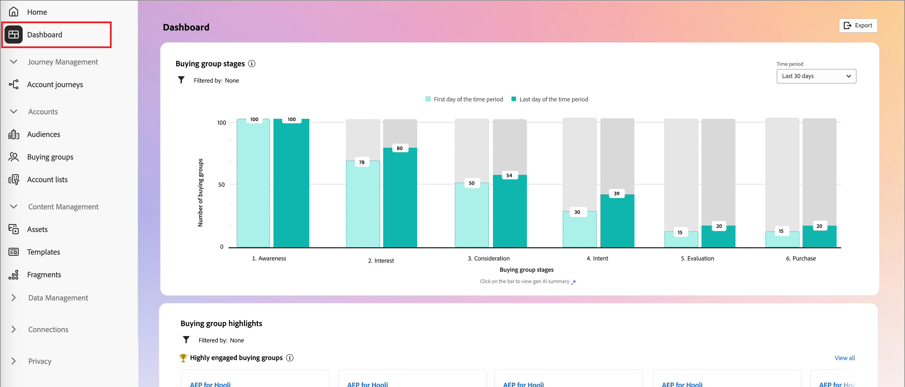{width="800" zoomable="yes"}

智慧型儀表板也提供對帳戶和購買群組詳細資訊頁面的存取權，其中包含兩種型別的創作AI功能：

* 帳戶與購買群組的摘要
* 個人、購買群組和帳戶的意圖偵測

{{intent-data-note}}

## 購買群組階段 {#buying-group-stages}

>[!CONTEXTUALHELP]
>id="ajo-b2b_intelligent_dashboard_buying_group_stages"
>title="購買群組階段"
>abstract="此圖表會根據設定的轉換規則，提供購買群組在各個不同階段的進度概觀。第一列顯示在選定時間段的第一天處於特定階段的購買群組數量，並與選定時間段最後一天的購買群組數量進行比較。"

_[!UICONTROL 購買群組階段]_&#x200B;圖表提供跨不同階段的購買群組進度概觀（[根據管理員設定的轉換規則](../buying-groups/buying-group-stages.md)）。

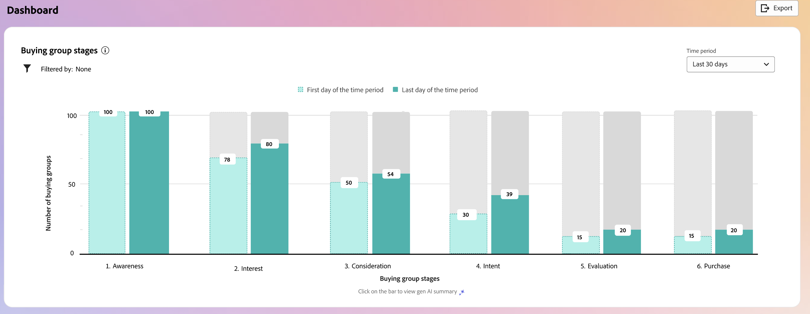{width="800" zoomable="yes"}

此圖表使用最近發佈的購買群組階段模型中的購買群組階段。 每個舞台都由兩個橫條所反映。 第一個長條表示在所選時間範圍的第一天購買群組的數量。 第二個（比較）是時間範圍最後日期的購買群組數量。 您可以將滑鼠停留在每個條上，檢視每個階段中的購買群組數量。

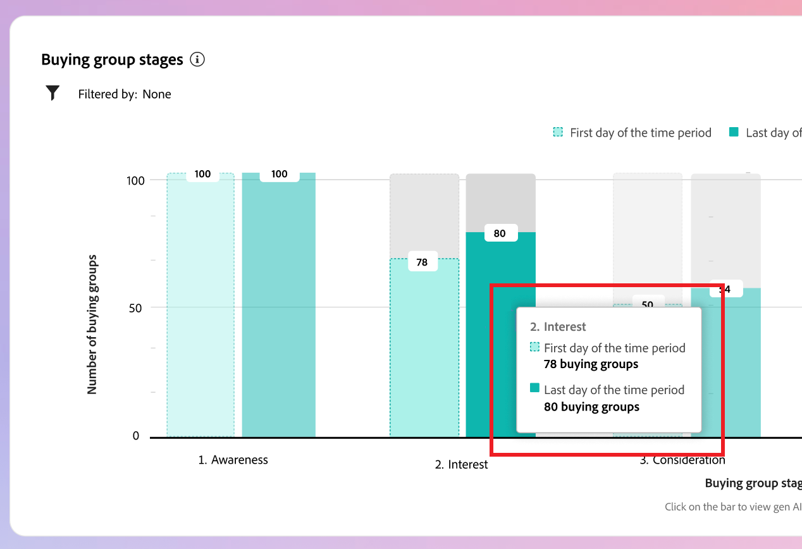{width="400"}

### Generative AI摘要

按一下長條圖以顯示所選時段內該階段中購買群組的產生AI摘要。

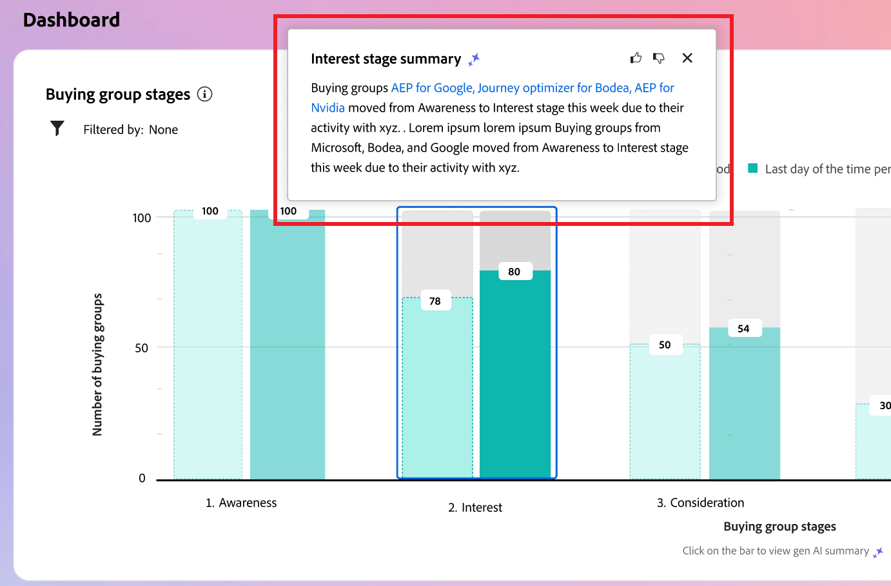{width="500"}

產生的摘要會根據設定的轉換規則，提供不同階段中購買群組進展的概觀。

### 時段 {#time-period-stages}

使用右上角的日期篩選器來變更資料視覺效果的日期範圍。 按一下向下鍵以設定相對日期範圍，或按一下設定自訂開始和結束日期。

<!-- 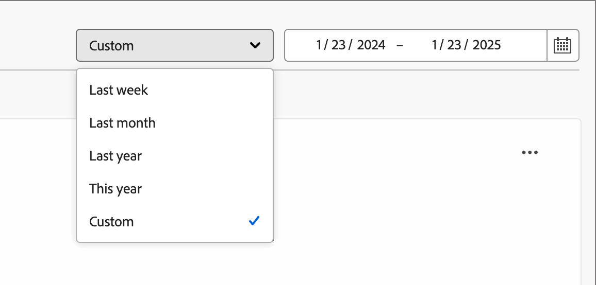{width="300"} -->

### 屬性篩選 {#attribute-filter-stages}

按一下左上方的&#x200B;_篩選器_ （ ）圖示，使用下列任一屬性來篩選資料顯示：

* 解決方案興趣
* 帳戶
* 階段名稱

<!-- Add screen when the UI is available 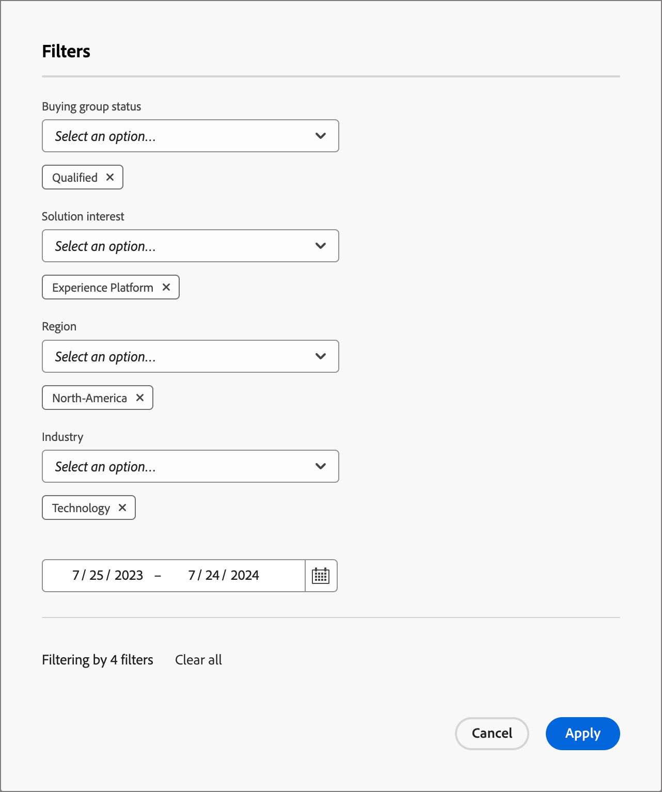{width="500"} -->

## 購買群組重點 {#buying-group-highlights}

>[!CONTEXTUALHELP]
>id="ajo-b2b_intelligent_dashboard_buying_group_highlights_engagement"
>title="按參與度排名前 5 名的購買群組"
>abstract="根據標準化參與度得分，參與度最高的購買群組。"

>[!CONTEXTUALHELP]
>id="ajo-b2b_intelligent_dashboard_buying_group_highlights_velocity"
>title="速度排名前 5 名的購買群組"
>abstract="按各階段進展速度排名的購買群組。"

>[!CONTEXTUALHELP]
>id="ajo-b2b_intelligent_dashboard_buying_group_highlights_stagnant"
>title="排名前 5 名的停滯購買群組"
>abstract="即便具有高完整性得分，但並未在各個階段取得進展的停滯購買群組。"

「_[!UICONTROL 購買群組焦點]_」區段會分成三列，以顯示貴組織感興趣之購買群組的相關資訊。

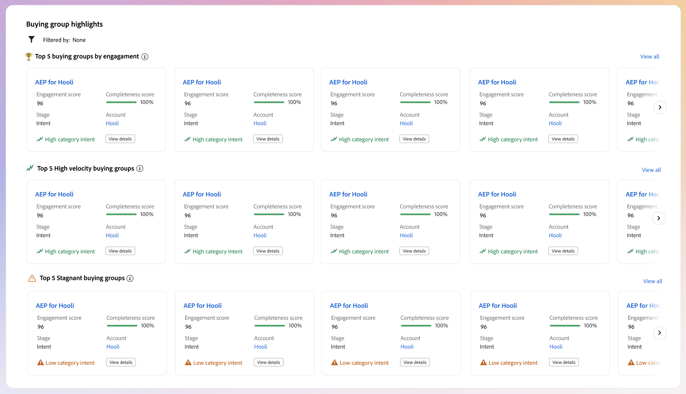{width="800" zoomable="yes"}

* **依參與度排名前5的購買群組** — 此列會根據其標準化參與分數，顯示參與度最高的購買群組。
* **前5名高速購買群組** — 此資料列會依據購買群組各階段的進度，顯示排名最前的購買群組。
* **前5名停滯購買群組** — 此列顯示即使完整度分數很高，仍未通過階段的最停滯購買群組。

每張卡片都包含下列資料：

* **_購買群組名稱_**。 按一下名稱以開啟購買群組詳細資訊頁面。
* **_帳戶名稱_**。 按一下名稱以開啟帳戶詳細資訊頁面（超連結至帳戶詳細資訊頁面）。
* 購買群組的&#x200B;**_目前階段_**。
* **_參與分數_** （在所有購買群組中標準化）。 如果所有購買群組都有相同的最高分數，這會顯示上次更新的分數。
* **_完整度分數_** （範圍從1到100）。 如果所有購買群組都有相同的最高分數，這會顯示上次更新的分數。
* **_類別目的_**。 按一下&#x200B;_[!UICONTROL 檢視詳細資料]_&#x200B;以檢視意圖資料：

  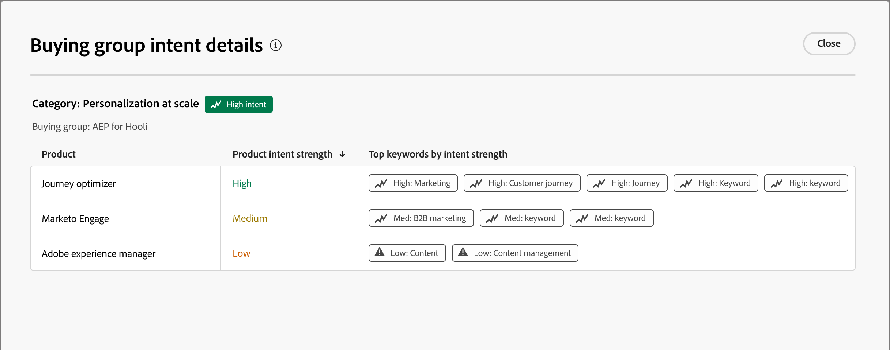{width="500" zoomable="yes"}

   * 詳細資訊快顯視窗會顯示類別名稱，其意圖層級位於頂端。
   * 每一列的資料會以欄的形式組織：產品名稱、產品意圖強度，以及依意圖強度排名的前幾個關鍵字。
   * 類別、產品和關鍵字的排序順序為高到低。 如果每種型別的一或多個具有相同的意圖強度，則排序會使用字母順序。

在&#x200B;_購買群組醒目提示_&#x200B;面板的右上角，按一下&#x200B;**[!UICONTROL 全部檢視]**&#x200B;以瀏覽購買群組清單頁面。

### 屬性篩選 {#attribute-filter-bg-highlights}

按一下左上方的&#x200B;_篩選器_ （ ）圖示，使用下列任一屬性來篩選資料顯示：

* 解決方案興趣
* 購買群組
* 帳戶

<!-- Add screen when the UI is available {width="500"} -->

### 時段 {#time-period-bg-highlights}

使用右上角的日期篩選器來變更資料視覺效果的日期範圍。 按一下向下鍵以設定相對日期範圍，或按一下設定自訂開始和結束日期。

<!-- {width="300"} -->

## 帳戶激增 {#account-surge}

>[!CONTEXTUALHELP]
>id="ajo-b2b_intelligent_dashboard_account_surge"
>title="帳戶激增"
>abstract="在選定時間段內，參與度動量發生顯著變化的帳戶。"

「_[!UICONTROL 飆升帳戶]_」區段會顯示所選時間範圍內參與動量發生重大變更的帳戶的視覺效果。

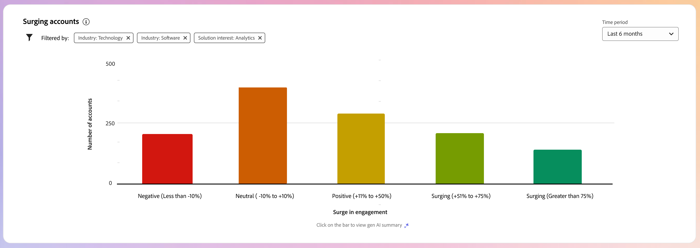{width="800" zoomable="yes"}

將滑鼠停留在每個長條上，即可檢視每個類別中的帳戶數。

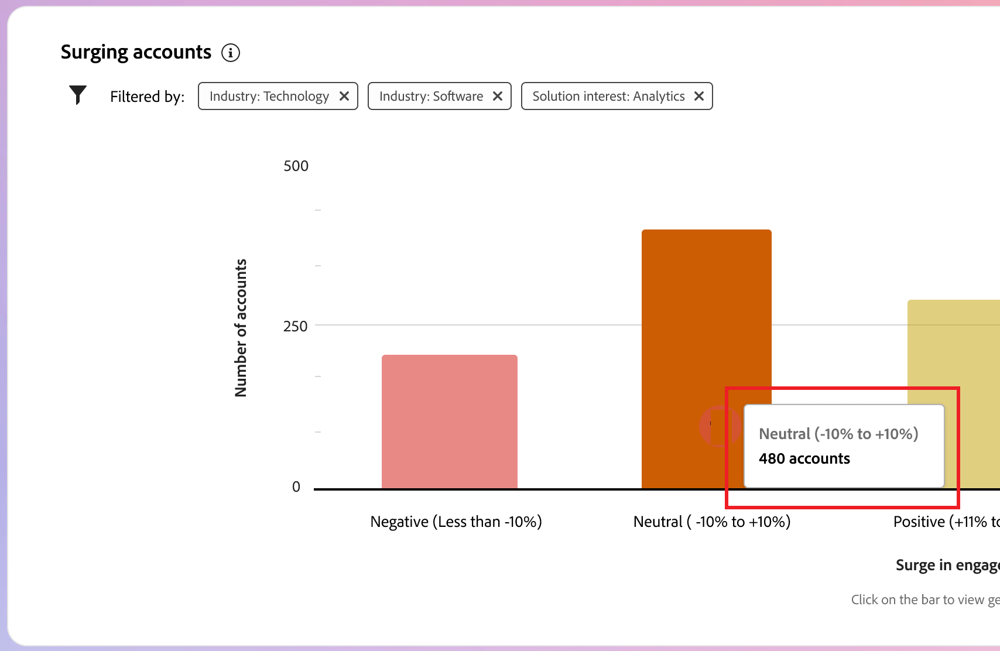{width="400"}

按一下長條圖以顯示所選時間範圍內類別中帳戶的產生AI摘要。

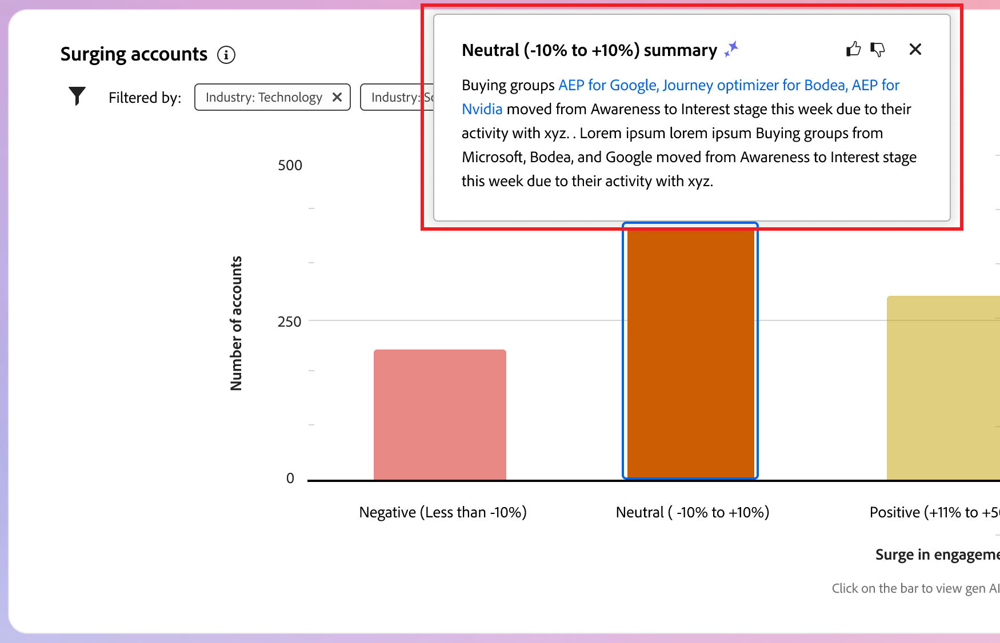{width="500"}

### 屬性篩選 {#attribute-filter-acct-surge}

按一下左上方的&#x200B;_篩選器_ （ ）圖示，使用下列任一屬性來篩選資料顯示：

* 解決方案興趣
* 行業
* 區域

<!-- Add screen when the UI is available {width="500"} -->

### 時段 {#time-period-acct-surge}

使用右上角的日期篩選器來變更資料視覺效果的日期範圍。 按一下向下鍵以設定相對日期範圍，或按一下設定自訂開始和結束日期。

<!-- {width="300"} -->

## 帳戶重點 {#account-highlights}

>[!CONTEXTUALHELP]
>id="ajo-b2b_intelligent_dashboard_account_highlights_surging"
>title="帳戶激增"
>abstract="在選定時間段內，參與度動量顯著增加的帳戶 "

>[!CONTEXTUALHELP]
>id="ajo-b2b_intelligent_dashboard_account_highlights_at_risk"
>title="有風險的帳戶"
>abstract="在選定時間段內，參與度動量顯著減少的帳戶。"

「_[!UICONTROL 購買群組焦點]_」區段會分成兩列，以顯示貴組織感興趣之帳戶的資訊。

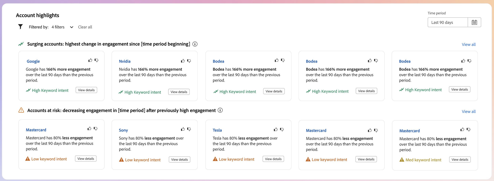{width="800" zoomable="yes"}

* **正在飆升的帳戶** — 此列顯示了在所選時間範圍內參與動量大幅增加的帳戶。
* **有風險的帳戶** — 此資料列顯示了在所選時間範圍內參與動量大幅減少的帳戶。

每張卡片都包含下列資料：

* **_帳戶名稱_**。 按一下名稱以開啟帳戶詳細資訊頁面。
* **_帳戶的產生AI摘要_**。
* **_關鍵字意圖_**。 按一下&#x200B;_[!UICONTROL 檢視詳細資料]_&#x200B;以檢視意圖資料：

  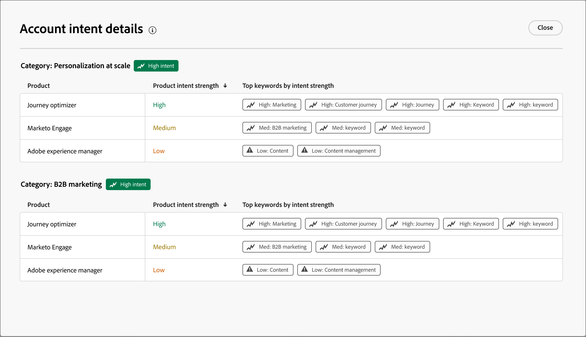{width="500" zoomable="yes"}

   * 詳細資訊快顯視窗會顯示類別名稱，其意圖層級位於頂端。
   * 每一列的資料會以欄的形式組織：產品名稱、產品意圖強度，以及依意圖強度排名的前幾個關鍵字。
   * 類別、產品和關鍵字的排序順序為高到低。 如果每種型別的一或多個具有相同的意圖強度，則排序會使用字母順序。
<!-- 
At the top right of the _Buying group highlights_ panel, click **[!UICONTROL View All]** to navigate to the Buying groups list page. -->

### 屬性篩選 {#attribute-filter-acct-highlights}

按一下左上方的&#x200B;_篩選器_ （ ）圖示，使用下列任一屬性來篩選資料顯示：

* 解決方案興趣
* 購買群組

<!-- Add screen when the UI is available {width="500"} -->

### 時段 {#time-period-acct-highlights}

使用右上角的日期篩選器來變更資料視覺效果的日期範圍。 按一下向下鍵以設定相對日期範圍，或按一下設定自訂開始和結束日期。

<!-- {width="300"} -->

## 聯絡人涵蓋範圍 {#contact-coverage}

>[!CONTEXTUALHELP]
>id="ajo-b2b_intelligent_dashboard_contact_coverage"
>title="聯絡人涵蓋範圍"
>abstract="顯示具有與解決方案興趣相關之特定角色的聯絡人數量。角色和解決方案興趣是根據購買群組範本進行指派。"

_[!UICONTROL 連絡人涵蓋範圍]_&#x200B;區段會顯示與解決方案相關的特定角色的連絡人數量視覺效果。 角色和解決方案興趣是根據購買群組範本進行指派。

{width="800" zoomable="yes"}

將滑鼠停留在每個儲存格上，即可檢視角色/解決方案興趣中的聯絡人數量。

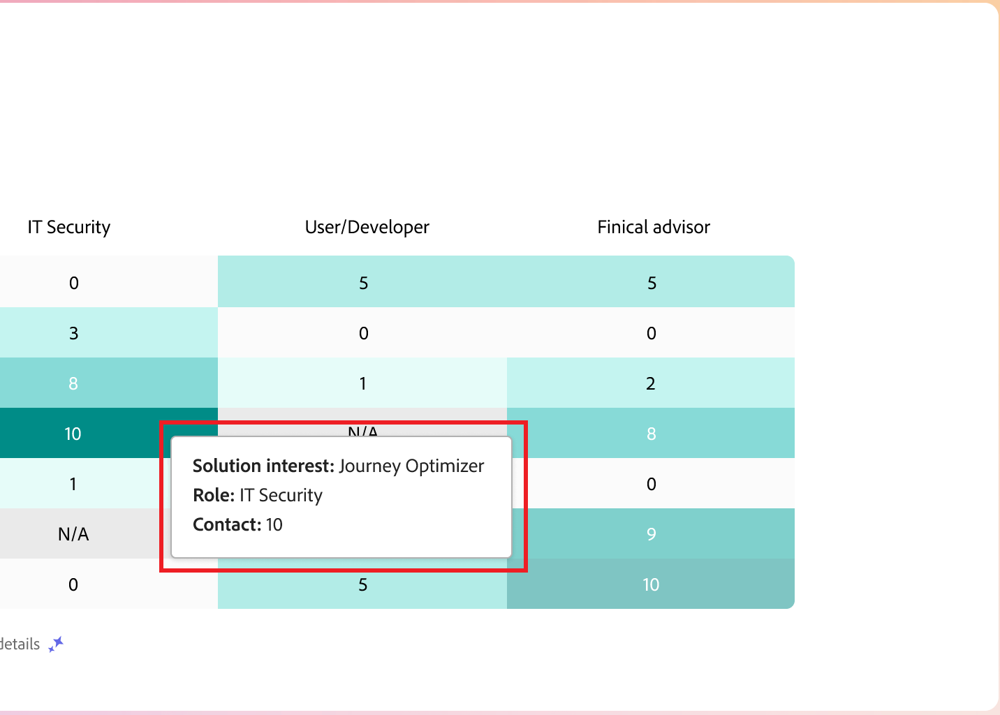{width="400"}

按一下儲存格，即可檢視角色/解決方案相關連絡人的詳細資訊。

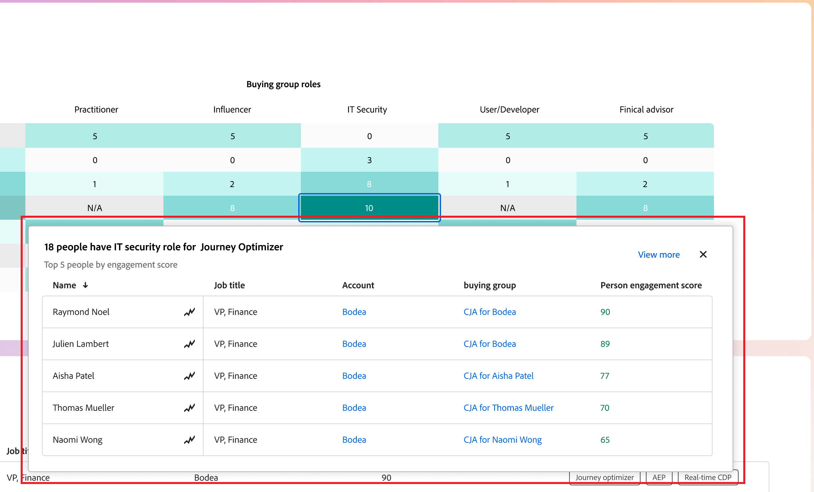{width="700" zoomable="yes"}

### 屬性篩選 {#attribute-filter-contact-coverage}

按一下左上方的&#x200B;_篩選器_ （ ）圖示，使用下列任一屬性來篩選資料顯示：

* 解決方案興趣
* 帳戶

<!-- Add screen when the UI is available {width="500"} -->

## 聯絡人重疊 {#contact-overlap}

>[!CONTEXTUALHELP]
>id="ajo-b2b_intelligent_dashboard_contact_overlap"
>title="聯絡人重疊"
>abstract="因與多個解決方案興趣相關，而隸屬於多個購買群組的聯絡人清單。"

_[!UICONTROL 連絡人重疊]_&#x200B;區段會顯示連絡人清單，這些連絡人屬於多個購買群組，因為與多個解決方案興趣有關聯。

{width="800" zoomable="yes"}

按一下&#x200B;_資訊_ （ ）以顯示包含下列詳細資訊的表格：

* 購買群組名稱（按一下名稱以開啟購買群組詳細資訊頁面）
* 角色
* 解決方案興趣
* 產品目的
* 產品

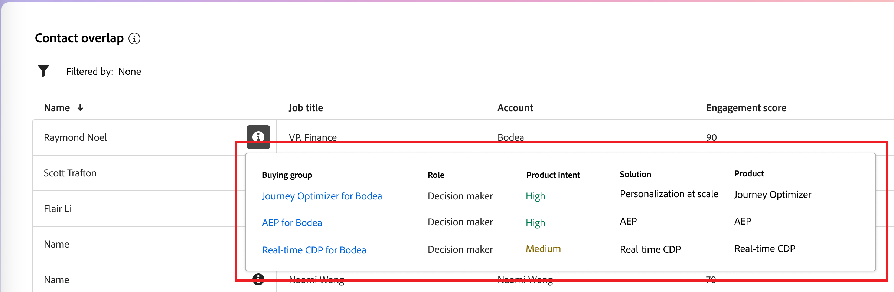{width="600" zoomable="yes"}

### 屬性篩選 {#attribute-filter-contact-overage}

按一下左上方的&#x200B;_篩選器_ （ ）圖示，使用下列任一屬性來篩選資料顯示：

* 解決方案興趣
* 角色
* 帳戶

<!-- Add screen when the UI is available {width="500"} -->
