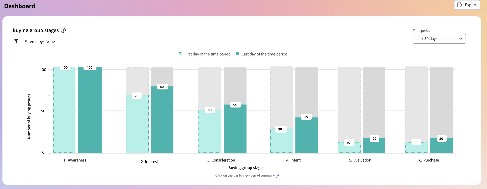
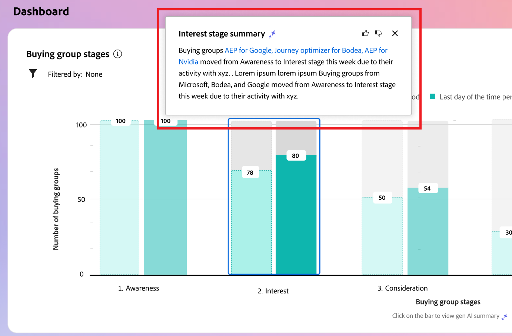
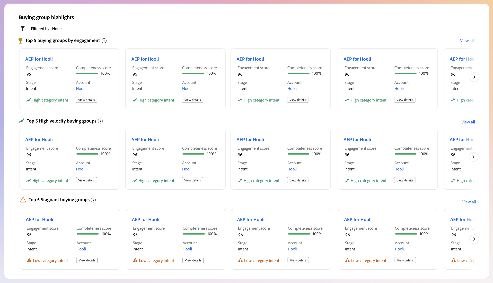
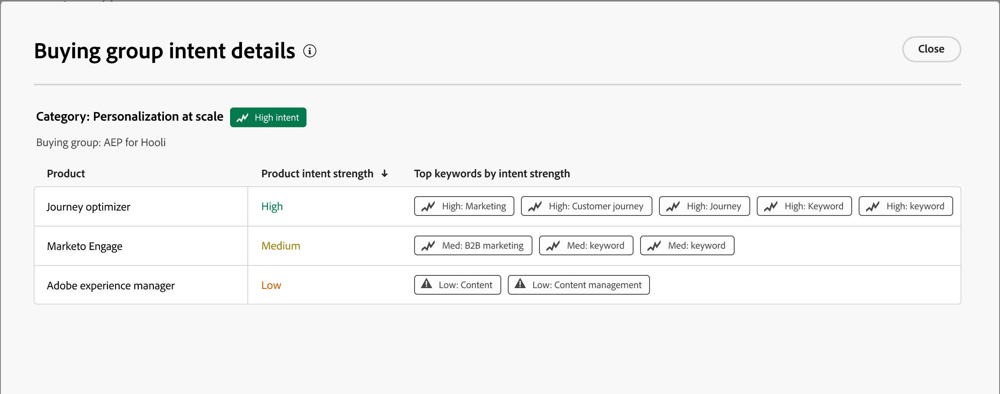
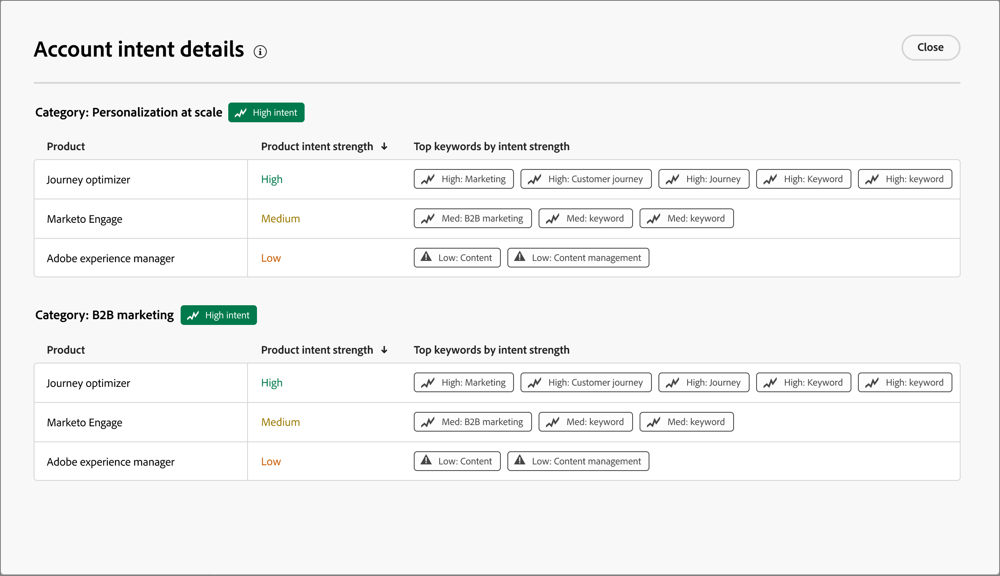
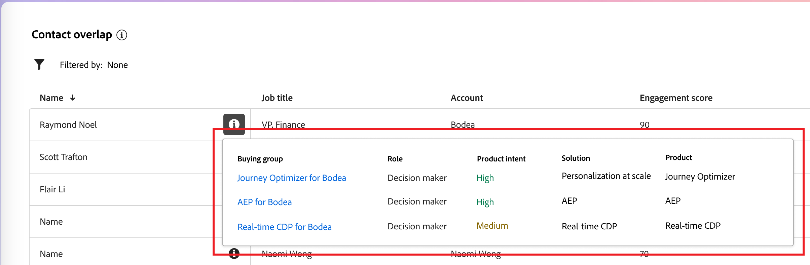

# 智慧儀表板

智慧型儀表板提供購買群組和帳戶量度的全方位檢視，協助您更有效地監控和制定行銷策略。

若要存取&#x200B;_智慧型儀表板_，請在左側導覽中選取&#x200B;**[!UICONTROL 儀表板]**&#x200B;專案。

{width="800" zoomable="yes"}

智慧型儀表板也提供對帳戶和購買群組詳細資訊頁面的存取權，其中包含兩種型別的創作AI功能：

* 帳戶與購買群組的摘要
* 個人、購買群組和帳戶的意圖偵測

{{intent-data-note}}

若要利用Intelligent Dashboard提供的資訊和深入分析，您的Journey Optimizer B2B edition執行個體必須具備必要的專案：

| 類型 | 需求 |
| ---- | ----------- |
| [購買群組階段](#buying-group-stages) | 設定購買群組階段&#x200B;**和**&#x200B;新增至已建立的購買群組。 |
| [購買群組焦點](#buying-group-highlights) | 設定購買群組階段&#x200B;**和**&#x200B;新增至已建立的購買群組。 |
| [帳戶突波](#surging-accounts) | 一或多個已發佈的歷程&#x200B;**或**&#x200B;已建立購買群組。 |
| [帳戶重點](#account-highlights) | 一或多個已發佈的歷程&#x200B;**或**&#x200B;已建立購買群組。 |
| [連絡人涵蓋範圍](#contact-coverage) | 一或多個已建立的購買群組（不需要階段）。 |
| [連絡人重疊](#contact-overlap) | 一或多個已建立的購買群組（不需要階段）。 |
| [帳戶詳細資料頁面](../accounts/account-details.md) | 一或多個已發佈的歷程。 |
| [購買群組詳細資料頁面](../buying-groups/buying-group-details.md) | 一或多個已建立的購買群組（不需要階段）。 |

## 購買群組階段 {#buying-group-stages}

>[!CONTEXTUALHELP]
>id="ajo-b2b_intelligent_dashboard_buying_group_stages"
>title="購買群組階段"
>abstract="此圖表會根據設定的轉換規則，提供購買群組在各個不同階段的進度概觀。 第一列顯示在所選時間段的第一天處於特定階段的購買群組數量，並與所選時間段最後一天的購買群組數量進行比較。"

_[!UICONTROL 購買群組階段]_&#x200B;圖表提供跨不同階段的購買群組進度概觀（[根據管理員設定的轉換規則](../buying-groups/buying-group-stages.md)）。

>[!NOTE]
>
>購買群組階段的可用性需要購買群組階段的設定。 請參閱[購買群組階段](../buying-groups/buying-group-stages.md)，以取得有關階段，以及如何定義及啟用購買群組的階段的詳細資訊。

{width="800" zoomable="yes"}

此圖表使用最近發佈的購買群組階段模型中的購買群組階段。 每個階段有兩個長條。 第一個長條表示在所選時間範圍的第一天購買群組的數量。 第二個（比較）是時間範圍最後日期的購買群組數量。 您可以將滑鼠停留在每個條上，檢視每個階段中的購買群組數量。

{width="400"}

### Generative AI摘要

按一下長條圖以顯示所選時段內該階段中購買群組的產生AI摘要。

{width="500"}

產生的摘要會根據設定的轉換規則，提供不同階段中購買群組進展的概觀。

### 時段 {#time-period-stages}

使用右上角的日期篩選器來變更資料視覺效果的日期範圍。 按一下向下箭頭，以設定相對日期範圍，或設定自訂開始和結束日期。

<!-- {width="300"} -->

### 屬性篩選 {#attribute-filter-stages}

按一下左上方的&#x200B;_篩選器_ （ ）圖示，使用下列任一屬性來篩選資料顯示：

* 解決方案興趣
* 帳戶
* 階段名稱

<!-- Add screen when the UI is available {width="500"} -->

## 購買群組重點 {#buying-group-highlights}

>[!CONTEXTUALHELP]
>id="ajo-b2b_intelligent_dashboard_buying_group_highlights_engagement"
>title="按參與度排名前 5 名的購買群組"
>abstract="根據標準化參與度得分，參與度最高的購買群組。"

>[!CONTEXTUALHELP]
>id="ajo-b2b_intelligent_dashboard_buying_group_highlights_velocity"
>title="速度排名前 5 名的購買群組"
>abstract="按各階段進展速度排名的購買群組。"

>[!CONTEXTUALHELP]
>id="ajo-b2b_intelligent_dashboard_buying_group_highlights_stagnant"
>title="排名前 5 名的停滯購買群組"
>abstract="即便具有高完整性得分，但並未在各個階段取得進展的停滯購買群組。"

「_[!UICONTROL 購買群組焦點]_」區段會分成三列，以顯示貴組織感興趣之購買群組的相關資訊。

{width="800" zoomable="yes"}

* **依參與度排名前5的購買群組** — 此列會根據其標準化參與分數，顯示參與度最高的購買群組。
* **前5名高速購買群組** — 此資料列會依據購買群組各階段的進度，顯示排名最前的購買群組。
* **前5名停滯購買群組** — 此列顯示即使完整度分數很高，仍未通過階段的最停滯購買群組。

每張卡片都包含下列資料：

* **_購買群組名稱_**。 按一下名稱以開啟採購組詳細資訊頁面。
* **_帳戶名_**。 按一下名稱以開啟帳戶詳細資訊頁（超連結到帳戶詳細資訊頁）。
* 購買組的&#x200B;**_當前階段_**。
* **_訂約分數_**（在所有購買組中均標準化）。 如果所有採購組具有相同的最高得分，則顯示上次更新的得分。
* **_完整性得分_**（範圍為1-100）。 如果所有採購組具有相同的最高得分，則顯示上次更新的得分。
* **_類別意圖_**。 按一下&#x200B;_[!UICONTROL 查看詳細資訊]_&#x200B;以查看意圖資料：

  {width="500" zoomable="yes"}

   * 詳細資訊彈出窗口在頂部顯示具有目的級別的類別名稱。
   * 每行的資料按產品名稱、產品意圖強度和按意圖強度排列的頂級關鍵字按列排列。
   * 對於類別、產品和關鍵字，排序順序為「高」到「低」。 如果每種類型中的一個或多個具有相同的意圖強度，則排序使用字母順序。

  {{intent-data-note}}

在&#x200B;_購買組突出顯示_&#x200B;面板的右上角，按一下「查看全部」]**以導航到「購買組」清單頁。**[!UICONTROL 

### 屬性篩選器 {#attribute-filter-bg-highlights}

按一下左上角的&#x200B;_篩選器_（）表徵圖，使用以下任何屬性篩選資料顯示：

* 解決方案興趣
* 購買群組
* 帳戶

<!-- Add screen when the UI is available {width="500"} -->

### 時段 {#time-period-bg-highlights}

使用右上角的日期篩選器更改資料可視化的日期範圍。 按一下向下箭頭設定相對日期範圍，或設定自定義起始日期和終止日期。

<!-- {width="300"} -->

## 帳戶激增 {#account-surge}

>[!CONTEXTUALHELP]
>id="ajo-b2b_intelligent_dashboard_account_surge"
>title="帳戶激增"
>abstract="在選定時間段內，參與度動量發生顯著變化的帳戶。"

_[!UICONTROL 激增的帳戶]_&#x200B;部分顯示帳戶的可視化，在所選時間範圍內，項目動量發生了顯著變化。

>[!NOTE]
>
>帳戶激增資料只包括Journey OptimizerB2B版通過帳戶旅行或購買小組獲取的帳戶。

{width="800" zoomable="yes"}

將滑鼠懸停在每個欄上以查看每個類別中的帳戶數。

{width="400"}

按一下條可顯示選定時間幀類別中帳戶的生成AI摘要。

{width="500"}

### 屬性篩選器 {#attribute-filter-acct-surge}

按一下左上角的&#x200B;_篩選器_（）表徵圖，使用以下任何屬性篩選資料顯示：

* 解決方案興趣
* 行業
* 區域

<!-- Add screen when the UI is available {width="500"} -->

### 時段 {#time-period-acct-surge}

使用右上角的日期篩選器更改資料可視化的日期範圍。 按一下向下箭頭設定相對日期範圍，或設定自定義起始日期和終止日期。

<!-- {width="300"} -->

## 帳戶重點 {#account-highlights}

>[!CONTEXTUALHELP]
>id="ajo-b2b_intelligent_dashboard_account_highlights_surging"
>title="帳戶激增"
>abstract="在選定時間段內，參與度動量顯著增加的帳戶 "

>[!CONTEXTUALHELP]
>id="ajo-b2b_intelligent_dashboard_account_highlights_at_risk"
>title="有風險的帳戶"
>abstract="在選定時間段內，參與度動量顯著減少的帳戶。"

_[!UICONTROL 帳戶突出顯示]_&#x200B;部分被組織成兩行，以顯示有關您組織感興趣的帳戶的資訊。

>[!NOTE]
>
>Account突出顯示的資料只包括Journey OptimizerB2B版通過帳戶旅程或購買組獲取的帳戶。

{width="800" zoomable="yes"}

* **帳戶激增** — 此行顯示的帳戶在所選時間範圍內的訂約量顯著增加。
* **風險帳戶** — 此行顯示的帳戶在所選時間範圍內的簽約動量顯著下降。

每張卡包括以下資料：

* **_帳戶名_**。 按一下名稱以開啟帳戶詳細資訊頁面。
* 帳戶的&#x200B;**_生成AI摘要_**。
* **_關鍵字意圖_**。 按一下&#x200B;_[!UICONTROL 查看詳細資訊]_&#x200B;以查看意圖資料：

  {width="500" zoomable="yes"}

   * 詳細資訊彈出窗口在頂部顯示具有目的級別的類別名稱。
   * 每行的資料按產品名稱、產品意圖強度和按意圖強度排列的頂級關鍵字按列排列。
   * 對於類別、產品和關鍵字，排序順序為「高」到「低」。 如果每種類型中的一個或多個具有相同的意圖強度，則排序使用字母順序。

  {{intent-data-note}}
<!-- 
At the top right of the _Buying group highlights_ panel, click **[!UICONTROL View All]** to navigate to the Buying groups list page. -->

### 屬性篩選器 {#attribute-filter-acct-highlights}

按一下左上角的&#x200B;_篩選器_（）表徵圖，使用以下任何屬性篩選資料顯示：

* 解決方案興趣
* 購買群組

<!-- Add screen when the UI is available {width="500"} -->

### 時段 {#time-period-acct-highlights}

使用右上角的日期篩選器更改資料可視化的日期範圍。 按一下向下箭頭，以設定相對日期範圍，或設定自訂開始和結束日期。

<!-- {width="300"} -->

## 聯絡人涵蓋範圍 {#contact-coverage}

>[!CONTEXTUALHELP]
>id="ajo-b2b_intelligent_dashboard_contact_coverage"
>title="聯絡人涵蓋範圍"
>abstract="顯示具有與解決方案興趣相關之特定角色的聯絡人數量。 角色和解決方案興趣是根據購買群組範本進行指派。"

_[!UICONTROL 連絡人涵蓋範圍]_&#x200B;區段會顯示與解決方案相關的特定角色的連絡人數量視覺效果。 角色和解決方案興趣是根據購買群組範本進行指派。

>[!NOTE]
>
>連絡人涵蓋範圍資料是根據在Journey Optimizer B2B edition例項中建立的購買群組。

{width="800" zoomable="yes"}

將滑鼠停留在每個儲存格上，即可檢視角色/解決方案興趣中的聯絡人數量。

{width="400"}

按一下儲存格，即可檢視角色/解決方案相關連絡人的詳細資訊。

{width="700" zoomable="yes"}

### 屬性篩選 {#attribute-filter-contact-coverage}

按一下左上方的&#x200B;_篩選器_ （ ）圖示，使用下列任一屬性來篩選資料顯示：

* 解決方案興趣
* 帳戶

<!-- Add screen when the UI is available {width="500"} -->

## 聯絡人重疊 {#contact-overlap}

>[!CONTEXTUALHELP]
>id="ajo-b2b_intelligent_dashboard_contact_overlap"
>title="聯絡人重疊"
>abstract="因與多個解決方案興趣相關，而隸屬於多個購買群組的聯絡人清單。"

_[!UICONTROL 連絡人重疊]_&#x200B;區段會顯示連絡人清單，這些連絡人屬於多個購買群組，因為與多個解決方案興趣有關聯。

>[!NOTE]
>
>聯絡人重疊資料是根據在Journey Optimizer B2B edition例項中建立的購買群組。

{width="800" zoomable="yes"}

按一下&#x200B;_資訊_ （ ）以顯示包含下列詳細資訊的表格：

* 購買群組名稱（按一下名稱以開啟購買群組詳細資訊頁面）
* 角色
* 解決方案興趣
* 產品意圖
* 產品

{width="600" zoomable="yes"}

### 屬性篩選 {#attribute-filter-contact-overage}

按一下左上方的&#x200B;_篩選器_ （ ）圖示，使用下列任一屬性來篩選資料顯示：

* 解決方案興趣
* 角色
* 帳戶

<!-- Add screen when the UI is available {width="500"} -->
