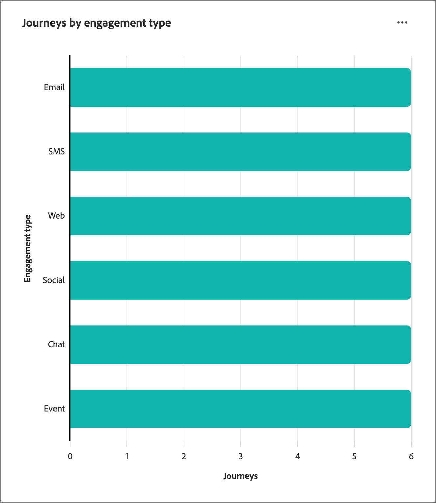
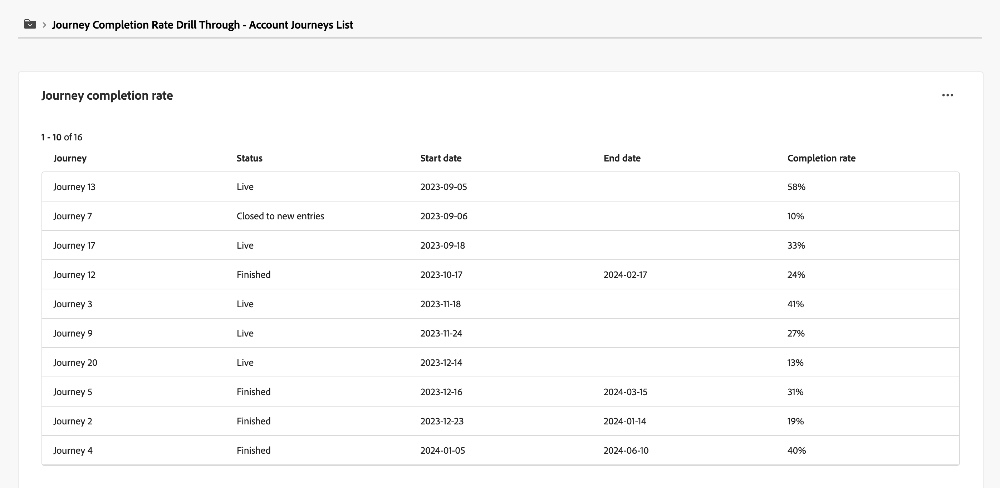
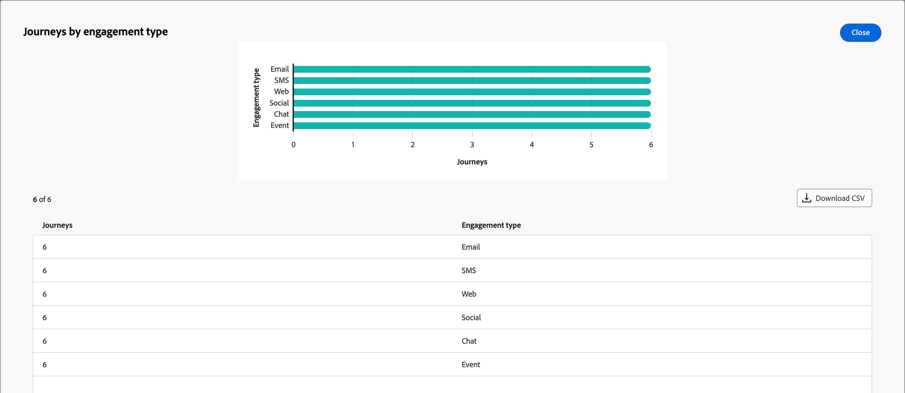

# 帳戶歷程總覽儀表板

此儀表板提供作用中帳戶歷程的完整概觀，使用圓形與長條圖來詳細描述帳戶進度，該圖表可分類和量化完成以及參與活動。 它可協助行銷人員透過關鍵傳送和參與量度來評估電子郵件和簡訊管道的有效性。

此概覽適用於已發佈的帳戶歷程，資料大約需要四個小時才能開始填入圖表和表格。

{width="700" zoomable="yes"}

## 歷程完成率分佈

此圖表會根據完成率說明歷程的分佈，並歸類為四個不同的分數區段。 中央數字代表歷程總數，並提供整體進度的快速快照。 分段的顏色表示每個分數範圍內的歷程比例，可讓您一眼就評估完成趨勢。

若要檢視詳細資訊，請按一下右上角的&#x200B;**...**&#x200B;功能表圖示。

{width="500"}

## 依參與類型劃分的歷程

此長條圖根據參與型別顯示歷程的分佈，並幫助您識別哪些參與最常用於各個歷程。 每個長條代表特定的參與型別，其長度表示包含該型別活動的歷程次數。 此視覺效果可讓您清楚且立即瞭解帳戶歷程中的參與趨勢。

若要檢視詳細資訊，請按一下右上角的&#x200B;**...**&#x200B;功能表圖示。

{width="500"}

## 與資料互動

若要與資料互動，請使用每個圖表右上角的&#x200B;**...**&#x200B;功能表。

### [!UICONTROL 鑽研]

對於圓形圖，請選擇&#x200B;**[!UICONTROL 鑽研]**&#x200B;以深入分析資料。

{width="700" zoomable="yes"}

您可以按一下右上方的&#x200B;_更多_ (**...**)功能表，然後選擇&#x200B;**[!UICONTROL 檢視更多]**&#x200B;以[檢視擴充資料](#view-more)。

### [!UICONTROL 檢視更多]

選擇&#x200B;**[!UICONTROL 檢視更多]**&#x200B;以檢視擴充的資料和深入分析。

{width="700" zoomable="yes"}

顯示的快顯視窗包括圖表和表格，顯示歷程資料的劃分。

若要下載資料，請按一下資料表格右上角的&#x200B;**[!UICONTROL 下載CSV]**。 若要返回&#x200B;_總覽_&#x200B;儀表板，請按一下&#x200B;**[!UICONTROL 關閉]**。
