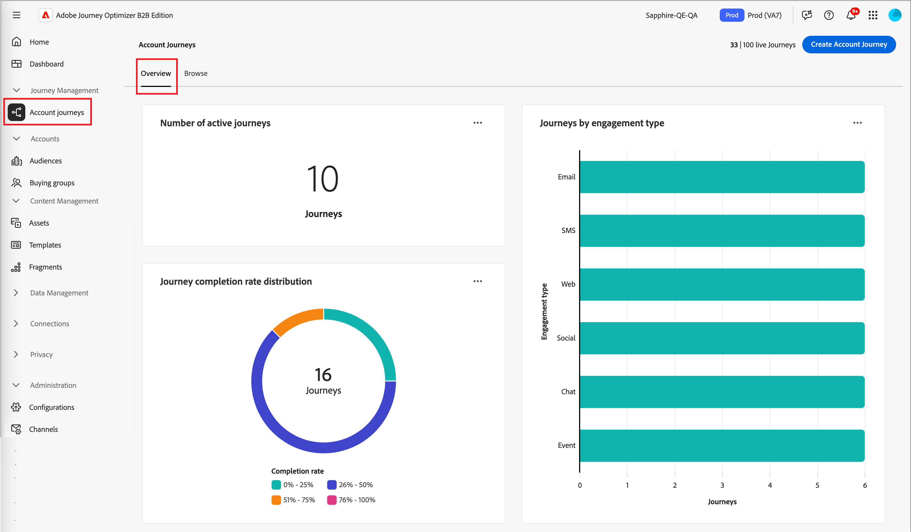
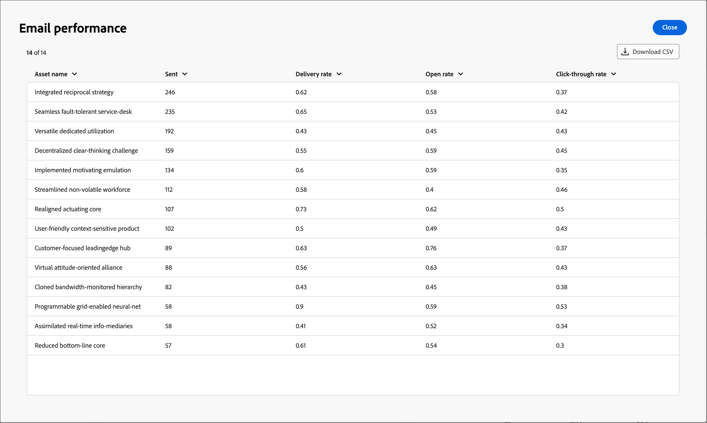

# 歷程概觀儀表板

此儀表板提供所選帳戶歷程的完整總覽，使用環形圖和折線圖詳細說明帳戶進度，該圖表會分類並量化完成、進行中的活動以及一段時間內的中止。 它可協助行銷人員透過關鍵傳送和參與量度，評估電子郵件和簡訊管道的成效。

此概覽適用於已發佈的帳戶歷程，資料大約需要四個小時才能開始填入圖表和表格。

{width="700" zoomable="yes"}

## 歷程狀態

此環圈圖提供歷程狀態的劃分，將帳戶分為`Completed`、`In Progress`和`Aborted`。 圖表的外緣會清楚標示每個區段對應的百分比與科目編號。

## 一段時間內的歷程完成

此折線圖會追蹤一段時間內完成歷程的帳戶數量。 水平軸對應時間軸，而垂直軸則量化帳戶，提供直接的完成趨勢檢視。

## 歷程績效Widget

本節提供兩個重要的量度：

* **[!UICONTROL 歷程完成率]** — 已成功完成其歷程的帳戶百分比。
* **[!UICONTROL 歷程持續時間]** — 帳戶完成歷程所花費的平均時間長度。

## 電子郵件和簡訊效能表

效能表可讓您詳細瞭解電子郵件和簡訊通道的成效。 每個表格都會展示量度（例如傳送率和點進率），以評估每個通訊接觸點的影響。

**[!UICONTROL 電子郵件效能]**&#x200B;資料表資料行：

* _[!UICONTROL 資產名稱]_ — 資產名稱
* _[!UICONTROL 已傳送]_ — 已傳送的電子郵件數目
* _[!UICONTROL 傳遞率]_ — 傳遞的電子郵件數目除以傳送的數目
* _[!UICONTROL 開啟率]_ — 開啟的電子郵件數目除以傳遞的數目
* _[!UICONTROL 點進率]_ — 點按電子郵件數除以傳遞數目

**[!UICONTROL SMS效能]**&#x200B;資料表資料行：

* _[!UICONTROL 資產名稱]_ — 資產名稱
* _[!UICONTROL 已傳送]_ — 已傳送的簡訊數目
* _[!UICONTROL 傳遞率]_ — 傳遞的SMS訊息數除以傳送的訊息數
* _[!UICONTROL 點進率]_ — 點按SMS訊息數除以傳送的訊息數
<!-- 
To generate a shareable PDF of your current view, click **[!UICONTROL Export]** at the top right of the page. -->

## 增強互動

使用每個圖表或表格右上角的動作圖示(**...**)，進一步與資料互動。

### 鑽研

對於&#x200B;_[!UICONTROL 歷程狀態]_&#x200B;圖表，請選擇&#x200B;**[!UICONTROL 鑽研]**&#x200B;以深入分析個別帳戶狀態。

{width="600" zoomable="yes"}
<!--
The applied global filters are carried over to the view and displayed at the top. Click the _Filter_ icon at the top left to filter the data display by journey.-->

### 檢視更多資訊

選擇&#x200B;**[!UICONTROL 檢視更多]**&#x200B;以存取擴充的資料和深入分析。 顯示的快顯視窗提供資料的劃分。

若要下載資料，請按一下右上角的&#x200B;**[!UICONTROL 下載CSV]**。

{width="600" zoomable="yes"}
