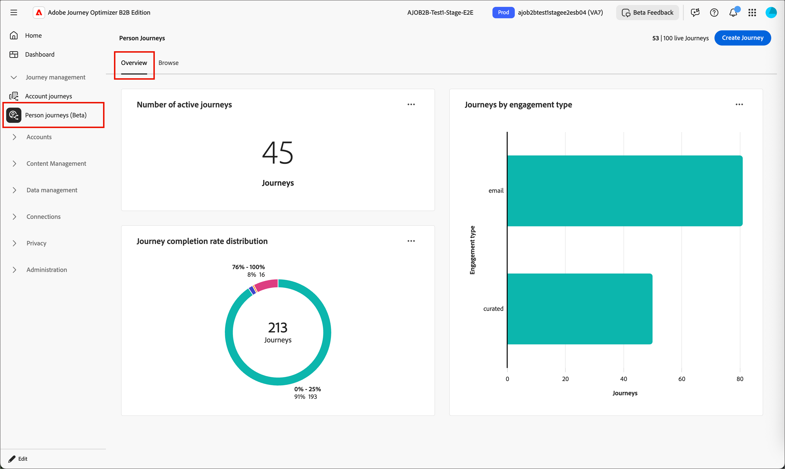

# 歷程概觀儀表板

[帳戶或個人歷程](../journeys/journeys-overview.md)的概述儀表板提供您作用中歷程的完整快照。 圓形圖和長條圖可分類並量化完成和參與活動，讓您透過關鍵傳送和參與量度，評估電子郵件和簡訊管道的有效性。 如需電子郵件特定傳遞和參與資料的跨歷程檢視，請參閱[電子郵件效能報表](email-performance-dashboard.md)。

此概覽適用於已發佈的歷程，資料大約需要四個小時才能開始填入圖表和表格。

>[!BEGINTABS]

>[!TAB 帳戶歷程]

在左側導覽列中，展開&#x200B;**[!UICONTROL 歷程管理]**，然後按一下&#x200B;**[!UICONTROL 帳戶歷程]**。 選取&#x200B;**[!UICONTROL 概觀]**&#x200B;標籤（如果預設未顯示）。

{width="800" zoomable="yes"}

>[!TAB 個人歷程(Beta)]

[!BADGE Beta]{type=Informative tooltip="提供測試版功能"}

在左側導覽列中，展開&#x200B;**[!UICONTROL 歷程管理]**，然後按一下&#x200B;**[!UICONTROL 個人歷程]**。 選取&#x200B;**[!UICONTROL 概觀]**&#x200B;標籤（如果預設未顯示）。

{width="800" zoomable="yes"}

>[!ENDTABS]

## 歷程完成率分佈 {#journey-completion-rate-distribution}

此圖表會根據完成率說明歷程的分佈，並歸類為四個不同的分數區段。 中央數字代表歷程總數，並提供整體進度的快速快照。 分段的顏色表示每個分數範圍內的歷程比例，可讓您一眼就評估完成趨勢。

若要檢視詳細資訊，請按一下右上角的&#x200B;**...**&#x200B;功能表圖示。

{width="500"}

## 依參與類型劃分的歷程 {#journeys-by-engagement-type}

此長條圖根據參與型別顯示歷程的分佈，並幫助您識別哪些參與最常用於各個歷程。 每個長條代表特定的參與型別，其長度表示包含該型別活動的歷程次數。 此視覺效果可讓您清楚且立即瞭解帳戶或人員歷程中的參與趨勢。

若要檢視詳細資訊，請按一下右上角的&#x200B;**...**&#x200B;功能表圖示。

按參與型別{width="500"}

## 與資料互動 {#engage-with-the-data}

若要與資料互動，請使用每個圖表右上角的&#x200B;**...**&#x200B;功能表。

### [!UICONTROL 鑽研] {#drill-through}

對於圓形圖，請選擇&#x200B;**[!UICONTROL 鑽研]**&#x200B;以深入分析資料。

![選擇[鑽研]以存取圖形資料](./assets/journey-completion-rate-drill-through.png){width="700" zoomable="yes"}

您可以按一下&#x200B;_更多_ (**...**) 功能表右上方，並選擇&#x200B;**[!UICONTROL 檢視更多]**&#x200B;到[檢視延伸資料](#view-more)。

### [!UICONTROL 檢視更多] {#view-more}

選擇&#x200B;**[!UICONTROL 檢視更多]**&#x200B;以檢視擴充的資料和深入分析。

{width="700" zoomable="yes"}

顯示的快顯視窗包括圖表和表格，顯示歷程資料的劃分。

若要下載資料，請按一下資料表格右上角的&#x200B;**[!UICONTROL 下載CSV]**。 若要返回&#x200B;_總覽_&#x200B;儀表板，請按一下&#x200B;**[!UICONTROL 關閉]**。
