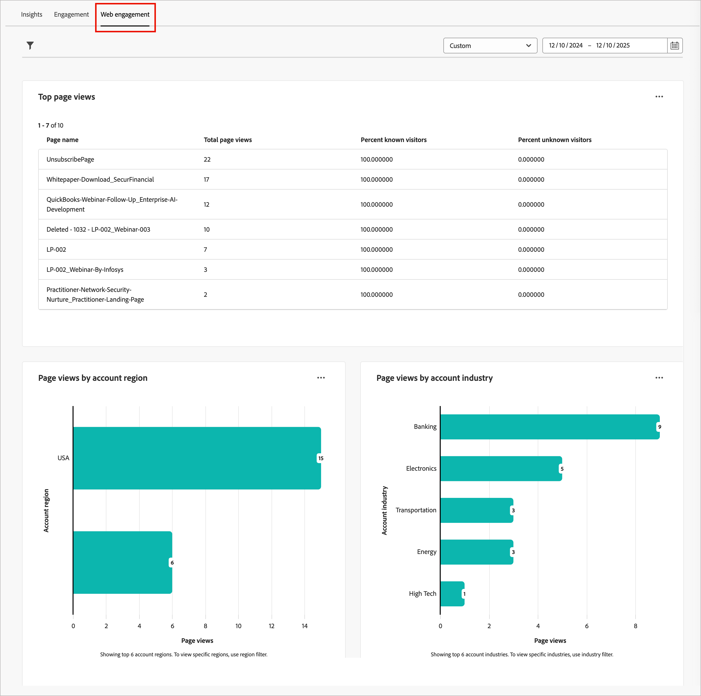
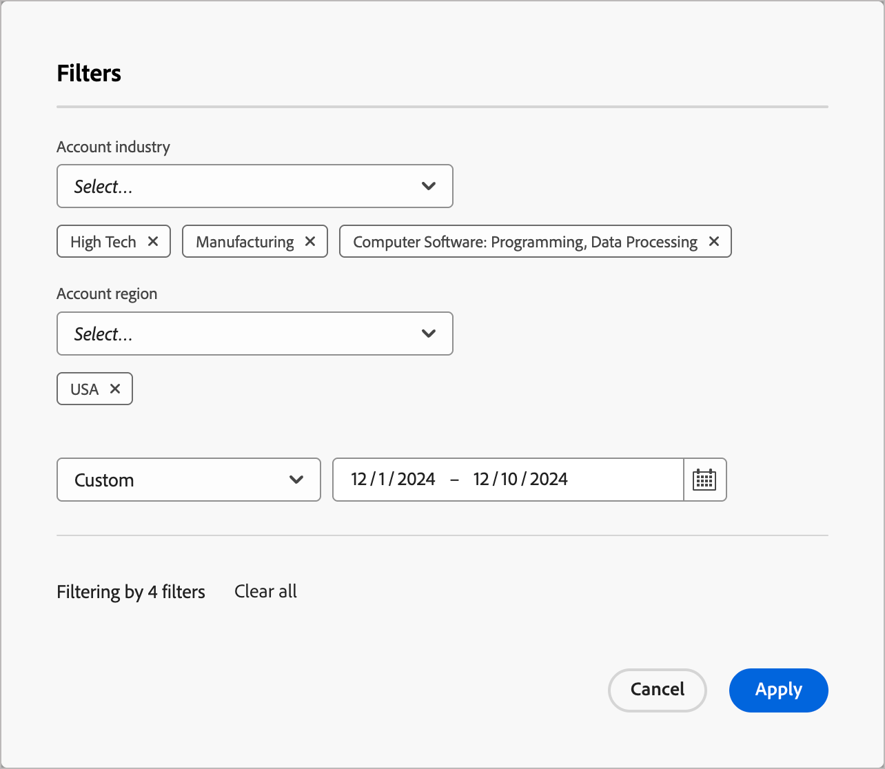
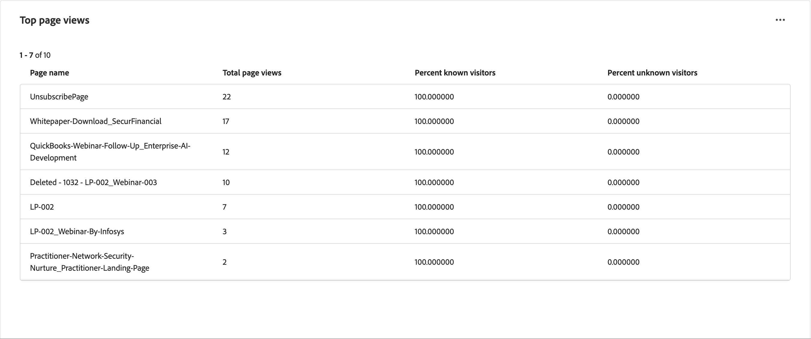
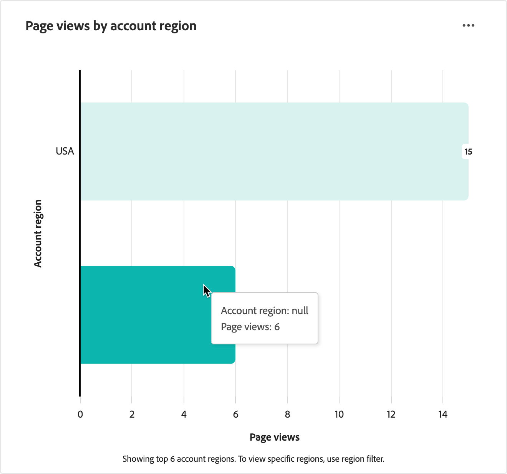
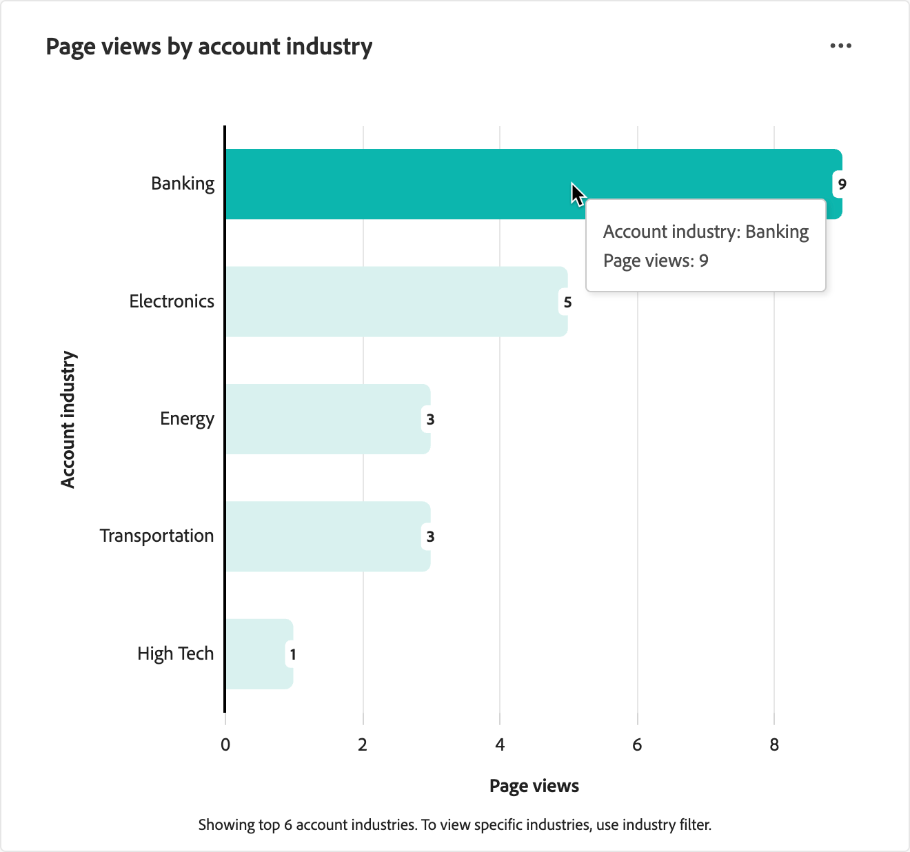
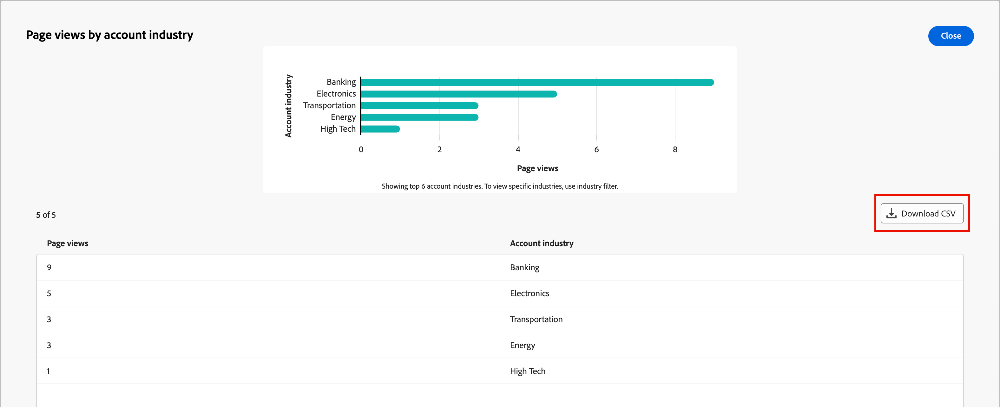

# 網頁參與儀表板

網路參與儀表板提供網路訪客如何與關鍵內容互動的可見度。 它會區隔各個帳戶產業與地區的資料，協助您瞭解參與趨勢。 使用此儀表板來顯示資訊為內容策略和帳戶目標定位提供資訊的網頁行為模式，以支援策略決策。

若要存取&#x200B;_Web Engagement儀表板_，請在左側導覽中選取&#x200B;**[!UICONTROL 儀表板]**&#x200B;專案。 然後選取頁面頂端的&#x200B;**[!UICONTROL Web參與]**&#x200B;索引標籤。

{width="700" zoomable="yes"}

## 篩選資料

按一下左上方的&#x200B;_篩選器_ （ ）圖示，使用下列任何屬性來篩選顯示的資料：

* **[!UICONTROL 帳戶區域]** — 依與帳戶相關聯的一或多個選取的地理區域篩選資料。
* **[!UICONTROL 帳戶產業]** — 依與帳戶相關聯的一或多個選取的產業分類來篩選資料。
* **[!UICONTROL 日期範圍]** — 依選取的日期範圍篩選資料。 預設範圍為目前日期。

{width="500"}

請針對您想要用來篩選資料的每個屬性選取多個值，然後按一下[套用]。****

## [!UICONTROL 熱門頁面檢視次數] {#top-page-views}

>[!CONTEXTUALHELP]
>id="ajo-b2b_web_engagement_top_page_views"
>title="排名最高的頁面檢視次數"
>abstract="網站上檢視次數最多的頁面，可協助您識別哪些內容帶來最多流量。"

此表格顯示前10個最常檢視的網頁，可協助您識別哪些內容最能引起訪客的共鳴。 資料包括：

| 欄 | 說明 |
| ------ | ----------- |
| 頁面名稱 | 網頁的名稱或標題。 |
| 檢視總數 | 頁面被檢視的總次數。 |
| 已知訪客(%) | 歸因至已知（已識別）訪客的頁面檢視百分比。 |
| 未知的訪客(%) | 歸因不明（匿名）訪客的頁面檢視百分比。 |

{width="650" zoomable="yes"}

## [!UICONTROL 依帳戶區域區分的頁面檢視次數] {#page-views-by-region}

>[!CONTEXTUALHELP]
>id="ajo-b2b_web_engagement_page_views_by_region"
>title="依帳戶區域的頁面檢視次數"
>abstract="依關聯帳戶的地理區域劃分的網站訪客分佈。"

此視覺效果會顯示依帳戶區域分段的訪客計數。 它說明了不同地理區域間的網路流量差異，讓您能夠根據區域受眾量身打造內容和行銷活動。 將滑鼠指標暫留在圖表中的長條圖上，即可檢視詳細資訊，包括：

* 帳戶區域的名稱
* 頁面檢視次數

{width="500" zoomable="yes"}

## [!UICONTROL 依帳戶產業區分的頁面檢視次數] {#page-views-by-industry}

>[!CONTEXTUALHELP]
>id="ajo-b2b_web_engagement_page_views_by_industry"
>title="依帳戶產業的頁面檢視次數"
>abstract="依關聯帳戶的產業分類劃分的Web訪客分佈。"

此視覺效果會顯示依帳戶產業劃分的訪客計數。 使用此圖表來瞭解不同產業間的網路流量差異，讓您能夠開發產業專屬的內容策略。 將滑鼠指標暫留在圖表中的長條圖上，即可檢視詳細資訊，包括：

* 帳戶產業的名稱
* 頁面檢視次數

{width="500" zoomable="yes"}

## 與資料互動

若要與資料互動，請使用每個圖表右上方的&#x200B;_更多_ (**...**)功能表，並選擇&#x200B;**[!UICONTROL 檢視更多]**&#x200B;以檢視擴充的資料和深入分析。

顯示的快顯視窗包括圖表和顯示資料劃分的表格。

若要下載資料，請按一下資料表格右上角的&#x200B;**[!UICONTROL 下載CSV]**。

{width="700" zoomable="yes"}
