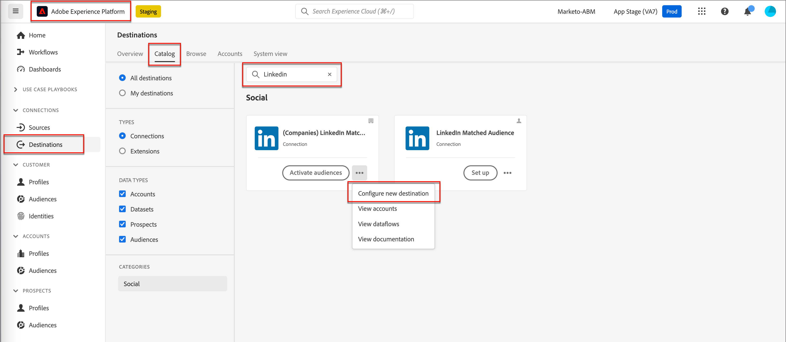
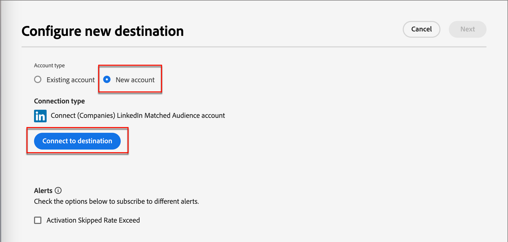
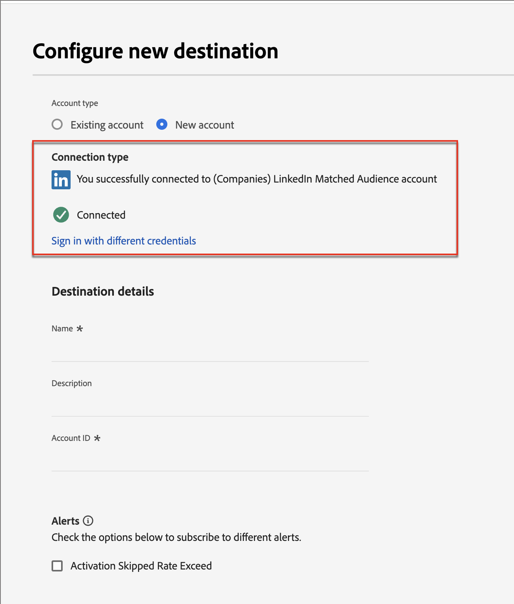
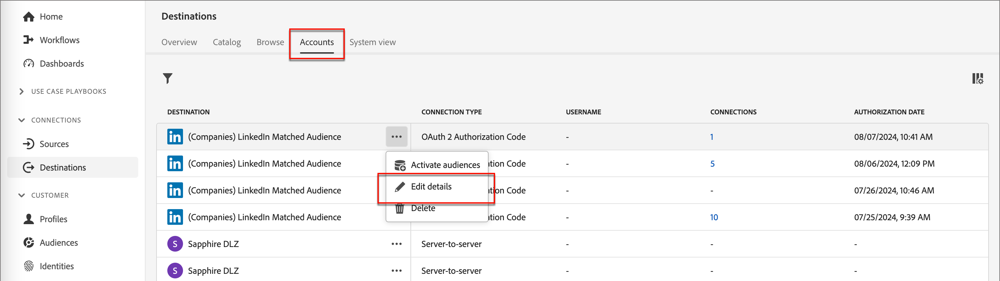
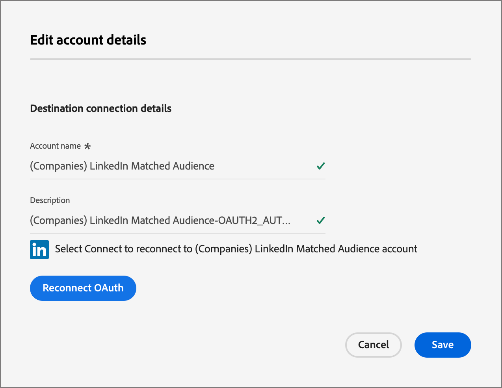
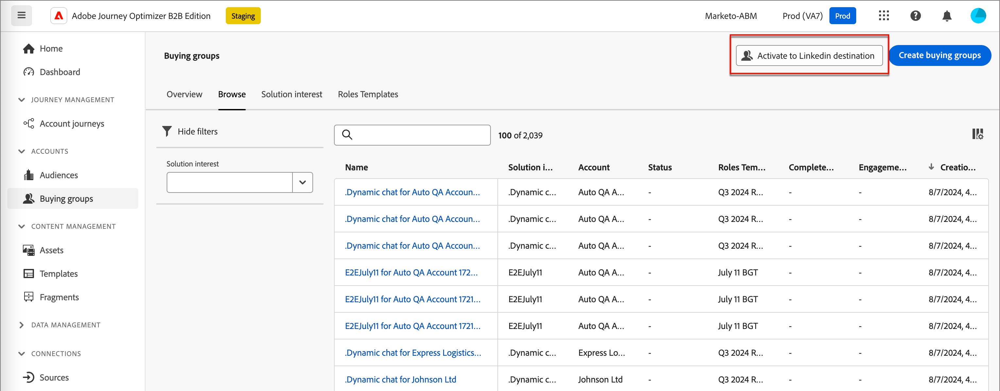
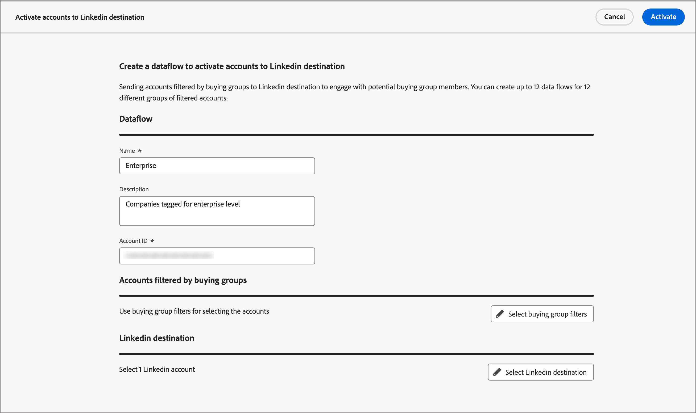
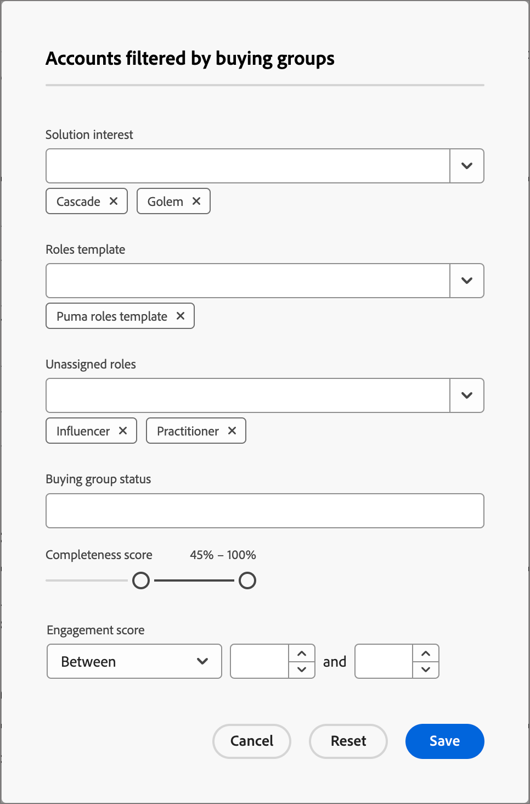

# linkedIn帳戶比對的對象

Journey Optimizer B2B Edition可讓您透過帳戶相符的受眾來產生LinkedIn廣告受眾，設計旨在協助您在購買群組中填入空角色。 透過定義一組購買群組篩選器，您可以維護「LinkedIn相符對象」，以鎖定符合您購買群組引數的潛在客戶。 此功能可運用Experience Platform目的地來管理整合的某些層面。 資料流上限為10個。

在從Journey Optimizer B2B版本啟動資料流之前，您必須至少有一個[（公司） LinkedIn相符對象目的地聯結器](https://experienceleague.adobe.com/en/docs/experience-platform/destinations/catalog/social/linkedin#connect)的執行個體，其設定在Experience Platform應用程式中的LinkedIn Campaign Manager帳戶。

## 設定新的LinkedIn帳戶連線 {#linkedin-destination-setup}

>[!CONTEXTUALHELP]
>id="ajo-b2b_linkedin_destination_setup"
>title="需要LinkedIn目的地設定"
>abstract="將依購買群組篩選的帳戶傳送至Linkedin目的地，以便與潛在的購買群組成員互動。 您可以為10個不同的篩選帳戶群組建立最多10個資料流程。 若要開始使用此功能，請先新增Linkedin目的地。"

1. 在Experience Platform中，前往左側導覽中的&#x200B;**[!UICONTROL 連線]** > **[!UICONTROL 目的地]**，然後選取&#x200B;**[!UICONTROL 目錄]**&#x200B;索引標籤。

1. 在目錄中，找出&#x200B;**[!UICONTROL （公司） LinkedIn相符的受眾]**&#x200B;聯結器。

   >[!TIP]
   >
   >您可以在搜尋方塊中輸入`LinkedIn`以快速找到聯結器。

1. 在聯結器卡中，按一下&#x200B;_更多_ (**...**)圖示並選擇&#x200B;**[!UICONTROL 設定新目的地]**。

   {width="800" zoomable="yes"}

1. 選取&#x200B;**[!UICONTROL 新帳戶]**&#x200B;並按一下&#x200B;**[!UICONTROL 連線到目的地]**。

   {width="500"}

1. 提供您的LinkedIn憑證並登入。

   驗證後，LinkedIn帳戶會連線為Experience Platform中的目的地。

   {width="400"}

   >[!IMPORTANT]
   >
   >此時，**不要**&#x200B;輸入&#x200B;_[!UICONTROL 目的地詳細資料]_。 只需要連線。

## 更新帳戶詳細資料

在Journey Optimizer B2B版本中，購買群組可以看到LinkedIn帳戶的名稱和說明。 最佳實務是更新這些資訊，以便與購買群組合作的行銷人員可輕鬆識別這些資訊。 您可以在Experience Platform或Journey Optimizer B2B Edition UI中變更帳戶詳細資料。

1. 前往左側導覽中的&#x200B;**[!UICONTROL 連線]** > **[!UICONTROL 目的地]**，然後選取&#x200B;**[!UICONTROL 帳戶]**&#x200B;標籤。

1. 針對您建立的新帳戶，按一下&#x200B;_更多_ (**...**)功能表，然後選擇&#x200B;**[!UICONTROL 編輯詳細資料]**。

   {width="800" zoomable="yes"}

1. 在對話方塊中，更新名稱和說明。

   {width="500"}

1. 按一下&#x200B;**[!UICONTROL 儲存]**。

## 啟用購買群組的帳戶

>[!NOTE]
>
>如果您已有10個資料流，則無法建立另一個資料流。 如果您已達到最大數量，請先刪除Experience Platform中的一個專案，然後再在Journey Optimizer B2B Edition中建立新專案。

1. 在Journey Optimizer B2B版本中，在左側導覽中前往&#x200B;**[!UICONTROL 帳戶]** > **[!UICONTROL 購買群組]**。

1. 選取&#x200B;**[!UICONTROL 瀏覽]**&#x200B;標籤。

1. 按一下右上角的「**[!UICONTROL 啟用至LinkedIn目的地]**」。

   {width="800" zoomable="yes"}

1. 為資料流提供描述性名稱和說明（選用）。

   儲存之後，您為資料流指定的名稱會加上&#x200B;_AJOB2B_，以協助識別Experience Platform的資料流。

1. 輸入LinkedIn Campaign Manager帳戶](https://www.linkedin.com/help/lms/answer/a424270)的[帳戶ID。

   您可以在Campaign Manager UI中依帳戶名稱尋找您的帳戶ID。

   {width="700" zoomable="yes"}

1. 按一下&#x200B;**[!UICONTROL 選取購買群組篩選器]**&#x200B;並定義帳戶對象的引數。

   >[!IMPORTANT]
   >
   >目前，在啟動資料流後無法編輯篩選器。 啟動資料流之前，請仔細檢查您的工作。

   {width="400"}

   對於&#x200B;**[!UICONTROL 參與分數]**，運運算元`Between`為包含型別，百分比範圍亦同。 例如，5.1和5都是介於&#x200B;_5和6之間的_。

   空白條件的處理方式如同`Is Any`。

   按一下&#x200B;**[!UICONTROL 儲存]**&#x200B;以新增指定的篩選器。

1. 按一下&#x200B;**[!UICONTROL 選取LinkedIn目的地]**，然後選擇您要使用的已設定LinkedIn目的地。

   啟用時，此設定會使用目的地設定和對應的虛擬區段來建立資料流。

1. 仔細檢查您的設定，然後按一下右上方的&#x200B;**[!UICONTROL [啟動]]**。

   在確認對話方塊中再按一下&#x200B;**[!UICONTROL 啟動]**。

   橫幅會以Experience Platform顯示，內含資料流功能表的連結，讓您能夠檢查資料流記錄。
