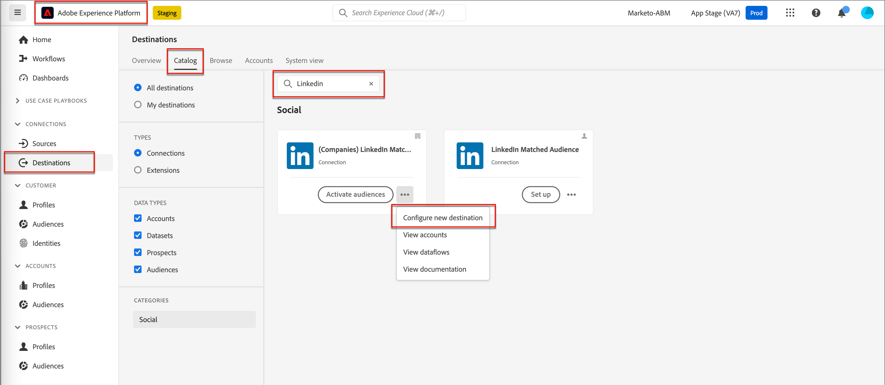
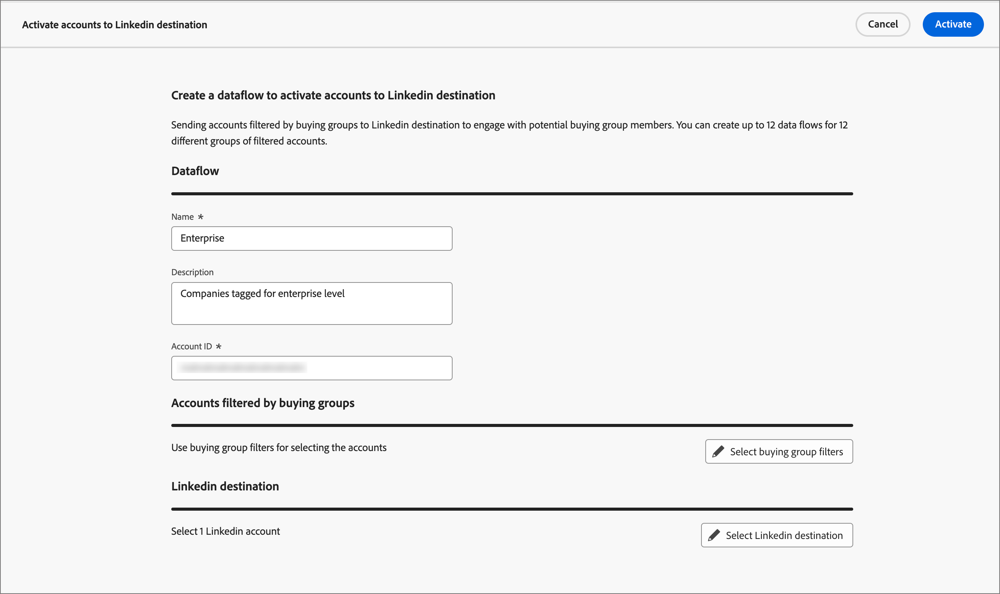
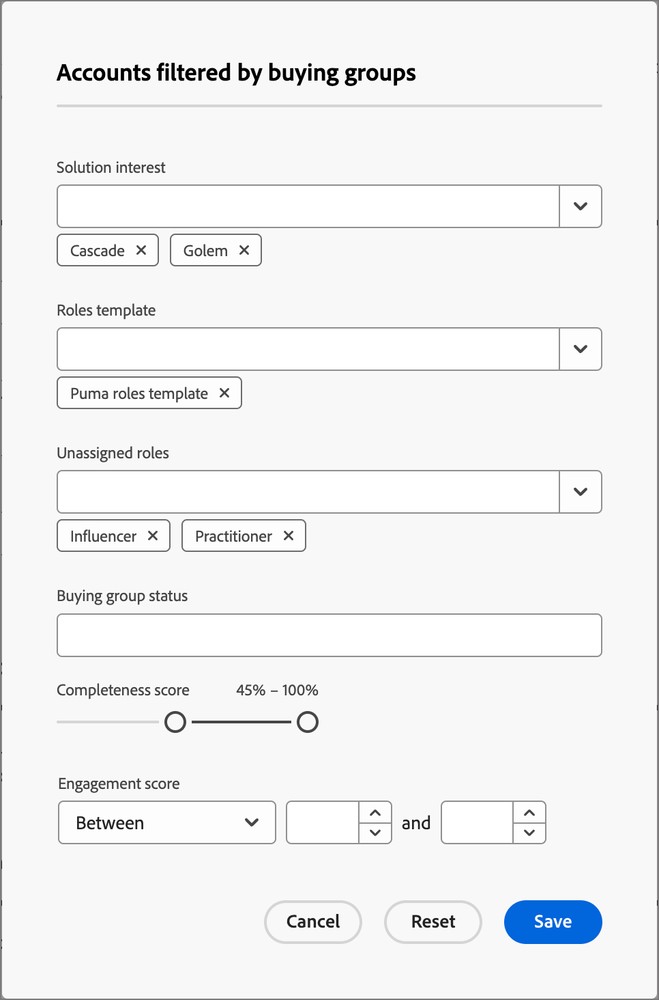

# LinkedIn帳戶匹配的受眾

[!DNL Journey Optimizer B2B Edition]提供通過帳戶匹配的受眾生成LinkedIn廣告受眾的能力，旨在幫助您填寫購買組中的空角色。 透過定義一組購買群組篩選器，您可以維護 LinkedIn 配對客群，以針對符合您的購買群組參數的潛在客戶。 您還可以從&#x200B;_執行操作_&#x200B;節點的帳戶行程中激活受眾。

此功能善用 Experience Platform 目標來管理整合的某些部分。 資料流限制為10個。

在從Journey OptimizerB2B版啟動資料流之前，必須至少有一個[（公司）LinkedIn匹配受眾目標連接器](https://experienceleague.adobe.com/en/docs/experience-platform/destinations/catalog/social/linkedin#connect){target="_blank"}的實例，該實例在您的Experience Platform應用程式中配置了LinkedIn市場活動經理帳戶。

## 設定新的 LinkedIn 帳戶連結 {#linkedin-destination-setup}

>[!CONTEXTUALHELP]
>id="ajo-b2b_linkedin_destination_setup"
>title="需要進行 LinkedIn 目的地設定"
>abstract="傳送依照購買群組篩選的帳戶至 Linkedin 目的地，與潛在的購買群組成員互動。 您可以為 10 個不同的已篩選帳戶群組建立最多 10 個資料流。 若要開始使用此功能，請先新增 Linkedin 目的地。"

1. 在Experience Platform中，轉到左側導航中的&#x200B;**[!UICONTROL 連接]** > **[!UICONTROL 目標]**，然後選擇&#x200B;**[!UICONTROL 目錄]**&#x200B;頁籤。

1. 在目錄中，找到&#x200B;**[!UICONTROL （公司）LinkedIn匹配的受眾]**&#x200B;連接器。

   >[!TIP]
   >
   >通過在搜索框中輸入`LinkedIn`可快速查找連接器。

1. 在連接器卡中，按一下&#x200B;_更多_(**...**) 表徵圖，然後選擇&#x200B;**[!UICONTROL 配置新目標]**。

   {width="800" zoomable="yes"}

1. 選擇&#x200B;**[!UICONTROL 新帳戶]**，然後按一下&#x200B;**[!UICONTROL 連接到目標]**。

   {width="500"}

1. 提供您的LinkedIn憑據並登錄。

   驗證後，LinkedIn帳戶將作為Experience Platform中的目標連接。

   顯示{width="400"}

   >[!IMPORTANT]
   >
   >此時，**不**&#x200B;輸入&#x200B;_[!UICONTROL 目標詳細資訊]_。 只需要連接。

## 更新帳戶詳細資訊

在Journey OptimizerB2B版中，購買組可以看到LinkedIn帳戶的名稱和說明。 最佳做法是更新此資訊，以便您的營銷人員能夠輕鬆識別此資訊，並與採購組合作。 您可以在Experience Platform或Journey OptimizerB2B版UI中更改帳戶詳細資訊。

1. 轉到左側導航中的&#x200B;**[!UICONTROL 連接]** > **[!UICONTROL 目標]**，然後選擇&#x200B;**[!UICONTROL 帳戶]**&#x200B;頁籤。

1. 有關您建立的新帳戶，請按一下&#x200B;_更多_(**...**) 菜單，然後選擇&#x200B;**[!UICONTROL 編輯詳細資訊]**。

   {width="800" zoomable="yes"}

1. 在對話框中，更新名稱和說明。

   {width="500"}

1. 按一下&#x200B;**[!UICONTROL 儲存]**。

## 激活採購組的帳戶

>[!NOTE]
>
>如果已有十個資料流，則無法建立另一個資料流。 如果最大值為，請在Journey OptimizerB2B版中建立新版本之前，先刪除Experience Platform中的一個。

1. 在 Journey Optimizer B2B Edition，前往左側導覽中的「**[!UICONTROL 帳戶]** > **[!UICONTROL 購買群組]**」。

1. 選取「**[!UICONTROL 瀏覽]**」索引標籤。

1. 按一下右上角的&#x200B;**[!UICONTROL 激活到LinkedIn目標]**。

   {width="800" zoomable="yes"}

1. 為資料流提供描述性名稱和說明（可選）。

   保存後，為資料流指定的名稱會以&#x200B;_AJOB2B_&#x200B;為前置詞，以幫助在Experience Platform中標識資料流。

1. 輸入你的LinkedIn市場活動經理帳戶[&#128279;](https://www.linkedin.com/help/lms/answer/a424270)的帳戶ID。

   您可以在「市場活動經理」UI中按帳戶名查找帳戶ID。

   {width="700" zoomable="yes"}

1. 按一下&#x200B;**[!UICONTROL 選擇購買組篩選器]**&#x200B;並定義帳戶訪問群體的參數。

   >[!IMPORTANT]
   >
   >此時，在激活資料流後無法編輯篩選器。 在激活資料流之前，請仔細檢查您的工作。

   {width="400"}

   在「**[!UICONTROL 參與度分數]**」中，`Between` 運算子是包含性的，百分比範圍亦同。 例如，5.1 和 5 均是在 5 和 6 _之間_。

   空條件被視為`Is Any`。

   按一下&#x200B;**[!UICONTROL 保存]**&#x200B;以添加指定的篩選器。

1. 按一下&#x200B;**[!UICONTROL 選擇LinkedIn目標]**，然後選擇要使用的已配置LinkedIn目標。

   激活後，此設定使用目標配置和相應的虛擬段建立資料流。

1. 按兩下您的設定，然後按一下右上角的&#x200B;**[!UICONTROL 激活]**。

   在確認對話框中再次按一下&#x200B;**[!UICONTROL 激活]**。

   Experience Platform中將顯示一個標題，其中包含指向資料流菜單的連結，以便您可以檢查資料流記錄。

## 從帳戶行程激活受眾

從2025.10版開始，使用帳戶的&#x200B;_激活到目標_&#x200B;操作，從您的旅途直接將帳戶激活到LinkedIn目標。 使用LinkedIn目標的操作，通過消除多系統切換和減少延遲來簡化市場活動執行。 例如，作為營銷人員，您可以自動將高意向帳戶激活到LinkedIn，以便在關鍵購買角色缺失時重新確定目標，或根據不活動過濾器重新激活休眠帳戶。

1. 在行程畫布中選擇&#x200B;_執行操作_&#x200B;節點後，將帳戶&#x200B;**上的**&#x200B;操作設定為&#x200B;**[!UICONTROL 激活到目標]**。

   {width="550" zoomable="yes"}

1. 從右邊的節點屬性中，選擇目標。

   * 如果建立了一個或多個目標，則可以按一下&#x200B;**[!UICONTROL 選擇目標]**&#x200B;以選擇現有目標。

   * 如果沒有現有目標，或者您想建立新目標，請按一下&#x200B;**[!UICONTROL 設定目標]**。

     {width="550" zoomable="yes"}

     此操作將在新瀏覽器頁籤中開啟「目標」目錄頁。

   {width="600" zoomable="yes"}

1. 在對話框中，選擇已配置的LinkedIn目標，然後按一下&#x200B;**[!UICONTROL 保存]**。

   {width="700" zoomable="yes"}

1. 輸入用於標識目標中已激活的受眾的&#x200B;**[!UICONTROL 受眾名稱]**。

   {width="550" zoomable="yes"}

## 協調付費媒體參與

您可以通過付費媒體渠道(如LinkedIn廣告受眾)與客戶成員接洽，以獲得、培養和確認他們的銷售資格。 在帳戶行程中使用&#x200B;_執行操作_&#x200B;節點，通過最適合不同帳戶成員的外部渠道自動與帳戶的關鍵成員進行接洽。

>[!VIDEO](https://video.tv.adobe.com/v/3448649/?learn=on)