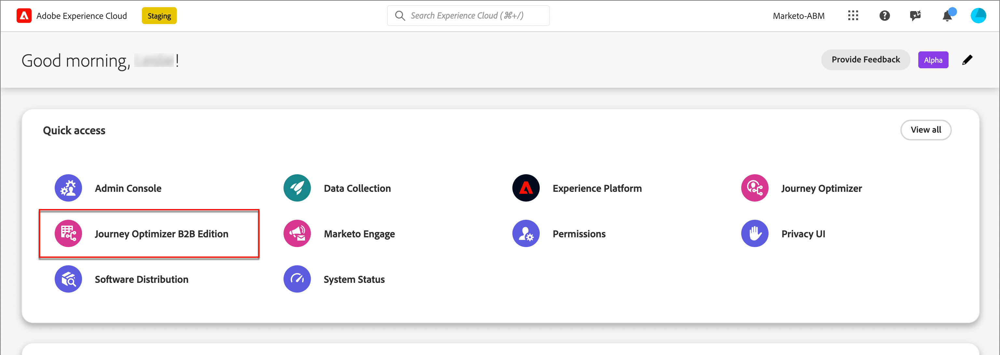

# 登入與首頁

透過Adobe Journey Optimizer B2B Edition，您可以使用內建的創作AI和領先業界的自動化功能，透過符合行銷資格的購買群組，協調帳戶和購買群組歷程，以最大化特定產品的需求。

<!-- Requirements?
-->
若要存取[!DNL Adobe Journey Optimizer B2B Edition]，請使用您的Adobe ID連線至Adobe Experience Cloud，然後選取[!DNL Journey Optimizer B2B Edition]。

{width="800" zoomable="yes"}

登入Adobe Experience Platform並選取Adobe Journey Optimizer B2B Edition應用程式時，首頁會顯示。 本頁提供Journey Optimizer B2B方案目前狀態的概觀，其形式為精細化前瞻分析和快速存取相關模組。 此外也提供下一步要採取的理想動作，以及何處尋找全方位的教學課程和檔案等相關資訊。

Journey Optimizer B2B Edition有兩個主要使用者角色：行銷人員和管理員。 每個角色都有不同成熟度階段（新或進階）的特定首頁。 頁面內容取決於每個角色所需的資訊以及要採取的後續動作。 這些頁面也包含&#x200B;**AI助理**&#x200B;的存取權，可協助使用者快速取得任何特定問題或所需主題的資訊<!-- and to obtain specific recommendations for their challenges or objectives-->。

## 行銷人員 — 新使用者

新使用者的行銷人員首頁包含三列，可協助行銷人員適應Journey Optimizer B2B及其功能。 它也會提供已建立之最新歷程的檢視，可作為新使用者的起點。

第一列包括新行銷人員的引導逐步說明，讓他們取得入門逐步說明，以便瞭解系統的細微差異，並有效開發B2B行銷策略和計畫。

第二列包含跨平台建立的最新AJO B2B歷程，讓行銷人員獲得建立帳戶歷程的最佳實務靈感。

第三列包含學習資源，可協助行銷人員取得特定主題的詳細資訊。

## 行銷人員 — 進階使用者

進階行銷人員的行銷人員首頁包含四列，可協助行銷人員取得有關方案目前進度和特定動作的更多資訊，以及要採取的下一個最佳動作和相關區段的快速存取權。

第一列包含B2B行銷人員根據先前採取的動作和方案的目前狀態可以採取的下一組動作，這會提示使用者進行下一個動作，以便與方案目標一致，並幫助他們快速達成目標。

第二列是由行銷人員存取的最新資產所組成，可讓行銷人員更輕鬆地找到這些資產並進行更新。

第三列包含關鍵績效指標，可協助行銷人員評估行銷方案的整體績效。

第四列包含學習資源，可協助行銷人員取得特定主題的詳細資訊。

## 管理員 — 新使用者

新管理員的&#x200B;_管理員_&#x200B;首頁包含三列，可協助管理員適應Journey Optimizer B2B版本及其功能，並提供已建立的最新歷程檢視，可作為新使用者的起點。

第一列包含新行銷人員的引導式逐步解說，以取得逐步入門歷程，瞭解系統的細微差異，並有效率地使用AJO B2B開發B2B行銷策略和計畫。

第二列包含B2B行銷人員最近使用的資產，位於單一表格中，方便管理員瞭解目前重點關注的資產。

第三列包含學習資源，可協助管理員取得特定主題的詳細資訊。

## 管理員 — 進階使用者

進階管理員的&#x200B;_管理員_&#x200B;首頁包含四個資料列，可協助管理員取得執行個體目前狀態的詳細資訊，以及可採取的特定動作，讓行銷人員更有效率、更有效率。

第一列由管理員根據先前採取的動作和執行個體的目前狀態而可執行的下一組動作組成。 它可做為提示，讓管理員對例項的引數（例如使用者許可權或任何特定模組設定）進行必要的更新。

第二列包含B2B行銷人員最近使用的資產，位於單一表格中，方便管理員瞭解目前重點關注的資產。

第三列包含關鍵績效指標，可協助管理員根據操作引數（例如使用者和使用情況）評估執行個體的進度。

第四列包含學習資源，可協助管理員取得特定主題的詳細資訊。
