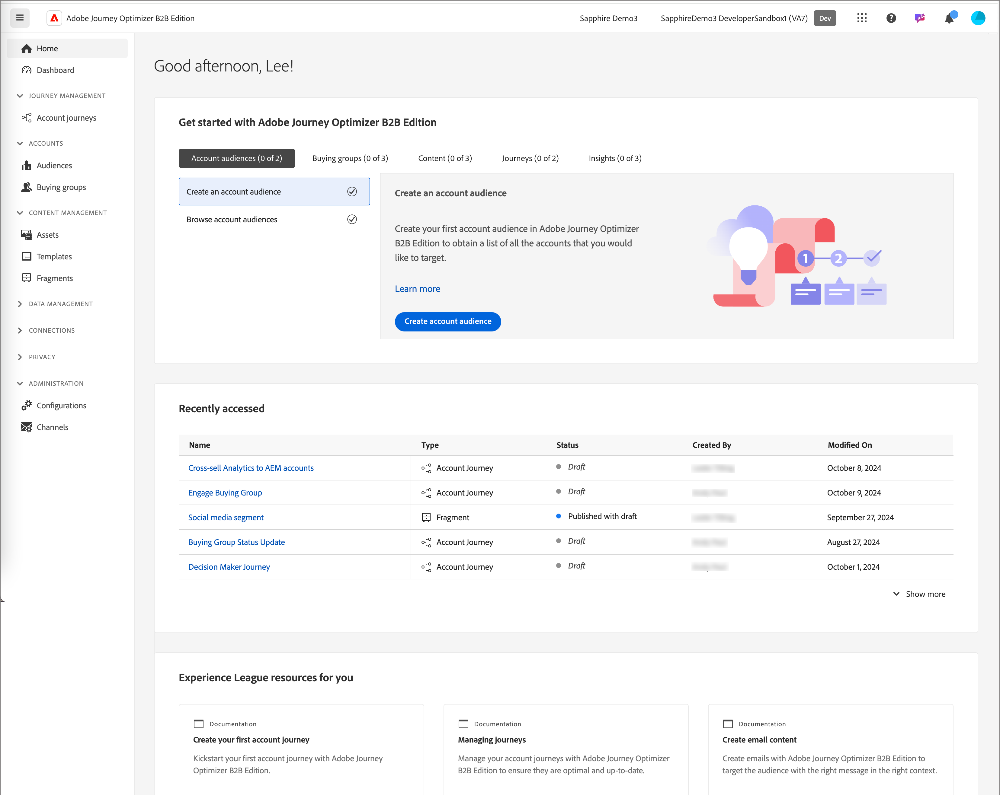

# 登入和首頁

您可以使用 Adobe Journey Optimizer B2B Edition 內建的生成式 AI 和領先業界的自動化功能，協調帳戶和購買群組歷程，以便利用符合行銷資格的購買群組，將特定產品的需求最大化。

<!-- Requirements?
-->
若要存取 [!DNL Adobe Journey Optimizer B2B Edition]，請使用 Adobe ID 連線至 Adobe Experience Cloud，然後選取 [!DNL Journey Optimizer B2B Edition]。

{width="800" zoomable="yes"}

您登入 Adobe Experience Platform 並選取 Adobe Journey Optimizer B2B Edition 應用程式時，便會顯示首頁。此頁面以<!-- refined insights and-->快速存取連結至相關資源<!-- It also provides information about the ideal next action to take and where to find the comprehensive set of tutorials and documentation. -->的形式，提供 Journey Optimizer B2B 行動方案的現況概觀。

{width="800" zoomable="yes"}

Journey Optimizer B2B Edition 具有兩種主要使用者角色：_**行銷人員**_&#x200B;和&#x200B;_**管理員**_。每個角色針對不同的成熟度階段 (新手或進階) 均有特定的首頁。此頁面是根據每個角色所需的資訊及後續要採取的行動來提供相關內容。

* **行銷人員 - 新使用者**：新使用者的「_行銷人員_」首頁可協助他們逐漸熟悉 Journey Optimizer B2B 及其功能。此首頁提供引導式操作示範，讓新行銷人員獲得入門的逐步指導，以便他們了解系統運作細節，並有效率地開發 B2B 行銷策略和行動方案。
* **行銷人員 - 進階使用者**：進階行銷人員的「_行銷人員_」首頁顯示目前的行動方案進度、建議的後續動作，並提供相關區段的快速存取。
* **管理員 - 新使用者**：新管理員的「_管理員_」首頁可協助他們逐漸熟悉 Journey Optimizer B2B Edition 及其功能。此首頁提供引導式操作示範，讓新管理員獲得逐步入門歷程，以了解系統運作細節並有效率地開發 B2B 行銷策略和行動方案。
* **管理員 - 進階使用者**：進階管理員的「_管理員_」首頁會顯示目前實例狀態和可操作步驟，以提高管理員的效率和有效性。

_[!UICONTROL 最近存取]_&#x200B;區段列出行銷人員或管理員最近存取的資產清單。使用此清單可直接前往您最近處理的資產，不需要導覽一系列的資產頁面及搜尋。

使用者亦可透過此頁面存取 [AI 助理](./ai-assistant/ai-assistant-overview.md)，並根據需求快速取得關於任何特定問題或主題的資訊。<!-- and to obtain specific recommendations for their challenges or objectives-->

<!-- 

## Marketer - new user

The Marketer home page for a new user consists of three rows that assist the marketer in getting accustomed to Journey Optimizer B2B and its capabilities. It also provides a view of the latest journeys that have been created, which can serve as a starting point for a new user.

The first row consists of a guided walkthrough for the new marketer to obtain an onboarding walkthrough so that they can understand the nuances of the system and become efficient in developing B2B marketing strategies and initiatives.

The second row consists of the recent AJO B2B journeys that have been created across the platform so that the marketer can get inspiration for the best practices to create an account journey.

The third row consists of the learning resources that can help a marketer gain more information on a specific topic.

## Marketer - advanced user

The Marketer home page for an advanced marketer consists of four rows that assists the marketer in obtaining more information on the current progress of the initiatives and on specific actions and on the next best action to be taken along with quick access to relevant sections.

The first row consists of the next set of actions that a B2B marketer can take based on the previous actions taken and the current state of the initiative, which provides a prompt for the user to make the next move that would align to the objective of the initiatives and help them reach the goals quickly.

The second row consists of the most recent assets accessed by the marketer to make it easier for the marketer to locate them and make updates to the same.

The third row consists of the Key Performance Indicators that can help the marketer gauge the overall performance of the marketing initiatives.

The fourth row consists of the learning resources that can help a marketer gain more information on a specific topic.

## Administrator - new user

The _Admin_ home page for a new administrator consists of three rows that assists the administrator in getting accustomed to Journey Optimizer B2B Edition and its capabilities, and provides a view of the latest journeys that have been created that can serve as a starting point for a new user.

The first row consists of a guided walkthrough for the new marketer to obtain a step-by-step onboarding journey to understand the nuances of the system and become efficient in developing B2B marketing strategies and initiatives with AJO B2B.

The second row consists of the recent assets used by the B2B marketers in a single table to make it easier for the administrator to know which assets are currently under focus.

The third row consists of the learning resources that would help an administrator gain more information on a specific topic.

## Administrator - advanced user

The _Admin_ home page for an advanced administrator consists of four rows that assists the administrator in obtaining more information about the current status of the instance and on specific actions that can be taken to make it more efficient and effective for the marketers.

The first row consists of the next set of actions that an administrator can take based on the previous actions taken and the current state of the instance. It serves as a prompt for the administrator to make the necessary updates to the parameters of the instances such as user permissions or any specific module configurations.

The second row consists of the recent assets used by the B2B marketers in a single table to make it easier for the administrator to know which assets are currently under focus.

The third row consists of the Key Performance Indicators that would help the administrators gauge the progress of the instance in terms of operational parameters such as users and usage.

The fourth row consists of the learning resources that would help the administrator gain more information on a specific topic.

-->