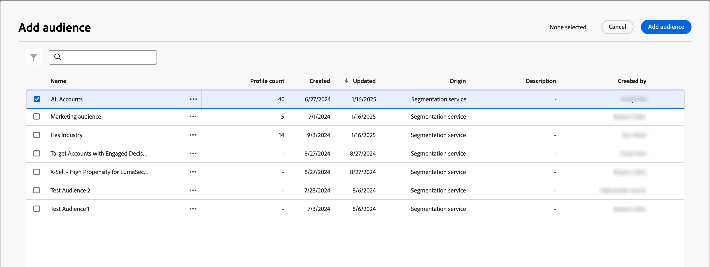

# 帳戶對象歷程節點

「帳戶對象」節點會定義歷程的輸入帳戶對象(在Adobe Experience Platform中建立和管理)。 當您[建立帳戶歷程](./journey-overview.md#create-an-account-journey)時，它一律以&#x200B;_帳戶對象_&#x200B;節點開始，您可以在其中新增輸入到歷程中。

_若要設定節點的對象：_

1. 按一下&#x200B;**[!UICONTROL 帳戶對象]**&#x200B;節點，在右側顯示節點屬性。

   {width="700" zoomable="yes"}

1. 按一下&#x200B;**[!UICONTROL 新增帳戶對象]**。

1. 在&#x200B;_[!UICONTROL 新增對象]_&#x200B;對話方塊中，選取先前建立的對象區段，然後按一下&#x200B;**[!UICONTROL 新增對象]**。

   {width="700" zoomable="yes"}

_若要建立對象區段：_

1. 在左側導覽列中，選擇&#x200B;**[!UICONTROL 帳戶]** > **[!UICONTROL 對象]**。

1. 按一下右上方的&#x200B;**[!UICONTROL 建立對象]**。

   {width="800" zoomable="yes"}

1. 請依照[Segmentation Service指南](https://experienceleague.adobe.com/en/docs/experience-platform/segmentation/ui/account-audiences){target="_blank"}中所述的步驟操作。
