# 採取動作

在您的帳戶歷程中，您可以新增&#x200B;_[!UICONTROL 採取動作]_&#x200B;節點來執行動作，例如傳送電子郵件、變更分數、指派給購買群組等。 動作通常是您因某種觸發器（例如事件或之前的動作）而想要發生的動作。

{width="30"} [觀看概觀影片](#overview-video)

## 帳戶動作

當您想要將變更套用至節點路徑上屬於帳戶的所有人員時，請使用帳戶上的動作。

### 動作和限制 {#account-action-constraints}

| 動作 | 限制 |
| ------ | ----------- |
| [!UICONTROL 帳戶變更資料值] | 選取屬性 新值 |
| [!UICONTROL 帳戶有趣的時刻] | 型別（電子郵件、里程碑或網頁） 說明（選擇性） |
| [!UICONTROL 啟用到目的地] | 選取目的地 |
| [!UICONTROL 新增帳戶至（其他）歷程] | 選取即時帳戶歷程 |
| [!UICONTROL 新增至帳戶清單] | 選取上線的靜態帳戶清單 |
| [!UICONTROL 從歷程移除帳戶] | 選取即時帳戶歷程 |
| [!UICONTROL 從帳戶清單移除] | 選取即時靜態帳戶清單 |
| [!UICONTROL 傳送銷售警示] | 選取感興趣的解決方案 傳送電子郵件至 |
| [!UICONTROL 更新購買群組階段] | 選取方案興趣 選取購買群組階段 |
| [!UICONTROL 更新購買群組狀態] | 選取方案興趣 狀態（必要，最多50個字元） |

### 新增以帳戶為基礎的動作

1. 導覽至歷程圖。

1. 按一下路徑上的加號( **+** )圖示，然後選擇&#x200B;**[!UICONTROL 執行動作]**。

   {width="400"}

1. 在右側的節點屬性中，選擇動作的&#x200B;**[!UICONTROL 帳戶]**。

1. 從清單中選取動作，並設定該動作的任何值。

   {width="700" zoomable="yes"}

>[!BEGINSHADEBOX]

### 啟用至LinkedIn目的地

對帳戶使用&#x200B;_對目的地啟用_&#x200B;動作，直接從您的歷程對Experience Platform目的地啟用帳戶。 此動作可讓您根據購買群組篩選器、參與分數和其他條件，將合格帳戶推送至支援目的地上的相符受眾。 It

從2025.10版開始，**_LinkedIn_**&#x200B;是第一個支援的目的地型別。 針對LinkedIn目的地使用動作，可消除多系統移交並減少延遲，進而簡化行銷活動的執行作業。 例如，身為行銷人員，您可以在關鍵購買角色遺失時，自動對LinkedIn啟用高意圖帳戶以重新進行目標定位，或根據閒置篩選器重新與休眠帳戶互動。

如需在LinkedIn目的地使用帳戶相符對象的詳細資訊，請參閱[LinkedIn帳戶相符對象](../data/linkedin-account-matched-audiences.md)。

+++ 將帳戶啟動設定為LinkedIn目的地

1. 在歷程畫布中選取&#x200B;_執行動作_&#x200B;節點後，將帳戶&#x200B;**[!UICONTROL 上的]**&#x200B;動作設定為&#x200B;**[!UICONTROL 啟用到目的地]**。

1. 按一下&#x200B;**[!UICONTROL 選取目的地]**。

   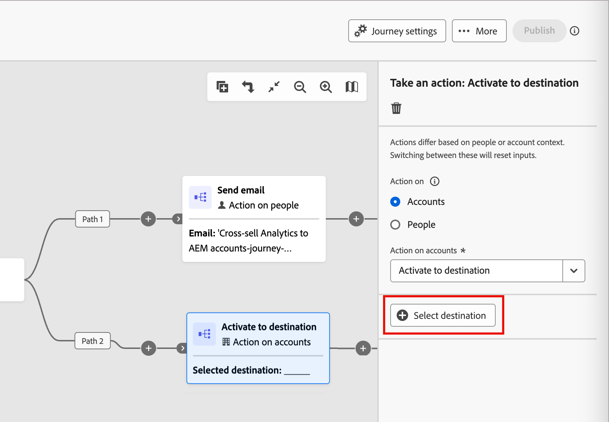{width="600" zoomable="yes"}

1. 在對話方塊中，選取設定的LinkedIn目的地，然後按一下&#x200B;**[!UICONTROL 儲存]**。

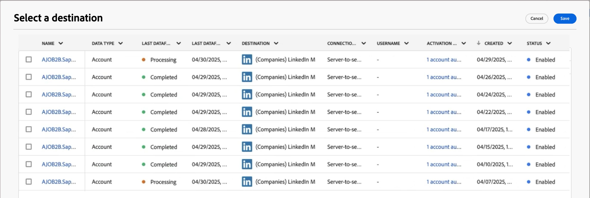{width="700" zoomable="yes"}

1. 輸入用來識別目的地中已啟動對象的&#x200B;**[!UICONTROL 對象名稱]**。

   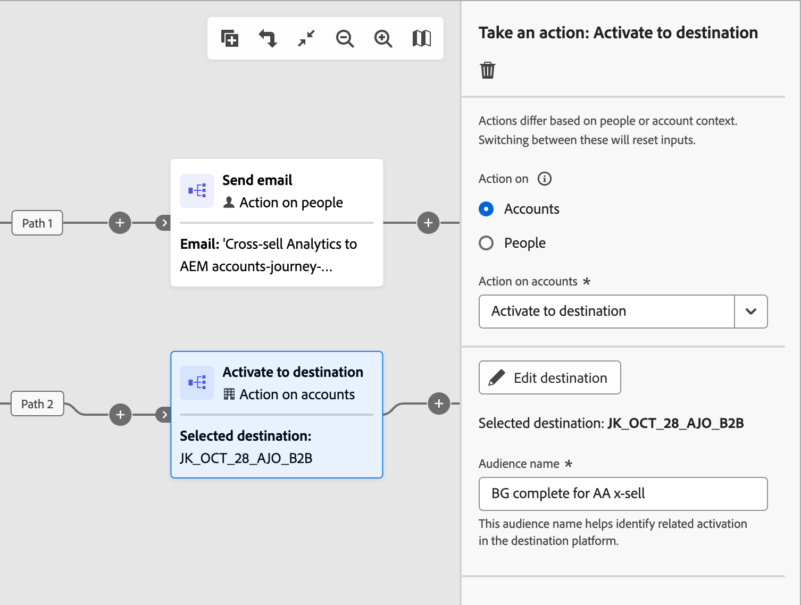{width="550" zoomable="yes"}

+++

>[!ENDSHADEBOX]

## 人員動作

當您想要將變更套用至節點路徑上的所有人員時，可對人員使用動作。 此節點型別可在依人員分割路徑內或依帳戶分割路徑內使用。

### 動作和限制 {#people-action-constraints}

| 內容 | 動作 | 限制 |
| ------- | ------ | ----------- |
| [Journey Optimizer B2B](#journey-optimizer-b2b-actions) | [!UICONTROL 新增至外部客戶對象] | 選取外部客戶客群 |
| | [!UICONTROL 指派給購買群組] | 選取方案興趣 選取角色 |
| | [!UICONTROL 變更資料值] | 選取人員屬性 設定新值 |
| | [!UICONTROL 變更分數] | 分數名稱 分數變更 |
| | [!UICONTROL 個人有趣的時刻] | 型別 描述 |
| | [!UICONTROL 從購買群組中移除] | 選取解決方案興趣 |
| | [!UICONTROL 傳送電子郵件] | 建立新電子郵件 從Marketo Engage選取電子郵件 |
| | [!UICONTROL 傳送簡訊] | 建立簡訊 |
| [Marketo Engage](#marketo-engage-actions) | [!UICONTROL 新增至清單] | 選取Marketo Engage工作區 清單名稱 |
| | [!UICONTROL 新增至Marketo Engage要求行銷活動] | 選取Marketo Engage工作區 選取要求行銷活動 |
| | [!UICONTROL 在Marketo Engage中變更人員分割] | 新磁碟分割 |
| | [!UICONTROL 從清單移除] | 選取Marketo Engage工作區 清單名稱 |

### 新增以人物為基礎的動作

1. 導覽至歷程圖。

1. 按一下路徑上的加號( **+** )圖示，然後選擇&#x200B;**[!UICONTROL 執行動作]**。

1. 在右側的節點屬性中，選擇動作的&#x200B;**[!UICONTROL 人員]**。

1. 從清單中選取動作，並設定該動作的任何值。

{width="700" zoomable="yes"}

### Journey Optimizer B2B動作

Journey Optimizer B2B以人物為基礎的動作，專門設計用於透過已設定的管道管理通訊，以及管理購買群組與帳戶中的人物分類。 當具有人員設定檔的合格帳戶到達節點時，歷程會套用動作。

+++[!UICONTROL 新增至外部客戶對象]

使用此動作將人員推送至可透過付費媒體頻道啟用的外部受眾，以進一步鎖定購買群組的成員。 此動作會透過Real-Time CDP B2B/P Edition執行。

>[!NOTE]
>
>當具有人員設定檔的合格帳戶到達已發佈歷程中的&#x200B;_新增到外部客戶對象_&#x200B;節點時，這些設定檔可能需要48小時才能填入外部對象中。

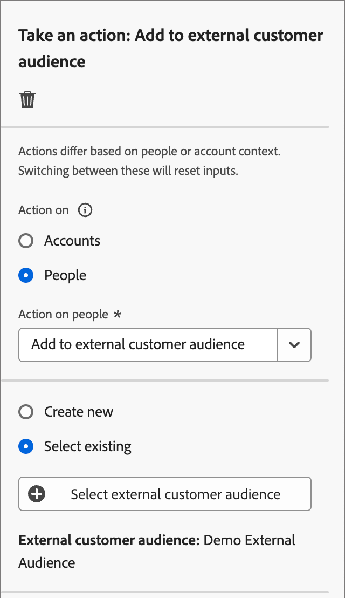{width="300"}

選取此以人物為基礎的動作時，您可以建立新的外部對象，或從現有的外部對象中選取。 針對現有對象，您可以選擇僅在Journey Optimizer B2B edition中建立的外部客戶對象。 當您建立對象並將其用於此歷程動作時，請務必連線到目的地。 如需詳細資訊，請參閱Experience Platform檔案中的[建立新的目的地連線](https://experienceleague.adobe.com/zh-hant/docs/experience-platform/destinations/ui/connect-destination){target="_blank"}和[啟用總覽](https://experienceleague.adobe.com/zh-hant/docs/experience-platform/destinations/ui/activate/activation-overview#activate-audiences-from-the-destinations-catalog){target="_blank"}。

{width="30"} [觀看付費媒體協調流程的影片概觀](../data/linkedin-account-matched-audiences.md#orchestrate-paid-media-engagement)

建立外部對象(_T):_

1. 選擇&#x200B;**[!UICONTROL 新建]**。

1. 按一下&#x200B;**[!UICONTROL 建立外部客戶對象]**。

1. 為新外部對象輸入&#x200B;**[!UICONTROL Name]** （必要）和&#x200B;**[!UICONTROL Description]** （選用）。

   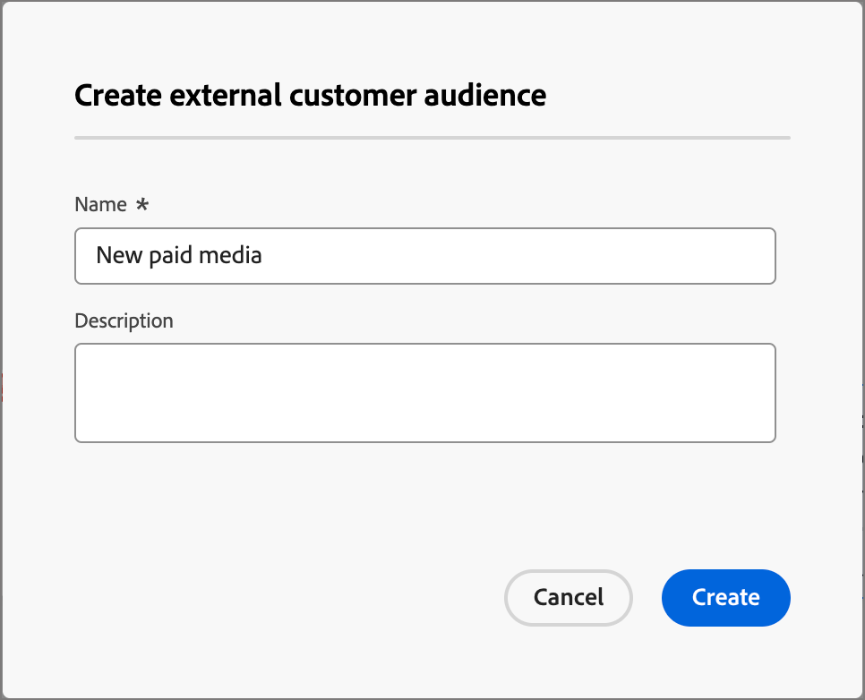{width="300"}

1. 按一下&#x200B;**[!UICONTROL 建立]**。

   系統會建立新對象並顯示確認訊息。 然後，您可以繼續將它用作節點動作的現有對象。

   >[!NOTE]
   >
   >從Journey Optimizer B2B edition建立新的外部客戶對象時，會內建一個虛擬記錄(`test@email.com`)。 將第一個實際設定檔新增至歷程的外部對象時，就會覆寫此記錄。

使用現有的對象(_T):_

1. 按一下&#x200B;**[!UICONTROL 選取外部客戶對象]**。

1. 在對話方塊中，選取您要使用的對象。

   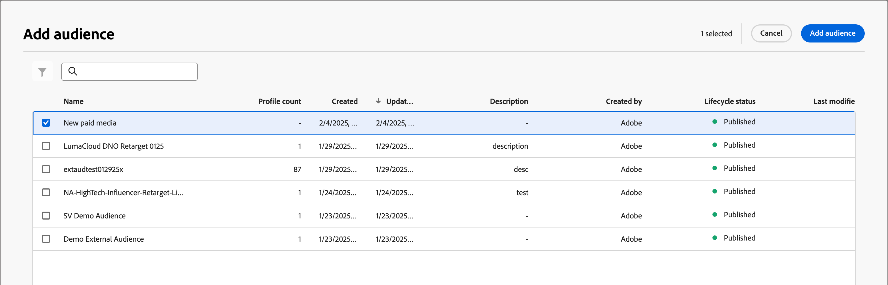{width="700" zoomable="yes"}

1. 按一下&#x200B;**[!UICONTROL 新增對象]**。

+++

+++[!UICONTROL 指派給購買群組]

使用此動作，根據選取的解決方案興趣和角色，將人員設定檔新增至[購買群組](../buying-groups/buying-groups-overview.md)。

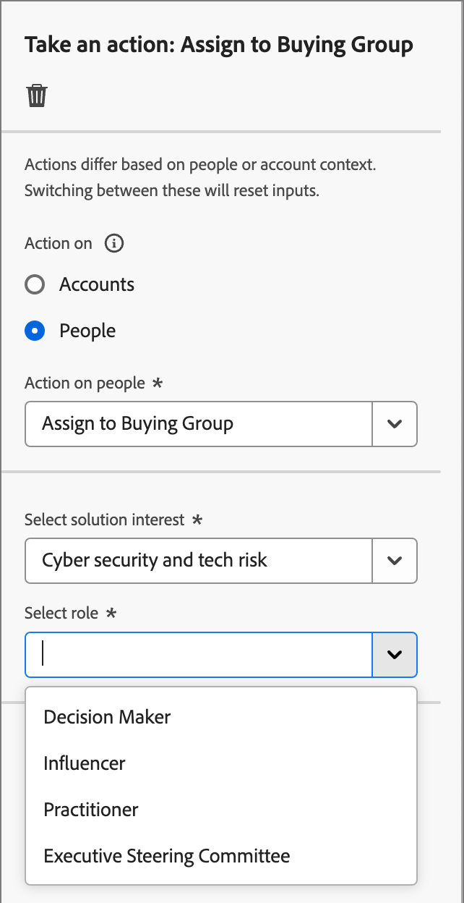{width="300"}

+++

+++[!UICONTROL 變更資料值]

使用此動作來變更[人員設定檔屬性](../data/field-mapping.md#xdm-business-person-attributes)的值。 選取屬性，然後設定新值。

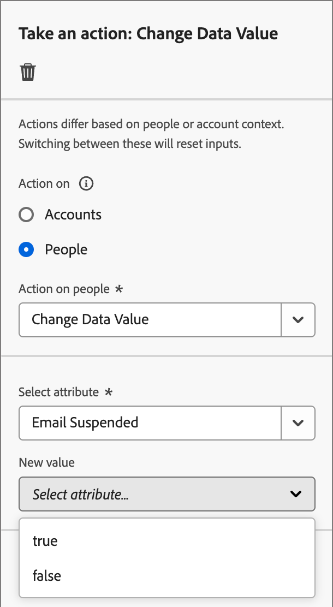{width="300"}

+++

+++[!UICONTROL 變更分數]

使用此動作來變更Marketo Engage中的人員分數。 [了解更多](https://experienceleague.adobe.com/zh-hant/docs/marketo-learn/tutorials/lead-and-data-management/lead-scoring-learn){target="_blank"}

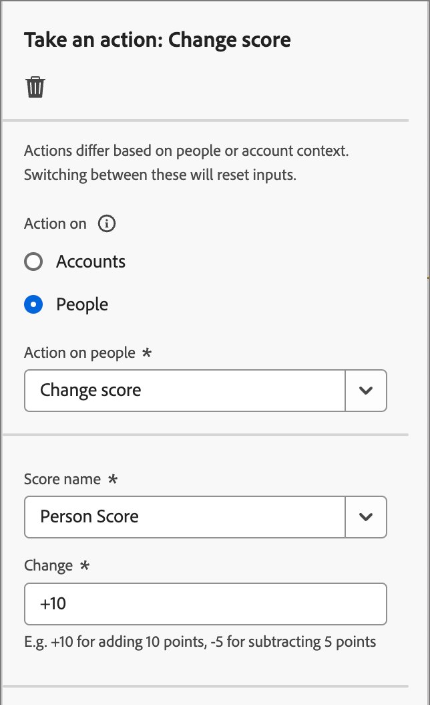{width="300"}

+++

+++[!UICONTROL 個人有趣的時刻]

使用此動作記錄人們有趣的時刻。 選擇型別（「電子郵件」、「里程碑」或「Web」）並新增說明（選用）。

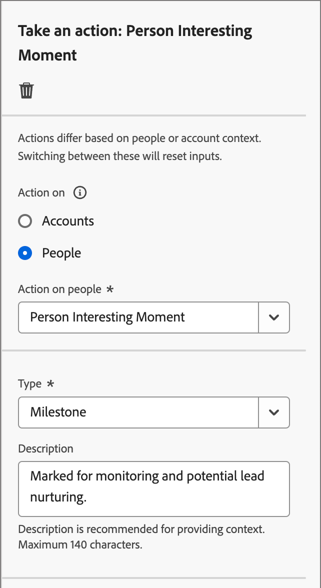{width="300"}

+++

+++[!UICONTROL 從購買群組中移除]

使用此動作，根據選取的解決方案興趣，從[購買群組](../buying-groups/buying-groups-overview.md)移除人員設定檔。

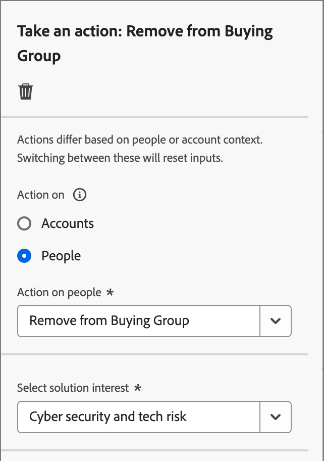{width="300"}

+++

+++[!UICONTROL 傳送電子郵件]

使用此動作傳送電子郵件。 在您[建立節點的電子郵件](../content/add-email.md#add-an-email-to-your-journey)之後，您可以在電子郵件設計空間設計、個人化和預覽電子郵件訊息（請參閱[電子郵件編寫](../content/email-authoring.md)）。 您也可以從Marketo Engage[傳送](https://experienceleague.adobe.com/zh-hant/docs/marketo/using/product-docs/email-marketing/general/creating-an-email/create-an-email){target="_blank"}電子郵件。 選取Marketo Engage工作區，然後選取要傳送的電子郵件。

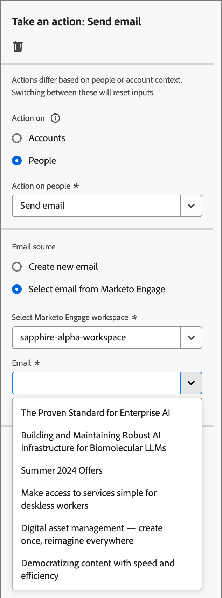{width="300"}

+++

+++[!UICONTROL 傳送簡訊]

使用此動作來傳送SMS訊息。 您可以在視覺化設計空間建立、個人化和預覽SMS訊息（請參閱[SMS製作](../content/sms-authoring.md)）。

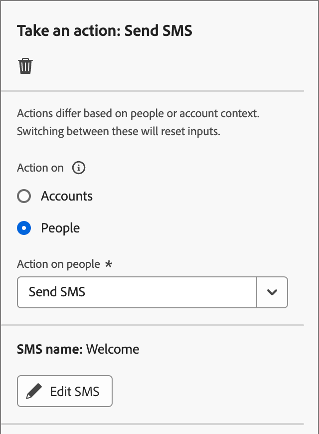{width="300"}

+++

### Marketo Engage動作

Marketo Engage以人物為基礎的動作，旨在協調Journey Optimizer B2B edition中以帳戶為基礎的行銷策劃，與Marketo Engage中以銷售機會為基礎的行銷工作。 使用這些動作來協調清單成員資格、人員分割和請求行銷活動。

+++[!UICONTROL 新增至清單]

使用此動作將人員新增至Marketo Engage中的[靜態清單](https://experienceleague.adobe.com/zh-hant/docs/marketo/using/product-docs/core-marketo-concepts/smart-lists-and-static-lists/static-lists/understanding-static-lists){target="_blank"}。

首先，請在連線的Marketo Engage執行個體中選取工作區。 接著，選取清單名稱。

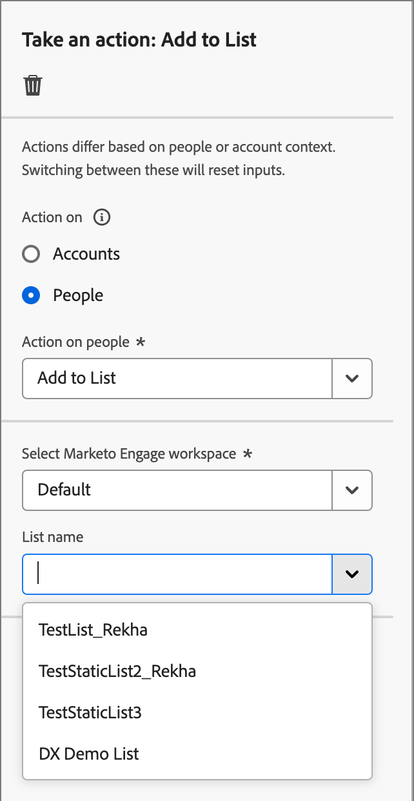{width="300"}

+++

+++[!UICONTROL 新增至Marketo要求行銷活動]

使用此動作將人員設定檔新增至Marketo Engage中的[請求行銷活動](https://experienceleague.adobe.com/zh-hant/docs/marketo/using/product-docs/core-marketo-concepts/smart-campaigns/flow-actions/request-campaign){target="_blank"}。

首先，請在連線的Marketo Engage執行個體中選取工作區。 接著，選取要求促銷活動名稱。

{width="300"}

+++

+++[!UICONTROL 在Marketo Engage中變更人員分割]

使用此動作來變更Marketo Engage中的[人員資料分割](https://experienceleague.adobe.com/zh-hant/docs/marketo/using/product-docs/administration/workspaces-and-person-partitions/understanding-workspaces-and-person-partitions#person-partitions){target="_blank"}。

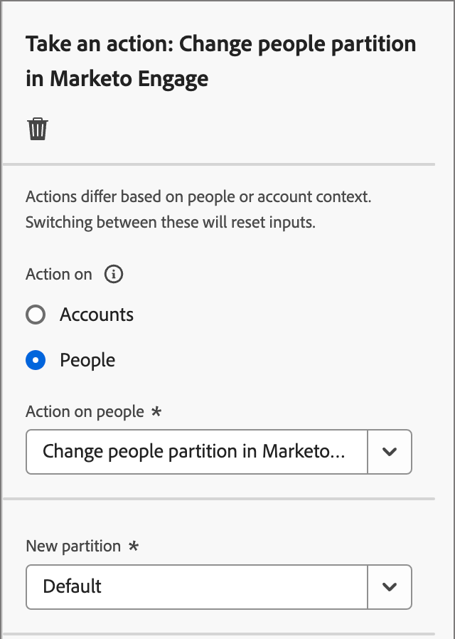{width="300"}

+++

+++[!UICONTROL 從清單移除]

使用此動作從Marketo Engage中的[靜態清單](https://experienceleague.adobe.com/zh-hant/docs/marketo/using/product-docs/core-marketo-concepts/smart-lists-and-static-lists/static-lists/understanding-static-lists){target="_blank"}移除人員。 首先，請在連線的Marketo Engage執行個體中選取工作區。 接著，選取清單名稱。

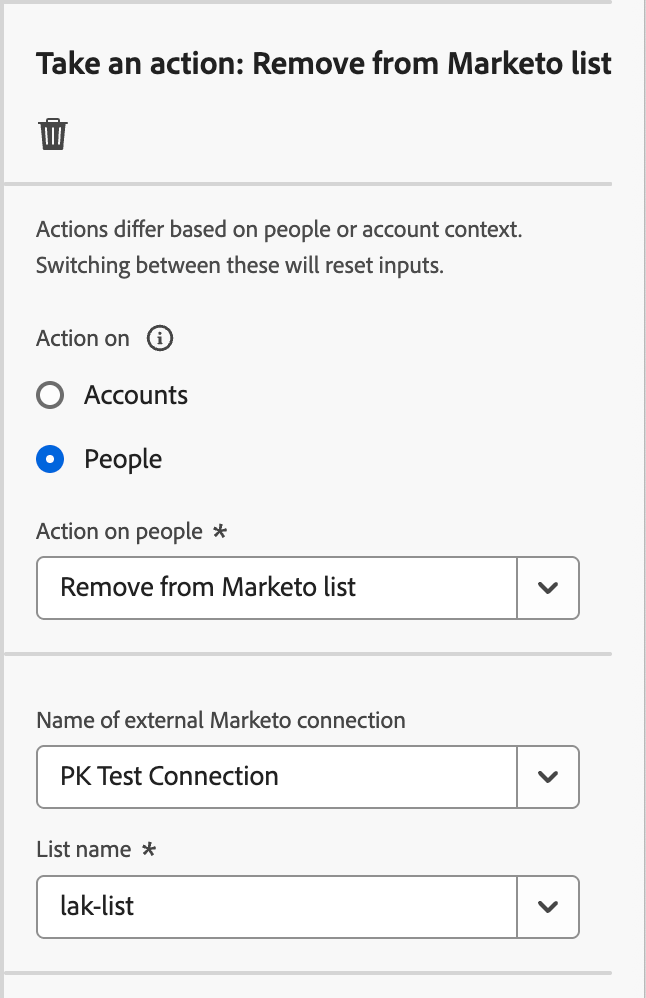{width="300"}

如果人員設定檔不是智慧清單的成員，則會忽略動作。

+++

## 概觀影片

>[!VIDEO](https://video.tv.adobe.com/v/3443256/?captions=chi_hant&learn=on)
