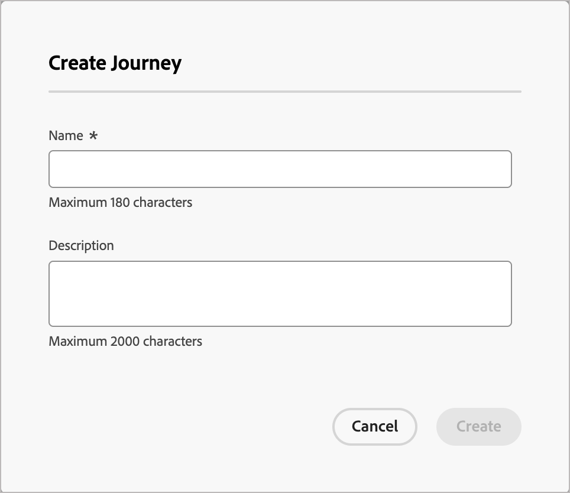
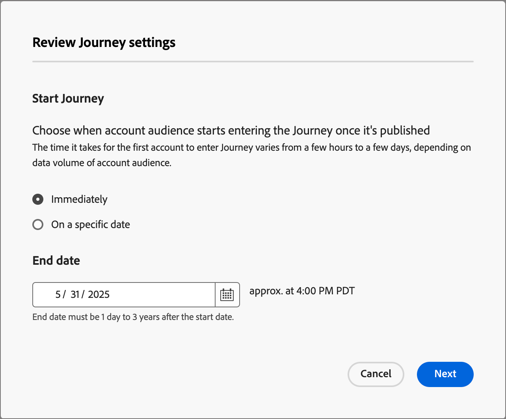

# 建置並發佈歷程

若要開始使用歷程，請建立歷程，然後在歷程地圖中建構節點和歷程流程。

{width="30"} [觀看概觀影片](#overview-video)

## 建立歷程

在左側導覽的&#x200B;**[!UICONTROL 歷程管理]**&#x200B;下，選取您要建立的歷程型別：

* **[!UICONTROL 帳戶歷程]**
* **[!UICONTROL 個人歷程]** (Beta)

新增歷程(_T):_

+++帳戶歷程

1. 按一下頁面右上角的&#x200B;**[!UICONTROL 建立帳戶歷程]**。

1. 在對話方塊中，輸入唯一的&#x200B;**[!UICONTROL Name]** （必要）和&#x200B;**[!UICONTROL Description]** （選用）。

   {width="400"}

1. 按一下&#x200B;**[!UICONTROL 建立]**。

+++

+++個人歷程(Beta)

1. 按一下頁面右上方的&#x200B;**[!UICONTROL 建立歷程]**。

1. 在對話方塊中，輸入唯一的&#x200B;**[!UICONTROL Name]** （必要）和&#x200B;**[!UICONTROL Description]** （選用）。

   {width="400"}

1. 按一下&#x200B;**[!UICONTROL 建立]**。

+++

## 歷程設計的建置區塊

_歷程地圖_&#x200B;是歷程工作區的中央區域。 您可以在此區域中新增及設定歷程節點。 按一下節點，即可開啟畫布右側的屬性窗格，並根據您的設計加以設定。 歷程一律以受眾節點開始，您可在此定義歷程的輸入：

* [帳戶對象節點](./account-audience-nodes.md)
* [個人受眾節點](./person-audience-nodes.md)

建立帳戶歷程並新增對象後，請使用節點建立歷程。 歷程地圖提供畫布，您可以在其中使用下列節點型別建置您的多步驟B2B行銷使用案例，以建構帳戶歷程：

* [採取動作](./action-nodes.md)
* [監聽事件](./listen-for-event-nodes.md)
* [分割路徑](./split-merge-paths-nodes.md)
* [等待](./wait-nodes.md)
* [合併路徑](./split-merge-paths-nodes.md)

## 護欄

為協助您建立歷程而不會發生錯誤，已設定下列護欄：

* _刪除分割路徑節點_：刪除節點需要刪除每個路徑中的所有後續節點。
* _刪除合併節點_：只有連線一個路徑時，才能刪除合併節點。 若要刪除合併節點，請僅保留一個選取的路徑。
* _在帳戶和人員之間切換_：將選取範圍從帳戶變更為人員，會刪除每個路徑中的所有後續節點。

## 新增節點

1. 導覽至歷程圖。

1. 按一下路徑上的加號( **+** )圖示，然後選取節點型別。

1. 設定右側的節點屬性。

## 刪除節點

1. 導覽至歷程圖。

1. 在右側的節點屬性中，按一下&#x200B;_刪除_ （  ）圖示。

1. 在設定對話方塊中，按一下&#x200B;**[!UICONTROL 刪除]**。

## 新增和刪除路徑

1. 導覽至歷程圖。

1. 按一下路徑上的加號( **+** )圖示，然後新增[分割路徑節點](./split-merge-paths-nodes.md#split-paths)。

1. 在右側的節點屬性中，選取&#x200B;**[!UICONTROL 帳戶]**。

1. 若要新增更多路徑，請按一下[新增路徑]。****

   當在歷程中建立每個路徑時，屬性中都會顯示新路徑卡。

1. 導覽至歷程中的其中一個路徑，並使用加號圖示將[動作](./action-nodes.md)或[事件](./listen-for-event-nodes.md)節點新增至此路徑。

1. 選取[分割路徑](./split-merge-paths-nodes.md)節點以開啟右側的屬性。

   無法刪除上面有節點的路徑。

1. 若要刪除這些路徑，必須先刪除該路徑上的所有節點。

## 排程歷程

發佈歷程時，歷程可以立即開始，或在排程的將來日期開始。 結束日期最多可自開始日期起三年。 發佈歷程後（_即時_&#x200B;狀態），您可以更新歷程的結束日期，但不能更新開始日期。

1. 導覽至歷程圖。

1. 按一下標題中的&#x200B;**[!UICONTROL 歷程設定]**&#x200B;以排程您的歷程。

1. 在對話方塊中，設定排程選項：

   * 選擇排程型別。

     若要在發佈時啟動歷程，請選擇&#x200B;**[!UICONTROL 立即]**。

     若要在未來日期啟動歷程，請選擇&#x200B;**[!UICONTROL 在特定日期]**&#x200B;並按一下&#x200B;_行事曆_&#x200B;圖示以選取日期。

     {width="400" zoomable="no"}

   * 指定歷程的&#x200B;**[!UICONTROL 結束日期]**。 從開始日期起最多可以有三年（需要此欄位才能發佈）。

1. 按一下&#x200B;**[!UICONTROL 儲存]**。

   當您準備好發佈您的歷程時，您可以在按一下&#x200B;_[!UICONTROL 發佈]_&#x200B;時檢閱這些設定。

## 發佈歷程

如果沒有封鎖程式錯誤，您可以發佈歷程。 發佈後，歷程狀態會變更為「_已上線_」。如果歷程發生錯誤，_[!UICONTROL 發佈]_&#x200B;按鈕會變暗並顯示內容資訊： `Resolve errors before publishing`。

>[!NOTE]
>
>發佈帳戶歷程後，符合資格的帳戶最久會延遲24小時以進入歷程。

1. 在歷程地圖的右上方，按一下&#x200B;**[!UICONTROL 發佈]**。

1. 在&#x200B;_[!UICONTROL 檢閱歷程設定]_&#x200B;對話方塊中，設定歷程開始選項。

   如果您已設定歷程設定來定義排程，請檢閱設定。

   如果您需要設定歷程啟用，請選擇排程型別：

   * 若要在發佈時啟動歷程，請選擇&#x200B;**[!UICONTROL 立即]**。

   * 若要在未來日期啟動歷程，請選擇&#x200B;**[!UICONTROL 在特定日期]**&#x200B;並按一下&#x200B;_行事曆_&#x200B;圖示以選取日期。

1. 如有需要，請指定歷程的&#x200B;**[!UICONTROL 結束日期]**。

   {width="400" zoomable="no"}

   從開始日期起最多可以有三年（需要此欄位才能發佈）。

1. 按一下&#x200B;**[!UICONTROL 下一步]**。

1. 在確認對話方塊中，按一下&#x200B;**[!UICONTROL 發佈]**。

## 概觀影片

>[!VIDEO](https://video.tv.adobe.com/v/3443204/?learn=on)
