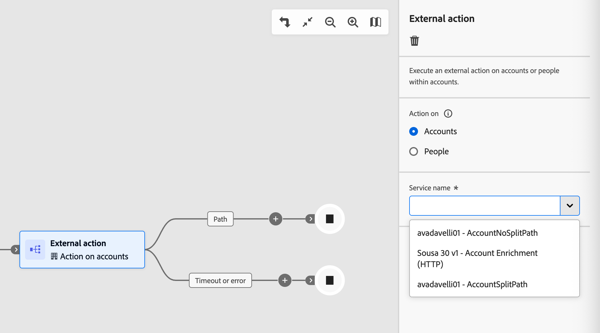
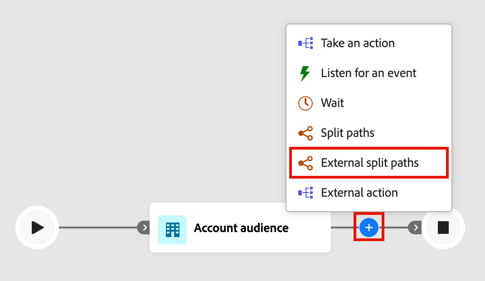
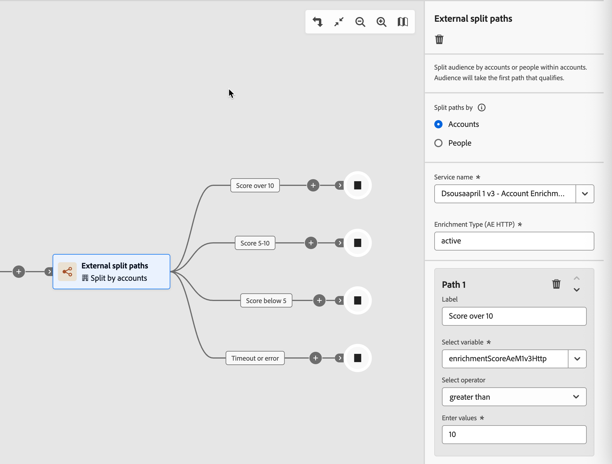

# 外部節點

使用外部節點將您的歷程連結到外部服務。 當對象到達其中一個節點時，[!DNL Journey Optimizer B2B Edition]會非同步地將對象屬性資料傳送至外部服務。 此服務會使用回呼處理資料及回應，傳回對象資訊和歷程用來繼續的中繼資料。

>[!NOTE]
>
>管理員必須[設定並啟動外部動作](../admin/configure-external-actions.md)，行銷人員才能在歷程中新增並實作這些節點。

有兩種外部動作節點型別：

* **[外部動作](#external-action)** — 呼叫外部服務並沿著單一傳出路徑繼續。 當您想要在不分支邏輯的情況下觸發外部流程時（例如更新外部系統中的記錄或傳送訊號至下游服務），請使用此節點。
* **[外部分割路徑](#external-split-paths)** — 呼叫外部服務並評估回應，以沿著數個已定義的路徑之一路由帳戶或人員。 當外部服務傳回值（例如分數或階層）並決定歷程的下一個步驟時，請使用此節點。

## 外部動作節點 {#external-action}

_外部動作_&#x200B;節點會呼叫外部服務並沿著單一傳出路徑繼續，無論回應內容為何。 將其用於外部呼叫後不需要分支的整合。

1. 導覽至帳戶或個人歷程畫布。

1. 按一下路徑上的加號( **+** )圖示，然後選擇&#x200B;**[!UICONTROL 外部動作]**。

   {width="400"}

1. （僅限帳戶歷程）在右側的節點屬性中，針對外部動作設定&#x200B;]**內容上的**[!UICONTROL &#x200B;動作：

   * 當您想要將外部動作套用至節點路徑上屬於帳戶的所有人員時，請選擇&#x200B;**[!UICONTROL 帳戶]**。
   * 當您想要將變更套用至節點路徑上的所有人員時，請選擇&#x200B;**[!UICONTROL 人員]**。

1. 選取外部&#x200B;**[!UICONTROL 服務名稱]**。

   {width="600" zoomable="yes"}

   此清單包含所有已設定的外部動作，這些外部動作是作用中且指定給&#x200B;_外部動作_&#x200B;型別和內容。

1. 如果服務具有全域屬性，請在服務名稱下方顯示的欄位中輸入必要值。

1. 繼續從節點的傳出路徑建置歷程。

   _[!UICONTROL 逾時或錯誤]_&#x200B;路徑會自動建立。 如果逾時期間（如服務中所設定）在收到回應之前經過，則帳戶或人員會沿此路徑前進。 如果收到錯誤回應，也同樣適用。 若要處理這些案例，您可以將歷程節點新增至此路徑，否則對象成員的歷程會終止。

## 外部分割路徑節點 {#external-split-paths}

「外部分割路徑」節點會呼叫外部服務，並使用回應來決定接下來要採用哪些路徑。 以外部服務傳回的變數（存取子）為基礎的條件可定義每個路徑。 歷程會根據定義的路徑條件評估回應，並沿著第一個相符路徑路由每個帳戶或人員。 路徑條件會以由上到下的順序評估。 每個帳戶或人員都會沿著其條件符合外部服務傳回值的第一個路徑前進。

1. 導覽至帳戶或個人歷程畫布。

1. 按一下路徑上的加號( **+** )圖示，然後選擇&#x200B;**[!UICONTROL 外部分割路徑]**。

   {width="400"}

1. （僅限帳戶歷程）在右側的節點屬性中，選擇&#x200B;**[!UICONTROL 依型別]**&#x200B;分割路徑：

   * **[!UICONTROL 帳戶]** — 針對依帳戶分割的路徑，您可以在定義的路徑中新增帳戶和人員節點。
   * **[!UICONTROL 人員]** — 針對依人員分割的路徑，您只能在定義的路徑內新增人員動作節點。 以人物為基礎的分割會使用&#x200B;_[!UICONTROL 合併路徑]_&#x200B;節點自動關閉，因此所有人員都可以前進到下一個步驟，而不會失去其帳戶內容。

1. 選取&#x200B;**[!UICONTROL 服務名稱]**。

1. 如果服務組態有&#x200B;_全域屬性_，請在服務名稱下方的欄位中輸入必要的值。

1. 針對&#x200B;_[!UICONTROL 路徑1]_，定義分支條件：

   * 對於&#x200B;**[!UICONTROL 標籤]**，請以更具說明性的標籤取代預設值。
   * 針對&#x200B;**[!UICONTROL 選取變數]**，請選擇存取子。 存取子是外部服務傳回的值，並在設定動作時定義。
   * 針對&#x200B;**[!UICONTROL 選取運運算元]**，選擇運運算元。
   * 針對&#x200B;**[!UICONTROL 輸入值]**，請輸入要比對的值。

   {width="600" zoomable="yes"}

   >[!NOTE]
   >
   >可用的條件變數和支援的歷程內容（_帳戶_、_人員_&#x200B;或帳戶&#x200B;_中的_&#x200B;人員）由外部動作設定決定。 如果預期的服務或變數無法使用，請聯絡管理員。

1. 若要新增更多路徑，請按一下&#x200B;**[!UICONTROL 新增路徑]**，並為您需要的每個路徑定義條件。

1. 繼續從節點的每個傳出路徑建置歷程。

   _[!UICONTROL 逾時或錯誤]_&#x200B;路徑會自動建立。 如果逾時期間（如服務中所設定）在收到回應之前經過，則帳戶或人員會沿此路徑前進。 如果收到錯誤回應，也同樣適用。 若要處理這些案例，您可以將歷程節點新增至此路徑，或對象成員的歷程結束。

1. 若要視需要合併&#x200B;_依帳戶分割_&#x200B;的兩個或多個路徑，您可以新增[合併路徑節點](./split-merge-paths-nodes.md#merge-paths)。
