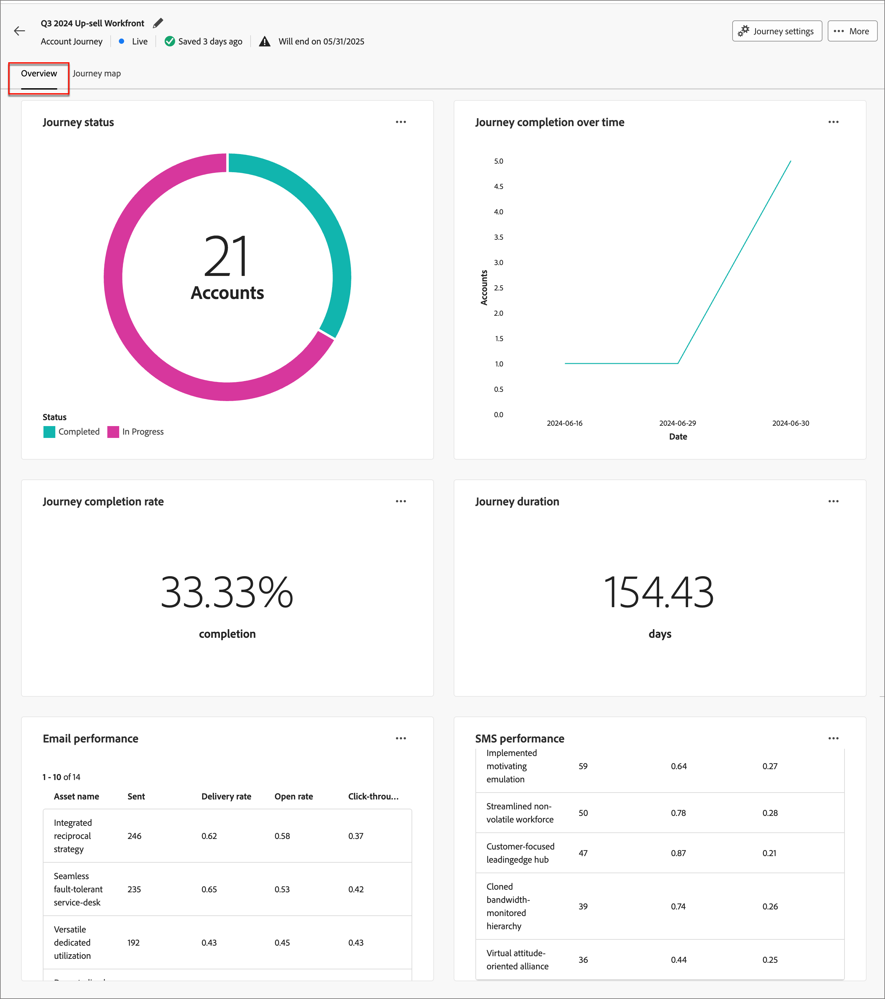
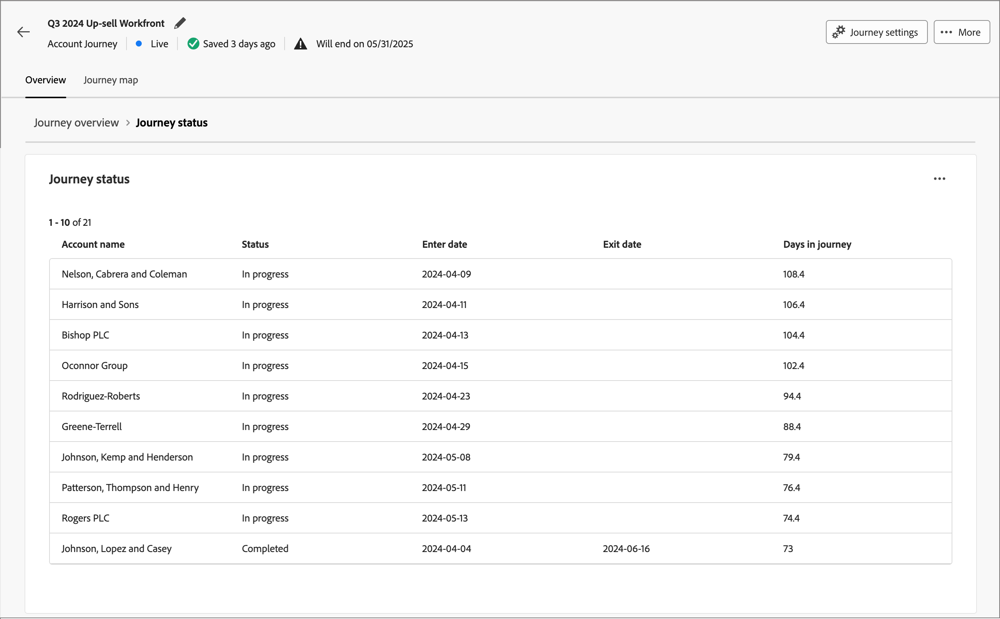
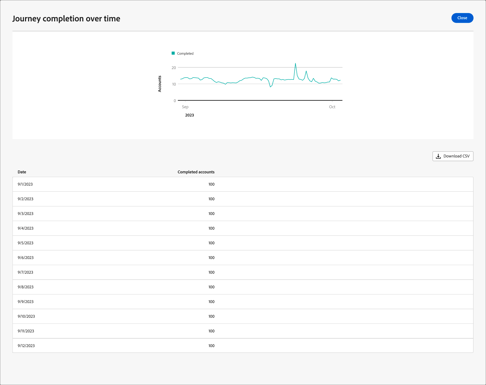

# 歷程詳細資料

當您按一下使用中帳戶歷程的名稱時，會顯示歷程詳細資料。 _[!UICONTROL 總覽]_&#x200B;索引標籤提供有關歷程的有用資訊，包括產生式AI摘要。

此儀表板提供所選帳戶歷程的完整概觀，使用圓形和折線圖詳細說明帳戶進度，該圖表會分類和量化完成、進行中的活動以及一段時間內的中止。 它可協助行銷人員透過關鍵傳送和參與量度來評估電子郵件和簡訊管道的有效性。

此概覽適用於已發佈的帳戶歷程，資料大約需要四個小時才能開始填入圖表和表格。

{width="700" zoomable="yes"}

## 歷程完成

本節介紹兩個完成量度：

* **[!UICONTROL 歷程狀態]** — 此圓形圖提供歷程狀態的劃分，方法是將帳戶分類為&#x200B;_已完成_、_進行中_&#x200B;和&#x200B;_已中止_。 每個區段在圖表的外邊緣會加上對應的百分比與科目編號標籤。
* **[!UICONTROL 一段時間的歷程完成]** — 此折線圖追蹤一段時間內完成其歷程的帳戶數。 水平軸對應時間軸，而垂直軸則量化帳戶，提供直接的完成趨勢檢視。

## 歷程參與

本節介紹兩個完成量度：

* **[!UICONTROL 帳戶參與率]** — 此圓形圖表會將歷程中的帳戶分割為&#x200B;_已參與_&#x200B;和&#x200B;_未參與_&#x200B;類別。 中央圖顯示總計數。 此視覺效果可讓您一目瞭然地瞭解整體帳戶參與情形。
* **參與的人員** — 此視覺效果會顯示歷程中符合&#x200B;_參與資格_&#x200B;的人員總數。

## 歷程績效

本節提供兩個重要的量度：

* **[!UICONTROL 歷程完成率]** — 已成功完成其歷程的帳戶百分比。
* **[!UICONTROL 歷程持續時間]** — 帳戶完成歷程所花費的平均時間長度。

## 電子郵件和簡訊效能

效能表可讓您詳細瞭解電子郵件和簡訊通道的成效。 每個表格都會顯示傳送率和點進率等量度，協助您評估每個通訊接觸點的影響。

**[!UICONTROL 電子郵件效能]**&#x200B;資料表資料行：

* _[!UICONTROL 資產名稱]_ — 資產名稱
* _[!UICONTROL 已傳送]_ — 已傳送的電子郵件數目
* _[!UICONTROL 傳遞率]_ — 傳遞的電子郵件數目除以傳送的數目
* _[!UICONTROL 開啟率]_ — 開啟的電子郵件數目除以傳遞的數目
* _[!UICONTROL 點進率]_ — 點按電子郵件數除以傳遞數目

**[!UICONTROL SMS效能]**&#x200B;資料表資料行：

* _[!UICONTROL 資產名稱]_ — 資產名稱
* _[!UICONTROL 已傳送]_ — 已傳送的簡訊數目
* _[!UICONTROL 傳遞率]_ — 傳遞的SMS訊息數除以傳送的訊息數
* _[!UICONTROL 點進率]_ — 點按SMS訊息數除以傳送的訊息數
<!-- 
To generate a shareable PDF of your current view, click **[!UICONTROL Export]** at the top right of the page. -->

## 增強互動

使用每個圖表或表格右上角的動作圖示(**...**)，進一步與資料互動。

### 鑽研

對於&#x200B;_[!UICONTROL 歷程狀態]_&#x200B;圖表，請選擇&#x200B;**[!UICONTROL 鑽研]**&#x200B;以深入分析個別帳戶狀態。

{width="600" zoomable="yes"}
<!--
The applied global filters are carried over to the view and displayed at the top. Click the _Filter_ icon at the top left to filter the data display by journey.-->

### 檢視更多

選擇&#x200B;**[!UICONTROL 檢視更多]**&#x200B;以存取延伸資料。 顯示的快顯視窗提供資料的劃分。

{width="600" zoomable="yes"}

若要下載資料，請按一下資料表格右上角的&#x200B;**[!UICONTROL 下載CSV]**。 若要返回&#x200B;_總覽_&#x200B;儀表板，請按一下&#x200B;**[!UICONTROL 關閉]**。
