# 帳戶歷程節點

在您[建立帳戶歷程](journey-overview.md#create-an-account-journey)並[新增對象](journey-overview.md#add-the-account-audience-for-your-journey)之後，使用節點建置歷程。 歷程地圖提供畫布，您可以在其中建立多步驟B2B行銷使用案例。

將不同的動作、事件和協調流程節點視為多步驟、跨管道的情境，藉此建立您的帳戶歷程。 歷程的每個節點代表邏輯路徑上的一個步驟。

## 帳戶對象節點

[帳戶對象](journey-overview.md#add-the-account-audience-for-your-journey)節點定義了歷程的輸入帳戶對象(在Adobe Experience Platform中建立和管理)。 此節點永遠是第一個節點，預設會自動建立。

## 採取動作

執行動作，例如傳送電子郵件、變更分數等。

**帳戶上的動作**：動作已套用至此路徑上屬於帳戶的所有人員。

**對人員的動作**：動作已套用至此路徑上的所有人員。 針對人員的動作可用於依人員拆分路徑或依帳戶拆分路徑中。

| 節點內容 | 函數 | 限制 |
| ------------ | -------- | ----------- |
| [人員](#add-a-people-action) | 指派給購買群組 | 選取方案興趣 選取角色 |
| | 從購買群組移除 | 選取解決方案興趣 |
| | 傳送簡訊 | 建立簡訊 |
| | 新增至Marketo Engage請求行銷活動 | 選取Marketo Engage工作區 選取要求行銷活動 |
| | 變更Marketo Engage中的人員分割 | 新磁碟分割 |
| | 個人有趣的時刻 | 型別 描述 |
| | 變更分數 | 分數名稱 變更 |
| | 傳送電子郵件 | 建立新電子郵件 從Marketo Engage中選取電子郵件 |
| [帳戶](#add-an-account-action) | 傳送銷售警報 | 選取感興趣的解決方案 傳送電子郵件至 |
| | 將帳戶新增至（其他）歷程 | 選取即時帳戶歷程 |
| | 更新購買群組狀態 | 方案興趣 狀態（必要，最多50個字元） |
| | 從（目前）歷程中移除帳戶 | 選取即時帳戶歷程 |
| | 帳戶有趣的時刻 | 型別（電子郵件、里程碑或網頁） 說明（選擇性） |
| | 帳戶變更資料值 | 選取屬性 新值 |

### 新增帳戶動作

1. 導覽至歷程編輯器。

1. 按一下路徑上的加號( **+** )圖示，然後選擇&#x200B;**[!UICONTROL 執行動作]**。

   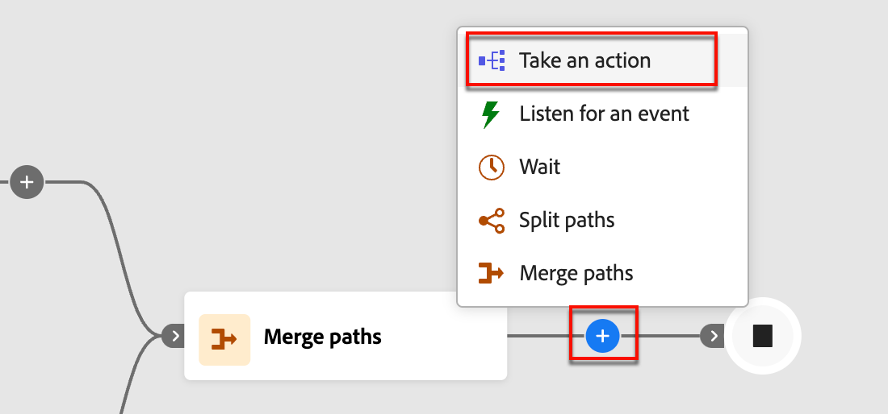{width="400"}

1. 在右側的節點屬性中，選擇動作的&#x200B;**[!UICONTROL 帳戶]**。

1. 從清單中選取動作，並設定該動作的任何值。

   {width="700" zoomable="yes"}

### 新增人員動作

1. 導覽至歷程編輯器。

1. 按一下路徑上的加號( **+** )圖示，然後選擇&#x200B;**[!UICONTROL 執行動作]**。

1. 在右側的節點屬性中，選擇動作的&#x200B;**[!UICONTROL 人員]**。

1. 從清單中選取動作，並設定該動作的任何值。

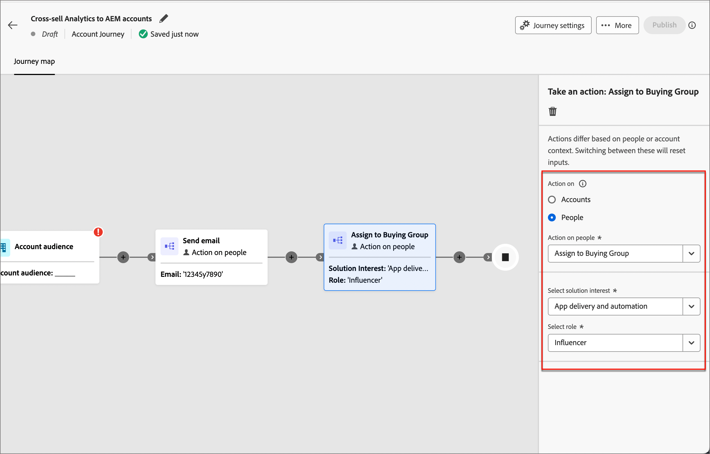{width="700" zoomable="yes"}

## 接聽事件

事件發生時，將您的對象移至歷程的下一個步驟。

* 您也可以定義歷程等待此事件的時間長度。 歷程在逾時後結束。
* 此外，您可以選擇在逾時路徑上新增其他節點。

**接聽帳戶上的事件**：如果帳戶中至少有一個人觸發事件，則帳戶會前進到歷程的下一個步驟。

**接聽人物上的事件**：人物上的事件只能套用至帳戶路徑；它無法用於依人物節點分割。

| 節點內容 | 函數 | 限制 |
| ------------ | -------- | ----------- |
| [人員](#add-a-people-event) | 資料值變更 | 屬性 其他限制（選擇性） 逾時（選擇性） |
| | 電子郵件中的點按連結 | 電子郵件 其他限制（選擇性） 逾時（選擇性） |
| | 已指派給購買群組 | 方案興趣 其他限制（選擇性） 逾時（選擇性） |
| | 開啟電子郵件 | 電子郵件 其他限制（選擇性） 逾時（選擇性） |
| | 分數已變更 | 分數名稱 其他限制（選擇性） 逾時（選擇性） |
| | 已從購買群組移除 | 方案興趣 活動日期（選擇性） 逾時（選擇性） |
| [帳戶](#add-an-account-event) | 購買群組狀態的變更 | 方案興趣 其他限制（選擇性） 逾時（選擇性） |
| | 完整度分數的變更 | 方案興趣 其他限制（選擇性） 逾時（選擇性） |
| | 帳戶有一個有趣的時刻 | 型別 其他限制（選擇性） 逾時（選擇性） |
| | 參與分數的變更 | 方案興趣 其他限制（選擇性） 逾時（選擇性） |
| | 帳戶資料值的變更 | 屬性 其他限制（選擇性） 逾時（選擇性） |

### 新增帳戶事件

1. 導覽至歷程編輯器。

1. 按一下路徑上的加號( **+** )圖示，然後選擇&#x200B;**[!UICONTROL 接聽事件]**。

1. 在右側的節點屬性中，為事件型別選擇&#x200B;**[!UICONTROL 帳戶]**。

   {width="700" zoomable="yes"}上的事件

1. 從清單中選取事件。

1. 按一下&#x200B;**[!UICONTROL 編輯事件]**&#x200B;並定義事件的詳細資料。

### 新增人員事件

1. 導覽至歷程編輯器。

1. 按一下路徑上的加號( **+** )圖示，然後選擇&#x200B;**[!UICONTROL 接聽事件]**。

1. 在右側的節點屬性中，選擇事件型別的&#x200B;**[!UICONTROL 人員]**。

   {width="700" zoomable="yes"}

1. 從清單中選取事件。

1. 按一下&#x200B;**[!UICONTROL 編輯事件]**&#x200B;並定義事件的詳細資料。

### 將逾時新增至事件節點

如有需要，請定義歷程等待事件的時間長度。 歷程在逾時後結束。

1. 啟用逾時切換。

1. 選取歷程在逾時前等待事件發生的持續時間。

   您可以選擇在此結束路徑，或透過設定其他路徑採取不同的動作。

1. 若要在歷程中建立新路徑，以便在事件未發生時新增適用於帳戶的動作和事件，請選取&#x200B;**[!UICONTROL 設定逾時路徑]**&#x200B;核取方塊。

   {width="700" zoomable="yes"}

## 分割路徑

根據篩選條件分割您的對象。

>[!NOTE]
>
>最多支援25個路徑。

**依帳戶分割路徑**：依帳戶分割的路徑可同時包含帳戶和人員動作與事件，而且這些路徑可進一步分割。

_依帳戶節點分割路徑如何運作？_

* 當您新增分割路徑節點並選擇&#x200B;_帳戶_&#x200B;時，新增的每個路徑都會包含一個能夠新增節點到每個邊緣的結束節點。
* 可以重複地依「帳戶」分割路徑，例如以巢狀方式。 分割路徑包含不新增預設路徑的選項。
* 不符合其中一個分割路徑資格的帳戶/人員不會在歷程中前進。
* 這些路徑可以使用合併節點來組合。

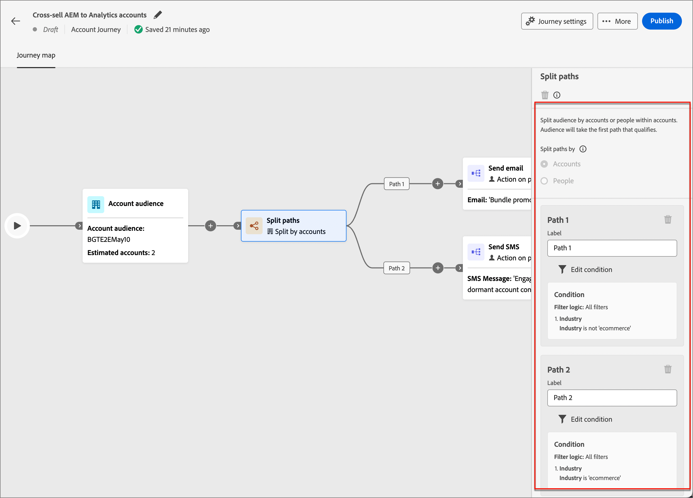{width="700" zoomable="yes"}

**依人員分割路徑**：依人員分割的路徑只能包含人員動作，且這些路徑無法再次分割。 路徑會自動加入。

_依人員節點分割路徑如何運作？_

* 依人員節點分割路徑會設為群組節點。 這些帳戶會自動合併，以便讓對象中的所有人都能前進到下一個步驟，而不會失去其所屬帳戶的內容。
* 人員的拆分路徑不能以巢狀方式顯示，您無法在位於此群組節點的路徑中為人員新增拆分路徑。
* 分割路徑包含不新增預設路徑的選項。 不符合資格的帳戶/人員不會在歷程中前進。

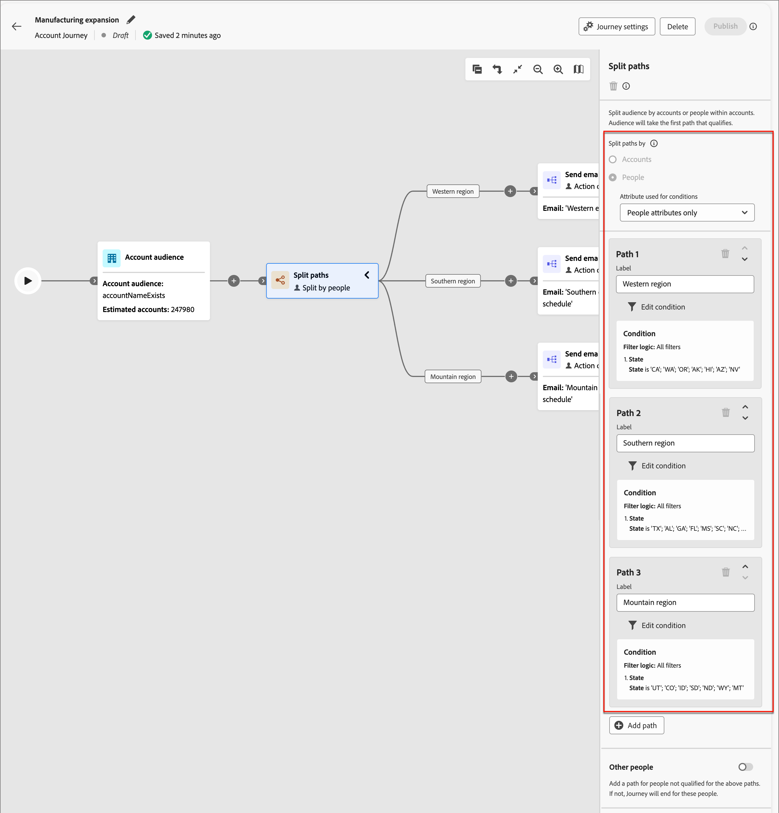{width="700" zoomable="yes"}

| 節點內容 | 路徑條件 | 說明 |
| ------------ | -------- | ----------- |
| [人員](#add-a-split-path-by-people-node) | 個人屬性 | |
| | 資料值已變更（例如篩選活動歷史記錄） | |
| | 已開啟的電子郵件 | |
| | 電子郵件中的點選連結 | |
| | 網頁上的點按連結 | |
| | 有個有趣的時刻 | |
| | 購買群組的成員 | |
| [帳戶](#add-a-split-path-by-account-node) | 帳戶資料值的變更（例如篩選活動歷史記錄） | |

### 依帳戶節點新增分割路徑

1. 導覽至歷程編輯器。

1. 按一下路徑上的加號( **+** )圖示，然後選擇&#x200B;**[!UICONTROL 分割路徑]**。

   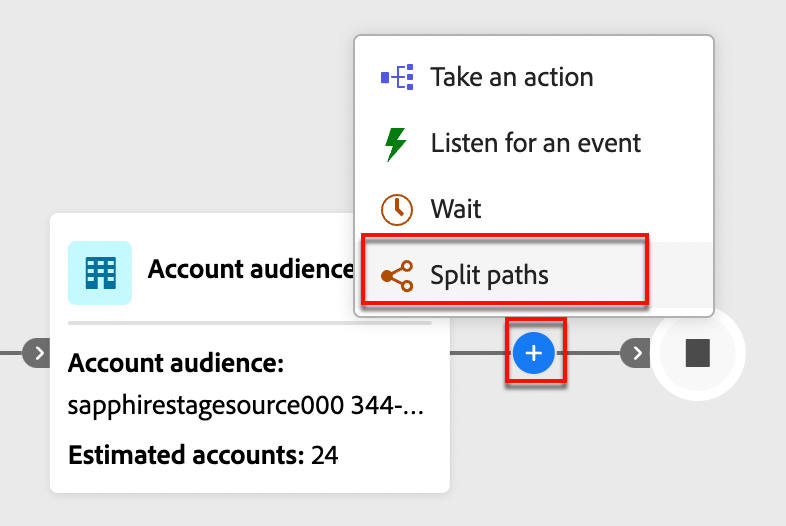{width="300"}

1. 在右側的節點屬性中，選擇&#x200B;**[!UICONTROL 帳戶]**&#x200B;進行分割。

1. 若要定義適用於&#x200B;_[!UICONTROL 路徑1]_&#x200B;的條件，請按一下&#x200B;**[!UICONTROL 套用條件]**。

   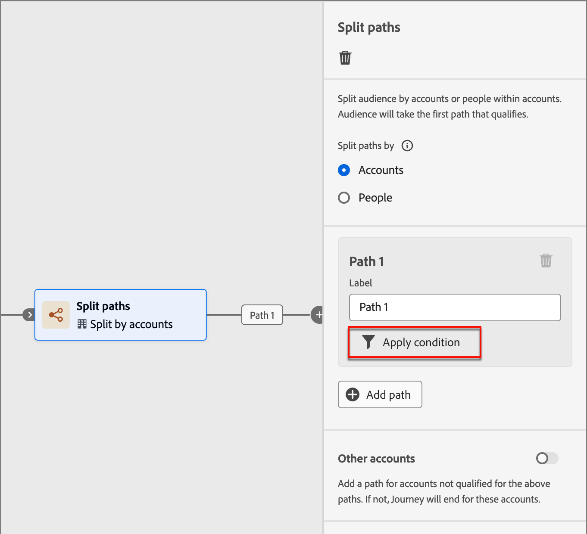{width="500"}

1. 在條件編輯器中，新增一或多個篩選器以定義分割路徑。

   * 從左側導覽拖放篩選器屬性，並完成比對定義。

   * 在上方套用&#x200B;**[!UICONTROL 篩選邏輯]**，微調條件。 您可以選擇符合所有屬性條件或任何條件。

     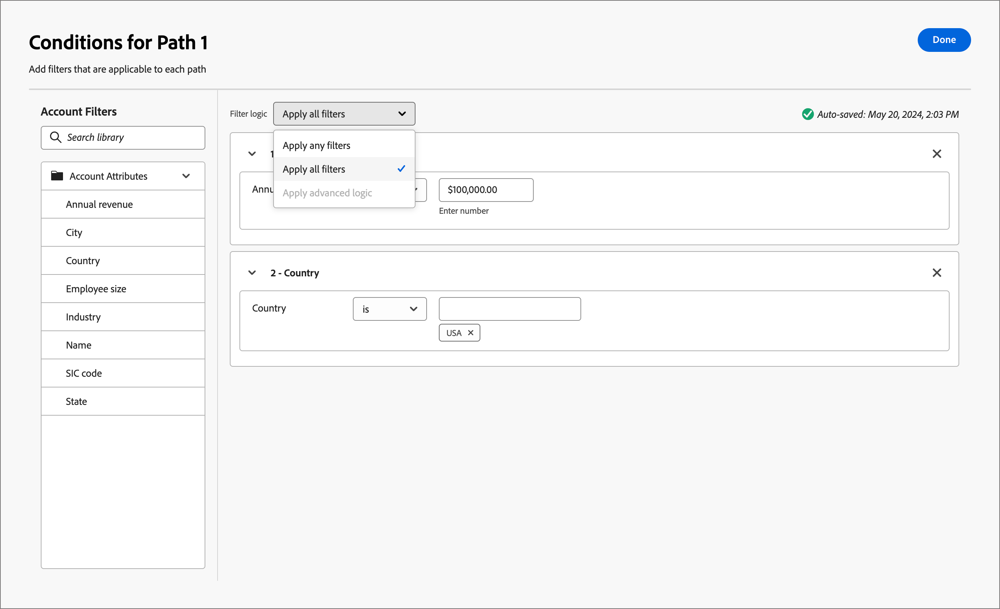{width="700" zoomable="yes"}

   * 按一下&#x200B;**[!UICONTROL 「完成」]**。

1. 若要新增更多路徑，請按一下[新增路徑] ****，並重複先前步驟以新增適用於此路徑的條件。

   您也可以根據這些條件來標示每個路徑，或使用預設標籤。

1. （選用）為不符合其他路徑資格的帳戶新增預設路徑。 如果沒有，歷程將針對這些帳戶結束。

   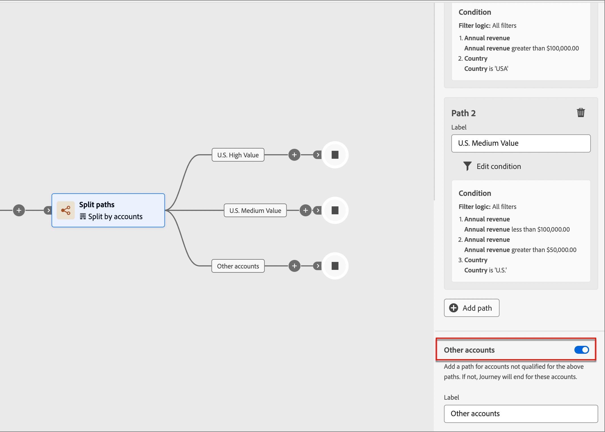{width="700" zoomable="yes"}

### 依人員節點新增分割路徑

1. 導覽至歷程編輯器。

1. 按一下路徑上的加號( **+** )圖示，然後選擇&#x200B;**[!UICONTROL 分割路徑]**。

   {width="300"}

1. 在右側的節點屬性中，選擇&#x200B;**[!UICONTROL 人員]**&#x200B;進行分割。

1. 若要定義適用於&#x200B;_[!UICONTROL 路徑1]_&#x200B;的條件，請按一下&#x200B;**[!UICONTROL 套用條件]**。

1. 在條件編輯器中，新增一或多個篩選器以定義分割路徑。

   * 從左側導覽拖放篩選器屬性，並完成比對定義。

   * 在上方套用&#x200B;**[!UICONTROL 篩選邏輯]**，微調條件。 您可以選擇符合所有屬性條件或任何條件。

   * 按一下&#x200B;**[!UICONTROL 「完成」]**。

1. 若要新增更多路徑，請按一下[新增路徑] ****，並重複先前步驟以新增適用於此路徑的條件。

   您也可以根據這些條件來標示每個路徑，或使用預設標籤。

1. 最後，您可以為不符合上述路徑資格的人新增預設路徑。 如果沒有，歷程將針對這些人員結束

當您針對在人員層級分割對象的每個路徑定義條件時，您可以新增要對人員採取的動作。

>[!NOTE]
>
>依人員分割對象時，只能新增人員動作。

## 等待

請等候一段特定時間，再繼續進行下一個步驟。

1. 導覽至歷程編輯器。

1. 按一下路徑上的加號( **+** )圖示，然後選擇&#x200B;**[!UICONTROL 等待]**。

1. 在右側的節點屬性中，設定在歷程繼續前往路徑中的下一個節點之前等待的&#x200B;**[!UICONTROL 持續時間]**&#x200B;時間。

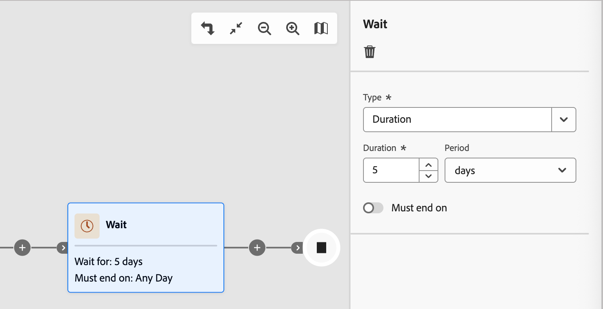{width="700" zoomable="yes"}

## 合併路徑

您可以使用此節點合併及取消合併歷程中的不同路徑。

1. 導覽至歷程編輯器。

1. 按一下路徑上的加號( **+** )圖示，然後選擇&#x200B;**[!UICONTROL 分割路徑]**。

1. 按一下分割節點以開啟其右側屬性。

1. 按一下[!UICONTROL 新增路徑]以建立三個路徑。

1. 將動作和事件的組合新增至每個路徑。

1. 按一下任一路徑的加號( **+** )圖示，然後從顯示的選項中選擇&#x200B;**[!UICONTROL 合併]**。

   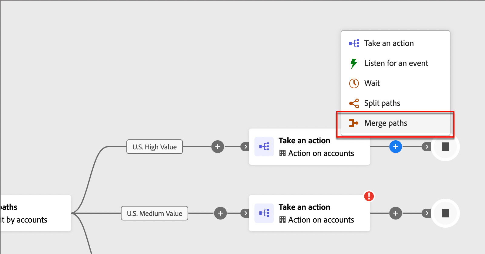{width="400"}

1. 在合併節點屬性中，選取您要合併的路徑。

   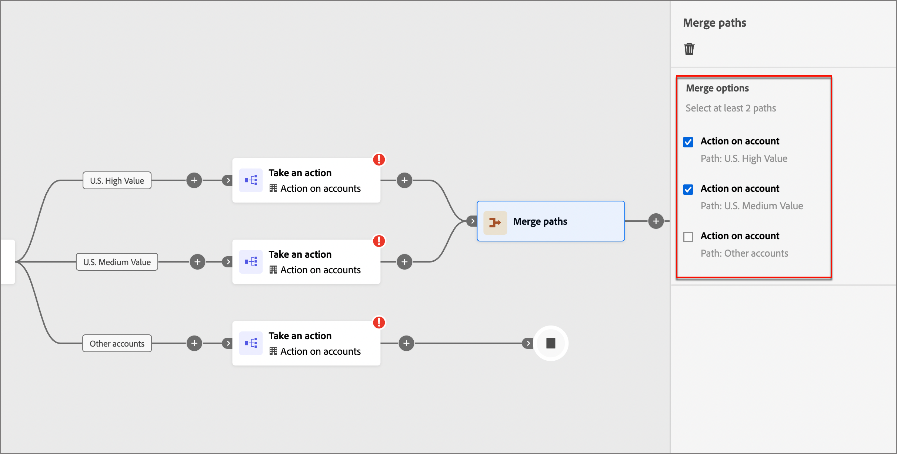{width="600" zoomable="yes"}

   您現在應該會看到路徑已合併，因此來自所選路徑的帳戶可合併為單一路徑，並且可以繼續完成歷程。

1. 如有需要，您可以導覽回合併節點屬性，並清除您要移除之任何路徑的核取方塊，以取消合併路徑。
