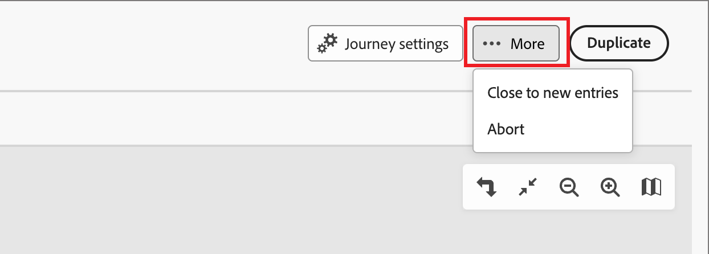
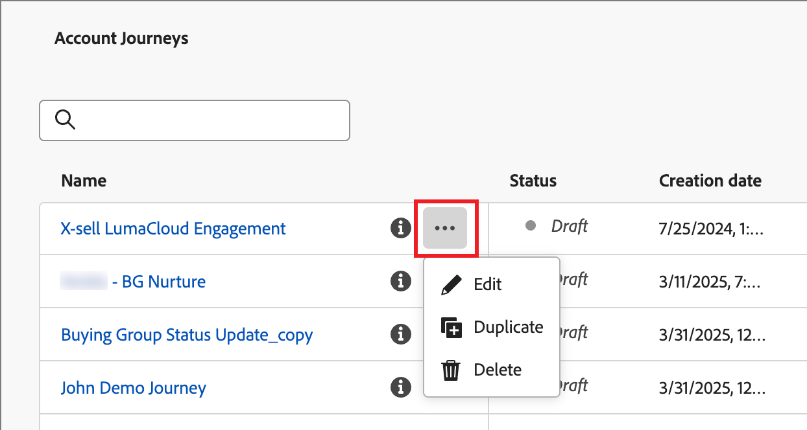
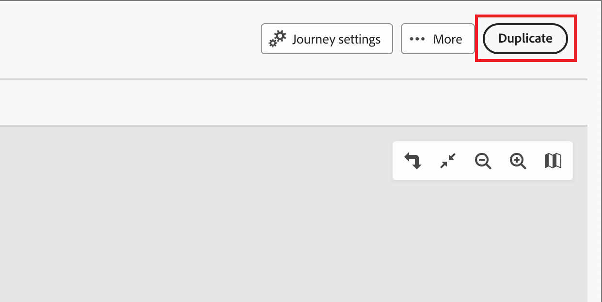

# 帳戶歷程

您可以利用帳戶歷程來簡化需求開發和購買群組資格鑑定的工作，並為您的贏取客戶、向上銷售/交叉銷售及保留客戶方案創造更多合格需求。透過涵蓋電子郵件、簡訊、活動等管道的自動化參與機制，為每個購買群組和購買群組成員量身打造歷程。

定義銷售導向的參與度機制，涵蓋電子郵件、簡訊以及更多內部帳戶歷程，以協調每個購買群組成員的集客式行銷和推播式銷售活動。

{width="30"} [觀看概觀影片](#overview-video)

## 開始使用歷程

若要開始使用帳戶歷程：

1. [建立歷程](./create-publish-journey.md#create-an-account-journey)。
1. 在歷程圖中[新增節點](./create-publish-journey.md#add-a-node)，並[定義歷程流程圖](./create-publish-journey.md#add-and-delete-a-path)。
1. [發佈此歷程](./create-publish-journey.md#publish-an-account-journey)。

## 存取並瀏覽帳戶歷程

在左側導覽中，按一下「**[!UICONTROL 帳戶歷程]**」。

{width="800" zoomable="yes"}

顯示的歷程頁面包括下列欄：

* [!UICONTROL 名稱] (按一下此名稱來開啟歷程以進行編輯)
* [!UICONTROL 狀態]
* [!UICONTROL 說明]
* [!UICONTROL 建立者]
* [!UICONTROL 上次更新日期]
* [!UICONTROL 上次更新者]
* [!UICONTROL 發佈日期]
* [!UICONTROL 發佈者]

使用頂部的&#x200B;_搜尋_&#x200B;工具按名稱尋找歷程。您可以點選欄標題，按「_[!UICONTROL 狀態]_」進行清單排序。

您可以按一下右上角的「_自訂表格_」() 圖示來自訂表格中顯示的欄位。選取或清除對話框中的核取方塊，然後按一下「**[!UICONTROL 套用]**」。

{width="800" zoomable="yes"}

## 帳戶歷程剖析

按一下「_[!UICONTROL 帳戶歷程]_」清單中的名稱 (顯示為連結) 來檢視其詳細資訊、進行變更及採取動作。

{width="800" zoomable="yes"}

每個帳戶歷程圖的標頭包括：

* 歷程名稱
* 存取並編輯歷程名稱 (_「編輯」_&#x200B;圖示)
* 歷程狀態

根據您套用的動作，歷程狀態可能會變更。根據歷程狀態，您可以或無法從標頭右側執行某些動作。

| 狀態 | 說明 | 可用的動作 |
| ------ | ----------- | ----------------- |
| _**草稿**_ | 未發佈且可以編輯的歷程。 | <ul><li>[發佈](./create-publish-journey.md#publish-an-account-journey)</li><li>重複 </li><li>刪除 </li></ul> |
| _**已上線**_ | 歷程發佈後，歷程狀態會從「草稿」變更為「已上線」。在此狀態下，您將無法編輯歷程。 | <ul><li>重複 </li><li>對新進客戶關閉 </li><li>中止 </li></ul> |
| _**對新進客戶關閉**_ | 當您在頂端導覽區域按一下「_對新進客戶關閉_」，此歷程狀態會從「_已上線_」變更為「[!UICONTROL 對新進客戶關閉]」。 | <ul><li>重複 </li><li>中止 </li></ul> |
| _**已中止**_ | 中止歷程時，原本的「_已上線_」或「_對新進客戶關閉_」歷程狀態將會發生變更。中止的歷程無法重新啟動。 | <ul><li>重複 </li><li>刪除 </li></ul> |
| _**已完成**_ | 當歷程中的所有帳戶均完成此歷程時，其狀態會從「已上線」或「對新進客戶關閉」變更為「已完成」。 | <ul><li>重複 </li><li>刪除 </li></ul> |

## 管理歷程

_帳戶歷程_&#x200B;清單包含您的 Journey Optimizer B2B Edition 執行個體的所有歷程。

### 中止歷程

如果您中止 (停止) 已上線或已排程的歷程，則歷程中的帳戶會立即停止其進度，且不再允許後續客群進入歷程。中止的歷程無法重新啟動。

>[!IMPORTANT]
>
>當帳戶歷程在另一個歷程的「_採取動作_」節點中，使用「_將帳戶新增至 (其他) 歷程_」動作時，中止歷程會阻止該歷程執行那個動作。

1. 按一下歷程名稱來開啟。

1. 按一下右上角的&#x200B;**[!UICONTROL 「更多...」]**&#x200B;選單，然後選擇「**[!UICONTROL 中止]**」。

   {width="450"}

1. 在確認對話框中，按一下「**[!UICONTROL 中止]**」。

### 對新進客戶關閉

如果您關閉已上線的歷程，則目前在歷程中的帳戶會繼續在該歷程中的路徑，且不再允許後續客群進入歷程。已關閉的歷程無法重新啟動。您可以重複已關閉的歷程。

>[!IMPORTANT]
>
>當帳戶歷程在另一個歷程的「_採取動作_」節點中，使用「_將帳戶新增至 (其他) 歷程_」動作時，對新進客戶關閉會阻止該歷程執行那個動作。

1. 按一下歷程名稱來開啟。

1. 按一下右上角的&#x200B;**[!UICONTROL 「更多...」]**&#x200B;選單，然後選擇「**[!UICONTROL 對新進客戶關閉]**」。

1. 在確認對話框中，按一下「**[!UICONTROL 對新進客戶關閉]**」。

### 重複歷程

重複動作類似於原地複製功能，但重複的歷程不會包括任何已建立的歷程內容資產。您可以重複帳戶歷程的詳細資訊，或僅重複流程和路徑架構的&#x200B;_基本框架_。

1. 按一下歷程名稱旁的&#x200B;_「更多」_&#x200B;圖示 (**...**)，然後選擇「**[!UICONTROL 重複]**」。

   {width="450"}

   根據帳戶歷程的狀態，您還可以從歷程詳細資訊或歷程圖中存取重複動作：

   * 針對草稿歷程，請按一下右上角的&#x200B;**[!UICONTROL 「更多...」]**&#x200B;選單，然後選擇「**[!UICONTROL 重複]**」。

   * 對於所有其他歷程狀態，請按一下右上角的「**[!UICONTROL 重複]**」。

     {width="450"}

1. 在「_重複歷程_」對話框中，設定新歷程的「**[!UICONTROL 名稱]**」和「**[!UICONTROL 描述]**」。

   預設情況下，對話框使用重複歷程的名稱並加上 __copy_。依需要為歷程輸入另一個唯一名稱。

   {width="400"}

1. 選擇重複的「**[!UICONTROL 類型]**」：

   * **[!UICONTROL 部分內容重複]** - 使用此類型複製歷程中所有內容，但不包括任何已建立的電子郵件或 SMS 訊息。參照 Marketo Engage 電子郵件或 SMS 訊息的節點完好無損。

   * **[!UICONTROL 重複但不包含詳細資訊]** - 使用此類型僅複製節點結構和路徑。所有節點設定和路徑條件均未定義 (預設)，以便您可以根據不同的客群、動作和路徑分段設定來重複使用基本流程。所有&#x200B;_等待_&#x200B;節點的預設值都是五天。

1. 按一下「**[!UICONTROL 重複]**」。

   重複的帳戶歷程在歷程圖中開啟，您可以根據需要在其中設定詳細資訊及建立歷程內容。

### 刪除歷程

使用刪除動作永久刪除歷程。您不能刪除已上線或已排程的歷程。

1. 按一下歷程名稱旁的&#x200B;_「更多」_&#x200B;圖示 (**...**)，然後選擇「**[!UICONTROL 刪除]**」。

   根據帳戶歷程的狀態，您也可以從歷程詳細資訊或歷程圖中存取刪除動作：

   * 對於草稿歷程，請按一下右上角的&#x200B;**[!UICONTROL 「更多...」]**&#x200B;選單，然後選擇「**[!UICONTROL 刪除]**」。

   * 對於其他歷程狀態，例如「_已完成_」或者「_已中止_」，按一下右上角的「**[!UICONTROL 刪除]**」。

1. 在確認對話框中，按一下「**[!UICONTROL 刪除]**」。

## 概觀影片

>[!VIDEO](https://video.tv.adobe.com/v/3443202/?learn=on)
