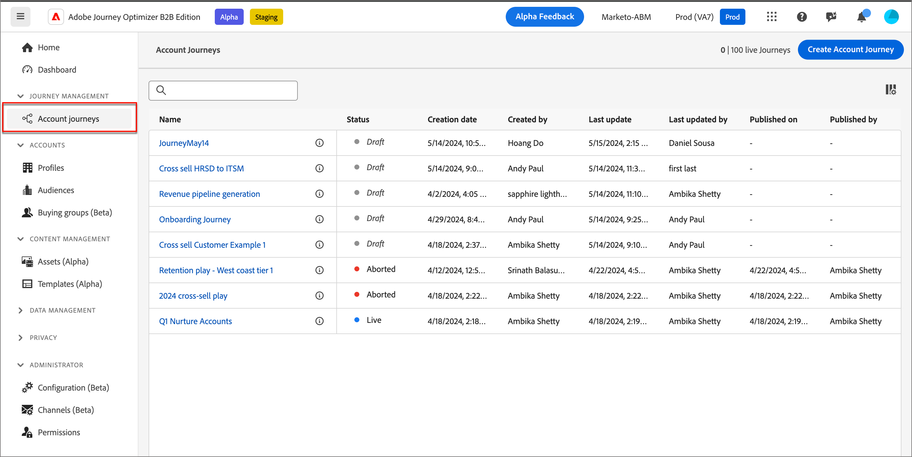
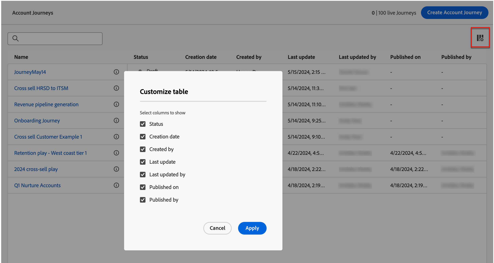
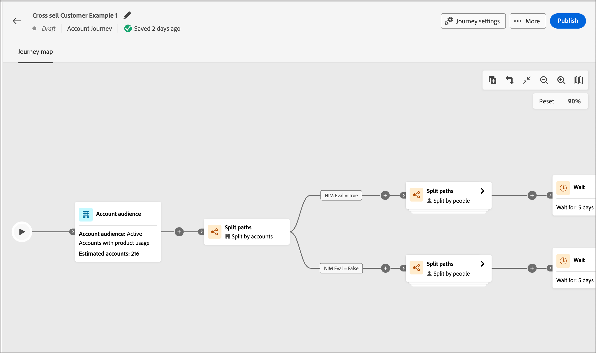
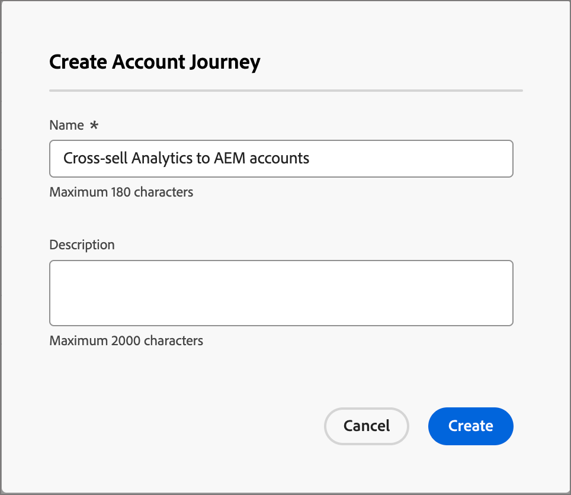
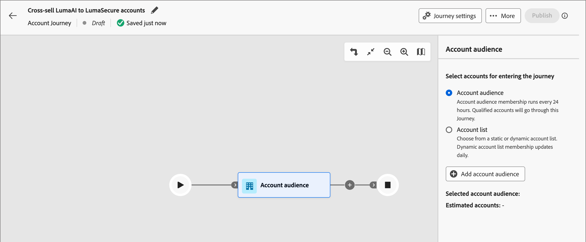
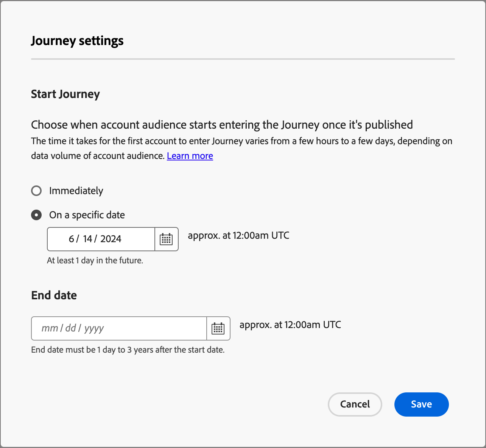

# 帳戶歷程

定義包括電子郵件、簡訊等內部帳戶歷程的銷售導向參與，以協調每個購買群組成員的傳入行銷與傳出銷售活動。

## 存取和瀏覽帳戶歷程

1. 在Adobe Experience Platform首頁中，按一下Adobe Journey Optimizer B2B Edition。

1. 在左側導覽中，按一下&#x200B;**[!UICONTROL 帳戶歷程]**。

   {width="800" zoomable="yes"}

   顯示的歷程頁面包含下列欄：

   * [!UICONTROL 名稱] （按一下名稱以開啟帳戶歷程以進行編輯）
   * [!UICONTROL 狀態]
   * [!UICONTROL 說明]
   * [!UICONTROL 建立者：]
   * [!UICONTROL 上次更新時間：]
   * [!UICONTROL 上次更新者]
   * [!UICONTROL 發佈於]
   * [!UICONTROL 發佈者]

此表格包含依名稱和建立者搜尋的功能。 排序目前無法使用。

您可以按一下右上角的&#x200B;_欄_&#x200B;圖示並選取或清除核取方塊，以自訂顯示的表格。

{width="800" zoomable="yes"}

## 帳戶歷程剖析

按一下&#x200B;_[!UICONTROL 帳戶歷程]_&#x200B;清單中的名稱（顯示為連結），即可檢閱詳細資料、進行變更以及執行動作。

{width="800" zoomable="yes"}

每個帳戶歷程的編輯器標題包括：

* 歷程名稱
* 可編輯名稱（_編輯_&#x200B;圖示）
* 歷程的狀態

標頭中有以下動作：

* **Publish** — 如果沒有封鎖程式錯誤，您可以發佈歷程。 發佈後，歷程狀態會變更為&#x200B;_即時_。 如果歷程發生錯誤，按鈕會以灰色顯示內容資訊： `Resolve errors before publishing`。
* **複製** — 此動作類似於複製函式，但複製的歷程不包含任何資產。
* **關閉新專案** — 如果您關閉歷程，目前歷程中的帳戶會繼續其在歷程中的路徑，且無法進一步進入歷程。 無法重新啟動已關閉的歷程。 您可以複製已關閉的歷程。
* **中止** — 如果您停止歷程，歷程中的帳戶會立即停止進度，而且無法進入進一步的歷程。 停止的歷程無法重新啟動。 如果您封鎖新入口而不停止人們的進度，請考慮改為關閉歷程。
* **刪除** — 此動作會永久刪除歷程。

歷程的狀態會根據您套用的動作而變更。 根據歷程的狀態，某些動作在/無法在標題中使用。

| 狀態 | 說明 | 可用動作 |
| ------ | ----------- | ----------------- |
| _**草稿**_ | 可編輯的未發佈歷程。 | <ul><li>發佈</li><li>複製 </li><li>刪除 </li></ul> |
| _**即時**_ | 發佈歷程時，歷程狀態從草稿變更為即時。 在此狀態下，將無法再編輯它。 | <ul><li>複製 </li><li>關閉新專案 </li><li>中止 </li></ul> |
| _**已關閉新專案**_ | 當您在頂端導覽中按一下[!UICONTROL 關閉新專案]時，歷程狀態會從&#x200B;_即時_&#x200B;變更為&#x200B;_已關閉新專案_。 | <ul><li>複製 </li><li>中止 </li></ul> |
| _**已中止**_ | 當您中止歷程時，歷程狀態從&#x200B;_即時_&#x200B;或&#x200B;_已關閉新專案_&#x200B;變更。 中止的歷程無法重新啟動。 | <ul><li>複製 </li><li>刪除 </li></ul> |
| _**已完成**_ | 當歷程中的所有帳戶完成歷程時，狀態會從「即時」或「已關閉」變更為新專案，即「已完成」。 | <ul><li>複製 </li><li>刪除 </li></ul> |

## 開始使用歷程

若要開始使用帳戶歷程，請建立歷程，然後在歷程編輯器中建構節點和歷程流程。

### 建立帳戶歷程

1. 在左側導覽中，按一下&#x200B;**[!UICONTROL 帳戶歷程]**。

1. 按一下頁面右上角的&#x200B;**[!UICONTROL 建立帳戶歷程]**。

1. 在對話方塊中，輸入唯一的&#x200B;**[!UICONTROL Name]** （必要）和&#x200B;**[!UICONTROL Description]** （選用）。

   {width="400"}

1. 按一下&#x200B;**[!UICONTROL 建立]**。

### 為您的歷程新增帳戶對象

帳戶歷程一律以帳戶對象開始，您可在此將輸入新增至歷程。

1. 按一下&#x200B;**[!UICONTROL 帳戶對象]**&#x200B;節點，在右側顯示節點屬性。

   {width="700" zoomable="yes"}

1. 按一下&#x200B;**[!UICONTROL 新增帳戶對象]**。

   您可以按一下&#x200B;_[!UICONTROL 新增對象]_，以選取先前選取的對象區段。

1. 若要建立新的對象區段，請在左側導覽中選取「**[!UICONTROL 帳戶對象]**」。

1. 按一下「**[!UICONTROL 建立對象]**」，並遵循[分段服務指南](https://experienceleague.adobe.com/en/docs/experience-platform/segmentation/ui/account-audiences){target="_blank"}中所述的步驟。

### 歷程的組成要素

_歷程畫布_&#x200B;是歷程設計器中的中央區域。 您可以在此區域中新增及設定歷程節點。 按一下節點，即可開啟畫布右側的屬性窗格，並根據您的設計加以設定。

您可以使用以下任一節點型別來建置您的歷程：

* [接聽事件](journey-nodes.md#listen-for-an-event)
* [採取動作](journey-nodes.md#take-an-action)
* [分割路徑](journey-nodes.md#split-paths)
* [等待](journey-nodes.md#wait)
* [合併路徑](journey-nodes.md#merge-paths)

### 護軌

為協助您建立歷程而不會發生錯誤，已設定下列護欄：

* _刪除分割路徑節點_：您必須刪除每個路徑中的所有後續節點，才能刪除節點。
* _刪除合併節點_：只有連線一個路徑時，才能刪除合併節點。 若要刪除合併節點，請僅保留一個選取的路徑。
* _在帳戶和人員之間切換_：若不刪除每個路徑中的所有後續節點，就無法將選擇從帳戶變更為人員。

### 新增節點

1. 導覽至歷程編輯器。

1. 按一下路徑上的加號( **+** )圖示，然後選取節點型別。

1. 設定右側的節點屬性。

### 刪除節點

1. 導覽至歷程編輯器。

1. 在右側的節點屬性中，按一下&#x200B;_刪除_ （垃圾桶）圖示。

1. 在設定對話方塊中，按一下&#x200B;**[!UICONTROL 刪除]**。

### 新增和刪除路徑

1. 導覽至歷程編輯器。

1. 按一下路徑上的加號( **+** )圖示，然後新增分割路徑節點。

1. 在右側的節點屬性中，選取&#x200B;**[!UICONTROL 帳戶]**。

1. 若要新增更多路徑，請按一下[新增路徑]。****

   當在歷程中建立每個路徑時，屬性中都會顯示新路徑卡。

1. 導覽至歷程中的其中一個路徑，並使用加號圖示將動作或事件節點新增至此路徑。

1. 選取分割路徑節點以開啟右側的屬性。

   請注意，無法刪除上面有節點的路徑。

1. 若要刪除這些路徑，必須先刪除該路徑上的所有節點。

### 排程歷程

發佈歷程時，歷程可以立即開始，或在排程的將來日期開始。 結束日期最多可自開始日期起三年。 發佈歷程後（_即時_&#x200B;狀態），您可以更新歷程的結束日期，但不能更新開始日期。

1. 導覽至歷程編輯器。

1. 按一下標題中的[!UICONTROL 歷程設定]以排程您的歷程。

1. 在對話方塊中，設定排程選項：

   * 選擇排程型別。

     若要在發佈時啟動歷程，請選擇&#x200B;**[!UICONTROL 立即]**。

     若要在未來日期啟動歷程，請選擇&#x200B;**[!UICONTROL 在特定日期]**&#x200B;並按一下&#x200B;_行事曆_&#x200B;圖示以選取日期。

     {width="400" zoomable="no"}

   * 指定歷程的&#x200B;**[!UICONTROL 結束日期]**。 從開始日期起最多可以有三年（此欄位為必填）。

1. 按一下&#x200B;**[!UICONTROL 儲存]**。

   當您準備好發佈您的歷程時，您可以在按一下&#x200B;_[!UICONTROL Publish]_&#x200B;時檢閱這些設定。
