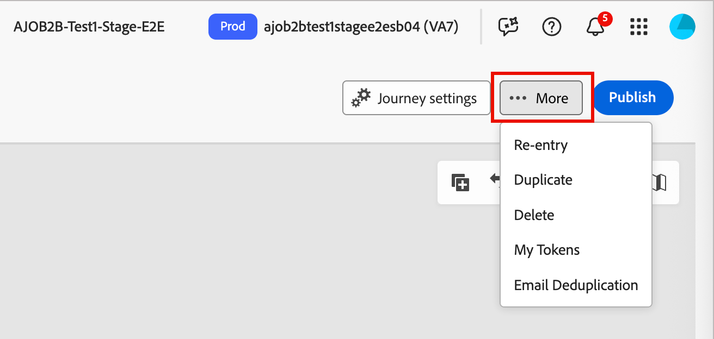
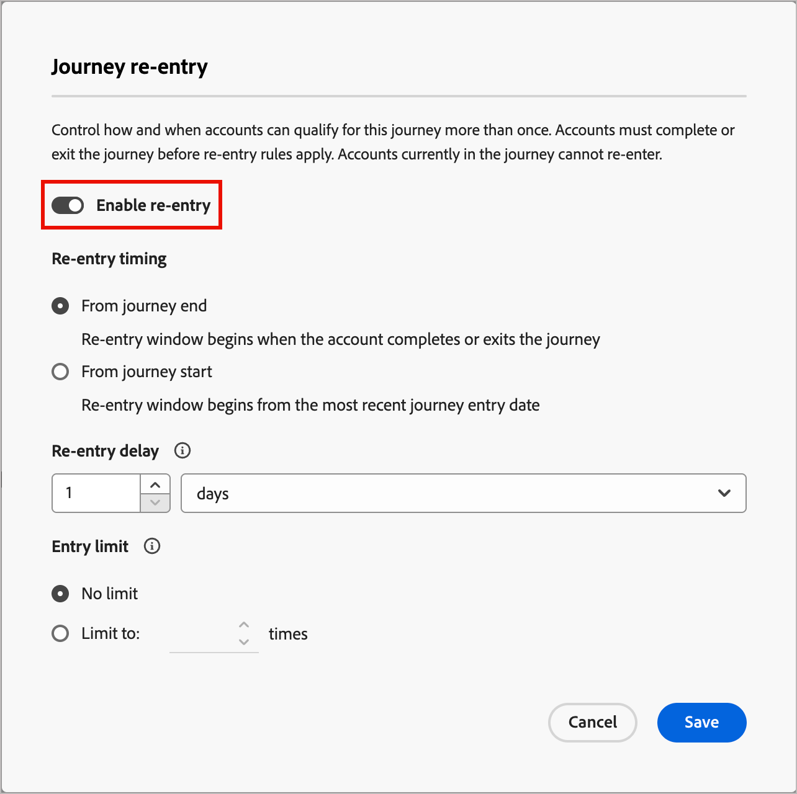

# 歷程重新進入

_僅限帳戶歷程_

當您啟用帳戶歷程的重新進入時，您可以控制帳戶何時以及多久可重新進入同一個歷程。 使用重新進入設定來設定條件、限制和等待時間，以便帳戶能以可控制的方式符合歷程的資格。

當下列專案為True時，帳戶便可符合歷程的資格：

* 帳戶在歷程允許的重新進入次數內。
* 帳戶已符合等待時間臨界值（重新取得資格之前的最短等待時間）。
* 帳戶目前不在歷程中。

## 為帳戶歷程啟用重新輸入

當歷程處於&#x200B;_草稿_&#x200B;狀態時，您可以啟用重新進入並變更重新進入設定。

1. 開啟草稿帳戶歷程。

1. 按一下右上方的&#x200B;**[!UICONTROL 更多……]**&#x200B;功能表，然後選擇&#x200B;**[!UICONTROL 重新進入]**。

   {width="450"}

1. 在&#x200B;_[!UICONTROL 歷程重新進入]_&#x200B;對話方塊中，切換&#x200B;**[!UICONTROL 啟用重新進入]**&#x200B;選項。

   啟用此功能後，會顯示計時、延遲和限制的選項。

   {width="450"}

1. 對於&#x200B;**[!UICONTROL 重新進入時間]**，請選擇等待的計算方式：

   * **[!UICONTROL 從歷程結束等待]** — 等待期間從帳戶結束或完成歷程時開始。 例如，「在帳戶完成歷程30天後，他們可以重新進入。」

   * **[!UICONTROL 從歷程開始等待]** — 等待期間是根據帳戶首次進入歷程的時間。 例如，「在帳戶開始歷程後的30天，他們可以重新輸入。」

1. 設定&#x200B;**[!UICONTROL 重新進入延遲]**，此為等待持續時間（小時或天）。

   此設定會決定帳戶在退出或開始歷程之後必須等候多久才能重新進入。

1. 設定&#x200B;**[!UICONTROL 進入限制]**&#x200B;以定義允許帳戶進入歷程的最大次數。

   當帳戶達到限制時，在重設限制或使用新限制重新發佈歷程之前，它不再符合登入資格。

   此限制適用於該歷程的每個帳戶。

1. 按一下&#x200B;**[!UICONTROL 儲存]**。

## 帳戶進展與活動

對於已發佈的帳戶歷程，歷程地圖會顯示歷程節點的[帳戶進度](./journeys-overview.md#review-account-progression)。 地圖上的每個節點會顯示到達該節點的帳戶數，如果是即時歷程，則顯示目前在該節點的帳戶數。 每次帳戶重新進入歷程時，都會計為不重複的專案。
<!-- You can see how many times accounts have entered the journey. ?? -->

當您深入到[帳戶詳細資料](../accounts/account-details.md)時，帳戶活動會在每次帳戶進入歷程時顯示。 其中包含明確的活動和遞回計數，以便您清楚看到重新輸入。
