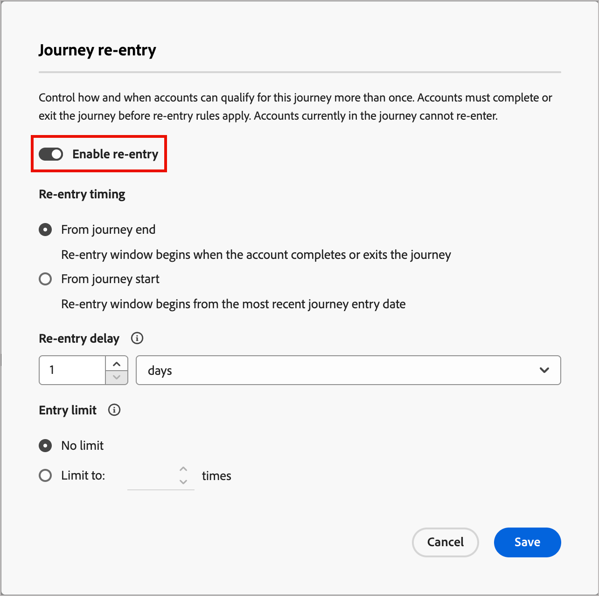

# 歷程重新進入

當您啟用歷程的重新進入時，您可以控制帳戶或人員何時及多久可重新進入同一歷程。 使用重新進入設定來設定條件、限制和等待時間，以便帳戶或人員以可控方式重新符合歷程的資格。

當下列專案為True時，帳戶或人員可以重新符合歷程的資格：

* 帳戶或個人在歷程允許的重新進入次數內。
* 帳戶或人員已符合等待時間臨界值（重新取得資格之前的最短等待時間）。
* 帳戶或人員目前不在歷程中。

## 為歷程啟用重新進入

當歷程處於&#x200B;_草稿_&#x200B;狀態時，您可以啟用重新進入並變更重新進入設定。

>[!BEGINTABS]

>[!TAB 帳戶歷程]

1. 開啟草稿帳戶歷程。

1. 按一下右上方的&#x200B;**[!UICONTROL 更多……]**&#x200B;功能表，然後選擇&#x200B;**[!UICONTROL 重新進入]**。

   ![按一下帳戶歷程右上角的[更多]](./assets/account-journey-draft-more-menu.png){width="450"}

1. 在&#x200B;_[!UICONTROL 歷程重新進入]_&#x200B;對話方塊中，切換&#x200B;**[!UICONTROL 啟用重新進入]**&#x200B;選項。

   啟用此功能後，會顯示計時、延遲和限制的選項。

   {width="450"}

1. 對於&#x200B;**[!UICONTROL 重新進入時間]**，請選擇等待的計算方式：

   * **[!UICONTROL 從歷程結束等待]** — 等待期間從帳戶結束或完成歷程時開始。 例如，「在帳戶完成歷程30天後，就可以重新輸入。」

   * **[!UICONTROL 從歷程開始等待]** — 等待期間是根據帳戶首次進入歷程的時間。 例如，「從帳戶開始歷程起30天後，就可以重新輸入。」

1. 設定&#x200B;**[!UICONTROL 重新進入延遲]**，此為等待持續時間（小時或天）。

   此設定會決定帳戶在退出或開始歷程之後必須等候多久才能重新進入。

1. 若要定義允許帳戶進入歷程的最大次數，請設定&#x200B;**[!UICONTROL 進入限制]**。

   當帳戶達到限制時，在重設限制或使用新限制重新發佈歷程之前，它不再符合登入資格。

   此限制適用於該歷程的每個帳戶。

1. 按一下&#x200B;**[!UICONTROL 儲存]**。

>[!TAB 個人歷程]

1. 開啟草稿人員歷程。

1. 按一下右上方的&#x200B;**[!UICONTROL 更多……]**&#x200B;功能表，然後選擇&#x200B;**[!UICONTROL 重新進入設定]**。

   ![按一下人員歷程右上角的[更多]](./assets/person-journey-draft-more-menu.png){width="450"}

1. 在&#x200B;_[!UICONTROL 歷程重新進入]_&#x200B;對話方塊中，切換&#x200B;**[!UICONTROL 啟用重新進入]**&#x200B;選項。

   啟用此功能後，會顯示計時、延遲和限制的選項。

   {width="450"}

1. 對於&#x200B;**[!UICONTROL 重新進入時間]**，請選擇等待的計算方式：

   * **[!UICONTROL 從歷程結束等待]** — 當人員結束或完成歷程時，等待期間就會開始。 例如，「在人員完成歷程30天後，就可以重新進入。」

   * **[!UICONTROL 從歷程開始等待]** — 等待期間取決於使用者第一次進入歷程的時間。 例如，「在人員開始歷程的30天後，他們就可以重新進入。」

1. 設定&#x200B;**[!UICONTROL 重新進入延遲]**，此為等待持續時間（小時或天）。

   此設定會決定使用者在結束或開始歷程後，必須等候多久才能重新進入。

1. 若要定義允許人員進入歷程的最大次數，請設定&#x200B;**[!UICONTROL 進入限制]**。

   當人員達到限制時，在重設限制或使用新限制重新發佈歷程之前，他們不再符合進入資格。

   此限制適用於該歷程的每個人。

1. 按一下&#x200B;**[!UICONTROL 儲存]**。

>[!ENDTABS]

## 進度與活動

對於已發佈的帳戶或個人歷程，歷程畫布會顯示歷程節點的[進度](./journeys-overview.md#review-account-progression)。 每個節點會顯示到達該節點的帳戶或人員數量，如果是即時歷程，則顯示目前在該節點的數字。 每次帳戶或人員重新進入歷程時，都會計為不重複的專案。

<!-- 
You can see how many times accounts have entered the journey. ?? 

When you drill in to [account details](../accounts/account-details.md), the account activity shows each time the account entered the journey. It includes explicit activity and a recurrence count so that you can see re-entries clearly.
-->
