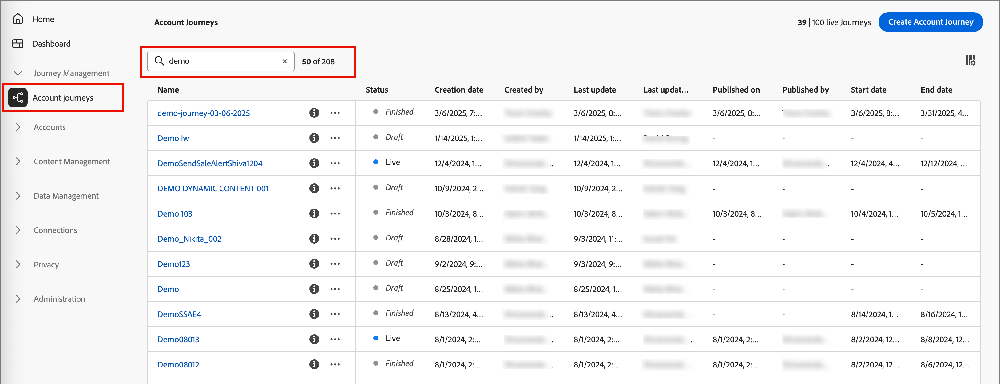
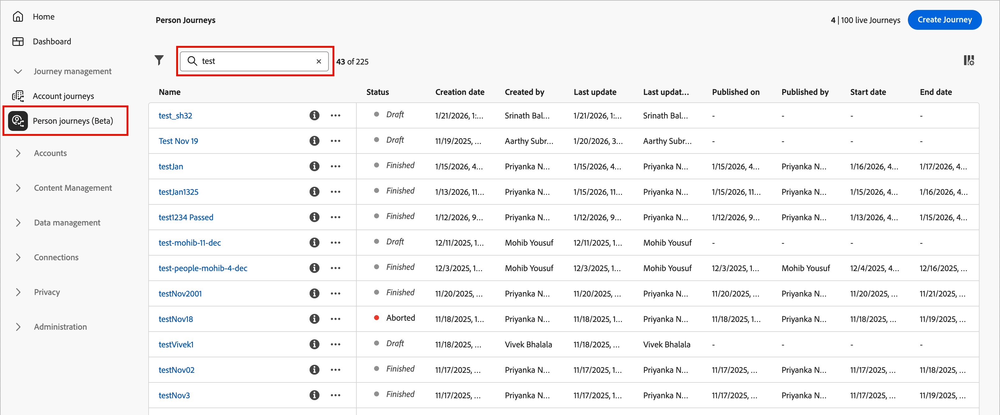
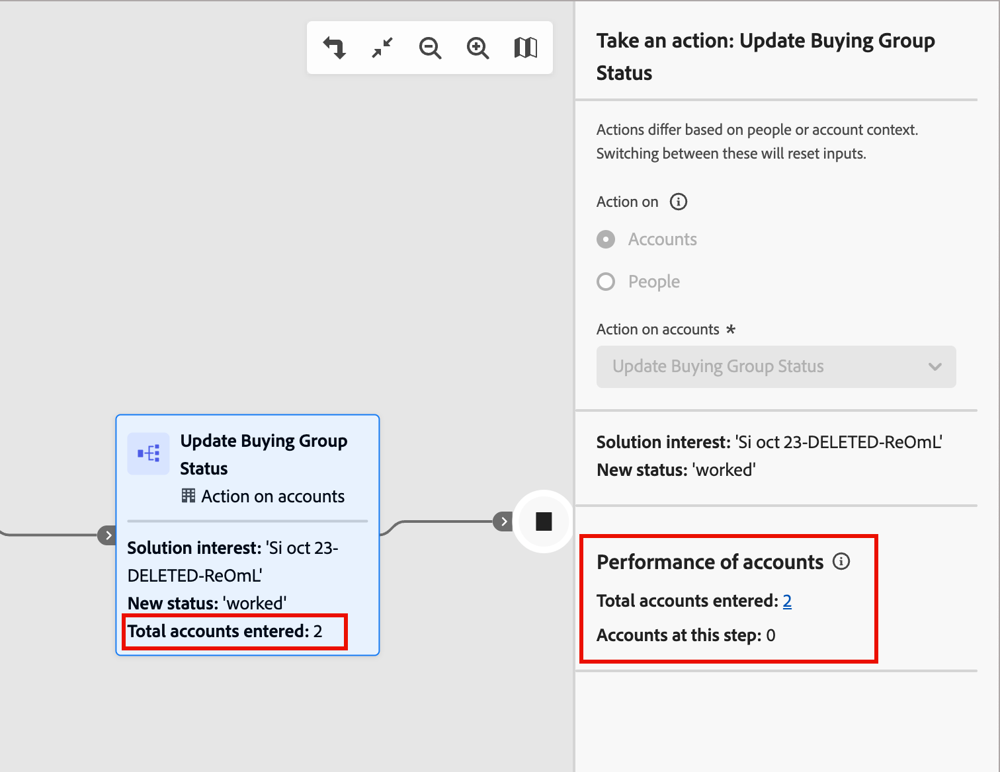
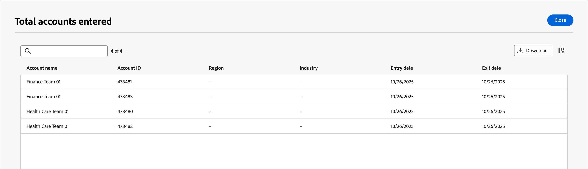

# 歷程管理

在Journey Optimizer B2B edition中，歷程是自動化的、多步驟的帳戶和基於銷售機會的行銷計畫，可協調跨管道的個人化體驗，以回應參與、業務活動或排程的行銷活動。 定義包含電子郵件、簡訊等在內的銷售導向參與以協調每個購買群組成員的傳入行銷與傳出銷售活動。

Journey Optimizer B2B edition支援兩種歷程型別：

* **帳戶歷程** — 簡化需求產生和購買群組資格，並針對您的收購、向上銷售/交叉銷售和保留計畫推動更多合格需求。 透過涵蓋電子郵件、簡訊、活動等管道的自動化參與機制，為每個購買群組和購買群組成員量身打造歷程。

  {width="30"} [觀看帳戶歷程概觀影片](#overview-video)

* **個人歷程** - (Beta)使用Experience Platform對象和資料來協調銷售機會型行銷。 個人歷程的行銷作業不依賴Marketo Engage或Adobe Campaign/B2C工具鏈的因應措施，因此可搭配B2B使用案例運作。

  如果搭配帳戶歷程及購買群組使用，個人歷程可讓行銷人員對購買歷程套用完整的協調流程。

  +++個人歷程的目前限制

  有些限制可能會封鎖某些使用案例，或導致建立個人歷程的困難。 許多問題都是初始Beta版計畫實作的結果，將於未來解決。

   * 事件不能與設定檔屬性結合以縮小對象定義。
   * 符合歷程設定檔資格的事件內容無法用於個人化或協調。
   * 歷程目前不能同時具有事件和設定檔區段輸入條件。
   * 事件接聽程式無法接聽多個事件。
   * 等待節點目前沒有完整的一套一週中的某天或當天時間的退出條件選項。
   * 電子郵件編輯器錯誤地引用了僅可用於帳戶歷程的功能和屬性
   * 尚未提供自訂歷程權杖（_我的權杖_）的支援。
   * 任一歷程型別目前都無法新增及移除人員歷程節點。
   * 事件歷史記錄無法用於協調或個人化。
   * 相關物件（例如帳戶、購買群組、商機和自訂物件）無法用於協調或個人化。
   * 目前不支援Web、SMS和廣告平台管道。

  +++

## 開始使用歷程

若要開始您的第一個歷程：

1. [建立歷程](./create-publish-journey.md#create-a-journey)。
1. 在歷程圖中[新增節點](./create-publish-journey.md#add-a-node)，並[定義歷程流程圖](./create-publish-journey.md#add-and-delete-a-path)。
1. [發佈此歷程](./create-publish-journey.md#publish-a-journey)。

## 存取及瀏覽您的歷程

>[!BEGINTABS]

>[!TAB 帳戶歷程]

在左側導覽列中，展開&#x200B;**[!UICONTROL 歷程管理]**，然後按一下&#x200B;**[!UICONTROL 帳戶歷程]**。

在清單頂端的「_搜尋_」工具中輸入文字，以便依據名稱來篩選顯示的清單。

{width="800" zoomable="yes"}

>[!TAB 個人歷程(Beta)]

[!BADGE Beta]{type=Informative tooltip="在簡化的架構上提供測試版功能"}

在左側導覽列中，展開&#x200B;**[!UICONTROL 歷程管理]**，然後按一下&#x200B;**[!UICONTROL 個人歷程]**。

在清單頂端的&#x200B;_搜尋_&#x200B;工具中輸入文字，依名稱篩選顯示的清單。

{width="800" zoomable="yes"}

>[!ENDTABS]

### 歷程清單欄

歷程清單頁面包含下列欄：

* [!UICONTROL 名稱] (按一下此名稱來開啟歷程以進行編輯)
* [!UICONTROL 狀態]
* [!UICONTROL 建立日期]
* [!UICONTROL 建立者]
* [!UICONTROL 上次更新]
* [!UICONTROL 上次更新者]
* [!UICONTROL 發佈日期]
* [!UICONTROL 發佈者]
* [!UICONTROL 開始日期]
* [!UICONTROL 結束日期]

您可以按一下欄標題，依&#x200B;_[!UICONTROL 狀態]_、_[!UICONTROL 建立日期]_&#x200B;或&#x200B;_[!UICONTROL 上次更新]_&#x200B;來排序清單。

若要自訂（顯示/隱藏）表格中顯示的欄，請按一下右上角的&#x200B;_自訂表格_ （  ）圖示。 選取或清除對話框中的核取方塊，然後按一下「**[!UICONTROL 套用]**」。

{width="800" zoomable="yes"}

### 歷程狀態

根據您套用的動作，歷程狀態可能會變更。根據歷程狀態，您可以或無法從標頭右側執行某些動作。

| 狀態 | 說明 | 可用的動作 |
| ------ | ----------- | ----------------- |
| _**草稿**_ | 未發佈且可以編輯的歷程。 | <li>[發佈](./create-publish-journey.md#publish-a-journey)<li>[複製](#duplicate-journey) <li>[刪除](#delete-journey) |
| _**已上線**_ | 發佈歷程時，歷程狀態從&#x200B;_草稿_&#x200B;變更為&#x200B;_即時_。 在此狀態下，您將無法編輯歷程。 | <li>[複製](#duplicate-journey)<li>[對新進客戶關閉](#close-to-new-entries) <li>[中止](#abort-journey) |
| _**對新進客戶關閉**_ | 當您在頂端導覽區域按一下「_對新進客戶關閉_」，此歷程狀態會從「_已上線_」變更為「[!UICONTROL 對新進客戶關閉]」。 | <li>[複製](#duplicate-journey) <li>[中止](#abort-journey) |
| _**已中止**_ | 中止歷程時，原本的「_已上線_」或「_對新進客戶關閉_」歷程狀態將會發生變更。中止的歷程無法重新啟動。 | <li>[複製](#duplicate-journey) <li>[刪除](#delete-journey) |
| _**已完成**_ | 當歷程中的所有帳戶或個人對象成員完成歷程時，狀態會從&#x200B;_即時_&#x200B;或&#x200B;_已關閉的新專案_&#x200B;變更為&#x200B;_已完成_。 | <li>[複製](#duplicate-journey) <li>[刪除](#delete-journey) |

## 歷程圖

按一下歷程清單中的名稱（顯示為連結），即可檢閱詳細資訊、進行變更以及執行動作。

{width="800" zoomable="yes"}

每個歷程地圖的標題包括：

* 歷程名稱
* 歷程名稱的編輯工具 ( _編輯_&#x200B;圖示)
* 歷程的[狀態](#journey-status)

從歷程圖，您可以[新增節點](./create-publish-journey.md#add-a-node)和[定義歷程流程](./create-publish-journey.md#add-and-delete-a-path)。

## 歷程動作

歷程清單頁面包含Journey Optimizer B2B edition執行個體中的所有帳戶或個人歷程。 您可以從清單頁面套用許多動作至歷程。

### 中止歷程

如果您中止（停止）即時或排程的歷程，歷程中的帳戶或人員會立即停止進度，且不會發生進一步的歷程入口。 中止的歷程無法重新啟動。

>[!IMPORTANT]
>
>當歷程用於來自&#x200B;_採取動作_&#x200B;節點且&#x200B;_[!UICONTROL 將帳戶新增至（其他）歷程]_&#x200B;動作時，中止該歷程封鎖該歷程中的該動作。

1. 按一下歷程名稱來開啟。

1. 按一下右上角的&#x200B;**[!UICONTROL 「更多...」]**&#x200B;選單，然後選擇「**[!UICONTROL 中止]**」。

   {width="450"}

1. 在確認對話框中，按一下「**[!UICONTROL 中止]**」。

### 對新進客戶關閉

如果您關閉已上線的歷程，則目前在歷程中的帳戶會繼續在該歷程中的路徑，且不再允許後續客群進入歷程。已關閉的歷程無法重新啟動。您可以重複已關閉的歷程。

>[!IMPORTANT]
>
>當歷程用於來自&#x200B;_採取動作_&#x200B;節點並具有&#x200B;_[!UICONTROL 將帳戶新增至（其他）歷程]_&#x200B;動作時，將其關閉至該歷程中該動作的新專案區塊。

1. 按一下歷程名稱來開啟。

1. 按一下右上角的&#x200B;**[!UICONTROL 「更多...」]**&#x200B;選單，然後選擇「**[!UICONTROL 對新進客戶關閉]**」。

1. 在確認對話框中，按一下「**[!UICONTROL 對新進客戶關閉]**」。

### 複製歷程

重複動作類似於原地複製功能，但重複的歷程不會包括任何已建立的歷程內容資產。您可以複製歷程的詳細資料，或只是流程與路徑結構的簡單&#x200B;_骨架_。

>[!NOTE]
>
>此動作目前不適用於個人歷程。

1. 按一下歷程名稱旁的&#x200B;_「更多」_&#x200B;圖示 (**...**)，然後選擇「**[!UICONTROL 重複]**」。

   {width="450"}

   根據歷程的狀態，您還可以從歷程詳細資訊或歷程地圖存取重複的動作：

   * 針對草稿歷程，請按一下右上角的&#x200B;**[!UICONTROL 「更多...」]**&#x200B;選單，然後選擇「**[!UICONTROL 重複]**」。

   * 對於所有其他歷程狀態，請按一下右上角的「**[!UICONTROL 重複]**」。

     {width="450"}

1. 在「_重複歷程_」對話框中，設定新歷程的「**[!UICONTROL 名稱]**」和「**[!UICONTROL 描述]**」。

   預設情況下，對話框會使用重複歷程的名稱，並加上 __copy_。依需要為歷程輸入另一個唯一名稱。

   {width="400"}

1. 選擇重複的「**[!UICONTROL 類型]**」：

   * **[!UICONTROL 部分內容重複]** - 使用此類型複製歷程中所有內容，但不包括任何已建立的電子郵件或 SMS 訊息。參照 Marketo Engage 電子郵件或 SMS 訊息的節點完好無損。

   * **[!UICONTROL 重複但不包含詳細資訊]** - 使用此類型僅複製節點結構和路徑。所有節點設定和路徑條件均未定義 (預設)，以便您可以根據不同的客群、動作和路徑分段設定來重複使用基本流程。所有&#x200B;_等待_&#x200B;節點的預設值都是五天。

1. 按一下「**[!UICONTROL 重複]**」。

   重複的歷程會在歷程地圖中開啟，您可以在其中設定詳細資訊，並視需要建立歷程內容。

### 刪除歷程

使用刪除動作永久刪除歷程。您不能刪除已上線或已排程的歷程。

1. 按一下歷程名稱旁的&#x200B;_「更多」_&#x200B;圖示 (**...**)，然後選擇「**[!UICONTROL 刪除]**」。

   根據歷程的狀態，您也可以從歷程詳細資訊或歷程地圖存取刪除動作：

   * 對於草稿歷程，請按一下右上角的&#x200B;**[!UICONTROL 「更多...」]**&#x200B;選單，然後選擇「**[!UICONTROL 刪除]**」。

   * 對於其他歷程狀態，例如「_已完成_」或者「_已中止_」，按一下右上角的「**[!UICONTROL 刪除]**」。

1. 在確認對話框中，按一下「**[!UICONTROL 刪除]**」。

## 審閱帳戶進度

對於處於&#x200B;_即時_、_已關閉新專案_、_已中止_&#x200B;或&#x200B;_已完成_&#x200B;狀態的已發佈帳戶歷程，您可以開啟歷程對應，以檢閱歷程節點的帳戶進展。 地圖上的每個節點皆會顯示到達該節點的帳戶數量，而對於上線歷程，則是顯示目前位於該節點的帳戶數量。

{width="400"}

當您選取該節點時，按一下數字可檢視進入該節點或目前正處於該歷程步驟的帳戶清單。

{width="700" zoomable="yes"}

## 帳戶歷程概觀影片 {#overview-video}

>[!VIDEO](https://video.tv.adobe.com/v/3443202/?learn=on)
