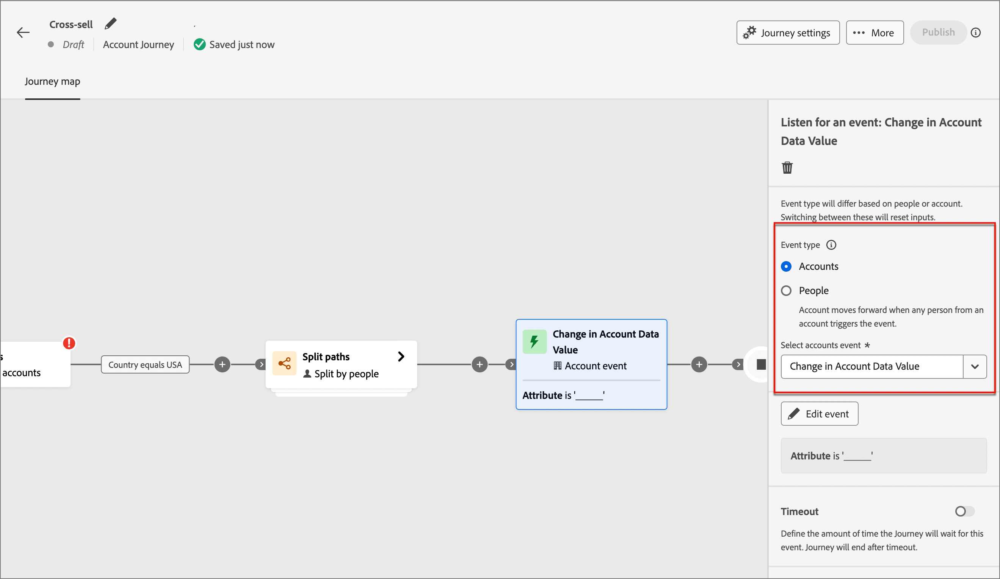
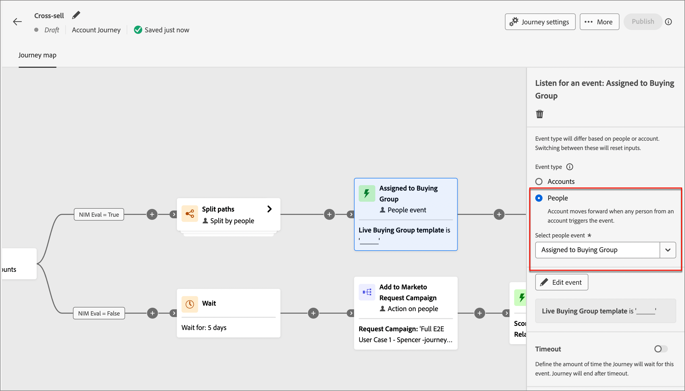
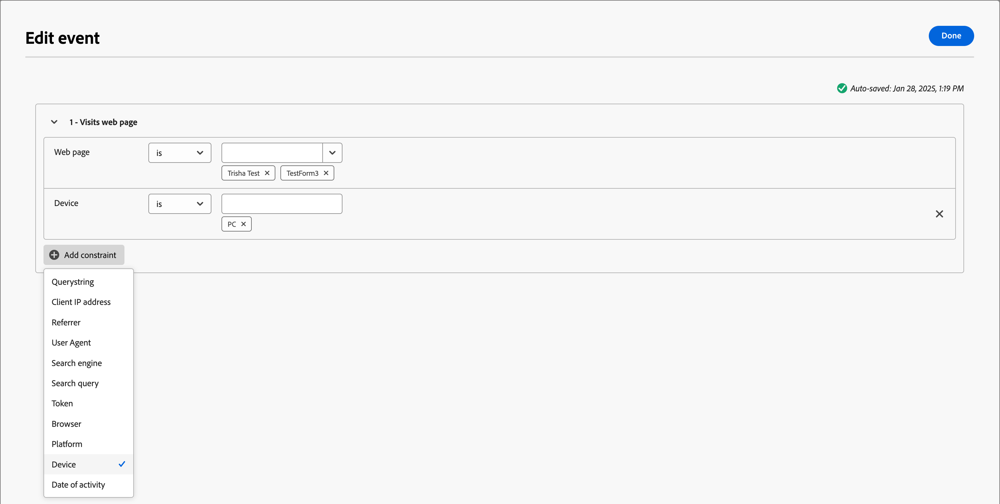
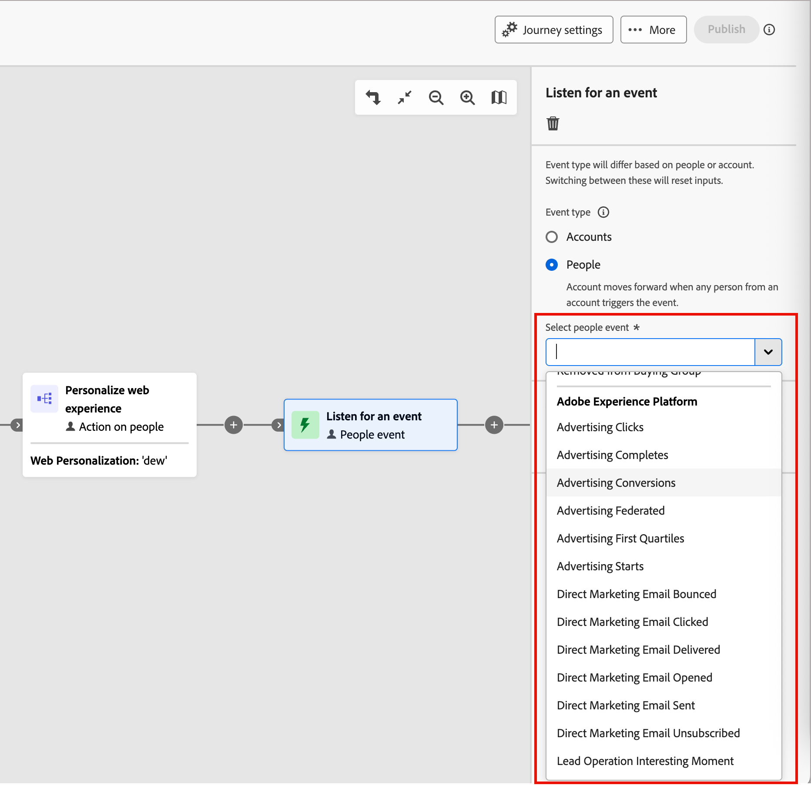
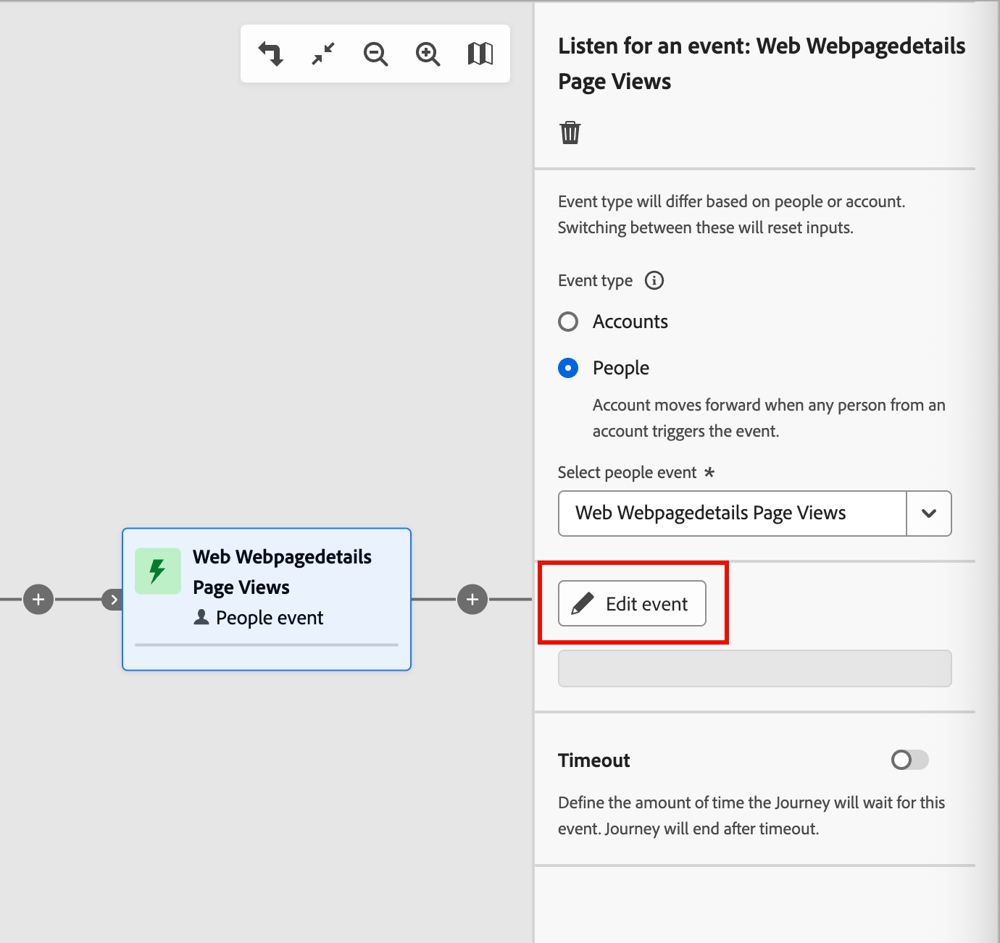
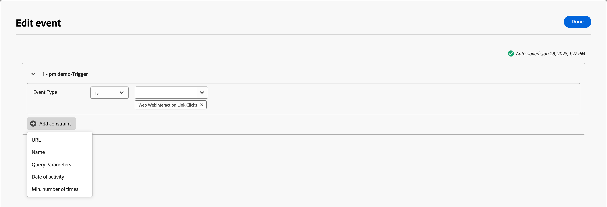
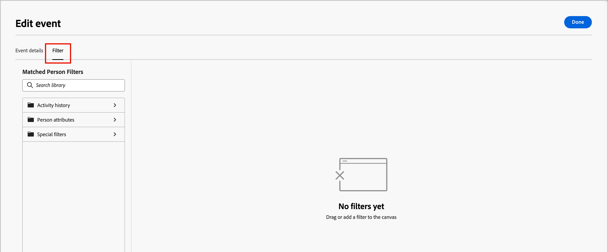
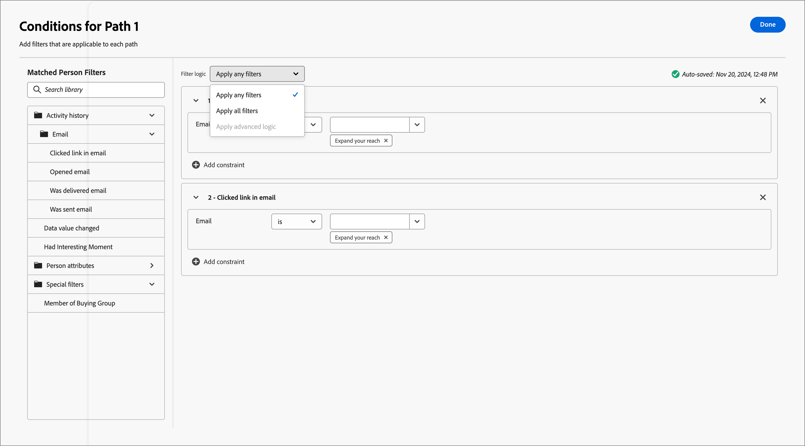
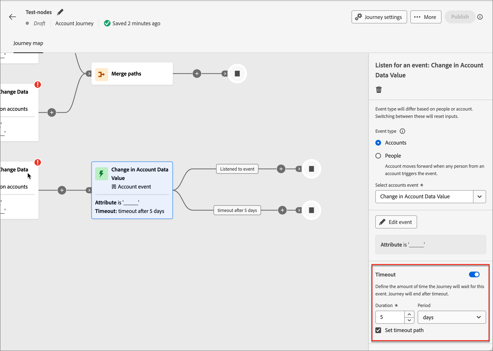

# 監聽事件

新增&#x200B;_接聽事件_&#x200B;節點，以便在事件發生時，將您的對象移至歷程的下一個步驟。

{width=&quot;30&quot;， vertical-align=&quot;middle&quot;} [觀看概觀影片](#overview-video)

>[!NOTE]
>
>對於帳戶歷程，您無法在分割路徑上由人員新增此節點型別。

## 帳戶事件

在帳戶歷程中，當您想要根據帳戶活動所觸發的事件，在歷程中向前移動帳戶時，您可以根據帳戶來監聽事件。

### 事件和限制

| 事件 | 限制 |
| ----- | ----------- |
| [!UICONTROL 帳戶有有趣的時刻] | 型別（電子郵件、里程碑或Web） 其他限制（選擇性）： <li>說明</li><li>來源</li><li>活動日期</li>  逾時（選擇性） |
| [!UICONTROL 帳戶資料值變更] | 屬性 其他限制（選擇性）： <li>新值</li><li>上一個值</li><li>活動日期</li>  逾時（選擇性） |
| [!UICONTROL 購買群組階段變更] | 方案興趣 其他限制（選擇性）： <li>新階段</li><li>上一個階段</li><li>活動日期</li> 逾時（選擇性） |
| [!UICONTROL 購買群組狀態變更] | 方案興趣 其他限制（選擇性）： <li>新狀態</li><li>先前的狀態</li><li>活動日期</li> 逾時（選擇性） |
| [!UICONTROL 完整度分數變更] | 方案興趣 其他限制（選擇性）： <li>新分數</li><li>前一個分數</li><li>活動日期</li> 逾時（選擇性） |
| [!UICONTROL 參與分數變更] | 方案興趣 其他限制（選擇性）： <li>新分數</li><li>前一個分數</li><li>活動日期</li> 逾時（選擇性） |

### 新增帳戶事件

1. 導覽至歷程圖。

1. 按一下路徑上的加號( **+** )圖示，然後選擇&#x200B;**[!UICONTROL 接聽事件]**。

1. 在右側的節點屬性中，為事件型別選擇&#x200B;**[!UICONTROL 帳戶]**。

   {width="700" zoomable="yes"}上的事件

1. 從清單中選取事件。

1. 按一下&#x200B;**[!UICONTROL 編輯事件]**&#x200B;並定義事件的詳細資料。

## 人物活動

在帳戶歷程中，當您想要根據人員活動所觸發的事件，在歷程中向前移動帳戶時，您可以根據人員來監聽事件。 您也可以根據人員屬性來篩選事件，

### 事件和限制

| 輸入型別 | 事件 | 限制 |
| ---------- | ----- | ----------- |
| Journey Optimizer B2B | [!UICONTROL 已指派給購買群組] | 方案興趣  其他限制（選擇性）： <li>角色</li><li>活動日期</li> 逾時（選擇性） |
| | [!UICONTROL 點按電子郵件中的連結] | 電子郵件  其他限制（選擇性）： <li>連結</li><li>連結識別碼</li><li>是行動裝置</li><li>裝置</li><li>平台</li><li>瀏覽器</li><li>為預測性內容</li><li>是機器人活動</li><li>機器人活動模式</li><li>瀏覽器</li><li>活動日期</li><li>最低 次數</li> 逾時（選擇性） |
| | 簡訊中的[!UICONTROL 點按連結] | 電子郵件  其他限制（選擇性）： <li>連結</li><li>裝置</li><li>平台</li><li>活動日期</li><li>最低 次數</li> 逾時（選擇性） |
| | [!UICONTROL 資料值變更] | 個人屬性  其他限制（選擇性）： <li>新值</li><li>上一個值</li><li>原因</li><li>來源</li><li>活動日期</li><li>最低 次數</li> 逾時（選擇性） |
| | [!UICONTROL 開啟電子郵件] | 電子郵件  其他限制（選擇性）： <li>連結</li><li>連結識別碼</li><li>是行動裝置</li><li>裝置</li><li>平台</li><li>瀏覽器</li><li>為預測性內容</li><li>是機器人活動</li><li>機器人活動模式</li><li>瀏覽器</li><li>活動日期</li><li>最低 次數</li> 逾時（選擇性） |
| | [!UICONTROL 已從購買群組]移除 | 方案興趣 活動日期（選擇性） 逾時（選擇性） |
| | [!UICONTROL 分數已變更] | 分數名稱  其他限制（選擇性）：<li>變更</li><li>新分數</li><li>急迫性</li><li>優先順序</li><li>相對分數</li><li>相對急迫性</li><li>活動日期</li><li>最低 次數</li> 逾時（選擇性） |
| | [!UICONTROL 簡訊退信] | SMS訊息  其他限制（選擇性）： <li>活動日期</li><li>最小次數</li> 逾時（選擇性） |
| Marketo Engage | [!UICONTROL 瀏覽網頁] | 網頁 選取一或多個要比對的Marketo Engage頁面。   其他限制（選擇性）： <li>Querystring</li><li>使用者端IP位址</li><li>反向連結</li><li>使用者代理</li><li>搜尋引擎</li><li>搜尋查詢</li><li>權杖</li><li>瀏覽器</li><li>平台</li><li>裝置</li><li>活動日期</li> |
| | [!UICONTROL 填寫表單] | 表單 選取一或多個要比對的Marketo Engage表單。   其他限制（選擇性）： <li>活動日期</li><li>Querystring</li><li>使用者端IP位址</li><li>反向連結</li><li>使用者代理</li><li>平台</li><li>裝置</li> 逾時（選擇性） |
| Adobe Experience Platform | [!UICONTROL 事件定義] | 事件型別  其他限制（選擇性）： <li>欄位</li>  其他限制（不支援）： <li>活動日期</li><li>最低 次數</li> 逾時（選擇性） |

### 人員事件篩選器

| 篩選器 | 說明 |
| ------------ | ----------- |
| [!UICONTROL 活動歷史記錄] > [!UICONTROL 電子郵件] | 根據條件評估的電子郵件活動，這些條件使用一或多個所選歷程中先前位置的電子郵件訊息： <li>[!UICONTROL 已點按電子郵件中的連結] <li>開啟電子郵件 <li>已由電子郵件傳遞 <li>已傳送電子郵件<!--  **[!UICONTROL Switch to inactivity filter]** - Use this option to filter based on lack of activity (a person did not have the email activity).--> |
| [!UICONTROL 活動歷史記錄] > [!UICONTROL 簡訊訊息] | 根據條件評估的SMS活動使用一或多個從歷程中先前選取的SMS訊息進行： <li>[!UICONTROL 已點按簡訊中的連結] <li>[!UICONTROL 簡訊已退回] <!--   **[!UICONTROL Switch to inactivity filter]** - Use this option to filter based on lack of activity (a person did not have the SMS activity). --> |
| [!UICONTROL 活動歷史記錄] > [!UICONTROL 資料值已變更] | 針對選取的人員屬性，發生值變更。 這些變更型別包括： <li>新值<li>上一個值<li>原因<li>來源<li>活動日期<li>最低 次數<!--   **[!UICONTROL Switch to inactivity filter]** - Use this option to filter based on lack of activity (a person did not have a data value change). --> |
| [!UICONTROL 活動歷史記錄] > [!UICONTROL 有趣的時刻] | 在關聯的Marketo Engage例項中定義的有趣時刻活動。 限制包括： <li>里程碑<li>電子郵件<li>網頁<!--  **[!UICONTROL Switch to inactivity filter]** - Use this option to filter based on lack of activity (a person did not have an interesting moment).--> |
| [!UICONTROL 活動歷史記錄] > [!UICONTROL 造訪的網頁] | 針對由相關Marketo Engage例項管理的一或多個網頁的網頁活動。 限制包括： <li>網頁（必填）<li>活動日期<li>使用者端IP位址 <li>Querystring <li>反向連結 <li>使用者代理 <li>搜尋引擎 <li>搜尋查詢 <li>個人化URL <li>權杖 <li>瀏覽器 <li>平台 <li>裝置 <li>最低 次數<!--  **[!UICONTROL Switch to inactivity filter]** - Use this option to filter based on lack of activity (a person did not visit the web page). --> |
| [!UICONTROL 個人屬性] | 個人設定檔中的屬性，包括： <li>城市 <li>國家/地區 <li>出生日期 <li>電子郵件地址 <li>電子郵件無效 <li>電子郵件已暫停 <li>名字 <li>推斷的狀態區域<li>職稱 <li>姓氏 <li>行動電話號碼 <li>個人參與分數 <li>電話號碼 <li>郵遞區號 <li>狀態 <li>已取消訂閱 <li>取消訂閱的原因 |
| [!UICONTROL 特殊篩選器] > [!UICONTROL 購買團體成員] | 該人員是或不是根據下列一或多個條件評估的購買群組成員： <li>解決方案興趣</li><li>購買群組狀態</li><li>完整度分數</li><li>參與分數</li><li>角色</li> |
| [!UICONTROL 特殊篩選器] > [!UICONTROL 清單成員] | 此人是否為一或多個Marketo Engage清單的成員。 |
| [!UICONTROL 特殊篩選器] > [!UICONTROL 計畫成員] | 此人是否為一或多個Marketo Engage方案的成員。 |

### 新增人員事件

1. 導覽至歷程圖。

1. 按一下路徑上的加號( **+** )圖示，然後選擇&#x200B;**[!UICONTROL 接聽事件]**。

1. 在右側的節點屬性中，選擇事件型別的&#x200B;**[!UICONTROL 人員]**。

   {width="700" zoomable="yes"}

1. 從清單中選取事件。

1. 按一下&#x200B;**[!UICONTROL 編輯事件]**&#x200B;並定義事件的詳細資料。

### 接聽Marketo Engage活動

如果您在連線的Marketo Engage執行個體中有網頁，您可以根據這些網頁的造訪/未造訪以及/未填寫的Marketo Engage表單來觸發事件。

1. 在歷程地圖中選取&#x200B;**[!UICONTROL 接聽事件]**&#x200B;節點。

1. 在右側的節點屬性中，選擇事件型別的&#x200B;**[!UICONTROL 人員]**。

1. 按一下&#x200B;**[!UICONTROL 選取人員事件]**&#x200B;選取器的箭頭，然後捲動功能表至&#x200B;**[!UICONTROL Marketo Engage]**&#x200B;區段。

1. 選取Market Engage活動型別：

   * **[!UICONTROL 瀏覽網頁]**。
   * **[!UICONTROL 填寫表單]**

   {width="700" zoomable="yes"}

1. 按一下&#x200B;**[!UICONTROL 編輯事件]**&#x200B;並定義一個或多個要比對的網頁，以及事件的任何其他限制。

   * （必要）在&#x200B;_[!UICONTROL 編輯事件]_&#x200B;對話方塊中，定義&#x200B;**[!UICONTROL 網頁]**&#x200B;或&#x200B;**[!UICONTROL 填寫表單]**&#x200B;條件約束。 使用&#x200B;**[!UICONTROL 是]** （預設）在一或多個選取的頁面或表單上比對。 使用&#x200B;**[!UICONTROL 不是]**&#x200B;在所有頁面瀏覽/表單上相符，並排除一或多個選取的頁面/表單。 或者，使用&#x200B;**[!UICONTROL 是任何]**&#x200B;運運算元，以比對任何Marketo Engage網頁造訪或填寫的表單。

   * （選擇性）按一下&#x200B;**[!UICONTROL 新增限制]**，然後選擇您要用於限制的欄位。 設定欄位的運運算元和值。

     {width="700" zoomable="yes"}

     您可以視需要重複此動作以包含其他欄位限制。

   * 如有需要，請選取&#x200B;**[!UICONTROL 篩選器]**&#x200B;索引標籤以[為事件新增篩選器](#add-a-filter-to-the-people-event)。

   * 定義限制和篩選器時，按一下&#x200B;**[!UICONTROL 完成]**。

1. 如有需要，請設定&#x200B;**[!UICONTROL 逾時]**&#x200B;選項，以限制接聽事件的時段（請參閱[將逾時新增至事件節點](#add-a-timeout-to-an-event-node)）。

1. 在歷程地圖中，新增下一個節點，以便在事件發生時執行。

### 聆聽體驗事件

管理員可以選取[Adobe Experience Platform (AEP) Experience Events](https://experienceleague.adobe.com/zh-hant/docs/experience-platform/xdm/classes/experienceevent){target="_blank"}，讓行銷人員建立對事件近乎即時反應的帳戶和人員歷程。 在歷程中使用體驗事件的程式分為兩個步驟：

1. 管理員[選取感興趣的事件型別和欄位](../admin/configure-aep-events.md#select-an-event)，以便在歷程中使用。

2. 在歷程中，新增&#x200B;_接聽事件_&#x200B;節點，並為以人物為基礎的事件選取Experience Platform事件型別。

<!--
{width="30", vertical-align="middle"} [Watch the video overview](../admin/configure-aep-events.md#overview-video) -->

若要在歷程中包含體驗事件(_T):_

1. 在歷程地圖中選取&#x200B;**[!UICONTROL 接聽事件]**&#x200B;節點。

1. （僅限帳戶歷程）在右側的節點屬性中，選擇&#x200B;**[!UICONTROL 人員]**&#x200B;作為事件型別。

1. 選取事件。

   若要進行&#x200B;**_帳戶歷程_**，請按一下&#x200B;**[!UICONTROL 選取人員事件]**&#x200B;選取器的箭頭，然後捲動功能表至&#x200B;**[!UICONTROL Adobe Experience Platform]**&#x200B;區段。

   {width="700" zoomable="yes"}

   若為個人歷程，請按一下&#x200B;**[!UICONTROL 選取事件]**&#x200B;選取器的箭頭，然後選擇事件。

1. 按一下&#x200B;**[!UICONTROL 編輯事件]**，並為事件定義一或多個限制。

   {width="400" zoomable="yes"}

   可用的限制定義為事件設定的Managed欄位。

   * 按一下&#x200B;**[!UICONTROL 新增限制]**，然後選擇您要用於限制的欄位。

   * 完成限制條件。

     您可以使用預設的&#x200B;**[!UICONTROL 是]**&#x200B;運運算元來比對一或多個欄位值。 或者，您可以使用&#x200B;**[!UICONTROL is not]**&#x200B;運運算元來比對所有值，並排除一或多個指定值。

     {width="700" zoomable="yes"}

   * 如有需要，請選取&#x200B;**[!UICONTROL 篩選器]**&#x200B;索引標籤以[為事件新增篩選器](#add-a-filter-to-the-people-event)。

   * （選擇性）按一下&#x200B;**[!UICONTROL 新增條件約束]**，並重複這些步驟以視需要包含其他欄位條件約束。

   * 定義限制和篩選器時，按一下&#x200B;**[!UICONTROL 完成]**。

1. 如有需要，請設定&#x200B;**[!UICONTROL 逾時]**&#x200B;選項，以限制接聽事件的時段（請參閱[將逾時新增至事件節點](#add-a-timeout-to-an-event-node)）。

1. 在歷程地圖中，新增下一個節點，以便在事件發生時執行。

1. 完成您歷程的其餘節點，並[發佈它](./journeys-overview.md)。

   當歷程為即時（已發佈）並到達&#x200B;_接聽事件_&#x200B;節點時，它會開始接聽AEP體驗事件。

### 將篩選器新增至人物事件

（僅限帳戶歷程）

1. 定義事件後，請在&#x200B;**[!UICONTROL 編輯事件]**&#x200B;對話方塊中選取&#x200B;_[!UICONTROL 篩選器]_&#x200B;索引標籤。

   {width="700" zoomable="yes"}

1. 新增一或多個篩選器，以鎖定事件的目標對象。

   * 從左側導覽拖放任何[人員篩選器](#people-event-filters)，並完成相符定義。

     >[!NOTE]
     >
     >如果您在Experience Platform的帳戶對象結構描述中定義了自訂人員欄位，則這些欄位也可在&#x200B;**[!UICONTROL 屬性]**&#x200B;下取得，以便在篩選器中作為人員屬性使用。

   * 在上方套用&#x200B;**[!UICONTROL 篩選邏輯]**，微調您的篩選。 您選擇符合所有篩選器或任何篩選器。

     {width="700" zoomable="yes"}

   * 按一下「**[!UICONTROL 完成]**」。

## 將逾時新增至事件節點

如有需要，請定義歷程等待事件的時間長度。 歷程會在逾時後結束，除非您定義逾時路徑，在其中新增其他節點。

1. 啟用&#x200B;**[!UICONTROL 逾時]**&#x200B;選項。

1. 選取歷程在逾時前等待事件發生的持續時間。

   您可以選擇在此結束路徑，或透過設定其他路徑採取不同的動作。

1. 若要在歷程中建立新路徑，以便在事件未發生時新增適用於帳戶的動作和事件，請選取&#x200B;**[!UICONTROL 設定逾時路徑]**&#x200B;核取方塊。

   {width="700" zoomable="yes"}

<!-- ## Overview video

>[!VIDEO](https://video.tv.adobe.com/v/3443245/?captions=chi_hant&learn=on) -->
