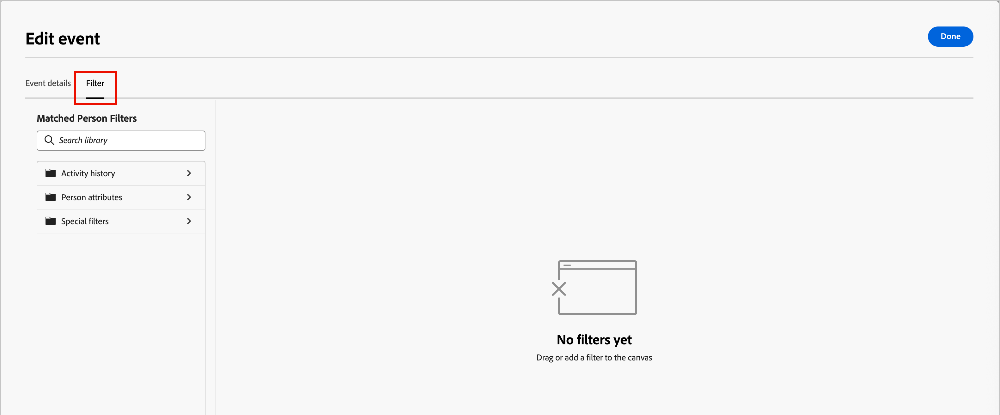

# 監聽事件

若要在事件發生時將對象推進到[歷程](./journeys-overview.md)中的下一個步驟，請新增&#x200B;_接聽事件_&#x200B;節點。 根據歷程型別，您可以根據人員或帳戶事件使用此節點來觸發歷程中的下一個節點。

<!--
{width="30", vertical-align="middle"} [Watch the overview video](#overview-video)
-->

## 帳戶歷程 {#account-journeys}

>[!NOTE]
>
>對於帳戶歷程，您無法在由人員分割的路徑上新增&#x200B;_[!UICONTROL 接聽事件]_&#x200B;節點型別。

1. 開啟帳戶歷程畫布。

1. 按一下路徑上的加號( **+** )圖示，然後選擇&#x200B;**[!UICONTROL 接聽事件]**。

   {width="400"}

1. 在右側的節點屬性中，使用&#x200B;_事件型別_&#x200B;選擇器在&#x200B;**[!UICONTROL 帳戶]**&#x200B;和&#x200B;**[!UICONTROL 人員]**&#x200B;之間選擇。

1. 從清單中選取事件。

   * 針對&#x200B;_人員_&#x200B;事件型別，選擇您要用於觸發器的[人員事件](#people-events)。

     {width="500" zoomable="yes"}

   * 對於&#x200B;_帳戶_&#x200B;事件型別，請選擇您要用於觸發器的[帳戶事件](#account-events)。

     {width="500" zoomable="yes"}上的事件

1. 按一下&#x200B;**[!UICONTROL 編輯事件]**&#x200B;並定義事件的詳細資料。

   根據選取的事件型別和事件，定義事件比對條件。

   * [人物活動](#people-events)
   * [帳戶事件](#account-events)

   您也可以包含事件的[篩選器](#filters-people-event)。

1. 按一下「**[!UICONTROL 完成]**」。

   事件和篩選器定義會顯示在節點和節點屬性中。

   {width="500"}

### 帳戶歷程的人員事件 {#people-events}

在帳戶歷程中，當您想要根據人員活動所觸發的事件，在歷程中向前移動帳戶時，您可以根據人員來監聽事件。 您也可以根據事件歷史記錄和人員屬性來篩選事件。

>[!TIP]
>
>體驗事件可在&#x200B;_前_&#x200B;個人進入歷程時發生（例如先前的電子郵件點按或網路互動）。 若要根據這些事件路由人員，請在[依人員分割路徑](./split-merge-paths-nodes.md#experience-event-history-filtering)節點中使用[!UICONTROL 事件歷史記錄]篩選器。

#### Journey Optimizer B2B事件 {#events-account-people}

| 事件 | 限制 |
| ----- | ----------- |
| [!UICONTROL 已指派給購買群組] | 方案興趣（必要）  其他限制（選擇性）： <li>角色</li><li>活動日期</li> 逾時（選擇性） |
| [!UICONTROL 個人設定檔變更] | 屬性（必要） 活動日期（選用） 新值（選用） 上一個值（選用） 原因（選用） Source （選用） |
| [!UICONTROL 已從購買群組]移除 | 方案興趣（必要） 活動日期（選用） 逾時（選用） |

1. 設定符合事件的必要值。

   如有需要，請為評估設定運運算元。

1. 針對您要納入事件比對的每個選用條件約束，按一下&#x200B;**[!UICONTROL 新增條件約束]**，然後在清單中選取條件約束。

   {width="700" zoomable="yes"}

1. （選擇性）選取&#x200B;**[!UICONTROL 篩選器]**&#x200B;索引標籤以[為事件新增篩選器](#filters-people-event)。

1. 按一下「**[!UICONTROL 完成]**」。

#### 體驗事件 {#experience-events-account-people}

>[!PREREQUISITES]
>
>管理員會設定[Adobe Experience Platform (AEP) Experience Events](https://experienceleague.adobe.com/en/docs/experience-platform/xdm/classes/experienceevent){target="_blank"}，讓行銷人員建立對事件近乎即時反應的帳戶和人員歷程。
>
>若要讓體驗事件可用於歷程，產品管理員必須先在[!DNL Journey Optimizer B2B Edition]中[新增感興趣的事件型別和欄位](../admin/configure-aep-events.md#add-an-event)。

1. 按一下&#x200B;**[!UICONTROL 新增限制]**，然後選擇您要用於限制的欄位。

   可用的限制定義為事件設定的Managed欄位。

1. 完成限制條件。

   您可以使用預設的&#x200B;**[!UICONTROL 是]**&#x200B;運運算元來比對一或多個欄位值。 或者，您可以使用&#x200B;**[!UICONTROL is not]**&#x200B;運運算元來比對所有值，並排除一或多個指定值。

   {width="700" zoomable="yes"}

1. （選擇性）選取&#x200B;**[!UICONTROL 篩選器]**&#x200B;索引標籤以[為事件新增篩選器](#filters-people-event)。

1. 按一下「**[!UICONTROL 完成]**」。

### 帳戶事件 {#account-events}

在帳戶歷程中，當您想要根據帳戶活動所觸發的事件，在歷程中向前移動帳戶時，您可以根據帳戶來監聽事件。

| 事件 | 限制 |
| ----- | ----------- |
| [!UICONTROL 帳戶有有趣的時刻] | 型別（電子郵件、里程碑或Web） 其他限制（選擇性）： <li>說明</li><li>來源</li><li>活動日期</li>  逾時（選擇性） |
| [!UICONTROL 帳戶資料值變更] | 屬性 其他限制（選擇性）： <li>新值</li><li>上一個值</li><li>活動日期</li>  逾時（選擇性） |
| [!UICONTROL 購買群組階段變更] | 方案興趣 其他限制（選擇性）： <li>新的階段</li><li>上一個階段</li><li>活動日期</li> 逾時（選擇性） |
| [!UICONTROL 購買群組狀態變更] | 方案興趣 其他限制（選擇性）： <li>新狀態</li><li>先前的狀態</li><li>活動日期</li> 逾時（選擇性） |
| [!UICONTROL 完整度分數變更] | 方案興趣 其他限制（選擇性）： <li>新分數</li><li>前一個分數</li><li>活動日期</li> 逾時（選擇性） |
| [!UICONTROL 參與分數變更] | 方案興趣 其他限制（選擇性）： <li>新分數</li><li>前一個分數</li><li>活動日期</li> 逾時（選擇性） |

1. 設定符合事件的必要條件約束。

1. 針對您要納入事件比對的每個選用條件約束，按一下&#x200B;**[!UICONTROL 新增條件約束]**&#x200B;並選取欄位。

   {width="700" zoomable="yes"}

   設定評估的運運算元和值。

1. 按一下「**[!UICONTROL 完成]**」。

<!--

Removed from AJO B2B people events 

| [!UICONTROL Clicks link in email] | Email  Additional constraints (optional): <li>Link</li><li>Link ID</li><li>Is mobile device</li><li>Device</li><li>Platform</li><li>Browser</li><li>Is predictive content</li><li>Is bot activity</li><li>Bot activity pattern</li><li>Browser</li><li>Date of activity</li><li>Min. number of times</li> Timeout (optional) |
| [!UICONTROL Clicks link in SMS] | Email  Additional constraints (optional): <li>Link</li><li>Device</li><li>Platform</li><li>Date of activity</li><li>Min. number of times</li> Timeout (optional) |
| [!UICONTROL Data value changes] | Person attribute  Additional constraints (optional): <li>New value</li><li>Previous value</li><li>Reason</li><li>Source</li><li>Date of activity</li><li>Min. number of times</li> Timeout (optional) |
| [!UICONTROL Opens email] | Email  Additional constraints (optional): <li>Link</li><li>Link ID</li><li>Is mobile device</li><li>Device</li><li>Platform</li><li>Browser</li><li>Is predictive content</li><li>Is bot activity</li><li>Bot activity pattern</li><li>Browser</li><li>Date of activity</li><li>Min. number of times</li> Timeout (optional) |
| [!UICONTROL Score is changed] | Score name  Additional constraints (optional):<li>Change</li><li>New score</li><li>Urgency</li><li>Priority</li><li>Relative score</li><li>Relative urgency</li><li>Date of activity</li><li>Min. number of times</li> Timeout (optional) |
| [!UICONTROL SMS Bounces]| SMS message  Additional constraints (optional): <li>Date of activity</li><li>Min number of times</li> Timeout (optional) |

### Listen for a Marketo Engage event {#listen-for-marketo-engage-event}

| Marketo Engage | [!UICONTROL Visits Web Page] | Web page   Select one or more Marketo Engage pages to match.   Additional constraints (optional): <li>Querystring</li><li>Client IP address</li><li>Referrer</li><li>User Agent</li><li>Search engine</li><li>Search query</li><li>Token</li><li>Browser</li><li>Platform</li><li>Device</li><li>Date of activity</li> |
| | [!UICONTROL Fills out form] | Form   Select one or more Marketo Engage forms to match.   Additional constraints (optional): <li>Date of activity</li><li>Querystring</li><li>Client IP address</li><li>Referrer</li><li>User agent</li><li>Platform</li><li>Device</li> Timeout (optional) |
| Adobe Experience Platform | [!UICONTROL Event definition] | Event type   Additional constraints (optional): <li>Fields</li>  Additional constraints (not supported): <li>Date of activity</li><li>Min. number of times</li>  Timeout (optional) |

If you have web pages in your connected Marketo Engage instance, you can trigger an event based on a visit/no visit to these web pages, as well as Marketo Engage forms that were/were not filled. 

1. Use the **[!UICONTROL Select people event]** selector and scroll the menu to the **[!UICONTROL Marketo Engage]** section.

1. Select a Marketo Engage activity type:

   * **[!UICONTROL Visits Web Page]**.
   * **[!UICONTROL Fills Out Form]**

   {width="700" zoomable="yes"}

1. Click **[!UICONTROL Edit event]** and define one or more web pages to match and any additional constraints for the event.

   * (Required) In the _[!UICONTROL Edit event]_ dialog, define the **[!UICONTROL Web page]** or **[!UICONTROL Fills out form]** constraint. Use **[!UICONTROL is]** (default) to match on one or more selected pages or forms. Use **[!UICONTROL is not]** to match on all page visits/forms with the exclusion of one or more selected pages/forms. Or, use the **[!UICONTROL is any]** operator to match on any Marketo Engage web page visit or filled form.

   * (Optional) Click **[!UICONTROL Add constraint]** and choose the field that you want to use for the constraint. Set the operator and the value for the field.

     {width="700" zoomable="yes"}

     To include additional field constraints as needed, repeat this action.

   * If needed, select the **[!UICONTROL Filters]** tab to [add filters for the event](#add-a-filter-to-the-people-event).

   * When the constraints and filters are defined, click **[!UICONTROL Done]**.

1. If needed, set the **[!UICONTROL Timeout]** option to limit the time period to listen for the event (see [Add a timeout to an event node](#add-a-timeout-to-an-event-node)). 

1. In the journey canvas, add the next node to execute when the event occurs.

-->

## 個人歷程 {#person-journeys}

1. 開啟人員歷程畫布。

1. 按一下路徑上的加號( **+** )圖示，然後選擇&#x200B;**[!UICONTROL 接聽事件]**。

   {width="350"}

1. 在右側的節點屬性中，按一下&#x200B;**[!UICONTROL 新增事件條件]**。

   {width="450"}

1. 新增事件，並設定您要與觸發器比對的限制。

   您可以使用[體驗事件](#experience-events-person)和[人員設定檔變更](#person-profile-changes)來定義事件觸發程式。

   將事件觸發器拖放到產生器空間中，並設定定義。 按一下&#x200B;**[!UICONTROL 新增限制]**，以針對您想要用來調整事件比對的每個限制。

   您可以新增多個相符的事件。 第一個符合資格事件會前進歷程中的個人設定檔。

1. （選擇性）選取&#x200B;**[!UICONTROL 篩選器]**&#x200B;索引標籤以[為事件新增篩選器](#filters-people-event)。

1. 按一下「**[!UICONTROL 完成]**」。

   事件和篩選器定義會顯示在節點和節點屬性中。

   {width="450"}

### 個人歷程的體驗事件 {#experience-events-person}

>[!PREREQUISITES]
>
>管理員會設定[Adobe Experience Platform (AEP) Experience Events](https://experienceleague.adobe.com/en/docs/experience-platform/xdm/classes/experienceevent){target="_blank"}，讓行銷人員建立對事件近乎即時反應的帳戶和人員歷程。
>
>若要讓體驗事件可用於歷程，產品管理員必須先在[!DNL Journey Optimizer B2B Edition]中[新增感興趣的事件型別和欄位](../admin/configure-aep-events.md#add-an-event)。

您可以在&#x200B;_[!UICONTROL 編輯事件]_&#x200B;對話方塊中使用體驗事件來觸發個人歷程中的節點。

1. 展開左側&#x200B;_[!UICONTROL 觸發器]_&#x200B;清單中的&#x200B;**[!UICONTROL Sapphire AEP事件]**。

1. 將「體驗事件」拖放至符合產生器的事件空間。

   您可以使用&#x200B;_搜尋_&#x200B;欄位來篩選事件名稱中的關鍵字，例如`email`。

1. 按一下&#x200B;**[!UICONTROL 新增限制]**，然後選擇您要用來調整事件比對的欄位。

   可用的限制定義為事件設定的Managed欄位。

   {width="700" zoomable="yes"}

1. 設定符合事件欄位的運運算元和值。

1. （選用）新增其他體驗事件或[個人資料變更](#person-profile-changes)。

   當您新增多個相符事件時。 第一個符合資格事件會前進歷程中的個人設定檔。

1. （選擇性）選取&#x200B;**[!UICONTROL 篩選器]**&#x200B;索引標籤以[為事件新增篩選器](#filters-people-event)。

1. 按一下「**[!UICONTROL 完成]**」。

### 人員輪廓變更 {#person-profile-changes}

您可以在&#x200B;_[!UICONTROL 編輯事件]_&#x200B;對話方塊中使用B2B個人資料屬性中的變更來觸發個人歷程中的節點。

1. 從&#x200B;**2&rbrace;觸發器&#x200B;_清單，將[!UICONTROL 人員設定檔變更]**&#x200B;拖放至事件相符產生器空間。_

1. 按一下&#x200B;**[!UICONTROL 新增限制]**，然後選取您要用於事件觸發器的屬性變更。

   根據您要比對的變更設定欄位值。

   {width="700" zoomable="yes"}

1. （選擇性）新增您想用來作為事件觸發器的其他&#x200B;_個人設定檔變更_&#x200B;屬性，或[體驗事件](#experience-events-person)。

   當您新增多個相符事件時。 第一個符合資格事件會前進歷程中的個人設定檔。

1. （選擇性）選取&#x200B;**[!UICONTROL 篩選器]**&#x200B;索引標籤以[為事件新增篩選器](#filters-people-event)。

1. 按一下「**[!UICONTROL 完成]**」。

## 事件篩選器 {#filters-people-event}

當您在帳戶歷程[&#128279;](#people-events)中定義[個人事件，或在個人歷程](#person-journeys)中定義個人事件時，您可以包含篩選功能，以根據各種條件限制相符的事件觸發器：

| 篩選器 | 說明 |
| ------------ | ----------- |
| [!UICONTROL 事件歷史記錄] | 管理員設定的Experience事件。 請參閱&#x200B;_[選取體驗事件和欄位](../admin/configure-aep-events.md)_。 |
| [!UICONTROL 個人屬性] | B2B個人設定檔中的屬性，包括： <li>城市 <li>國家 <li>出生日期 <li>電子郵件地址 <li>電子郵件無效 <li>電子郵件中止 <li>名字 <li>推斷的州別區域<li>職稱 <li>姓氏 <li>手機號碼 <li>人員參與度分數 <li>電話號碼 <li>郵遞區號 <li>州別 <li>已取消訂閱 <li>取消訂閱的原因 |
| [!UICONTROL 個人屬性] | （僅限個人歷程）屬性值 |
| [!UICONTROL 特殊篩選器] > [!UICONTROL 購買團體成員] | 該人員是或不是根據下列一或多個條件評估的購買群組成員： <li>解決方案興趣</li><li>購買群組狀態</li><li>完整度分數</li><li>參與分數</li><li>已移除</li><li>角色</li> |

<!--
| [!UICONTROL Special filters] > [!UICONTROL Member of List] | The person is or is not a member of one or more Marketo Engage lists. |
| [!UICONTROL Special filters] > [!UICONTROL Member of Program] | The person is or is not a member of one or more Marketo Engage programs. |
-->

1. 定義事件觸發程式後，在&#x200B;_[!UICONTROL 編輯事件]_&#x200B;對話方塊中選取&#x200B;**[!UICONTROL 篩選器]**&#x200B;索引標籤。

   {width="700" zoomable="yes"}

1. 若要篩選相符專案，請新增一或多個篩選條件。

   * 從左側導覽拖放任何篩選器，並完成相符定義。

     >[!NOTE]
     >
     >如果您在Experience Platform的帳戶對象結構描述中定義了自訂人員欄位，則這些欄位也可在&#x200B;**[!UICONTROL 屬性]**&#x200B;下取得，以便在篩選器中作為人員屬性使用。

   * 在上方套用&#x200B;**[!UICONTROL 篩選邏輯]**，以縮小篩選範圍。 您可以選擇比對所有篩選器或任何篩選器。

     {width="600" zoomable="yes"}

1. 事件和篩選器定義完成時，按一下&#x200B;**[!UICONTROL 完成]**。

## 將逾時新增至事件節點 {#timeouts}

如有需要，請定義歷程等待事件的時間長度。 歷程會在逾時後結束，除非您定義逾時路徑，在其中新增其他節點。

啟用節點屬性中的&#x200B;**[!UICONTROL 逾時]**&#x200B;選項，以指定&#x200B;_接聽事件_&#x200B;節點的逾時。

1. 啟用這些選項後，請選擇&#x200B;_型別_&#x200B;並指定逾時的引數：

   * **[!UICONTROL 持續時間]** — 使用此型別指定事件觸發器的時段。 如果事件沒有在該期間內觸發，則人員或帳戶沒有在歷程中繼續。

     選取歷程在逾時前等待事件發生的持續時間。 指定分鐘數、小時數、日數、周數或月數。

     {width="500" zoomable="yes"}

     如果您希望時段在一週中的特定日結束，請啟用&#x200B;**[!UICONTROL 必須於]**&#x200B;結束。 **[!UICONTROL 預設會選取任何一天]**，並選取所有日期。 清除核取方塊，然後選取結束日期的一天或多天。 然後選取&#x200B;**時間**&#x200B;和&#x200B;**[!UICONTROL 時區]**。

     {width="300"}結束

   * **[!UICONTROL 日期]** — 使用此型別設定節點的到期日。 如果事件未在指定的日期/時間觸發，則人員或帳戶不會繼續在歷程中進行。

     按一下&#x200B;_行事曆_&#x200B;圖示以設定逾時的日期和時間。

     {width="500" zoomable="yes"}

1. 定義逾時路徑。

   預設會選取&#x200B;**[!UICONTROL 設定逾時路徑]**&#x200B;選項。 您可以使用此路徑來定義監聽事件節點逾時會發生什麼情況。 您可以新增替代動作和事件，這些動作和事件可在事件未發生時套用至人員設定檔。

   {width="600" zoomable="yes"}

   如果您不想定義路徑，可以清除&#x200B;_[!UICONTROL 設定逾時路徑]_&#x200B;核取方塊。

<!--
 ## Overview video

>[!VIDEO](https://video.tv.adobe.com/v/3443219/?learn=on) 
-->
