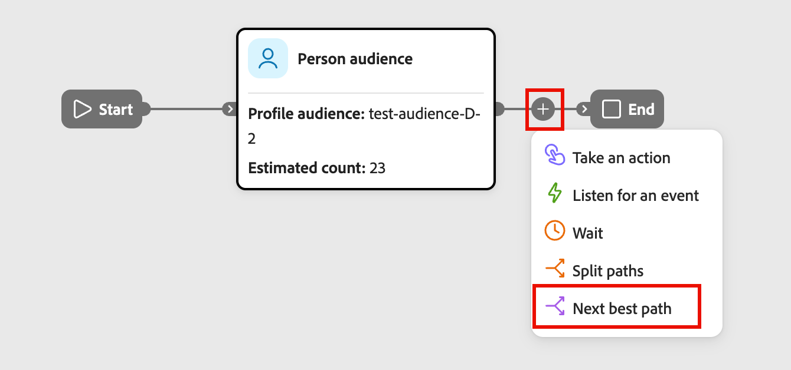
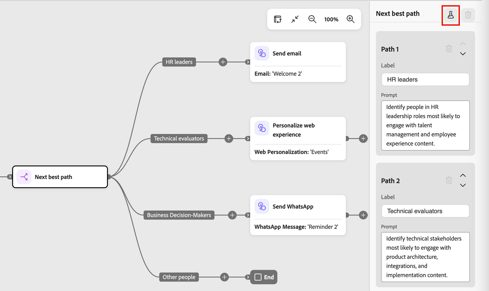
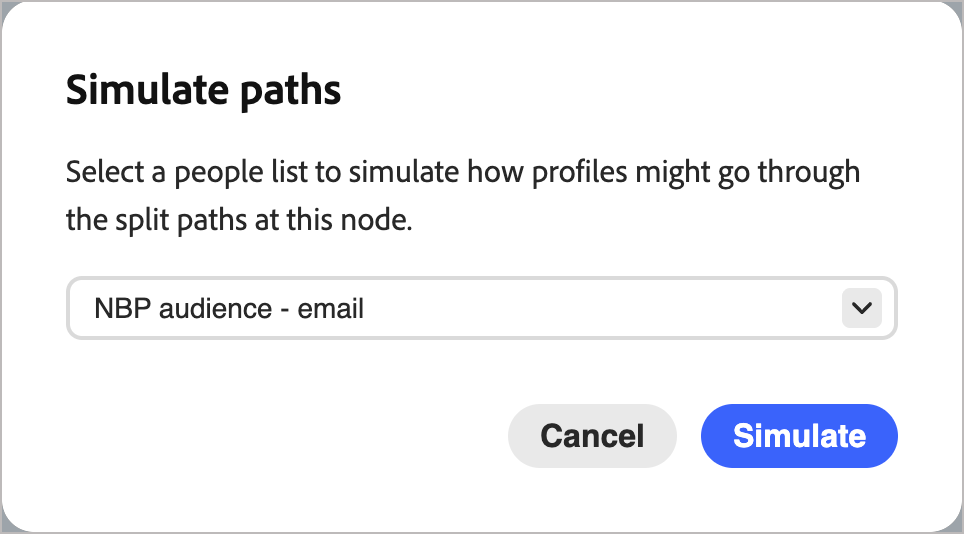

# 下一個最佳路徑節點

_下一個最佳路徑_&#x200B;節點會將AI驅動的分割路徑決策直接帶入歷程畫布。 您不是在[分割路徑](./split-merge-paths-nodes.md)節點上設定篩選條件，而是以自然語言描述您的意圖，讓系統決定每個人的最相關路徑。

>[!NOTE]
>
>下一個最佳路徑節點僅適用於個人歷程。 帳戶歷程不支援這些功能。

在B2B購買中，設定檔可能看起來像是某種型別的購買者，但他們的行為、電影資料和參與情境會顯示更細微的故事。 下一個最佳路徑節點會評估該內容，以做出智慧型路由決定，同時讓您在啟動歷程之前檢閱、修改或覆寫任何AI建議。

AI會使用輸入組合，根據您定義的路徑提示評估每個人：

* **參與歷程記錄** — 來自目前和先前歷程的電子郵件開啟、連結點選、網頁瀏覽和其他行為訊號
* **即時訊號** — 高意圖事件，例如表單填寫和定價頁面造訪次數
* **個人資料屬性** — 人口統計、職稱、角色和第一類資料
* **帳戶屬性** — 與個人帳戶相關的韌體和技術資料

當人員到達節點時，系統會擷取設定檔前後關聯、套用限制，並使用LLM來選取最適合的路徑。 每個決定都以可信度分數和自然語言推理記錄，以獲得透明度和可觀察性。

如果沒有強比對路徑，或提示參考的資料不可用於設定檔，則會將人員路由至預設的遞補路徑。

## 新增下一個最佳路徑節點 {#add-next-best-path-node}

1. 開啟人員歷程並導覽至歷程圖。

1. 按一下路徑上的加號( **+** )圖示，然後選擇&#x200B;**[!UICONTROL 下一個最佳路徑]**。

   {width="350" zoomable="no"}

   節點會新增至畫布，而AI分割設定面板會顯示在右側。 它以一個路徑和預設&#x200B;_其他人_&#x200B;路徑開始，路由不符合任何已定義路徑資格的人。

   {width="500"}

## 設定路徑 {#configure-paths}

針對每個路徑，定義名稱和自然語言提示，說明應該路由至該路徑的人員。 提示輸入會完全取代篩選條件UI；沒有要設定的屬性條件。

1. 按一下&#x200B;**[!UICONTROL 新增路徑]**，以新增您想要加入節點的每個額外路徑。

   若要移除路徑，請按一下路徑卡上的&#x200B;_刪除_ （  ）圖示。

1. 對於右側面板中的每個路徑卡片：

   * 輸入反映該區段對象或意圖的&#x200B;**[!UICONTROL 標籤]**。

   * 輸入自然語言的&#x200B;**[!UICONTROL 提示]**，描述誰屬於此路徑。 專注於意圖和結果，而不是特定的屬性值。

     <!-- To get prompt ideas, click **[!UICONTROL Suggest prompts]**. The system provides several example prompts tailored to the path context that you can use as-is or adapt. -->

     {width="500"}

     **三路徑分割的提示範例：**

      * _Path 1 - HR主管&#x200B;:_識別擔任人力資源主管角色的人，他們最有可能參與人才管理和員工經驗內容。
      * _Path 2 — 技術評估人員&#x200B;:_找出最有可能參與產品架構、整合及實作內容的技術利害關係人。
      * _Path 3 — 業務決策者&#x200B;:_識別最有可能參與ROI、業務成果和案例研究內容的業務利害關係人。

1. 如有需要，請重新排序路徑，以設定比對的優先順序。

   路徑篩選是以由上到下的順序評估。 每個人都會沿著第一個符合的路徑前進。

   按一下每個路徑卡片右上角的向上和向下箭頭，將其在路徑清單中向上或向下移動。

   {width="500"}

1. 檢閱預設路徑（路徑清單中的最後一個），並視需要變更標籤。

   當AI無法放心地將人員指派給任何定義的路徑，或相關資料無法使用時，就會使用預設路徑。 當提示引用了給定設定檔的資料集中不存在的資料時，系統將該設定檔路由到預設路徑並標籤資料間隙。

### Human-in-the-loop控制項 {#human-in-the-loop}

AI建議不具繫結。 在啟用歷程之前，您可以：

* 編輯任何路徑提示以調整路由邏輯。
* 新增、移除或重新排序路徑。
* 視需要使用自訂條件覆寫AI建議。

在您發佈歷程之前，AI導向的路徑指派不會生效。

## 依使用案例提示範例 {#examples}

下列範例說明如何在常見的B2B行銷使用案例中撰寫有效的路徑提示。 使用這些內容作為起點，並調整語言以符合您的歷程內容和受眾資料。

### 主動研究和購買訊號 {#active-research}

+++路徑1 — 活躍的產品研究人員

_識別正在研究CRM軟體的人員。 在過去30天內，尋找重複的產品頁面造訪、參與比較內容、頻繁回訪，以及提升的第三方意圖訊號。_

+++

+++路徑2 — 定價比較行為

_識別過去14天內檢視過定價或計畫比較頁面多次的使用者，尤其是那些在定價和功能檔案頁面之間切換的使用者。_

+++

+++路徑3 — 高意圖，無轉換

_識別過去21天內參與產品示範、定價頁面或整合檔案，但尚未提交表單或轉換的高意圖訪客。_

+++

+++路徑4 — 猶豫的結帳行為

_識別已開始結帳或示範預訂流程，但未完成這些流程的使用者，以及至少之後返回一次而未轉換的使用者。_

+++

### 流失和保留風險 {#churn-retention}

+++路徑1 — 流失風險訊號

_根據過去60天內產品使用量下降、登入頻率降低、支援票證尖峰及行銷參與減少等資料，識別有流失跡象的客戶。_

+++

+++路徑2 — 讓超級使用者失去吸引力

_識別過去30天參與速度較其歷史基線大幅下降的先前參與使用者。_

+++

### 教育到評估差距 {#education-evaluation}

+++路徑1 — 定價順序研究

_識別下載電子書，然後在7天內造訪定價頁面但未要求示範的使用者。_

+++

+++路徑2 — 無後續追蹤的網路研討會

_識別參加網路研討會後返回產品頁面但從未預訂示範或聯絡銷售的人員。_

+++

+++路徑3 — 比較導向評估

_識別檢視競爭對手比較文章，然後在14天內造訪整合或移轉檔案的訪客。_

+++

### 電子郵件參與順序 {#email-engagement}

+++路徑1 — 無點按即可開啟

_識別在30天內開啟了三封或更多行銷電子郵件，但從未點進網站的潛在客戶。_

+++

+++路徑2 — 已點按，但沒有更深入的參與

_識別從電子郵件點選至產品頁面，但未探索其他頁面或在7天內回訪的使用者。_

+++

### 試用和轉換模式 {#trial-conversion}

+++路徑1 — 快速轉換器

_識別在開始試用後30天內升級且在試用期間顯示高產品內參與度的客戶。_

+++

+++路徑2 — 試用版停止使用者

_識別在第一週登入，但之後顯示最小活動，且在試用到期之前未轉換的試用使用者。_

+++

### 多頻道購買者 {#multi-channel}

+++路徑1 — 廣告和自然整合

_識別最初透過付費廣告參與，後來在14天內透過直接或有機管道回訪的使用者。_

+++

+++路徑2 — 產品評估事件

_識別參與面對面或虛擬活動且隨後在30天內增加產品研究行為的帳戶。_

+++

+++路徑3 — 社交網站間研究人員

_識別參與社交內容且後來造訪高意圖頁面的使用者，例如定價或示範預訂。_

+++

### 地區購買訊號 {#regional-buying}

+++路徑1 — 特定區域的突波

_識別在北美的帳戶，這些帳戶顯示過去30天內產品研究活動增加，以及協力廠商意向訊號提高，而不是其歷史基準線。_

+++

+++路徑2 — 新興市場發展勢頭

_識別APAC中參與速度在過去14天內大幅增加的帳戶，即使整體參與量仍為中等。_

+++

+++路徑3 — 特定區域的企業興趣

_識別過去21天內EMEA中涉及法規遵循、資料駐留或安全性檔案的企業規模帳戶。_

+++

+++路徑4 — 滲透不足區域

_在已指派的銷售區域中，識別已顯示意圖訊號，但尚未聯絡銷售的高符合度帳戶。_

+++

### 行為計時訊號 {#behavioral-timing}

+++路徑1 — 課後研究人員

_識別在本機時區正常營業時間以外重複使用產品和定價頁面的使用者。_

+++

+++路徑2 — 壓縮的研究時段

_識別在多個產品領域的短短72小時內顯示異常高的參與密度的帳戶。_

+++

+++路徑3 — 季末活動尖峰

_識別會計季度最後30天評估階段活動激增的帳戶。_

+++

## 發佈前模擬決策 {#simulate}

在歷程上線之前，使用模擬測試AI如何根據實際對象評估您的提示。 它僅適用於歷程處於&#x200B;_草稿_&#x200B;狀態且對任何已發佈的歷程沒有影響時。 用它來驗證路由邏輯，並在AI建議中建立可信度。

### 執行模擬 {#run-simulation}

1. 選取下一個最佳路徑節點，然後按一下右側面板頂端的&#x200B;_模擬_ （  ）圖示。

   {width="500"}

1. 在對話方塊中，選擇用於模擬的對象：

   * **[!UICONTROL 原始人員清單]** — 使用對象節點的對象。 指定當完整對象超過模擬臨界值時的範例大小。
   * **[!UICONTROL 動態與靜態清單]** — 使用[!DNL Marketo Engage]靜態或動態清單。
   * **[!UICONTROL 測試記錄]** — 使用AI建議的測試設定檔。

   {width="300"}

   >[!NOTE]
   >
   >如果選取的對象超過模擬臨界值，系統會在100個設定檔範例上執行模擬。 UI中的指示器會顯示以範例為基礎的結果。
   >
   >如果選取的對象尚未具體化，則會封鎖模擬。 內嵌警告會指導您先實體化對象。

1. 按一下&#x200B;**[!UICONTROL 模擬]**。

### 檢閱模擬結果 {#review-simulation-results}

模擬執行後，右側面板會顯示設定檔在每個路徑中的分配方式，以及這些任務背後的AI推理：

| 結果 | 說明 |
| ------ | ----------- |
| **輪廓** | 路由至路徑的設定檔數目。 |
| **分割** | 路由至路徑的設定檔百分比。 |
| **信賴度** | 路徑指派的AI信賴水準。 信賴度可反映資料的時效性、訊號強度和一致性，以及類似路由模式的歷史成功。 |
| **提示** | 已針對路徑評估的提示。 |
| **AI推理** | 說明為何將設定檔集體指派給此路徑的自然語言說明。 |

{width="400"}的結果

>[!NOTE]
>
>當可用的資料或範圍限制決定時，結果會包括有關限制的資訊。 例如，當資料集中不存在必要的屬性時，結果會包含明確指標，說明缺少資料如何影響結果。

使用結果來調整提示，並確認製程反映您預期的結果。 您可以修改路徑提示，並在發佈前視需要多次重新執行模擬。

## 發佈和監視歷程 {#publish-and-monitor}

驗證模擬結果後：

1. 將人物對象連線至歷程進入節點。

1. [發佈此歷程](./create-publish-journey.md#publish-a-journey)。

歷程上線後，下一個最佳路徑節點會在執行時執行。 當每個人都到達節點時，AI會使用最新訊號即時評估他們，並將其路由到最相關的路徑。

針對已發佈的歷程，開啟歷程地圖並選取下一個最佳路徑節點，以在右側面板中檢視&#x200B;**[!UICONTROL 即時結果]**&#x200B;區段。 即時結果顯示：

* 每個路徑中的設定檔分佈百分比
* 每個路徑指派的信賴度分數
* 路徑層級和設定檔層級推理，包含個別設定檔的可展開細節

即時結果也可在歷程主控台中取得，並可透過AI中樞中的[歷程可觀察性技能](../agents/journey-agent.md#journey-observability-skill)取得。
