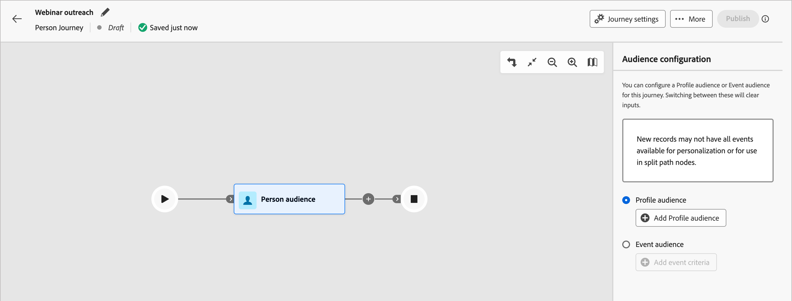
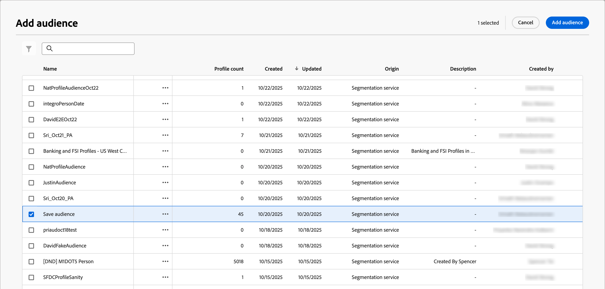
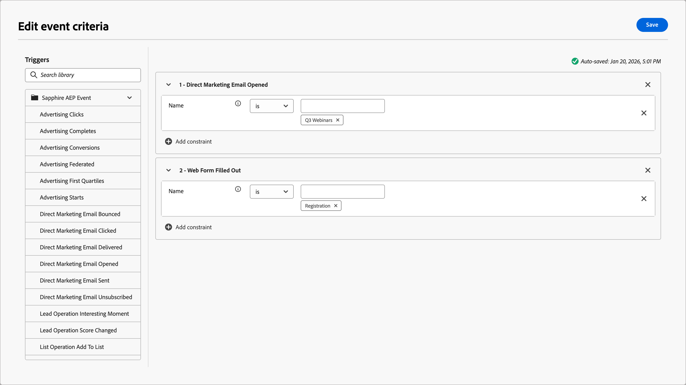

# 個人受眾歷程節點

_個人對象_&#x200B;節點會指定哪些人員設定檔進入歷程。 當您[建立個人歷程](./create-publish-journey.md#create-a-journey)時，歷程一律以定義其輸入的個人對象節點開始。 個人受眾節點可以有兩種受眾輸入型別之一：CDP區段或事件型會籍。 區段和事件型對象定義無法結合。

對個人受眾歷程節點使用下列其中一個輸入選項：

* **設定檔對象** — 使用CDP中定義的區段對象。 符合對象資格的所有設定檔都會新增為歷程的成員。 區段的新資格設定檔會在每日[設定檔擷取](#profile-ingestion)任務期間新增到歷程中。 如果設定檔不再符合區段的資格，就會&#x200B;**_不_**&#x200B;從歷程中移除。

* **事件對象** — 使用合格事件來定義對象。 這些事件是在節點設定中定義，且必須使用在管理設定[中設定的](../admin/configure-aep-events.md)XDM事件。 事件型對象會籍支援最多10個事件。 在設定檔採取的第一個相符事件之後，設定檔會立即符合歷程的資格。

  >[!NOTE]
  >
  >事件不能與設定檔屬性結合以縮小對象定義。 已規劃在未來版本中改善以解決此限制。

## 輪廓攝取

在Journey Optimizer B2B edition中，每晚的對象擷取任務可讓設定檔與Experience Platform保持同步。 雖然事件型個人歷程可讓不屬於由Journey Optimizer B2B edition擷取/使用的設定檔或帳戶對象的設定檔符合資格，但除非屬於個人歷程、帳戶歷程或購買群組使用的對象，否則擷取的設定檔會維持陳舊。 如果擷取設定檔並稍後新增至對象，則會執行設定檔拼接，且設定檔會與Experience Platform保持同步。 已計畫在未來版本中改善此設定檔資料同步。

事件型人員歷程擷取的新建立設定檔在擷取時可能沒有更新的設定檔資訊。 例如，如果設定檔是透過表單填寫事件建立，且人員歷程從合格的表單填寫事件中擷取它們，則表單中提交的資料在歷程擷取時可能尚未同步至設定檔。 結果可能是個人化的不完整資料（例如電子郵件內容）。 已規劃在未來版本中改善此設定檔事件資料同步。

事件型人員歷程可限定仍為匿名/沒有電子郵件地址且僅包含ECID的設定檔。 此問題最常發生在您具有網頁活動的資格邏輯時。 如果太多設定檔符合資格，過於廣泛的事件型對象邏輯可能會導致執行個體達到4,000萬個設定檔上限。 限制您的對象可能範圍，以防止此情境。

>[!IMPORTANT]
>
>在目前的Beta版計畫中，人員歷程的理想用途是僅限定您在帳戶歷程和購買群組定義中也會鎖定的設定檔。 此使用方式可確保完整的設定檔與Experience Platform保持同步。

## 設定個人對象節點的對象

1. 按一下&#x200B;**[!UICONTROL 個人對象]**&#x200B;節點。

   此動作會在右側顯示節點屬性。

   {width="700" zoomable="yes"}

1. 選擇進入歷程的人員的輸入型別：

   * **[!UICONTROL 設定檔對象]**

     選擇&#x200B;_[!UICONTROL 設定檔對象]_&#x200B;選項。 然後，按一下&#x200B;**[!UICONTROL 新增設定檔對象]**。

     在&#x200B;_[!UICONTROL 新增對象]_&#x200B;對話方塊中，選取先前建立的對象區段。 然後，按一下&#x200B;**[!UICONTROL 新增對象]**。

     {width="700" zoomable="yes"}

   * **[!UICONTROL 活動對象]**

     選擇&#x200B;_[!UICONTROL 事件對象]_&#x200B;選項。 然後，按一下&#x200B;**[!UICONTROL 新增事件條件]**。

     在&#x200B;_[!UICONTROL 編輯事件條件]_&#x200B;對話方塊中，新增一或多個要用於對象成員資格的事件。 針對您新增的每個事件，按一下&#x200B;**[!UICONTROL 新增限制]**&#x200B;以選擇符合的事件屬性。 設定您要用於比對的評估。 您可以新增多個限制以符合事件。

     {width="700" zoomable="yes"}

     定義事件條件時，按一下&#x200B;**[!UICONTROL 儲存]**。

     如需歷程支援事件組態的詳細資訊，請參閱[管理體驗事件](../admin/configure-aep-events.md#manage-experience-events)。
